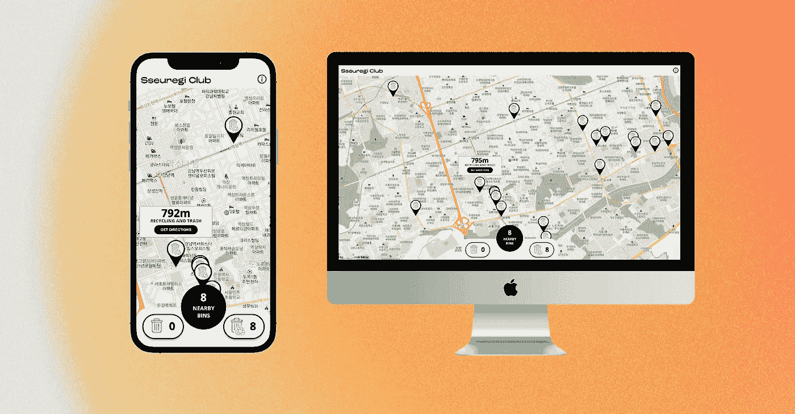
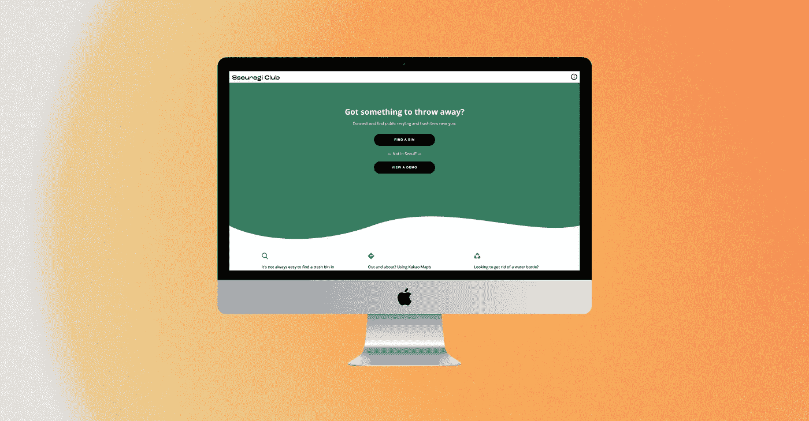

# 用 React 创建一个回收站查找器

> 原文：<https://javascript.plainenglish.io/building-a-recycling-bin-finder-with-react-ba08cf09bda5?source=collection_archive---------18----------------------->

*用 React、Node.js 和 Kakao Maps API 构建的首尔公共垃圾桶和回收站查找器。*



# 关于🚮

我今年夏天完成的 Sseuregi Club 是一个**移动优先的 React web 应用**，它可以找到用户的当前位置，并显示附近的公共回收和垃圾箱。然后，用户可以选择一个箱柜，并获取到该位置的方向。



目前，全市大约有 80 个垃圾箱，但我希望随着应用程序的增长，这个数字会增加。

# 这个概念💡

任何一个在城市中行走的人，在某个时候都经历过一个共同的问题: ***我到底可以在哪里扔掉东西？我想开发一个应用程序，可以帮助用户在城市中外出时找到公共垃圾和回收箱。***

通过一点研究，我发现 Kakao(韩国软件巨头)为他们流行的地图应用 **Kakao Maps** 的软件提供了[一个开放的 web API](https://apis.map.kakao.com/) 。虽然 API 没有为公共垃圾容器提供任何位置，但我认为这将是我的项目的一个很好的起点，并决定开始。

# 技术👨🏼‍💻

这个项目的完整代码可以在我的 GitHub 上的[这里](https://github.com/dunleavyjack/Sseuregi-Club-V2)找到。它由以下部分组成:

*   **做出反应**
*   **React-路由器**
*   **Kakao 地图 API**
*   **Axios** (针对 API 请求)
*   **柏树**(用于 UI 测试)
*   **图马**(用于设计 UI)
*   **Vercel** (用于部署)

# 该计划👨‍🔬

首先，程序使用 **HTML5 地理定位**找到用户的当前坐标。然后锁定该位置，并以该点为中心创建地图。我还使用了一个动画来创建一个从整个城市的大地图“放大”的效果。

接下来，当地图被放大时，计算用户离每个箱的距离(该距离在本地存储有**经度**和**纬度**)。这是通过编程在两点之间画一条不可见的线，然后求出这条线的距离来实现的。

```
// Draw an 'invisible' line to each bin from user locationlet line = new kakao.maps.Polyline({ map: map, path: [userPosition, binPosition], strokeOpacity: 0, // Makes line invisible}); // Get length of each line to find distance from userlet lineLength = Math.round(line.getLength());
```

然后，程序决定那个箱子是否离用户足够近，以将其标记为附近。在这种情况下，距离被设置为用户周围 800 米的半径，并且使用`useState()`钩保存附近箱子的总量。

```
// Check if bin is nearbyif (lineLength < 800) { setNearbyBins((prevCount) => prevCount + 1);
```

该程序还会跟踪每个垃圾箱是回收还是只放垃圾，如下所示:

```
// Check if nearby bin is recyling or trashif (bin.recycling) { setRecyclingBinCount( (prevCount) => prevCount + 1 );} else { setTrashBinCount((prevCount) => prevCount + 1);}
```

最后，向每个标记添加一个“click”事件监听器，当用户选择它时，它会启动一个关于该媒体夹的信息窗口。该窗口包括垃圾箱与用户的距离，是否是垃圾或回收，以及查看其位置方向的选项。

最后，一旦每个垃圾箱都被映射，附近垃圾箱的总数以及回收垃圾箱和垃圾专用垃圾箱的数量都被传递到一个定制的`<InfoPanel />`组件中，并显示在 UI 中。

```
<InfoPanel nearby={nearbyBins} nearbyTrash={trashBinCount} nearbyRecycling={recyclingBinCount}/>
```

# 收集数据🚴‍♂️

该项目的一个早期障碍是首尔没有垃圾和回收容器的公共数据库。我花了一些时间浏览该市及其不同市辖区的政府网站，但什么也没找到。

相反，应用程序中每个垃圾箱的数据是使用自行车和地理定位应用程序收集的。我会找到一个垃圾箱，用手机上的应用程序锁定坐标。后来，我会在家里把数据添加到我机器上的程序中。

# 设计用户界面🎨

我认为这个应用程序的用户可能不在他们的个人电脑前，所以我采用了移动优先的设计。我在桌面和移动布局上都测试了这个程序，但是我为移动用户做了特别的考虑。

我还发现，首先使用 **Figma** 进行设计可以节省很多时间。我仍然不能相信这个程序是完全免费的，我用它来制作我所有的蓝图和模型。

# 挑战和解决方案🚧

## 了解 Kakao 地图 API

这是我第一次使用 Kakao Maps API 以及一个自托管项目的地图软件。我很高兴地发现这个 API 有很好的文档以及一个有用的韩国开发者在线社区，他们也在自己的项目中使用这个 API。

特别是一个开发者写了一个[优秀的教程系列](https://velog.io/@bearsjelly/series/%EC%9A%B8%EB%A9%B4%EC%84%9C-%EC%B9%B4%EC%B9%B4%EC%98%A4%EB%A7%B5-%EC%A0%81%EC%9A%A9%ED%95%98%EA%B8%B0)，它真的帮助了我的起步，我强烈推荐它。题目也很大程度上总结了自学的经验:“边哭边应用 Kakao 地图”。

## **制作演示**

Kakao Maps 只为韩国提供位置服务，所以我意识到一些用户(住在其他地方的朋友或潜在的招聘人员)将无法尝试它。

所以，我用首尔的固定地址建了一个演示版。虽然演示只是一个演示，但它确实让用户感受到了应用程序是如何工作的。顺便说一下，地点:我的旧公寓。

# 后续步骤🚀

我真的希望用户能够将他们自己的垃圾桶和回收站添加到数据库中，目前我正在使用 **MongoDB** 和 **Express** 将这变成一个全栈项目。用一点时间，我希望它能越来越好！

*更多内容尽在*[***plain English . io***](http://plainenglish.io/)