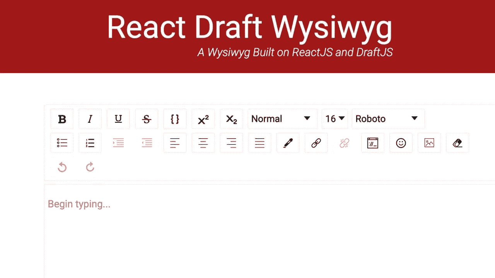
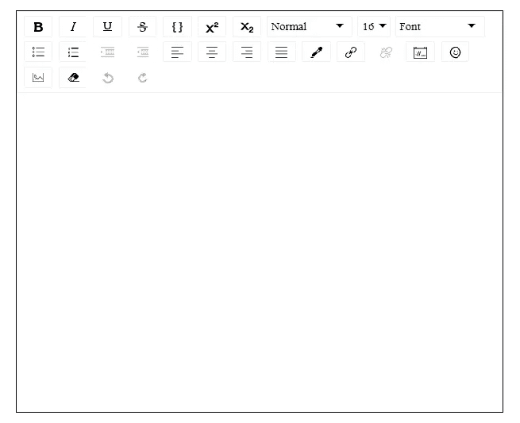
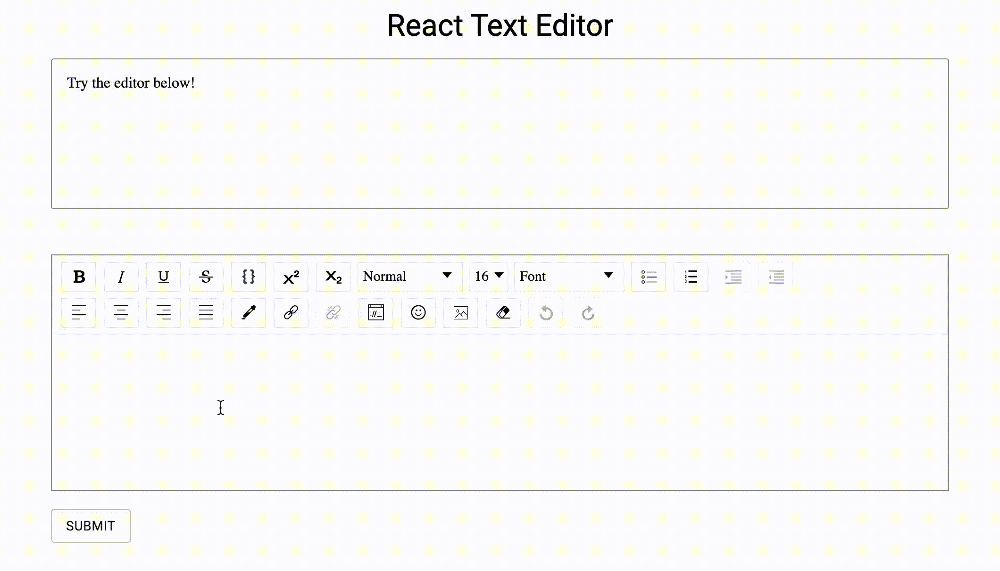

# 使用 React Draft Wysiwyg 构建富文本编辑器

> 原文：<https://javascript.plainenglish.io/building-a-rich-text-editor-with-react-draft-wysiwyg-2b2f99a57907?source=collection_archive---------2----------------------->



富文本编辑器已经成为现代 web 中的一个常见组件。它使网站与用户的互动性更强。但是构建一个富文本编辑器真的很难。

对于 react 社区，我们很幸运有 react-draft-wysiwyg。这是一个强大的文本编辑器。在本文中，我将使用 react-draft-wysiwyg 构建一个富文本编辑器。然后保存内容并显示。我们开始吧！

 [## 反应草稿所见即所得

### 编辑描述

jpuri.github.io](https://jpuri.github.io/react-draft-wysiwyg/#/) 

# **设置项目**

首先创建一个 react 项目。您可以使用 create-react-app 或以您喜欢的方式构建。完成后，让我们安装我们将需要的软件包。

```
npm install -s draft-jsnpm install -s react-draft-wysiwygnpm install -s draftjs-to-html
```

或者

```
yarn add draft-jsyarn add react-draft-wysiwygyarn add draftjs-to-html
```

创建一个 Editor.js 文件，然后将它们导入到我们的 TextEditor 组件。别忘了导入它的 CSS 模块。

让我们添加两个属性来设置编辑器的样式。它们是 wrapperStyle 和 editorStyle。就这样，我们可以立即看到编辑器的用户界面。

让我们检查一下！



# 自定义工具栏

现在我们可以看到我们的文本编辑器。它的工具栏看起来很强大。它有如此多的选择。但是如果我们不需要那么多选择呢？别担心，这个工具栏是完全定制的。它为我们提供了一个自定义的工具栏属性。第一个也是最重要的参数是选项。这是一个包含我们刚刚在工具栏中看到的所有选项的数组。以下是默认选项:

```
options: ['inline', 'blockType', 'fontSize', 'fontFamily', 'list', 'textAlign', 'colorPicker', 'link', 'embedded', 'emoji', 'image', 'remove', 'history']
```

要管理工具栏，我们所要做的就是从选项中删除那些我们不需要的。

在工具栏属性中，每个选项都有自己的参数供我们管理。让我们以“内联”为例。默认情况下，它看起来如下:

在选项参数中，我们决定显示哪个选项。我们还可以通过给工具栏中的这些选项按钮赋予 classname 来增加它们的样式。如果你不想所有的选项都显示在工具栏上，只需设置' inDropDown '为真。那么所有的内嵌选项都将出现在一个下拉列表中。当然，我们可以通过设置 dropdownClassName 来编辑它的样式。

# 编辑器状态

我们已经做了用户界面部分，但功能还没有准备好。让我们让它活起来！

首先从 draft-js 导入 EditorState，并调用它的方法 createEmpty()。然后我们创建一个状态(editorState)来存储它。还要创建一个状态(rawMessage)来存储我们创建的字符串，并创建一个状态(Message)来显示我们的消息。

然后我们需要一个函数来处理内容。因此，我们创建一个函数 onEditorStateChange 来设置 onEditorStateChange 属性。然后从 draft-js 导入 convertToRaw，从 draftjs-to-html 导入 draftToHtml。

让我们在 onEditorStateChange 函数中施展一下魔法。当我们在编辑器中添加内容时，它们将被存储在 EditorState 中，这是一个对象。EditorState 对象包括内容、样式和编辑记录。我们需要它的 getCurrentContent()方法来只获取内容。我们从 EditorState.getCurrentContent()得到的仍然是一个对象。所以我们使用 convertToRaw()将其转换为 raw JS 结构。并使用 draftToHtml 将其转换为 Html 作为字符串类型，因为我们无法在 React.DOM 中显示 JS。

每次 editorState 更改时都会调用此函数。我们从 editorState 转换的内容将被设置为 rawMessage。

# 危险的

最后，我们完成了 EditorState 到 HTML 的转换，并将其设置为 rawMessage。是时候展示我们的原始信息内容了。我创建了一个提交按钮来将我们的内容设置为消息状态。一旦用户完成编辑，只需点击提交按钮，我们在编辑器中创建的内容就会显示在上面。

但问题是我们不能直接从 React 设置 HTML。我们必须使用 dangerouslySetInnerHTML 属性。根据官方文档，它是 React 在浏览器 DOM 中使用 innerHTML 的替代品。

所以我们将消息状态插入到 dangerouslySetInnerHTML 属性中的 __html 键。

检查下面的代码:

查看下面编辑器的工作方式:



## 结论

就是这个！我们现在有了一个富文本编辑器。我们可以将编辑器中的所有内容保存并显示为字符串。

你也可以检查我下面的代码:

 [## weianofsteel/react-text-editor

### 反应文本编辑器。在 GitHub 上创建一个帐户，为 weianofsteel/react-text-editor 的开发做出贡献。

github.com](https://github.com/weianofsteel/react-text-editor) 

*更多内容看*[***plain English . io***](https://plainenglish.io/)