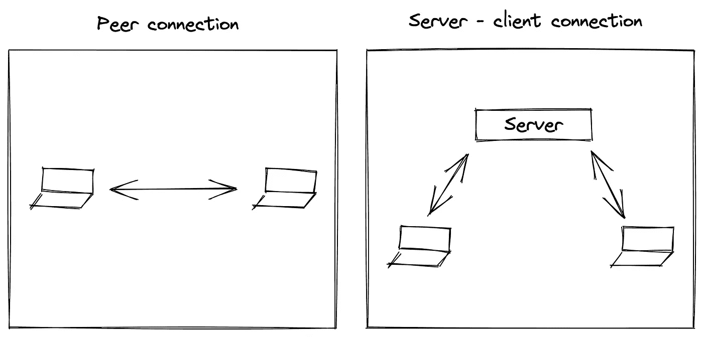
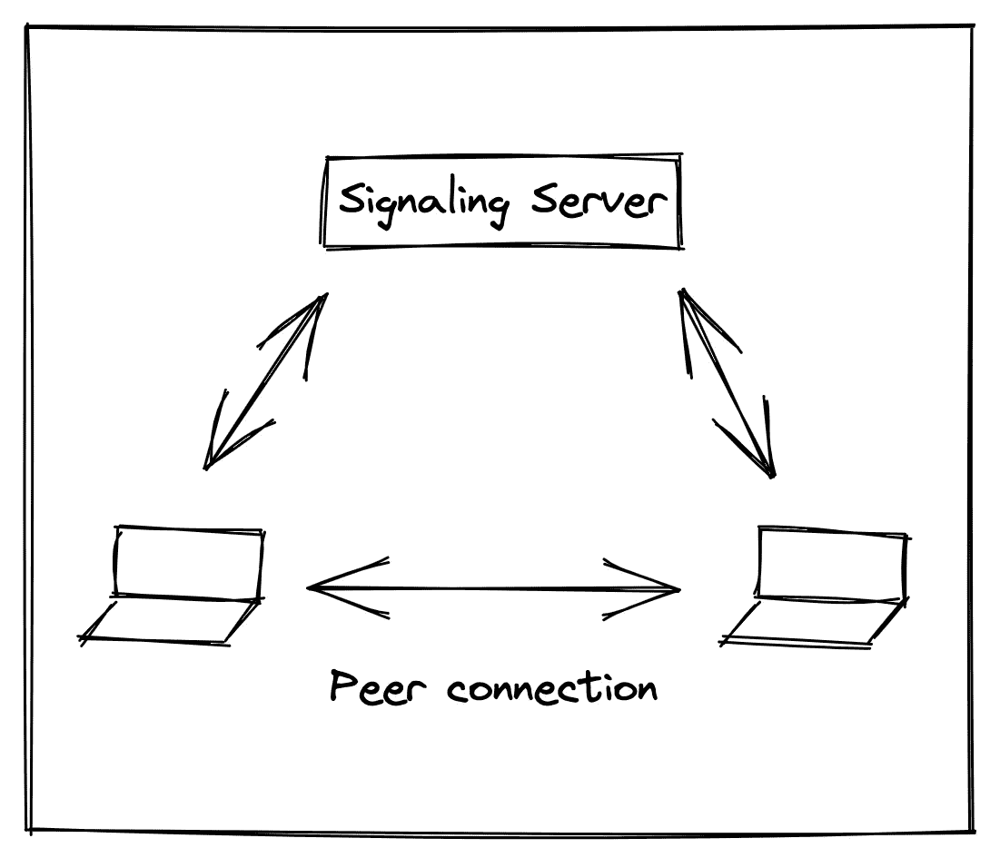
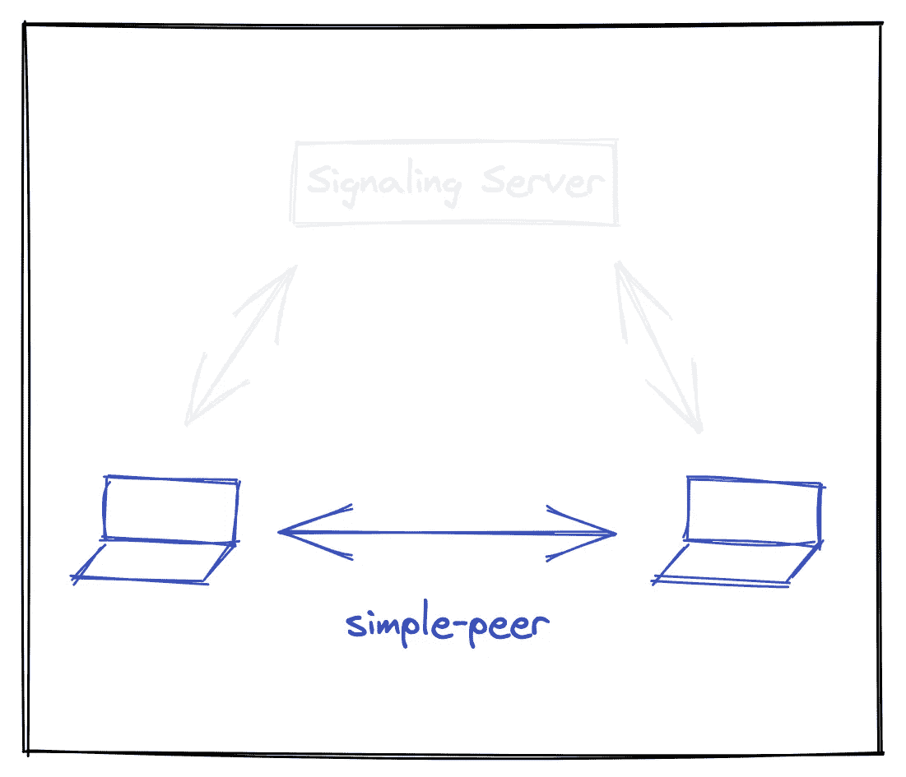

# 为简单对等体构建信令服务器

> 原文：<https://javascript.plainenglish.io/building-a-signaling-server-for-simple-peer-f92d754edc85?source=collection_archive---------3----------------------->

信令、STUN 和 TURN 的快速介绍，以及用于简单对等的开源信令服务器和包装器。


早在 2015 年，我就构建了[一个依赖于](https://kinectron.github.io/#/) [PeerJS](https://peerjs.com/) 的开源工具。几年后，我对该工具进行了改造，并注意到 PeerJS 出现了一些错误，该工具在 2014 年左右被其最初的开发者弃用。在对 PeerJS 的替代方案进行了一些研究之后，我发现 Feross 的 [simple-peer](https://github.com/feross/simple-peer) 被很好地记录、维护，并被许多项目使用。但是它缺少了一个重要的组件——一个[信令服务器](https://developer.mozilla.org/en-US/docs/Web/API/WebRTC_API/Signaling_and_video_calling)。

从那以后，我一直在慢慢收集关于信令、STUN 和 TURN 服务器的信息，并最终创建了我自己的开源[信令服务器](https://github.com/lisajamhoury/simple-peer-server)和用于简单对等的[包装器](https://github.com/lisajamhoury/simple-peer-wrapper)。以下是我所学到的东西的汇编，我发现有用的资源，以及对我所构建的工具的简短介绍。

# 什么是信令服务器，我为什么需要信令服务器？

重要的事情先来。对等连接是 [WebRTC](https://webrtc.org/) 的一部分，是两台计算机(称为“对等方”)之间的直接连接，用于在两台计算机之间直接发送视频、音频和数据。对等连接不同于到服务器的连接，因为它们允许对等方之间直接交换信息，而不是通过服务器。



Peer connections allow for direct communication between two computers, rather than communicating through a server.

虽然一旦有了对等连接，两个对等体就可以直接相互通信，但是 WebRTC 没有给对等体一种找到彼此以建立连接的方法——这就是信令服务器的用武之地。

信令服务器是允许对等体找到彼此并建立对等体连接的服务器。它存在于 WebRTC 之外，但却是建立对等连接的必要组件。



A signaling server is a server that allows peers to find each other and to establish a peer connection.

# 用于简单对等体的信令服务器

[Simple-peer](https://github.com/feross/simple-peer) 是一个创建一对一对等连接的库，但是它不包括信令服务器。



The simple-peer library creates peer connections, but does not handle signaling.

我想在我的项目中使用 simple-peer，但是我找不到一个开源的信令服务器。因此，我在与 WebRTC 实时通信的 [Codelab 的帮助下构建了一个。一年后，我在 NYU](https://codelabs.developers.google.com/codelabs/webrtc-web#0) 用同龄人给[上课，我意识到我需要一个工具来为我的班级范例使用。这促使我将我编写的信令服务器开发成其他人可以使用的东西。](https://github.com/lisajamhoury/The-Body-Everywhere-And-Here/blob/master/syllabus.md)

我构建的工具由两个模块组成:[简单对等服务器](https://github.com/lisajamhoury/simple-peer-server)和[简单对等包装器](https://github.com/lisajamhoury/simple-peer-wrapper)。首先，您需要启动并运行服务器。

```
// in your terminal — install the module 
npm install simple-peer-server// in your application file — create the server
const SimplePeerServer = require('simple-peer-server');
const http = require('http');
const server = http.createServer();
const spServer = new SimplePeerServer(server);server.listen(8081);// in your terminal — run it!
node app.js
```

然后，您需要在客户端代码中包含包装器。

```
// in your terminal — install the module 
npm install simple-peer-wrapper// in your client code - create a wrapper and connect to your server
const options = {
  serverUrl: 'http://localhost:8081',
};

const spw = new SimplePeerWrapper(options);
spw.connect();spw.on('data', (data) => {
  const partnerData = data.data;
});// make sure you close the connection before you close the window
window.onbeforeunload = () => {
  spw.close();
};
```

上面的代码连接到信令服务器，使用 simple-peer 创建一个对等连接，并将从另一个对等方接收的数据存储在一个变量中。完整的文档和示例代码可以在[这里(服务器)](https://github.com/lisajamhoury/simple-peer-server)和[这里(包装器)](https://github.com/lisajamhoury/simple-peer-wrapper)获得。

# 关于眩晕/转身服务器的一个注释

简单对等服务器和简单对等包装器一起提供了在两个或多个对等体之间建立连接的信令服务器和客户端。

他们使用[插座。IO](https://socket.io/) 传输信令消息，然后通过[简单对等](https://github.com/feross/simple-peer)创建对等连接。

要启动并运行，您可以在您的[本地主机](https://whatismyipaddress.com/localhost)上运行一个信令服务器和您的客户端代码。

如果您在公共互联网上启动您的应用程序，您可能还需要 STUN 和 TURN 服务器。STUN 和 TURN 服务器负责获取对等体的 IP 地址。STUN 服务器可以为大约 86%的连接获取公共 IP 地址。如果您只是在本地测试或创建一个类项目，STUN 服务器可能会做到这一点。对于另外 14%的连接，以及需要在公共互联网上可靠工作的应用程序，需要一个 TURN 服务器来通过某些防火墙。

默认的 STUN 服务器由 simple-peer 提供。(尽管它们可以在简单对等和简单对等包装器中被覆盖。)TURN 服务器的维护成本可能很高，需要由应用程序开发人员提供(如果您正在阅读本文，那么开发人员可能就是您；).

要了解更多关于信令、STUN 和 TURN 服务器的信息，我推荐 Sam Dutton 的这篇优秀文章。如果你需要一个 TURN 服务器，你可能会发现这篇由 Gabriel Turner 撰写的关于[如何使用 Coturn](https://gabrieltanner.org/blog/turn-server) 设置和配置你自己的 TURN 服务器的文章很有帮助。你也可以查看付费服务，如 [Twilio 的网络遍历服务](https://www.twilio.com/stun-turn)。

一旦你设置好你的 TURN 服务器，参见[简单对等包装文档](https://github.com/lisajamhoury/simple-peer-wrapper#new-simplepeerwrapperoptions)了解如何将它们添加到你的对等连接中。

# 有用的资源

以下是我在研究和构建时发现有用的参考资料。请在评论中分享其他有用的资源:)

## **文章**

*   [构建 WebRTC 应用程序所需的后端服务:STUN、TURN 和 signaling](https://www.html5rocks.com/en/tutorials/webrtc/infrastructure/)Sam dutt on
*   [Codelab:与 WebRTC 的实时通信](https://codelabs.developers.google.com/codelabs/webrtc-web#0)
*   [网络地址转换的工作原理](https://computer.howstuffworks.com/nat.htm)杰夫·泰森
*   [如何使用 Coturn](https://gabrieltanner.org/blog/turn-server) 设置和配置自己的 TURN 服务器
*   [Google 为什么不提供免费的 TURN 服务器？](https://bloggeek.me/google-free-turn-server/)作者 BlogGeek。我(感谢[菲利普·汉克](https://twitter.com/HCornflower)为[提供参考](https://twitter.com/HCornflower/status/1422654574649913346)

## 代码参考/工具

*   [转](https://github.com/coturn/coturn)
*   Feross 的简单同行
*   Sagivo 的 WebRTC stun / turn 服务器列表
*   [WebRTC 样本:滴流冰](https://webrtc.github.io/samples/src/content/peerconnection/trickle-ice/)

*更多内容尽在*[***plain English . io***](http://plainenglish.io/)