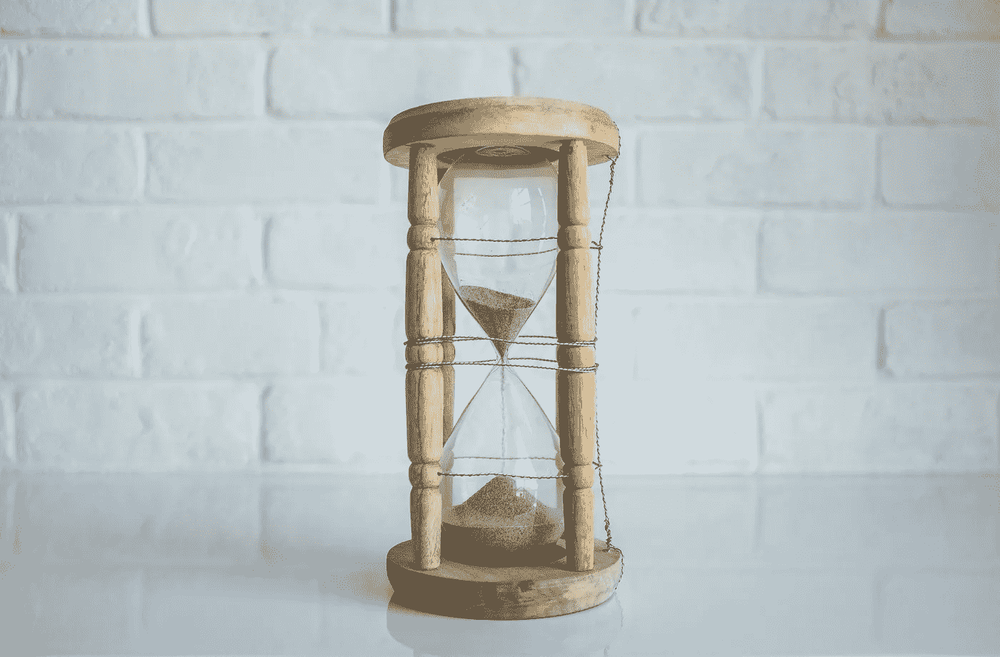

# 在 React 中构建一个简单的倒计时器

> 原文：<https://javascript.plainenglish.io/building-a-simple-countdown-timer-in-react-f24fdc2a5fd5?source=collection_archive---------7----------------------->

Photo by [NeONBRAND](https://unsplash.com/@neonbrand?utm_source=unsplash&utm_medium=referral&utm_content=creditCopyText) on [Unsplash](https://unsplash.com/s/photos/timer?utm_source=unsplash&utm_medium=referral&utm_content=creditCopyText)

在我的上一个项目中，我不得不写一个定时器，你可以设置，启动/暂停和重置。这不是最难写的东西，但有几件事，我最初没有想到。我们一步一步来，看看怎么做。

# 目标

我们的计时器应该是这样的:

Figma prototype

计时器将始终初始化为 20 分钟，但是您可以通过单击它旁边的按钮来减少或增加分钟数。在显示的时间下方有两个按钮。一个启动计时器，这也将是一个暂停按钮，另一个重置计时器。

# 让我们开始编码吧

首先，你需要制作一个`Timer.js`和`Timer.css`文件。因为我们一开始就应该有一个漂亮的计时器，打开`Timer.css`文件，并粘贴以下代码:

## Timer.js 框架代码

我们定义了`timer`、`isActive`和`isPaused`变量。

`timer`值最初设置为`20`分钟。

`isActive`是定义的变量，用于查看定时器是否激活，并初始设置为`false`。

`isPaused`是定义的变量，用于查看定时器是否暂停，并初始设置为`false`。

接下来，复制并粘贴我们的框架代码:

同样，我们使用`useRef`钩子来获取或控制任何元素的引用。这与使用`document.getElementById("demo")`是一样的，这意味着我们跳过了虚拟 dom，直接与浏览器打交道。

# 编写按钮的所有功能

## 函数 handleDecrease 和 handleIncrement

增加或减少定时器值的简单功能。

## 功能手柄启动

当我们点击开始按钮，计时器将开始减少，并保持递减，直到我们暂停或停止它。为此，我们将使用`setInterval`方法。`setInterval`是一个在特定的时间间隔后调用函数或运行一些代码的方法，通过第二个参数指定。只要我们不阻止它，它就会一直运行。它需要两个参数。回调和时间(毫秒)。

当我们按下开始按钮时，`isActive`将变成`true`,每秒钟计时器值将减 1。我们将`countRef` **当前**属性设置为`setInterval`函数，这意味着我们在变量`countRef`中设置了`**timerId**`，现在我们可以在其他函数中使用它。我们使用`countRef.current`来获取参考的当前值。

我们的开始按钮也是一个暂停按钮，这就是为什么这里实现了这个逻辑。如果开始按钮已经激活(也称为。如果 isActive 值设置为 true—if 语句),其变量`isActive`将变为`false`。为了使**停止**或**暂停**计时器，我们需要使用`clearInterval`功能。`clearInterval`需要一个参数。我们将在`clearInterval`方法中传递`countRef.current`作为参数。

恢复它将再次启动计时器。

## 功能句柄重置

重置功能会将所有内容重置为初始值。它将停止计时器，清除间隔并将值设置为 20。

# 有条件地呈现按钮

当我们按下开始按钮时，它会变成暂停按钮。所以这意味着如果`isActive`为真，按钮上应该写着暂停。这个小小的调整如下所示:

# 格式化时间

现在，我们的计时器只显示秒，但是我们希望它看起来像— 00:00。

我们将创建一个函数`formatTime`来显示我们想要的时间。`timer` const 将具有以秒为单位的值。我们的函数现在看起来像这样:

现在，我们的常量`timer`只有 1 秒，当我们想增加或减少这个值时，我们应该增加 60 秒:

# 问题

当我们到 00:00 时，计时器应该停止。现在我们有一个计时器，当它到达那个值时，下一个是-1:-1 → -1:-2，以此类推。这是因为`setInterval` 没有最新的定时器值。

我们将添加跟踪`timer`值的`useEffect`钩子。如果数值低于 1 秒`clearInterval.`

同样，如果`timer`值小于 1，我们也不想启动计时器。我们只需要稍微调整一下:

# 搞定了。

我们已经完成了倒计时。一开始你可以找到 CSS 代码。下面是我们完成的 JS 代码:

而我们的成品**(未激活):**

还有**主动:**

