# 如何构建一个简单的 JavaScript 编译器来生成 SVG

> 原文：<https://javascript.plainenglish.io/building-a-simple-javascript-compiler-to-generate-svgs-7236006649b7?source=collection_archive---------14----------------------->

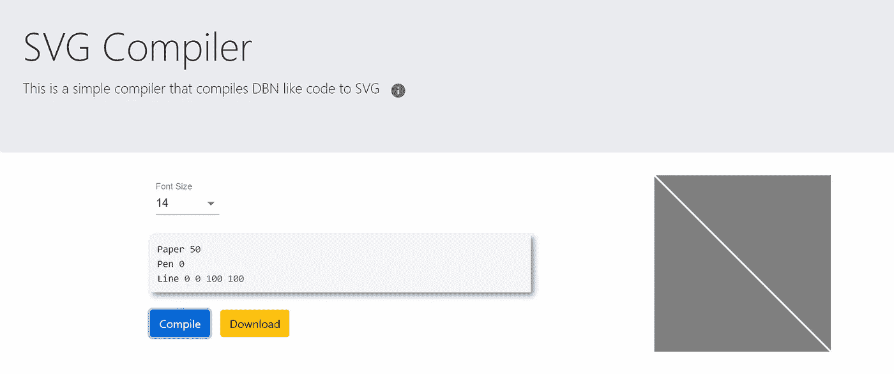

Fig: SVG Compiler Web App

> 可缩放矢量图形(SVGs)是一种基于 XML 的语言，用于描述二维矢量和混合矢量/光栅图形。

该编译器旨在使用户更容易生成 SVG 代码，使用非编码人员也容易理解的指令。这些说明的格式深受 DBN(数字设计)语言的启发。

# 介绍

我们使用一种受 DBN(数字设计)启发的语言来描述简单的形状，以便生成相应的 SVG 图像。

每个语句都由一个调用表达式和一个数字文字组成。

示例—第 0 0 100 100 行

目前支持的调用表达式有:
**1。纸张** —创建基础框架。
颜色:指定 RGB 填充颜色(0-白色，100-黑色)

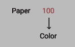

Fig: Syntax for Paper

**2。笔** —用于设置下一个形状的笔画颜色。
颜色:指定 RGB 填充颜色(0 —白色，100 —黑色)

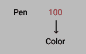

Fig: Syntax for Pen

**3。矩形** —绘制一个矩形。
x:左上角 x 坐标
y:左上角 y 坐标
宽度:矩形宽度
高度:矩形高度
填充:指定 RGB 填充颜色(0 —白色，100 —黑色)

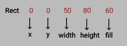

Fig: Syntax for Rect

**4。线** —画一条线。
x1:起点的 x 坐标
y1:起点的 y 坐标
x2:终点的 x 坐标
y2:终点的 y 坐标

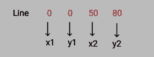

Fig: Syntax for Line

**5。圆** —画一个圆。
cx:中心的 x 坐标
cy:中心的 y 坐标
半径:圆的半径
填充:指定 RGB 填充颜色(0 —白色，100 —黑色)

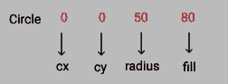

Fig: Syntax for Circle

6。椭圆-绘制一个椭圆。
cx:中心的 x 坐标
cy:中心的 y 坐标
rx:椭圆的水平半径
ry:椭圆的垂直半径
fill:指定 RGB 填充颜色(0 —白色，100 —黑色)

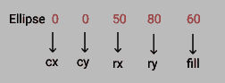

Fig: Syntax for Ellipse

# 编译程序设计

编译器由四个阶段组成

1. ***词法分析***
lexer 函数一次接受一条指令，并将其分解成一系列的记号。

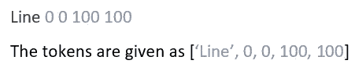

正如我们所看到的，令牌有两种类型——单词/数字。

词法分析的下一步是映射生成的标记，并为每个标记分配其类型。

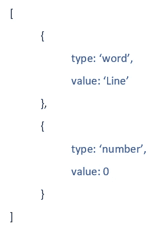

Fig: Assigning types to the Tokens Generated

2. ***解析***
解析器函数循环遍历词法分析器生成的所有标记，构建抽象语法树(AST)。

生成的令牌由两种表达式组成—
1。调用表达式
2。数字文字

当解析器遇到 CallExpression (Paper、Line、Rect、Circle、Ellipse、Pen)时，它会给它分配一个名称和一个参数数组。通过循环 tokens 数组中接下来的几个条目可以找到参数。

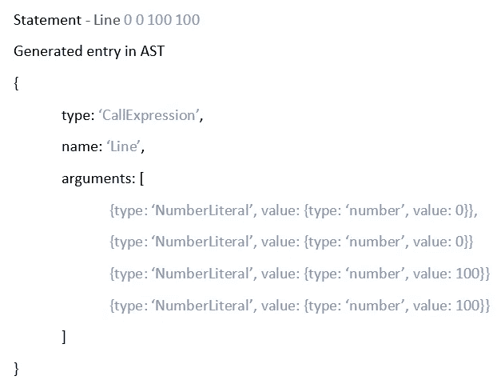

3. ***转换*** 在上一步中，一旦我们通过解析分析了语法，我们就将结构转换成适合最终结果的东西。

我们在上一步中创建的 AST 不足以构建一个 SVG。
比如。“纸”是一个只存在于 DBN 范式中的概念。在 SVG 中，我们可能使用< rect >元素来表示一篇论文。transformer 函数将 AST 转换成另一个 SVG 友好的 AST。

结果将会是这样的:

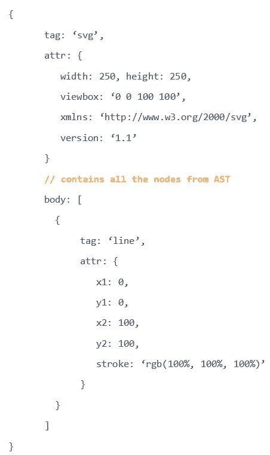

Fig: Transformed AST structure

4. ***代码生成*** 在最后一步中，我们使用字符串连接来获取转换后的 AST 并生成 SVG 代码。以下 DBN 语言的 SVG 代码如下所示:

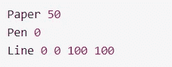

Fig: DBN like language

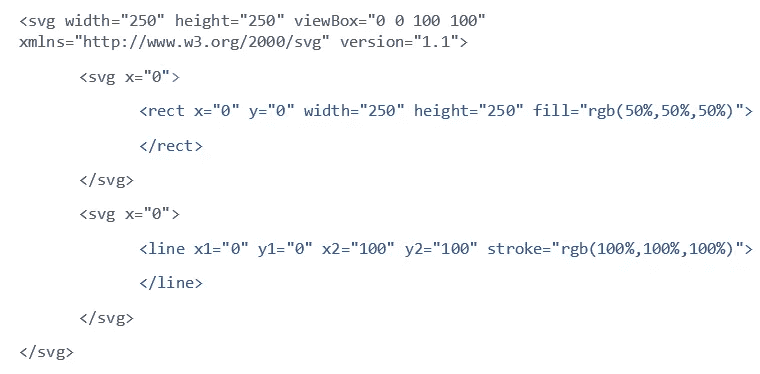

Fig: Generated SVG Code

使用标签显示最终结果。

# *开发和托管*

这个 web 应用程序是使用 **React** 创建的，托管在 **AWS Amplify** 上。
AWS Amplify 提供了一个免费层，允许我们在线托管我们的应用程序，并使用 AWS 云控制台监控它们。

**AWS 上主机程序放大**
1。在 AWS 上创建一个免费帐户(需要提供账单详情，但除非超出免费等级，否则不会向您收费)。

2.搜索 AWS Amplify。

3.授权您的 GitHub 帐户进行持续集成。

4.选择要托管的代码所在的存储库和分支。

5.配置构建设置(可以保留默认值)。

6.查看配置。

7.构建和部署应用程序。

# 首字母缩略词

DBN——数字设计
SVG——可缩放矢量图形
AWS——亚马逊网络服务

> ***Web 应用托管在*** 下面的链接上

 [## SVG 编译器

### 编译器使用类似 DBN 的代码生成 SVG

master.ddyzdttmkunq0.amplifyapp.com](https://master.ddyzdttmkunq0.amplifyapp.com/) 

> ***代码托管在 GitHub*** 上，如果您有更好的想法/方法，请随意创建问题和 pr。

 [## RRS-项目/svg

### 编译器接受描述不同形状的简单代码，并生成相应的 SVG 代码和图像。SVG…

github.com](https://github.com/RRS-Project/svg) 

***在 GitHub 上找我***

 [## riyasavant -概述

### 从日落到繁星点点的夜晚。从日落到繁星点点的夜晚。GSSoC'21 |全栈发烧友 Block 或 Report 我是全栈…

github.com](https://github.com/riyasavant/) 

***队友***

 [## rahulnoronha -概述

### B.达雅纳达萨加尔大学 Tech 计算机科学与工程本科学生(2018-2022)。阻止或报告…

github.com](https://github.com/rahulnoronha)  [## San411 -概述

### 屏蔽或举报所有与机器学习相关的项目，深度学习 Jupyter 笔记本预测贫困使用…

github.com](https://github.com/San411) 

[*更多内容看 plainenglish.io*](http://plainenglish.io/)