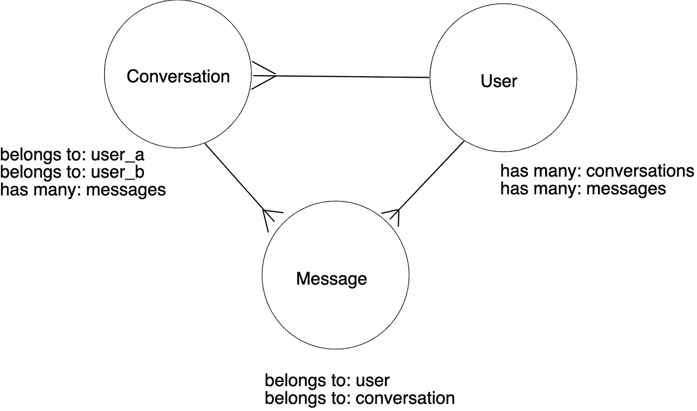
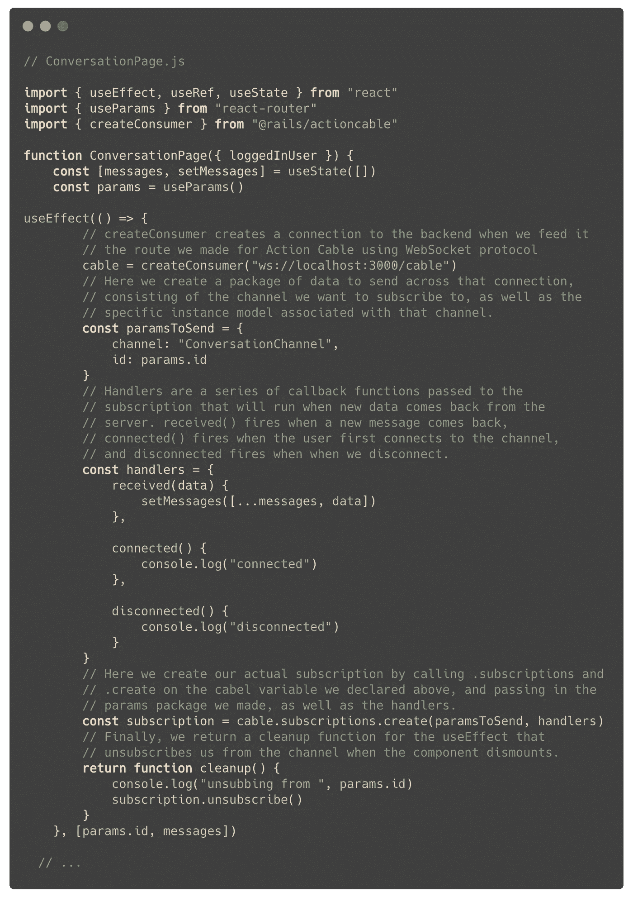
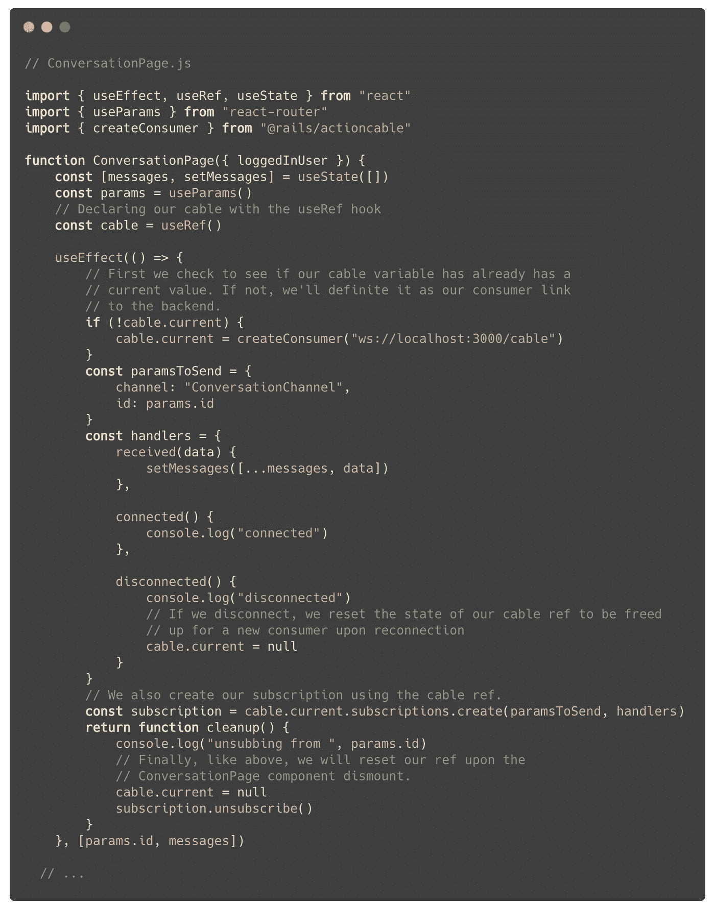

# 在 React with Action Cable 中建立简单的实时聊天

> 原文：<https://javascript.plainenglish.io/building-a-simple-live-chat-in-react-with-action-cable-8c2abf7a25b5?source=collection_archive---------6----------------------->

Photo by [Volodymyr Hryshchenko](https://unsplash.com/@lunarts?utm_source=medium&utm_medium=referral) on [Unsplash](https://unsplash.com?utm_source=medium&utm_medium=referral)

没有什么比“来自后端的实时客户端更新”这句话更让像我这样的 web 开发新手心惊肉跳的了作为该领域的新手，他仍然只是刚刚涉足 React state 的浅水区，将另一层复杂性倒入其中的想法让我有点想吐。

但在规划我最近的一个项目，作为一种社交媒体风格的应用程序时，我知道我需要一样东西，才能让它看起来接近合法:用户之间的实时 DMs。这意味着是时候直面恐惧了。

几天后，经过几个头痛的问题和一次功能性的实时聊天，我在这里向你报告我的发现，并希望为像我一样想在应用程序中实现类似功能的初学者提供一个简单易行的路线图。让我们开始吧。

# 序文

我们将在前面提到的 React 中用 Ruby on Rails 后端构建这个聊天功能。在这篇博客中，我们将重点介绍如何设置 Action Cable，并通过 WebSockets 将您的前端连接到广播，所以我假设到目前为止您已经设置好了，这样对话中的任何一个用户都可以将消息保存到后端，但是接收者需要刷新他们的页面才能看到它。作为参考，下面是我们将使用的领域模型:

# 让它发生

让我们从后端开始。我们将利用 Action Cable 从我们的数据库中广播一个现场直播，我们的前端可以连接并集成到 state 中。Action Cable 预先打包了 Rails，所以既然我们已经设置好了项目，我们就可以立即投入运行了。

我们要做的第一件事是在`routes.rb`中设置一条自定义路线:

这是我们需要为 Action Cable 编写的唯一路线，也是允许我们在前端和后端之间建立实时连接的特殊调料。

下一步，我们将为我们的资源创建一个通道。通道类似于处理典型 RESTful 动作的控制器，它允许用户订阅我们的直播。让我们在终端中运行以下代码:

`rails g channel conversation`

这将为我们生成一些新项目，即`app`中的`channels`目录，其中包含一个名为`conversation_channel.rb`的文件。该文件包含一小段样板代码，这些代码与用户订阅或取消订阅频道时发生的事情有关。让我们给`subscribed`方法添加几行代码:

我们在这里所做的是通过从会话的`show`页面获取参数(想想 http://www.yoursite.com/conversations/**36**——在这种情况下，我们将找到 ID 为 36 的会话)，找到用户订阅的特定会话(记住:一个用户有许多会话)，然后为该会话创建一个流。接下来，我们将切换到我们的前端，并努力构建一些代码来桥接该连接。

在 React 项目中，我们需要做的第一件事是安装 Rails Action Cable 包，它将为我们提供建立实时链接所需的工具:

`npm i @rails/actioncable`

然后，在我们的对话的`show`动作指向的组件(这里称为`ConversationPage.js`)内部，我们将设置一个副作用，以挂钩到我们刚刚在后端创建的流中。

哇，这里发生了很多事！让我们一点一点地分解它。

在副作用中，我们将首先声明一个变量，该变量创建一个到我们在后端编写的 Action Cable route 的连接。

接下来，我们将创建一个参数包，在订阅时传递给该连接。这个包包含了我们想要连接的特定频道，以及我们可能需要的任何额外的识别数据——在这个例子中是我们从特定对话的显示页面中捕获的参数(同样，想想 http://www.yoursite.com/conversations/**36)。**

之后，我们将编写一组三个独立的回调函数，也传递给订阅- `received`、`connected`和`disconnected`。这些函数决定了当同名事件发生时会发生什么。仔细看看`received`，你会看到我们正在获取后端通过订阅连接发送给我们的数据(即:发布到聊天中的新消息),并将其传播到 state。

在处理程序之后，我们将创建实际的订阅，并将 params 包和那些处理程序作为参数传入。

最后，我们将返回一个清理函数来指示当我们的`ConversationPage`卸载时会发生什么。基本上，我们现在所做的就是退订这个频道。

咻！这绝对是很多，但我们还没有完全完成。让我们再次切换到后端，增加我们的`messages_controller`文件来处理实时连接:

首先，我们将像往常一样创建一条新消息。然后，我们将通过调用我们的`Conversation`类上的`.find`方法并从新创建的消息中传入`conversation_id`来找到关联的会话(记住——一条消息属于一个会话)。最后，我们将向我们的`ConversationChannel`广播对话实例和新消息，并以传统方式呈现消息的 JSON。

太好了！我们现在已经在后端设置了广播频道，使用 Action Cable 和 WebSockets 将其连接到我们的前端，并将从 feed 收到的新消息传播到 React 中的 state，以便我们可以实时看到它们。如果我们切换到我们的浏览器，在一个单独的窗口中打开第二个帐户，我们可以测试一下。如果我们从两个用户中的任何一个发送一条新消息，我们将会看到它…几乎可以工作了？不过，您可能会遇到一些奇怪的错误。来自任一用户的新消息应该立即出现在两个屏幕上的聊天中，但是您可能会注意到，其中一些消息会重叠在一起，而其他消息会导致旧消息消失或失序。

如果你在一个屏幕上看到重复的消息，很可能是因为你更新了两次状态——一次是当新消息从`received`回调函数返回时，另一次可能是在你的`POST`请求向服务器发送新消息后。那也行！这只是因为您之前已经构建了通过 HTTP 协议与状态交互的特性。让我们清理一下我们的`POST`请求，这样我们甚至不需要从服务器获取响应，让我们的 Action Cable 连接处理所有的 state 工作:

第二个 bug 更令人困惑——发送或接收消息的用户有时会发现存储在他们本地状态中的其他消息的顺序和可见性。为了理解这里发生了什么，让我们再来看看我们用来连接到后端广播的副作用。

注意，在最后一行的依赖数组中，`useEffect`同时监视着`params.id`变量*和*我们的`messages`状态数组。这是有意义的——我们希望每当我们导航到一个新的对话时，以及每当一个新消息被添加到 state 时，这个副作用都被触发。但是现在考虑一下这个`useEffect`为我们处理的一切:当然，它最明显的功能是从服务器接收新数据，并把它放入状态，但是这个钩子*也*首先负责创建我们对频道的订阅。这意味着每次一个新的消息被添加到`messages`数组中，效果会再次激发并创建一个全新的订阅！这解释了不可靠的排序问题和消失的数据——我们的应用程序基本上被对依赖数组的不断更新所创建的所有新订阅搞糊涂了。

我们可以通过使用另一个 React 钩子来解决这个问题:`useRef`。简而言之，我们可以将信息传递到`useRef`中，存储到一个在渲染之间不会改变的状态中。但是如果信息*由于某种原因*改变了，`useRef`也会阻止重新渲染到其他组件。我们可以在变量上调用`.current`来检查它的当前状态。利用这个工具，我们可以在每次效果触发时创建新的连接之前，先检查连接是否已经存在。让我们在组件范围内用`useRef`声明我们的电缆，然后重构一些东西:

这应该可以了！有了这些改变，新消息应该在对话中为两个用户实时有序地呈现！

# 结论

Action Cable、WebSockets、channels……这些术语对于新手来说可能听起来很可怕，但是一旦你理解了在引擎盖下发生了什么，它们就可以用来构建令人印象深刻的交互功能，这些功能可以真正将你的应用程序提升到一个新的水平。上述指南实际上只涵盖了该技术最基本的方面和实现。因此，如果您有兴趣了解更多，我强烈建议您深入研究文档，看看到底有什么可能！这些都是强大的工具，是对任何 web 开发人员工具包的巨大补充。

*更多内容请看*[***plain English . io***](http://plainenglish.io/)