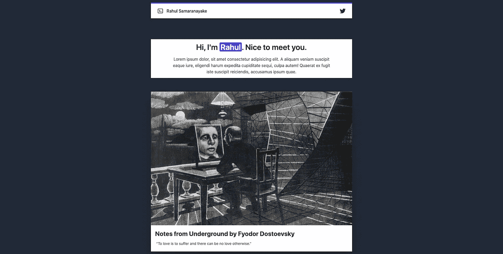

# 用 Airtable API、React、Next.js 和 Tailwind CSS 构建一个投资组合

> 原文：<https://javascript.plainenglish.io/building-a-simple-portfolio-with-airtable-api-react-next-js-tailwind-css-7a24fcf3b5e6?source=collection_archive---------5----------------------->

几周前，我开始探索 [JAM Stack](https://jamstack.org/) (JavaScript、API 和标记)以及 Airtables API。随后，这个迷你项目的灵感来自于 [James Q Quicks](https://twitter.com/jamesqquick) 教程。

Preview

这仍然是一个正在进行的项目，随着我了解的越来越多，我会不断地添加更多的功能。

部署在 Vercel 上的演示:[https://air table-react-nextjs-tailwindcss-portfolio-trahulsam 1997 . Vercel . app/](https://airtable-react-nextjs-tailwindcss-portfolio-trahulsam1997.vercel.app/)

如果你想跳过教程，你可以直接从 GitHub 克隆:[https://GitHub . com/trahulsam 1997/air table-react-nextjs-tailwindcss-portfolio](https://github.com/TRahulSam1997/airtable-react-nextjs-tailwindcss-portfolio)

Demo

## 步骤 1:设置 Next.js 项目

确保您具备 Next.js 项目的所有先决条件。

 [## 入门| Next.js

### 欢迎使用 Next.js 文档！如果您不熟悉 Next.js，我们建议您从学习课程开始。的…

nextjs.org](https://nextjs.org/docs) 

`cd`进入你的工作目录并运行`npx create-next-app [app-name]`

与`create-react-app`类似，`create-next-app`会为你引导项目。

`cd [app-name]`然后运行`npm run dev`前往

你会看到这个:

Browser

Terminal

## 步骤 2:用 Tailwind CSS 配置 Next.js

我不可能做得比詹姆斯更好，所以我推荐你看他的视频。

在[简单的](https://tailwindcss.com/docs/guides/nextjs)中，

在您的项目目录中运行`npm install -D tailwindcss@latest postcss@latest autoprefixer@latest`。

创建您的配置文件:

`npx tailwindcss init -p`

确保 **tailwind.config.js** 和 **postcss.config.js** 文件在你的根目录下。

打开`./styles/index.css`并设置顺风指令。

Base, components, and utilities styles.

将`../styles/index.css`导入`_app.js`

*我给一些渲染的元素添加了一些顺风 CSS* [*模板代码*](https://tailwindcomponents.com/component/developer-portfolio) *。我将在第 4 步中介绍这一点。*

## 步骤 3:用 Airtable API 配置 Next.js

Airtable API 为 Node.js 提供了一个优秀的 [NPM 包](https://www.npmjs.com/package/airtable)，使得使用 Airtable 库进行 CRUD 操作变得更加容易。

`cd`进入根文件夹，运行`npm i airtable`。

Make sure it installs without errors.

现在让我们设置我们的[气垫底座](https://support.airtable.com/hc/en-us/articles/202576419-Introduction-to-Airtable-bases)。

如果您还没有帐户，请创建一个免费的 Airtable 帐户。

创建[新基地](https://support.airtable.com/hc/en-us/articles/202576419-Introduction-to-Airtable-bases)。

在这个基础上，定义一个新的表并创建 3 个列，名称为**标题**(单行测试)**描述**(单行测试)& **图像** (URL)。您可以随意命名这些列，但是请记住，您必须相应地更改应用程序中的代码。

The Base I used for my demo populated with some random quotes from some of my favourite authors.

出于 RESTful API 的目的，您需要获得 Airtable API 键和 Airtable 基本 ID。

转到官方的 [Airtable API 页面](https://airtable.com/api)，选择您创建的工作区并按照说明进行操作。这很简单。

有了密钥后，在中设置配置。环境文件。这仅适用于您的本地系统。如果您在 Vercel 或 Netlify 上部署应用程序，您可以设置。生产环境中的 env 变量。

`cd [app-name]`和`touch .env`

填充。环境文件:

.env file configs

确保你想在浏览器上看到的文本有前缀 **NEXT_PUBLIC_** ，因为 Next.js 将默认[向公众公开这些变量。](https://nextjs.org/docs/basic-features/environment-variables)

在所有这些都配置好之后。

`cd pages/api` `touch utils/airtable.js`

File structure.

文件`airtable.js`将配置 Airtable 客户端，并**缩小**我们从请求中获得的一些数据。

将以下代码添加到`airtable.js`:

在这个文件中，我们通过一个引用在 Airtable 基表之间创建了一个连接。当发出请求时，Airtable 会发送大量多余的数据。因此，我们可以缩小(第 6–14 行)数据，只获取必要的字段。

在 API 目录中添加`getData.js`。

File structure.

顾名思义，这个文件将允许我们使用我们在`airtable.js`上创建的客户机向 Airtable 服务器发出请求，并获得响应。

将以下代码添加到`getData.js`:

这个回调函数将允许我们选择一个特定的表，并获得它的第一页作为响应(第 5 行)。然后使用我们创建和导入的函数缩小这些信息(第 6 行)。

一旦您运行您的服务器并转到[http://localhost:3000/API/get data](http://localhost:3000/api/getData)，假设您已经填充了该表，您将在浏览器上看到响应。

Response from Airtable.

再次推荐看詹姆斯对这部分做的视频。尽管这与我所做的有点不同，但这是同一个概念，他解释得很清楚，也很全面:

## 步骤 4:创建数据上下文

React [Context](https://reactjs.org/docs/context.html) 是一个简洁的接口，允许通过组件树传递“全局”数据，而不必在每一层都将它们作为道具传递。由于我们没有在这个应用程序中进行所有的 CRUD 操作，React 上下文可能不是必需的，但至少在我看来，让我们的全局数据处于一个集中的状态会使它更加整洁、结构化和可扩展。

在项目根目录下创建一个目录`contexts`，并在其中创建`dataContext.js`。

将以下代码添加到`dataContexts.js`:

该功能允许我们的数据处于集中状态，以供不同的组件访问。

我们已经创建了`DataItemsContext()`和`DataItemsProvider()`，它们将我们的数据暴露给`index.js`(步骤 5)中的主`Home()`函数，并分别提供我们从`fetch()`调用中获得的所有值。

`DataItemsContext()`将接受一个析构的`{children}`属性，但是我们也使用状态`useState([])`设置了一个初始值。它返回属性`dataItems`和函数`setDataItems`和`refreshDataItems`。

## 第五步:组件

创建一个`components`目录。添加`DataItem.js`和`Navbar.js`。

将以下代码添加到`Navbar.js`:

这是不言自明的。这是一个添加了公共`.env`变量的 Navbar 样板代码。

将以下代码添加到`DataItem.js`:

该组件将在使用时接收通过`index.js` `Home`函数传递的`dataItem`。

## 第六步:最终合并

由于我们创建了上下文，现在我们可以通过在`index.js`中使用它来在我们的应用程序中使用它。

但是首先，将下面的代码添加到`_app.js`:

我们已经用`<DataItemsProvider>`包装了我们的整个应用程序，使其可访问。

您还会注意到我使用 Tailwind 类完成的一小段样式(第 8 行)。

最后一步是将以下代码添加到`index.js`:

这里发生了很多事情，所以让我来分解一下:

由于上一步，我们的`index.js`将可以访问`DataItemsContext`。

我们已经从 react 导入了`[useEffect](https://reactjs.org/docs/hooks-effect.html)`和`[useContext](https://reactjs.org/docs/hooks-reference.html#usecontext)`钩子，这允许我们分别在内存中使用`initialDataItems`和`setDataItems()`属性。

我使用了 [getServerSideProps()](https://nextjs.org/docs/basic-features/data-fetching#getserversideprops-server-side-rendering) 钩子来获取数据。正如 Next.js 文档所述:

> 如果您从页面中导出一个名为`getServerSideProps`的`async`函数，Next.js 将使用`getServerSideProps`返回的数据在每次请求时预呈现该页面。

所以我们的函数将把`initialDataItems`返回到主`Home`函数中。注意我用的是从`airtable.js`导入的`table`和`minifyRecords()`。

`DataItem`和`Navbar`是从组件导入的。

剩下的代码是返回带有适当数据和 [Tailwind CSS](https://tailwindcomponents.com/component/developer-portfolio) 样式的页面。

## 步骤 7:环境变量和部署

确保所有的。填充您在**步骤 2** 中设置的环境变量。

然后`cd [app-name]`并运行`npm run dev`并前往 [http://localhost:3000/](http://localhost:3000/) 或者您可以运行`npm run build`进行部署。

我在 [vercel](https://nextjs.org/docs/deployment) 上部署了应用程序。

**关于部署的说明。我花了很多时间来处理一个错误，这个错误来自于* `*getServerSideProps()*` *和导出预渲染。我不知道为什么或如何，但我只是简单地将* `*package.json*` *中的* `*“build”: “next build && export”*` *改为* `*“build”: “next build”*` *并将其部署好。我给詹姆斯发了信息，这是他的回复*

## 结论

感谢您的阅读。我希望这篇文章对你有用。请务必在评论中告诉我们你的想法。

*更多内容请看*[***plain English . io***](https://plainenglish.io/)