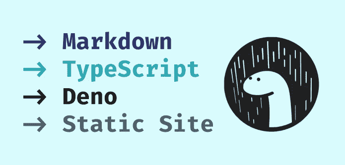
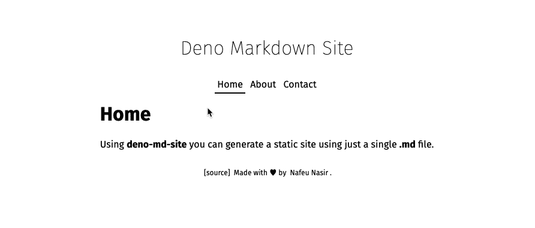
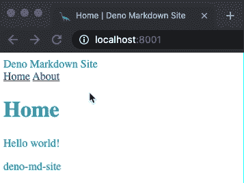

# 用 Deno 构建静态站点生成器

> 原文：<https://javascript.plainenglish.io/building-a-static-site-generator-with-deno-61132446353d?source=collection_archive---------5----------------------->



## 通过 Deno 轻松使用 TypeScript 和 Markdown 来构建静态站点生成器

构建静态 web 内容是绝对必要的。如果你在过去 10 年中的任何时候都积极参与 web 开发，你很可能会遇到静态站点生成器，如[杰基尔](https://jekyllrb.com/)或[盖茨比](https://www.gatsbyjs.com/)。甚至像 [Wordpress](https://wordpress.com/) 这样的 CMS 系统也执行相当多的静态内容生成。

多亏了现代的 JavaScript，你不必成为一个编程奇才来构建奇特的静态站点生成器。事实上，你可以用*很少的代码*完成很多事情。这就是我们在这篇博文中要做的事情，我们将使用一种叫做 **Deno** 的令人惊叹的新技术。

此外，我们将使用 TypeScript，**但是等等！本教程不需要预先的打字技能。如果你对 JavaScript 很熟悉，那就绝对没问题。事实上，如果您还没有接触过打字稿，您可以用它来尝试一下。**

## 什么是德诺？

关于 [**Deno**](https://deno.land/) 这里我就不赘述了，不过你可以把它想成`Node.js`的精神继承者，也是 node 最初的创造者打造的。

这是一个安全的 JavaScript 运行时，支持类型脚本、代码格式化、测试、顶级异步和更多开箱即用的功能。

`deno`和`node`的一个巨大区别是没有包管理器。deno 包不是在一个单独的文件中指定包或第三方依赖项，而是用基于 url 的导入语句在代码中指定**，如下所示:**

```
import { parse } from 'https://deno.land/std@0.85.0/datetime/mod.ts'
```

**运行程序时，会检查、安装和缓存这些依赖项。**

**为了安全起见，当使用 deno 运行时，可以使用标志来确定脚本的文件权限和网络访问级别，如下所示:**

```
deno run --allow-read mod.ts
```

## **装置**

**注意:如果你已经安装了 deno，你可以跳过这一步。**

**要首次安装 deno，请使用以下任一选项:**

**MacOS 或 Linux (Shell)**

```
curl -fsSL https://deno.land/x/install/install.sh | sh
```

**苹果电脑(brew)**

```
brew install deno
```

**Windows 操作系统**

```
iwr https://deno.land/x/install/install.ps1 -useb | iex
```

***注意:本教程的剩余部分将使用适用于 MacOS/Linux 的 shell 命令，但是所有的编码指令对于 Windows 都是一样的。***

## **我们将会产生什么**

****

**我们的目标是用 TypeScript 编写一个 deno 脚本，该脚本将单个`.md`文件作为输入，并生成以下内容:**

*   **带有导航栏、内容区和页脚的网站布局**
*   **遵循网站结构的文件夹和`index.html`文件(1 层深度)**
*   **所有导航链接中的有效`href`值**
*   **在每个页面中链接的生成的样式表**
*   **一个 SVG 表情图标，链接在每一页**

## **以编程方式思考网站**

**如果你还在学习你的网站基础知识，静态网站生成器是一个非常棒的项目，可以帮助你加强这些技能。一旦你完成这个，你会发现天空是无限的。构建自己的功能性 CMS、自动生成的文档或自动化营销网站的维护不会太遥远。**

## **让我们来构建我们的 Deno Markdown 站点生成器**

***注意:这篇博文的所有源代码都可以在* `[*github.com/nafeu/deno-md-site*](https://github.com/nafeu/deno-md-site)`获得**

**首先创建一个新的项目文件夹和`main.ts`文件:**

```
mkdir deno-md-site
cd deno-md-site
touch main.ts
```

**在你选择的编辑器中打开`main.ts`，现在，添加以下评论:**

**这就是脚本的结构，因此很容易理解。我们将在各节之间跳转，更新常量，并在需要时添加依赖项。**

## **步骤 0。抓取 CLI 参数**

**当我们运行我们的脚本时，我们将提供一个`.md`文件(文件名)的路径和一个构建我们网站的路径，要访问这些命令行参数，我们可以像这样使用`Deno.args`:**

```
/* Step 0: Grab CLI arguments */
const filename = Deno.args[FIRST_ITEM_INDEX];
const buildPath = Deno.args[SECOND_ITEM_INDEX] || './build';
```

**你会注意到我们在这里使用了两个常量，`FIRST_ITEM_INDEX`和`SECOND_ITEM_INDEX`，我们还没有声明它们，所以让我们先在常量部分这样做:**

```
/* Section: Constants */
const FIRST_ITEM_INDEX = 0;
const SECOND_ITEM_INDEX = 1;
```

**如果没有提供参数，我们希望记录一条消息通知用户，然后退出脚本，否则继续。我们可以通过添加以下内容来做到这一点:**

**现在，如果我们测试我们的脚本，我们应该看到以下内容:**

```
$ deno run main.ts
Please specify .md file
```

**有了两个参数，我们得到:**

```
$ deno run main.ts testFile testDir
Building site with 'testFile' into 'testDir'
```

## **定义我们的解决方案**

**在我们继续之前，有几件事我们需要考虑清楚。我们应该考虑哪些默认值？我们是否遗漏了一些依赖关系？如何用`types`来明确我们要解决的问题？**

**让我们将以下内容添加到我们的**接口和全局**部分:**

**在这里，我们说，我们希望我们的脚本侧重于一个对象类型`**Page**`，它将有:**

*   **一个页面的字符串`path`(想想网站中页面的链接，而不是文件系统中的路径)**
*   **一个字符串`name`将会是我们页面的标题**
*   **一个字符串`html`，它将包含该页面的所有 HTML**

**我们想考虑一个额外的对象`**Layout**`,它可以存储类似可重用页脚的信息。最后，我们定义了一个数组`pages`，它存储了`**Page**`对象并实例化了我们的**布局**对象。**

**现在我们已经设置好了这些，我们将导入一些额外的依赖项。我们将从 https://deno.land/x/markdown[进口`Marked`从 https://deno.land/std](https://deno.land/x/markdown)[进口`ensureFileSync`。这些将帮助我们分别解析 markdown 以及创建/保存文件和目录路径。](https://deno.land/std)**

**我们可以像这样导入它们:**

## **第一步。解析降价文件中的元数据和组件**

**使用`utf-8`编码选项创建一个新的`TextDecoder`，并在运行脚本时读取我们指定的文件内容:**

**现在我们可以访问我们的文件内容了，但是等等…这个文件里面到底有什么呢？让我们后退一步，决定如何使用 markdown 进行模板化。**

## **决定模板机制**

**让我们保持简单的规则:**

*   **使用 [YAML 前台事件](https://jekyllrb.com/docs/front-matter/)来声明一个网站标题，可选的 css 样式和一个可选的表情符号图标**
*   **使用三个加号(`+++`)来分隔页面和布局组件**
*   **使用三个加号下面的格式`/[PAGE_PATH]:[PAGE_TITLE]`分别表示页面的路径和标题**
*   **对页面路径/标题声明下的页面内容使用常规的降价**
*   **格式`/home:Home`下的强制主页**

**我们可以用`touch example.md`创建一个示例`.md`文件，并用以下内容填充它:**

```
---
title: Deno Markdown Site
styles: >
  body { color: #22a6b3; }
favicon: 🦕
---
/home:Home

# Home

Hello world!

+++
/about:About

# About

Built for learning.

+++
layout:footer

deno-md-site
```

**现在在我们的`main.ts`文件中，让我们拆分`+++`上的文件内容，创建一个名为`COMPONENT_DELIMITER`的常量:**

```
/* Section: Constants */
const FIRST_ITEM_INDEX = 0;
const SECOND_ITEM_INDEX = 1;
const COMPONENT_DELIMITER = '+++';
```

**我们将在`Step 1`中的`fileContent.split(...)`中使用该常量:**

**如果您临时添加`console.log(components)`并使用`deno run --allow-read main.ts example.md`运行脚本，您应该会看到以下内容:**

**我们可以看到，这个数组中有`3`个条目，带有前置内容(标题、样式和图标)的**主页**，关于页面的**，以及**页脚**布局组件。这些商品都是有效的降价商品，这对我们来说非常重要。****

**让我们使用`Marked`库从第一个项目中提取前面的内容:**

**在这个实例中，`Marked.parse(...)`接受有效的降价，进行一些处理，然后返回一些值。从这些值中，我们选择只解构一个名为`meta`的字段，然后为了便于阅读，我们将该字段重命名为`frontMatter`。**

**让我们添加`console.log({ title, styles, favicon })`，然后使用以下代码运行我们的脚本:**

```
deno run --allow-read --unstable main.ts example.md
```

***注意:我们使用标志* `*--allow-read*` *来允许我们的文件系统和* `*--unstable*` *中的读操作，因为 Deno 的一些标准库还不是 100%稳定。***

**我们应该看到:**

**太好了！现在我们知道如何分割模板化的 markdown 文件并提取有用的信息。我们可以继续构建其余的页面。**

## **第二步。从组件构建页面数据**

**让我们使用`Marked`从我们的 markdown 生成 HTML 标记，将以下内容添加到`Step 2`:**

**`Marked.parse(...)`返回一个`content`字段，它包含了我们在这里要解构的 HTML。我们可以使用一个临时的`console.log(...)`语句来查看它的结果。再次运行脚本，我们应该有:**

**厉害！我们终于可以处理一些生成的标记了。对于每个组件，您可以看到第一个标记是一个段落标记，带有页面的路径和标题。我们用正则表达式把这些拉出来。**

## **使用简单的正则表达式提取标记**

***注意:我不是正则表达式专家，我通常使用* `[*regex101.com*](https://regex101.com/)` *来帮助我构建模式。***

**给定示例文本**

```
<p>/home:Home</p>
<h1 id="home">Home</h1>
<p>Hello world!</p>
```

**我们想从第一个标签中拉出`/home`和`Home`。同样的，我们想把`layout`和`footer`从**

```
<p>layout:footer</p>
<p>deno-md-site</p>
```

**我们可以把这些值看作是我们的**组件类型值**，为了提取它们，我们可以使用以下模式:**

**这可以细分如下:**

*   **匹配`<tag>[GROUP_1]\:[GROUP_2]</tag>`的第一个实例**
*   **`<\S>`和`<\/\S>`将匹配开始和结束标签**
*   **`(.*?)\:(.*?)`将把`<tag>`到`:`再到`:`到`</tag>`之间的任何一个分别匹配到*捕获组*中**
*   **第一个`(.*?)`捕获组给出一个**组件类型**，可以是**
*   **以`/`开始的**页面路径****
*   **单词**布局**表示这是一个布局组件**
*   **第二个`(.*?)`捕获组给出一个**分量值**，可以是**
*   ****页面标题**为**页面路径****
*   **特定的布局组件(即**页脚****
*   **`\S`匹配任何非空白字符**
*   **使用`g`全局模式标志意味着我们将匹配给定的全部文本**

**让我们将这个模式添加到我们的常数中**

```
/* Section: Constants */
const FIRST_ITEM_INDEX = 0;
const SECOND_ITEM_INDEX = 1;
const COMPONENT_DELIMITER = '+++';
const COMPONENT_TYPE_PATTERN = /<\S>(.*?)\:(.*?)<\/\S>/g;
```

**然后让我们更新`Step 2`如下:**

**这里我们使用 html `content`并使用`content.matchAll(COMPONENT_TYPE_PATTERN)`来获取我们所有的`matchedComponentType`信息。然后我们使用数组析构和`const [, path, name]`来忽略第一项(这将是我们的完全匹配),然后将`path`和`name`从匹配的组中取出。**

**由于我们正在记录`path`和`name`，再次运行脚本应该会得到:**

**现在，我们还需要每个组件的实际 HTML 内容，首先，让我们声明另一个模式，如下所示:**

```
const HTML_CONTENT_PATTERN = /\n(.*)/gs;
```

**这是一个简单得多的模式，可以分解如下:**

*   **`\n(.*)`匹配第一个换行符(`\n`)之后的所有内容**
*   **`(...)`创建一个捕获组**
*   **`.*`意味着它将匹配任何字符序列**
*   **使用`s`全局模式标志意味着一个换行符也在`.`的范围内匹配**
*   **使用`g`全局模式标志意味着我们将匹配给定的全部文本**

**所以给定文本**

```
<p>/home:Home</p>
<h1 id="home">Home</h1>
<p>Hello world!</p>
```

**我们希望将我们的 HTML 页面内容提取为**

```
<h1 id="home">Home</h1>
<p>Hello world!</p>
```

**让我们用新的模式更新我们的常数**

```
/* Section: Constants */
const FIRST_ITEM_INDEX = 0;
const SECOND_ITEM_INDEX = 1;
const COMPONENT_DELIMITER = '+++';
const COMPONENT_TYPE_PATTERN = /<\S>(.*?)\:(.*?)<\/\S>/g;
const HTML_CONTENT_PATTERN = /\n(.*)/gs;
```

**并更新`Step 2`来使用新的模式提取 HTML**

**我们还将`html`添加到日志语句中，运行脚本应该会给我们:**

**缺德！现在我们有了组件，我们可以将它们存储到适当的变量`layout`和`pages`中，我们在前面的`Interfaces and Globals`部分已经声明了。将我们的最终更新添加到`Step 2`:**

**声明另一个常量`LAYOUT_PREFIX`并像这样添加它:**

```
/* Section: Constants */
const FIRST_ITEM_INDEX = 0;
const SECOND_ITEM_INDEX = 1;
const COMPONENT_DELIMITER = '+++';
const COMPONENT_TYPE_PATTERN = /<\S>(.*?)\:(.*?)<\/\S>/g;
const HTML_CONTENT_PATTERN = /\n(.*)/gs;
const LAYOUT_PREFIX = 'layout';
```

**我们将使用`LAYOUT_PREFIX`来帮助我们决定返回的`path`是否是布局组件，然后我们将组件值映射到`layout`对象或者将整个组件推入`pages`数组。**

**如果我们此时记录`layout`和`pages`并运行脚本，我们应该会看到:**

**很可爱吧？**

## **第三步。为 HTML 内容生成模板**

**现在我们已经有了所有的内容，我们需要为我们的站点构建所有其他必要的 HTML。我们将创建一系列模板助手函数:**

**在我们开始之前，让我们再添加两个常量`HOME_PATH`和`STYLESHEET_PATH`:**

**这些将帮助我们前进，让我们添加一个帮助器方法`isHomePath`来帮助我们决定我们正在处理的组件是否是主页:**

**然后让我们添加一个助手，它接受一个字符串`path`，决定我们是否在主页上，然后返回一个样式表的最终路径(我们将很快生成):**

**现在对于一些模板，让我们添加一个模板助手来构建一个作为 svg 的 favicon:**

**因为表情符号 favicon 是可选的，如果我们得到一个，我们渲染它，如果没有，我们默认为🦕。现在让我们为导航创建一个`<div>`,如下所示:**

**这需要一个字符串`currentPath`，循环遍历我们在`pages`变量中的每个`page`，并映射一组`<a>`标签，如果`currentPath`和页面`path`匹配，其中将有一个额外的类`selected`。`href`也是由页面是否是主页决定的。这个方法构造了类似于:**

**我们也可以像这样快速声明一个页脚模板:**

**这只是检查我们先前声明的`layout`映射，看看是否存在一个页脚，如果存在，就把它的 HTML 拉入一个 div。在我们的场景中，它会给我们:**

```
<div id="footer">
  <p>deno-md-site</p>
</div>
```

**让我们将这两个助手都添加到`Step 3`中，这样我们就有了:**

**现在对于我们的主要 html 内容来说，这是`index.html`文件本身的基本结构。让我们创建另一个名为`getHtmlByPage`的模板助手，它接受类型`Page`作为输入:**

**在这里，您可以看到我们使用了所有之前声明的与我们的目标相关的助手和变量。**

*   **`${name}`是当前**页面的名称****
*   **`${title}`是我们整个网站的标题(即。`Deno Markdown Site`)**
*   **`${getStylesheetHref(path)}`将我们链接到一个样式表(我们稍后将再次构建它)**
*   **`${getNavigation(path)}`生成导航 div**
*   **`${html}`是当前页面的 HTML**

**我们最后的`Step 3`部分应该是这样的**

**一切都在慢慢变好。我们要做的最后一件事是生成我们的`index.html`文件和它们相关的文件夹。**

## **第四步。将页面构建到。具有适当路径的 html 文件**

**这一步相对简单，我们知道`pages`变量中的每个`page`都有我们所有的 HTML 内容和一个`path`。例如，路径可以看起来像`/`或`/about`等。基于这些值，让我们定义**输出路径**，这将是写入 index.html 文件的实际文件系统路径:**

**还记得我们在脚本前面从 CLI 参数中获取的`buildPath`吗？在这里，我们可以将它与页面路径缝合在一起，得到我们的**输出路径**。使用临时的`console.log(...)`，我们可以运行脚本并得到:**

**让我们更新`Step 4`，现在将这些文件保存到我们的文件系统中，为了确保我们在文件中包含正确的内容，我们使用我们的`getHtmlByPage`模板助手:**

**在这里，`[ensureFileSync](https://deno.land/std@0.74.0/fs#ensurefile)`确保文件存在。如果指定的路径包含不存在的目录，则创建这些目录。在我们确认文件路径存在后，`Deno.writeFileSync`将`getHtmlByPage`用于我们选择的**页面**对象，并为其生成所有必要的 HTML 内容(根据我们的模板)。**

**此外，由于我们正在**将**写入我们的文件系统，我们必须使用`--allow-write`标志，测试脚本如下:**

**这将生成一个具有以下结构的`build`目录:**

```
build
├── about
│   └── index.html
└── index.html
```

## **第五步。建立额外的资产文件**

**我们的最后一步是生成额外的资产文件，并确保它们也保存在我们构建的适当位置。在这个例子中，我们只有两个额外的资产，一个样式表(`styles.css`)和一个 favicon ( `favicon.svg`)。我们可以这样创建它们:**

**现在，当我们运行脚本时，我们的目录结构是**

```
build
├── about
│   └── index.html
├── favicon.svg
├── index.html
└── styles.css
```

## **预览我们的网站**

**首先让我们`cd build`进入我们的构建文件夹。运行本地 web 服务器有多种选择，请选择以下最适合您的选项:**

*   ****Python 2** : `python -m SimpleHTTPServer 8001`**
*   ****Python 3** : `python3 -m http.server 8001`**
*   ****PHP** : `php -S localhost:8001`**
*   ****浏览器同步**(节点包):`npm install -g browser-sync; browser-sync --port 8001`**

**然后，如果我们在本地浏览器中打开`localhost:8001`，我们应该会看到:**

****

**就是这样，如果你想尝试一个更高级的样式示例，可以在`[github.com/nafeu/deno-md-site](https://github.com/nafeu/deno-md-site)`查看这个`[example-site.md](https://raw.githubusercontent.com/nafeu/deno-md-site/main/example-site.md)`。**

**感谢您阅读完本教程，我希望它对您有所帮助，并且您已经开启了对更聪明的静态站点生成的想象。编码快乐！**