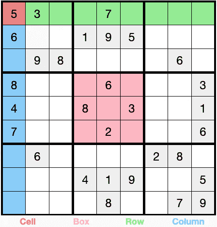

# 使用普通 JavaScript 构建数独谜题生成器

> 原文：<https://javascript.plainenglish.io/building-a-sudoku-puzzle-generator-d55cead9656d?source=collection_archive---------4----------------------->

编写一个生成器可能需要大量的工作。你需要考虑很多因素。下面是我如何使用普通 JavaScript 实现的。



Sudoku Board

## 数独是什么？

在我开始解释如何生成独特的[数独](https://en.wikipedia.org/wiki/Sudoku)谜题之前，回顾一下数独的规则是很重要的。

数独游戏是在一个 9x9 的网格上进行的，网格由行、列和 3x3 的“盒子”分隔开。每行、每列和每个框中的“单元格”需要用数字 1-9 填写，不能有重复的数字。为了使数独游戏有效，它必须只有一个唯一的解决方案。换句话说，棋盘上的每个格子都有一个预定的值，这个值会随着谜题的解开而显示出来。如果一个单元格有两个或两个以上的值，将导致解决方案，这个难题是无效的。

## **背景**

编写一个生成器可能需要大量的工作。你需要考虑很多因素，例如[给你生成的谜题评分](https://www.sudokuessentials.com/grading-sudoku-puzzles.html)(指定难度)并确保生成的谜题有唯一的答案。

给谜题评分是一个异常困难的问题，因为人类在解决问题时使用了各种各样的技术。虽然这肯定是对计算机科学和人类心理学的一次有趣尝试，但我发现对于大多数用例来说，从头构建一个生成器是特别不必要的。相反，我决定通过操纵现有矩阵(拼图)来“作弊”，而不影响拼图的完整性，如上所述。

## 发电机编码

我首先整理了一个已经评分的现有谜题列表，并将它们作为二维数组(矩阵)复制到一个 javascript 文件中用作种子，空值映射为 0。您可以将空值表示为`null`或`undefined`，我只是更喜欢 0，因为测试时更容易读取输出。然后，您可以将代表矩阵的变量保存在标记为“easy”、“medium”、“hard”等的数组中。你最终会得到类似于`const easy = [easySeed1, easySeed2, ...]`的东西。接下来，每当我需要生成一个谜题时，我就对一个随机种子执行一系列随机转换。您可以对任何有效的谜题进行的变换有:

1.  将矩阵旋转 0 到 3 次
2.  将所有数字映射到其他数字
3.  洗牌任何 2-3 行或列跨越相同的 3 个方块。

## 旋转矩阵

想象你拿着一张纸，上面有一个数独游戏。现在将这张纸旋转 90 度，并调整数字的方向，使它们不会向侧面倾斜。这个谜题看起来会有所不同，但它显然仍然有效。事实上，如果你在网上或应用程序上玩数独，你得到的是同样的数独，只是旋转了 90 度，你可能不会注意到。这正是问题的关键。你不需要生成完全‘独一无二’的谜题，只要‘独一无二’的*足够让**他们神不知鬼不觉。不管怎样，实现这一点的代码如下:*

```
*const rotateMatrix = (array) => {
  const n = array.length  

  // Create a temporary matrix of size n x n
  let t = Array.from(Array(n), () => Array.from(Array(n)))

  for (let i = 0; i < n; i++) {
    for (let j = 0; j < n; j++) {

      // basically array[i][j] gets moved to [j][n - (i + 1)]
      // e.g. array[0][0] => array[0][8] assuming 9x9 matrix
      let ele = array[i][j];
      let idx = n - (i + 1)

      t[j][idx] = ele
    }
  }
  return t
}*
```

## *地图编号*

*您也可以将任何数字组映射到任何其他数字组，谜题保持不变。例如，您可以映射数字，使“1”变成“3”，“3”变成“9”，以此类推。我们可以这样做，首先使用 [Fisher-Yates](https://medium.com/@oldwestaction/randomness-is-hard-e085decbcbb2) 方法混洗数字 1-9 的数组，并设置一个转换对象，使得:*

```
*const conversion = {}
// i + 1 bc we want 1-9 as keys and arrays start at index 0 
shuffled.forEach((e, i) => conversion[i + 1] = e)*
```

*一旦有了转换对象，就可以简单地遍历矩阵，将每个数字映射到转换的值，确保考虑到了空值:*

```
*arr[i][j] = conversion[[arr[i][j]] || 0*
```

## *无序排列行和列*

*这是目前为止转换 seed 谜题最酷的方法，我相信这是真正改变谜题的方法。参考一下本文顶部的图片。如果你把第一行(绿色突出显示的那一行)换成第二或第三行，谜题仍然有效。概括地说，行在组(1，2，3)，(4，5，6)和(7，8，9)中的顺序并不重要，但是您不能在组之间交换行。柱子也是一样。如果你不相信我，请查看[数独解决方案](https://www.sudoku-solutions.com/)，并简单地将页面顶部的图片中的谜题复制到他们的界面中。点击“检查拼图”。现在只需交换第一行和第二行，并继续这样做的行和列，直到你确信。假设您已经有了一个 shuffle 函数，您可以非常容易地对行进行洗牌:*

```
*const shuffleRows = (array) => {
  return [
   shuffle(array.slice(0, 3)),
   shuffle(array.slice(3, 6)),
   shuffle(array.slice(6)
  ].flat() // flat by default flattens array by one level*
```

*为了混洗列，首先旋转矩阵一次，然后使用相同的 shuffleRows 函数，然后旋转矩阵 3 次以上，回到其原始方向。*

## *结论*

*我有了制作拼图生成器的灵感，因为我试图用来生成拼图的[包](https://yarnpkg.com/?q=sudoku&p=1)不能生成有效的拼图，而且我不想依赖外部 API 来获取拼图。*

*虽然从技术上讲，这不是一个“真正的”字谜生成器，但我发现这种方法对于我自己的个人项目来说已经足够好了。当然，你提供给生成器的谜题种子越多，它就越能欺骗人们相信他们正在解决真正独特的谜题。*

*我试图在我的室友身上测试，但在我有任何确凿的数据之前，他们就厌倦了。希望你喜欢这篇文章，感谢阅读！*

*[*更多内容看 plainenglish.io*](http://plainenglish.io/)*