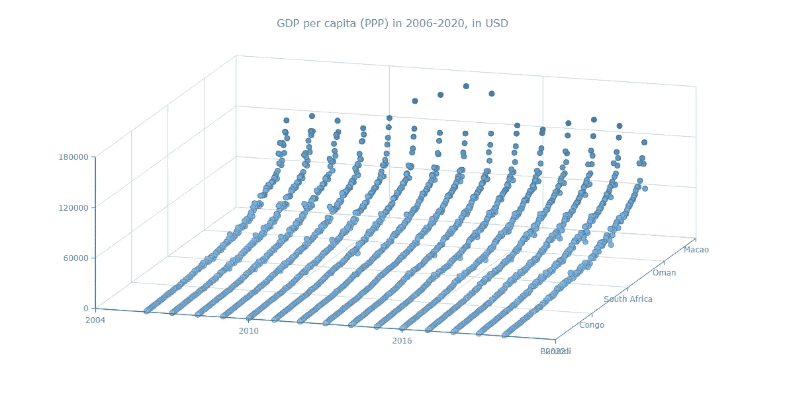
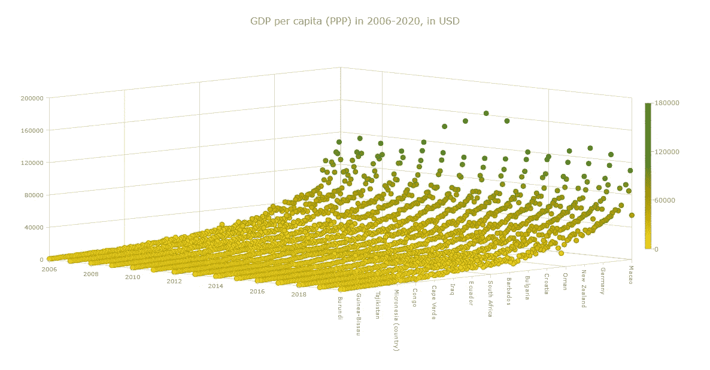

# 用 JavaScript 构建曲面图

> 原文：<https://javascript.plainenglish.io/building-a-surface-chart-in-javascript-189e0d07a4c4?source=collection_archive---------17----------------------->


[数据可视化](https://www.anychart.com/blog/2018/11/20/data-visualization-definition-history-examples/)如今是一项必备技能，数据不断增长，需要分析和呈现这些数据。无论你是否在技术行业，你肯定会遇到数据图表，因此，学习如何构建可视化是一个好主意。

在这里，我将向您展示构建图表并不困难，只要使用正确的工具，您就可以花很少的时间和精力来创建交互式的、有趣的可视化效果！

在这个循序渐进的教程中，我将演示如何使用 JavaScript 库在一个漂亮的交互式 3D 表面图表上显示过去 15 年各个国家的 GDP 值，以实现数据可视化。

表面情节看起来相当复杂，但我将向您展示制作一个引人注目且功能齐全的表面情节是多么简单。

# 什么是 3D 曲面图？

3D 曲面图在 x、y 和 z 轴上绘制三维数据，其中两个变量是独立的(沿水平轴显示)，一个变量依赖于另两个变量(显示在垂直轴上)。

在本教程中，我将绘制国家和年份作为自变量，GDP 值作为因变量。

# JavaScript 图表库

目前，有很多好的 [JS 图表库](https://en.wikipedia.org/wiki/Comparison_of_JavaScript_charting_libraries)，它们都有一些优点和缺点。您可以根据自己的具体需求选择使用哪一个，最棒的是，所有库的可视化构建过程都非常相似。所以，你可以从任何一个图书馆开始学习，也可以将你的知识扩展到另一个图书馆。

对于本教程，我将使用 [AnyChart](https://www.anychart.com/) JavaScript 图表库，这对初学者来说可能是个不错的选择。它有大量的[示例](https://www.anychart.com/products/anychart/gallery/)以及大量的[文档](https://docs.anychart.com/)，这对刚开始时非常有用。

此外，AnyChart 非常易于使用，并且具有大量定制选项。对许多人来说尤其重要的是，它可以免费用于个人、教育和其他非商业用途。

# 使用 JS 库构建基本的 3D 表面图

当然，如果你有 HTML、CSS 和 JavaScript 的背景知识，这是一个优势。但是，即使你是一个完全的初学者，也不要不知所措。我将带您浏览代码的每一行，一旦您理解了正在发生的事情，它应该会变得更容易理解。

使用 JS 库创建 3D 表面图或基本上任何图表有四个一般步骤，如前所述，无论使用什么库，这些步骤都是一样的。

*   创建 HTML 页面来显示您的图表。
*   包括所需的 JavaScript 文件。
*   准备并连接您的数据。
*   为图表编写 JS 代码。

## 步骤 1-创建一个基本的 HTML 页面

第一步是创建一个包含图表的空白 HTML 页面。我将向页面添加一个具有唯一 id 的 block 元素。稍后我将使用 id 来引用`<div>`。

我现在将页面的`<style>`块中的`<div>`的高度和宽度指定为 100%。这将在整个页面上呈现图表。您可以根据自己的喜好指定高度和宽度。

```
<!DOCTYPE html>
<html lang="en">
  <head>
    <meta charset="utf-8">
    <title>JavaScript Surface Chart</title>
    <style type="text/css">   
      html, body, #container {
        width: 100%;
        height: 100%;
        margin: 0;
        padding: 0;
      }
    </style>
  </head>
  <body>
    <div id="container"></div>
  </body>
</html>
```

## 步骤 2 —添加必要的脚本

使用 JavaScript 库时，需要添加特定于正在构建的图表和正在使用的库的脚本。

在这里，我使用 AnyChart，所以我需要从[的 CDN](https://cdn.anychart.com/) (内容交付网络)添加相应的脚本，基本上所有的脚本都可以在这里找到。

因此，我将为这个图表包含 AnyChart 的[核心](https://docs.anychart.com/Quick_Start/Modules#core)和[表面](https://docs.anychart.com/Quick_Start/Modules#surface)模块。

提醒您一下，在 HTML 页面的`<head>`部分包含所有这些脚本文件。

```
<!DOCTYPE html>
<html lang="en">
  <head>
  <meta charset="utf-8">
  <title>JavaScript Surface Chart</title>
  <script src="https://cdn.anychart.com/releases/8.10.0/js/anychart-core.min.js"></script>
  <script src="https://cdn.anychart.com/releases/8.10.0/js/anychart-surface.min.js"></script>
  <script src="https://cdn.anychart.com/releases/8.10.0/js/anychart-data-adapter.min.js"></script>
  <style type="text/css">   
    html, body, #container {
      width: 100%; height: 100%; margin: 0; padding: 0;
    }
  </style>
  </head>
  <body> 
    <div id="container"></div>
    <script>
 ***// All the code for the JS Surface Chart will come here***    </script>
  </body>
</html>
```

## 步骤 3 —包含数据

我决定在 3D 表面图中可视化的数据来自世界银行开放数据网站，该网站在一个 CSV 文件中为我提供了所有国家的 GDP(基于 PPP)数据。

如果数据采用图表期望的格式以及您希望如何显示数据，则创建图表会更容易。所以我对数据进行了相应的预处理。你可以在这里浏览我的 JSON 数据文件[。](https://gist.githubusercontent.com/shacheeswadia/b0d6b34a1910359e0e1a8fc0c84019a6/raw/4ab92ca6361f1bc9875d2854e2e1271bc991f86b/surfaceAreaData.json)

为了从 JSON 文件加载数据，我将添加 AnyChart 的[数据适配器](https://docs.anychart.com/Quick_Start/Modules#data_adapter)模块，并在 HTML 页面主体的`<script>`标记中使用`loadJsonFile`方法。

三个准备步骤已经完成，所以准备写一些代码吧！

## 步骤 4 —编写绘制图表的代码

我要做的第一件事是确保所有代码只有在页面完全加载后才执行。为此，我将把整个代码放在`anychart.onDocumentReady()`函数中。

然后，我将处理从 JSON 文件加载的数据。尽管我已经对数据进行了预处理，但为了绘制 3D 表面图，我还需要进一步处理它。基本上，我将根据 x 轴数据的顺序创建一个保存 y 轴和 z 轴数据的数组。

```
anychart.onDocumentReady(function () {
  anychart.data.loadJsonFile(    'https://gist.githubusercontent.com/shacheeswadia/b0d6b34a1910359e0e1a8fc0c84019a6/raw/4ab92ca6361f1bc9875d2854e2e1271bc991f86b/surfaceAreaData.json',
    function (data) {
 ***// processing of the data***      var result = [];
      for (var x = 0; x < data.x.length; x++) {
        for (var y = 0; y < data.y.length; y++) {
          result.push([x, data.y.sort()[y], data.z[x][y]]);
        }
      }
    }
  );
});
```

现在，我将创建曲面图，并根据刚刚创建的数据数组设置标记。

接下来，我需要从加载的数据中设置 x 轴标签，因为我创建的数组只包含一个序列，而不包含国家名称。我还将指定 x 刻度的最大值。

```
***// create surface chart*** var chart = anychart.surface();

***// enable markers and set data for them*** chart.markers().enabled(true).data(result);

***// set x axis labels format*** chart
  .xAxis()
  .labels()
  .format(function () {
    return data.x[Math.round(this.value)];
  });.

***// set x axis scale maximum*** chart.xScale().maximum(data.x.length - 1);
```

现在，我将为我的图表添加一个标题，并在各边添加一些填充。最后，我将引用第一步中创建的`<div>`并绘制图表。

```
***// set chart paddings*** chart.padding(25, 50, 75, 50);

***// set chart title*** chart.title('GDP per capita (PPP) in 2006-2020, in USD');

***// set container id for the chart*** chart.container('container');

***// initiate chart drawing*** chart.draw();
```



瞧啊。一个基本的功能性 3D 表面图已经准备好了！

> ***你可以在***[***CodePen***](https://codepen.io/shacheeswadia/pen/xxLbBZa)***，【或者在***[***any chart Playground***](https://playground.anychart.com/ylK75uzg/)***上看看这个 JavaScript 3D 曲面图的基本版本，或者在这里查看一下代码。***

```
<!DOCTYPE html>
<html lang="en">
  <head>
  <meta charset="utf-8">
  <title>JavaScript Surface Chart</title>
  <script src="https://cdn.anychart.com/releases/8.10.0/js/anychart-core.min.js"></script>
  <script src="https://cdn.anychart.com/releases/8.10.0/js/anychart-surface.min.js"></script>
  <script src="https://cdn.anychart.com/releases/8.10.0/js/anychart-data-adapter.min.js"></script>
  <style type="text/css">   
    html, body, #container {
      width: 100%; height: 100%; margin: 0; padding: 0;
    }
  </style>
  </head>
  <body> 
    <div id="container"></div>
    <script>
      anychart.onDocumentReady(function () {
        anychart.data.loadJsonFile(                   'https://gist.githubusercontent.com/shacheeswadia/b0d6b34a1910359e0e1a8fc0c84019a6/raw/4ab92ca6361f1bc9875d2854e2e1271bc991f86b/surfaceAreaData.json',
          function (data) {
 ***// processing of the data***            var result = [];
            for (var x = 0; x < data.x.length; x++) {
              for (var y = 0; y < data.y.length; y++) {
                result.push([x, data.y.sort()[y], data.z[x][y]]);
              }
            } ***// create surface chart***            var chart = anychart.surface(); ***// enable markers and set data for them***            chart.markers().enabled(true).data(result);

 ***// set x axis labels format***            chart
              .xAxis()
              .labels()
              .format(function () {
                return data.x[Math.round(this.value)];
              });

 ***// set x axis scale maximum***            chart.xScale().maximum(data.x.length - 1);

 ***// set chart paddings***            chart.padding(25, 50, 75, 50);

 ***// set chart title***            chart.title('GDP per capita (PPP) in 2006-2020, in USD'); ***// set container id for the chart***            chart.container('container'); ***// initiate chart drawing***            chart.draw();
          }
        );
      });
    </script>
  </body>
</html>
```

# 自定义 JS 曲面图

使用任何 JS 图表库的最大好处之一是，您只需编写很少的代码就可以实现图表的工作版本。此外，大多数库都提供了定制图表的选项，使其更加个性化和信息量更大。

让我向您展示如何增强 JS 3D 曲面图，使其更加直观和美观:

## 步骤 1 —改善所有轴的外观和感觉

这可能看起来是很小的改变，但这是我首先要做的。修改坐标轴的外观和感觉使图表看起来明显更好，更容易阅读。

**修改轴的基本设置**

为了强调曲面图的 3D 效果，我将 y 轴和 z 轴分别旋转 15 度和 45 度。这可以通过使用内置的旋转功能非常简单地完成。

我现在将 y 轴的最大值和最小值设置为开始和结束年份，以使绘图看起来更清晰。

```
***// set y and z axes rotation*** chart.rotationY(15);
chart.rotationZ(45);

***// set y scale minimum/maximum*** chart.yScale().minimum(2006);
chart.yScale().maximum(2020);
```

现在，我将启用 x 和 y 轴的次要刻度，以显示更多刻度，从而显示更多标签。为了记号的一致性，我将 y 轴和 z 轴的间隔设置为固定值。

```
***// enable x and y axes minor ticks*** chart.xAxis().minorTicks().enabled(true);
chart.xAxis().minorLabels().enabled(true);
chart.yAxis().minorTicks().enabled(true);
chart.yAxis().minorLabels().enabled(true);

***// set scales ticks intervals*** chart.yScale().ticks().interval(8);
chart.zScale().ticks().interval(40000);
```

**修改轴的标签**

为了避免与 x 轴标签重叠，我将隐藏 y 轴上的最后一个标签。

接下来，我将减小所有轴的标签和次要标签(次要刻度的标签)的字体大小。

```
***// hide the last label in y axis*** chart.yAxis().drawLastLabel(false);

***// set x, y and z axes labels font size*** chart.xAxis().labels().fontSize(10);
chart.xAxis().minorLabels().fontSize(10);
chart.yAxis().labels().fontSize(10);
chart.yAxis().minorLabels().fontSize(10);
chart.zAxis().labels().fontSize(10);
```

最后，在标签修改中，我将 x 轴标签和次要标签旋转 90 度，以获得更清晰的外观。

我还需要用加载的数据设置 x 轴次标签，类似于我之前对 x 轴法线标签所做的。

```
***// set x axis labels rotation*** chart.xAxis().labels().rotation(90);
chart.xAxis().minorLabels().rotation(90);
chart
  .xAxis()
  .minorLabels()
  .format(function () {
    return data.x[Math.round(this.value)];
  });
```

**修改轴的行程**

默认情况下，曲面图使用三种不同的颜色来表示三个不同的轴。但是我不需要我的表现，所以我将改变所有轴的笔画以及刻度为浅灰色。

```
***// set x, y and z axes stroke settings*** chart.xAxis().stroke(null);
chart.xAxis().ticks().stroke("1 lightgray"); 
chart.xAxis().minorTicks().stroke("1 lightgray"); 
chart.yAxis().stroke(null);
chart.yAxis().ticks().stroke("1 lightgray"); 
chart.yAxis().minorTicks().stroke("1 lightgray");
chart.zAxis().stroke(null);
chart.zAxis().ticks().stroke("1 lightgray"); 
chart.zAxis().minorTicks().stroke("1 lightgray");
```

> ***在这里看看这个对坐标轴进行了所有美化的版本是什么样子，你可以在***[***CodePen***](https://codepen.io/shacheeswadia/pen/eYEZyqP)***【或者在***[***any chart Playground***](https://playground.anychart.com/xbTC6gE8/)***上使用它。***


## 步骤 2-添加调色板

提升图表吸引力的一个可靠方法是根据你展示的数据添加一个调色板。这是一个非常简单的过程，我首先用我想要的颜色创建一个线性色标，然后为图表设置色标。

除了添加颜色，我还将添加一个图例，显示什么颜色表示什么值范围，这只用一行代码就可以完成。

```
***// create color scale*** var customColorScale = anychart.scales.linearColor();
customColorScale.colors([
  '#ffdd0e',
  '#BCA600',
  '#76A100',
  '#1b8366',
  '#007561'
]);

***// set color scale*** chart.colorScale(customColorScale);

***// enable and configure color range*** chart.colorRange().enabled(true).orientation('right');
```

## 步骤 3 —增强工具提示

当您展示更多数据时，拥有一个有用的工具提示总是一个好主意。默认的工具提示信息并不丰富，因此我将对其进行自定义，以显示每个绘制点的所有三个参数的值——国家、年份和 GDP 数字。

```
***// tooltip settings*** chart
  .tooltip()
  .useHtml(true)
  .titleFormat(function () {
    return data.x[this.x];
  })
  .format(function () {
    return "Year: " + this.y + "<br>" + "GDP:$ " + this.z.toFixed(2);
  });
```

你不认为这个简单的工具提示给图表增加了更多的价值吗？

> ***看看现在基于 JavaScript 的 3D 表面图看起来有多酷和定制，你可以在 CodePen[和在***[***any chart Playground***](https://playground.anychart.com/R1Mq06kP)***]上找到完整的代码。***



# 结论

如此激动人心、看起来复杂的 3D 表面图竟然可以如此轻松地构建出来，这难道不令人惊讶吗？使用 JavaScript 库，您可以快速创建一个简单的、可操作的图表，然后添加任意多的特性来调整您的可视化效果。

在各种 [JS 图表库](https://en.wikipedia.org/wiki/Comparison_of_JavaScript_charting_libraries)中有许多不同类型的数据可视化可用，例如，您可以查看 AnyChart 中可用的[图表类型选项](https://docs.anychart.com/Quick_Start/Supported_Charts_Types)。

请提出任何问题，给出建议，或者简单地打个招呼。天空是提高每个国家的 GDP 和创造伟大的可视化的极限，所以开始用这个新学到的技能制作一些有趣和有启发性的图表吧！

***经沙奇·斯瓦迪亚许可出版。最初出现在 2021 年 12 月 10 日的***[***Hongkiat***](https://www.hongkiat.com/blog/creating-surface-chart-with-javascript/)***上，标题为“如何用 JavaScript 创建曲面图(4 个简单步骤)”。***

***在***[***Chartopedia***](https://www.anychart.com/chartopedia/chart-type/surface-chart/)***上找到更多关于表面图表的信息，一个免费的图表类型指南。不要错过其他*** [***JS 制图教程***](https://www.anychart.com/blog/category/javascript-chart-tutorials/) ***。***

***对客座博文有想法？我们期待听到它—*** [***让我们知道***](https://www.anychart.com/support/) ***！***

*原载于 2021 年 12 月 15 日*[*【https://www.anychart.com】*](https://www.anychart.com/blog/2021/12/15/surface-chart-javascript/)*。*

*更多内容看* [***说白了. io***](http://plainenglish.io/) ***。*** *报名参加我们的* [***免费每周简讯这里***](http://newsletter.plainenglish.io/) ***。***