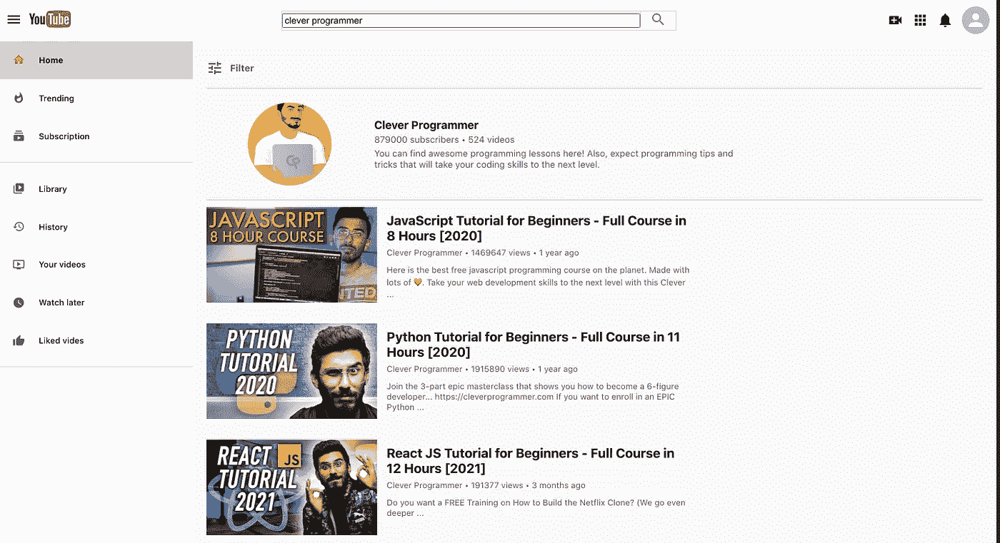
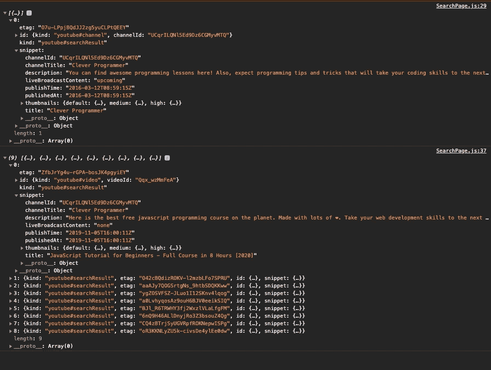

# 让我们用 React 构建一个 YouTube 克隆

> 原文：<https://javascript.plainenglish.io/building-a-youtube-clone-using-react-part-3-d86db83d3b33?source=collection_archive---------1----------------------->

## 第 3 部分:在本教程中，我们将通过构建允许我们按关键字搜索的搜索页面来继续构建 YouTube 克隆

在第 1 部分和 [2](https://medium.com/swlh/building-a-youtube-clone-using-react-part-2-a23a9dded270) 中，我们从从 Youtube 数据 API v3 获取 API 密钥开始，并构建了推荐视频页面，根据您的国家代码显示最受欢迎的视频。在这一部分中，我们将构建 Youtube 克隆的搜索页面，它包含通过关键字搜索视频的功能。

Search Page that we are going to build

下面是构建这个 YouTube 克隆的部分列表:

*   第 1 部分—获取 API 键并构建侧栏和标题([这里是](/@nouman10/building-a-youtube-clone-using-react-part-1-40fb09ae2837))
*   第 2 部分—建立推荐视频页面([此处为](https://medium.com/swlh/building-a-youtube-clone-using-react-part-2-a23a9dded270))
*   第 3 部分—构建搜索页面(这一部分)
*   第 4 部分—构建视频播放器页面([此处为](https://nouman10.medium.com/lets-build-a-youtube-clone-with-react-part-4-48dd9e9d8cef))

如果你不喜欢阅读，对源代码感兴趣，可以滚动到故事的结尾。

> **注意:**本教程假设您对 JavaScript 和 React 有基本的了解。
> 
> **注意:**本教程不包含所有的代码，尤其是样式，而是解释了项目的主要部分

# **配置路线**

让我们首先为我们的网站配置路由。我们将在`App.js`中进行这些更改

我们的主页是我们构建的`RecommendedVideos`组件。而`SearchPage`组件就是我们在本文中要构建的。

# 重定向到搜索页面

让我们首先添加重定向到搜索路径的功能，以防用户在搜索栏中输入内容。

为此，我们将更新我们的`Header`组件，将搜索作为它的状态。

因此，单击搜索图标将使用输入栏中的搜索关键字重定向到搜索页面

# 通道行组件

让我们首先创建一个根据搜索关键字显示`ChannelRow`的组件。这将是一个虚拟组件，也就是说，它不会被重定向到实际频道的页面

遵循我们在前面部分中使用的相同模式，在`components/`文件夹中创建一个 ChannelRow 文件夹，分别包含两个文件`ChannelRow.js`和`ChannelRow.css`。

让我们给组件添加一些样式

# 视频行组件

现在，我们将在 react 中利用可重用组件的力量。我们将构建一个组件，接受视频的细节并呈现它。然后，我们将简单地像使用 HTML 标签一样使用该组件，并将属性传递给它。

然后我们将样式添加到`VideoRow.css`

# 访问 API

让我们现在开始构建`SearchPage`组件，但首先我们需要访问 API 来获取频道和基于搜索关键字的视频。

注意，这里有两个独立的 API 调用。一个用于频道，另一个用于视频。收到的输出如下所示:

我已经扩展了频道的结果和视频列表中的一个视频，以便更好地查看我们得到的数据。以下是我们感兴趣的渠道信息:

1.  频道 Id
2.  标题
3.  描述
4.  缩略图中的图像

从视频来看:

1.  视频 Id
2.  标题
3.  缩略图中的图像
4.  描述
5.  频道标题
6.  时间戳

# 助手功能

让我们创建两个独立的助手函数，以便从响应中提取所需的数据

我们将不得不提出一些额外的要求，以及获得有关渠道和视频的统计数据。YouTube API 不允许我们基于关键字搜索统计数据，这就是为什么需要使用 id 发送单独的请求。

# 将一切结合在一起

让我们将到目前为止我们已经构建的所有东西合并到`SearchPage`组件中。

你注意到我们如何在地图函数中使用`VideoRow`来渲染所有的视频了吗？这就是 React 通过构建我们可以随时重用的组件为我们提供的强大功能。

最后，让我们给组件添加一些样式

# 结论

这部分到此为止。让我们总结一下我们在本教程中所做的工作:

1.  使用`react-router-dom`设置到适当组件的路线
2.  创建了`ChannelRow`和`VideoRow`组件来分别渲染频道和视频
3.  使用`axios`通过搜索关键字访问 Youtube API 获取数据
4.  编写了两个助手函数来清理来自 API 的响应
5.  将所有内容组合到`SearchPage` 组件中以呈现所有内容。

在下一讲中，我们将创建`VideoPlayer`组件，它将呈现和播放您想要的任何特定视频。

你可以在我的 GitHub 上查看完整的源代码

如果您觉得以上内容对您有用，请分享并随时支持我-->

*   https://www.buymeacoffee.com/nouman10