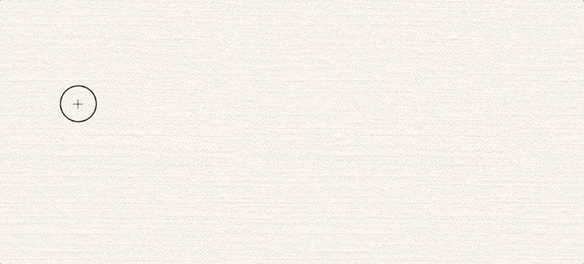

# 用 React 搭建一个 AR 画图 App

> 原文：<https://javascript.plainenglish.io/building-an-ar-drawing-app-using-react-5f47740a747c?source=collection_archive---------9----------------------->

如果你刚刚学习了一种新的框架或语言，那么从构建简单、直接的应用程序到构建有许多活动部件的应用程序的跨越似乎是不可逾越的。至少，这是我在 react 中实现我的第一个项目时的感觉。我有一个充满热情的想法，但没有路线图、例子，甚至不确定它是否可行。

我的目标是构建一个 web 应用程序，使用户能够绘制 AR 人脸过滤器，但我是 react 和 javascript 的新手，我不确定以我的技能水平是否能做到这一点。我的第一步是寻找有用的第三方库。谢天谢地，我找到了一个很棒的开源 javascript 库，名为 [Jeeliz](https://jeeliz.com/) 。他们甚至有一个内置绘图组件和面部跟踪的面部过滤器！你可以试试这里的。

The stock library face filter

这是我想做的事情的一个很好的起点。尽管绘图部分不足以满足我的目的，但它给了我继续这个项目的信心。话虽如此，我仍然不知道我将如何实现一个可用的绘图界面，不同的笔画颜色，大小，擦除，并在完成后保存(你如何保存一个图像映射到视频饲料！？这对我来说是一个谜。)

我在前端使用 create-react-app，状态管理使用 redux，后端使用 rails API。第一个障碍是让 Jeeliz AI 面部识别库与我的 react 组件合作。我使用的库的一部分是一个大文件，包含了你在上面的面部过滤器的例子中看到的所有行为。我花了很多时间阅读这个文件，试图理解如何让它与 react 一起工作。我最终发现这个库是通过使用两个 HTML 画布来工作的。需要在我的 react 相机视图组件中创建一个画布来显示相机馈送。另一个画布将被映射到用户的面部，并且即使当用户倾斜或旋转他们的头部时，也将保持以他们的面部为中心。这个内部画布是绘画发生的地方。

This simple component brought my react app and the facial recognition library together!

这个组件看起来很简单，但由于我没有 HTML 画布或显示视频提要的经验，我花了很长时间才弄明白，所以当我最终在我的网站上获得视频提要时，我欣喜若狂。我现在可以解决创建一个合适的绘图组件的问题了。在研究了 HMTL 画布之后，我意识到构建一个“好的”绘图应用程序是多么复杂。我希望这个应用程序有一个直观的界面和流畅的笔画。我很快意识到我的绘图组件也需要一个外部库。我很幸运地找到了另一个很棒的开源库，[at rement . js](https://github.com/jakubfiala/atrament.js?utm_source=designernews)。

The strokes are smooth!

在这一点上，我有两个不相关的库，我本质上希望它们成为一个。我的计划是用这个新的处理图片库替换 Jeeliz face 过滤器中已经存在的绘图组件。

Scientific diagram of how I planned to mesh the two libraries.

当然，事实证明说起来容易做起来难。这些库本身很容易使用。如果我想要的只是创建一个画布，用 Atrament 库在上面画画，我需要导入这个库，按照他们的文档创建一个画布，这个库会处理剩下的事情。问题是 Jeeliz 面部过滤器库有着复杂的层次，我不能简单地插入一个装置的绘图组件。Jeeliz 库有自己的绘图组件，以及对内置 API 的调用，该 API 执行基本操作，如启动和停止相机，每次更改后刷新画布，以及检查当前是否检测到人脸。它自己做了太多的事情，以至于我不得不找出从一个终端输入绘图信息的正确位置，以确保 Jeeliz 将它放在 2D 的 HTML 画布上，这个画布正被固定到检测到的人脸上。

这是我第一次不得不阅读别人的外国复杂代码，理解它，并转换它。最后，我能够让这两个库工作了，因为 Atrament 绘图库有一个漂亮的编程绘图选项。这允许我通过将绘制笔画的坐标提供给 Jeeliz 面部过滤器库的事件监听器来连接这些库。

Mouse down and Mouse move event listeners from Jeeliz library.

在上面的代码中，您可以看到鼠标按下和鼠标移动的事件侦听器。以前，他们使用 canvas API (CTX)来绘制，但现在，他们使用鼠标的坐标来调用 atrament.draw，以显示用户做出的笔画。我还删除了 Jeeliz 面部滤镜中最初的华丽框架，但是将图像映射到面部的能力使得在绘制滤镜后尝试滤镜变得容易。

结果是一个应用程序，你可以绘制面部过滤器，保存它们，稍后试用，并浏览其他用户绘制的过滤器。以下是绘图界面的最终外观:

# 结论

总的来说，我从开发这个应用中学到了很多。有太多的时刻，我觉得这是不可能的，我不能让它工作，但成品让我很高兴，我很高兴与朋友分享它，看看他们创造了什么。可以试试这里的 app [。](http://facepaint.patriciaarnedo.com)

*更多内容尽在*[***plain English . io***](https://plainenglish.io/)