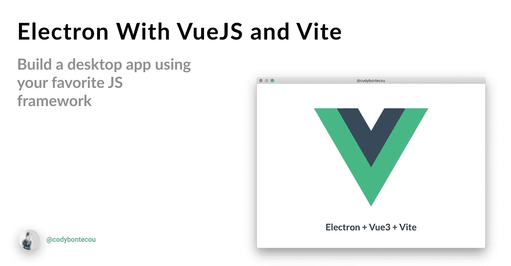

# 如何用 Vue.js 和 Vite 搭建一个电子 App

> 原文：<https://javascript.plainenglish.io/building-an-electron-app-with-vuejs-and-vite-6f41e2d7587f?source=collection_archive---------17----------------------->

> 让我们将 Electron 的力量与 Vue.js 和 Vite 结合起来，只用 JavaScript 就能创建令人难以置信的桌面应用程序。
> 这篇文章最初发布在我的[站点](https://codybontecou.com/electron-app-with-vuejs-and-vite.html)。

## TL: DR

克隆[这个](https://github.com/Deluze/electron-vue-template)回购，并将其用作启动模板。

## [电子眼](https://github.com/SimulatedGREG/electron-vue)已死，万岁[电子眼模板](https://github.com/Deluze/electron-vue-template)

看起来 [electron-vue](https://github.com/SimulatedGREG/electron-vue) ，结合 Vue.js 和 electron 的领先 Github 库自 2021 年 4 月 21 日以来没有提交过。在 4 月 21 日提交之前，自 2019 年 12 月 3 日以来以及在此之前的 2018 年 10 月 23 日，它没有重大贡献活动。

回购可能还没死，但它正在离开——失败的构建、数百个公开的问题，以及被锁定在特定的工具版本中，所有这些都可能是即将到来的迹象。

## vue-CLI-plugin-electronic-builder 很整洁，但不是我喜欢的。

有了 3.5k Github Stars 和与 electron-vue 差不多的支持量，我决定试一试。他们声称对您使用 Vue CLI 3 或 4 创建的现有应用程序运行命令`vue add electron-builder`,就这样，您的 Vue.js web 应用程序现在在一个电子实例中运行。

使用`vue create`构建了一个新的 Vue.js 应用程序，然后立即运行`vue add electron-builder`，我能够运行一个电子实例，这真是不可思议。

虽然编译启动了，但是确实给了我一个`ExtensionWarning`错误信息。试图移动目录结构和改变文件名会破坏应用程序。不得不阅读文档来管理像文件名和位置这样基本的东西是令人恼火的。我担心这个包在幕后有太多的魔力，让我无法舒适地使用它。

## 为什么[电子眼模板](https://github.com/Deluze/electron-vue-template)？它只有 14 颗星星！

> 它非常简单，没有不必要的依赖开销。

电子模板以透明和易于管理的方式搭建了网站。它附带了一个非常好的目录结构，使得它很容易消化和理解配置或构建代码发生的位置。node_module 构建脚本的幕后并没有什么神奇的事情发生。

因为它的透明性和结构良好的代码。这个模板非常适合作为使用 VueJS 和 electronic 构建桌面应用程序的起点。

这个存储库几乎没有损失，因为明天它将失去唯一的贡献者。因为它是一个模板，你可以克隆它，并从中挑出你想要的部分。

## 更不用说，还自带 Vite！

[Vite](https://vitejs.dev/) 在热模块更换方面独树一帜(HMR)。由于其按需文件服务，应用程序构建时间几乎是即时的——比现有的任何其他构建工具都快得多。

在提到的三个软件包中，[电子模板](https://github.com/Deluze/electron-vue-template)是唯一一个内置 Vite 的。仅仅这一点就是使用模板的原因。

## 下一步是什么？

在过去的几周里，我一直在一个个人应用程序上使用电子，我计划很快公布这个应用程序。它已经发展到了这样一个阶段:后端逻辑被压制，需要 UI 增强以及像 Vuex 这样的状态管理系统。

我将很快集成一个状态管理系统——要么是 [Vuex](https://vuex.vuejs.org/) 要么是 [Pinia](https://github.com/posva/pinia) 。我很好奇在一个使用 Vue 的电子应用程序中这个过程是什么样子的，但是我会尽我所能在我经历这个过程的时候写一篇博文。

*更多内容看* [***说白了。*** *报名参加我们的*](http://plainenglish.io/) [***免费每周简讯这里***](http://newsletter.plainenglish.io/) ***。***