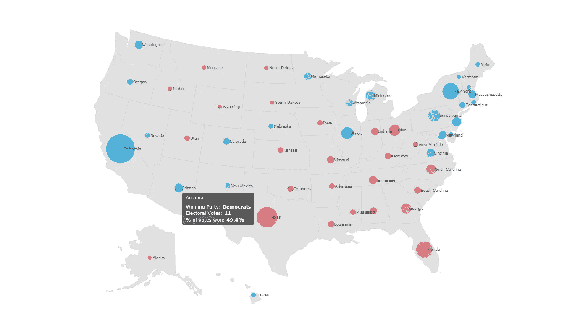
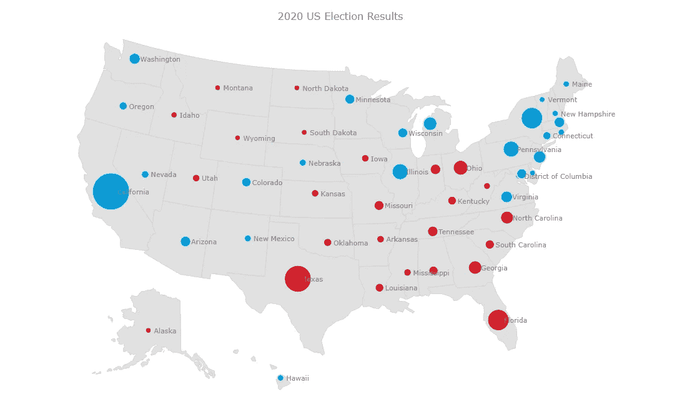
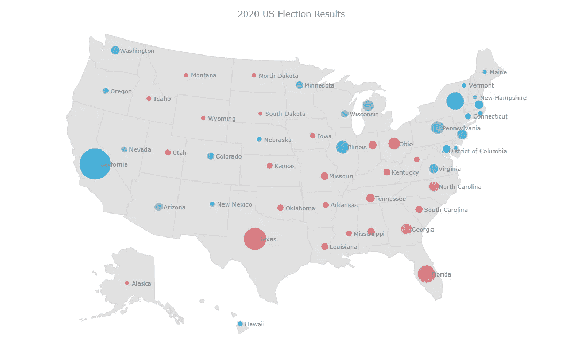
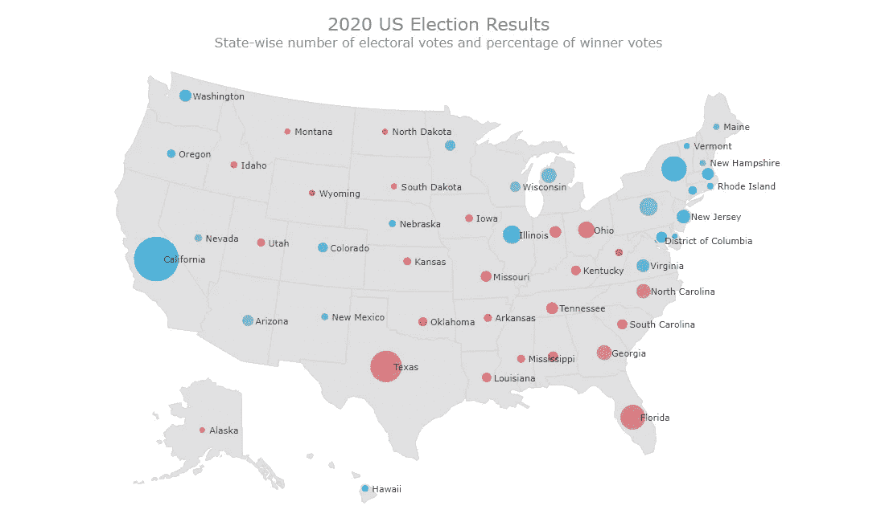

# 用 JavaScript 构建气泡图可视化选举结果

> 原文：<https://javascript.plainenglish.io/building-bubble-map-with-javascript-to-visualize-election-results-70c24fe0eadf?source=collection_archive---------20----------------------->



在这个数据呈指数级增长的时代，可视化是工具箱中必备的技能。流行的技术包括条形图、折线图、饼图和气泡图等。

对于任何开发人员来说，用 JavaScript 从头开始构建交互式图表都是一件困难的事情，尤其是对于新手来说。这就是为什么我们有 [JS 图表库](https://en.wikipedia.org/wiki/Comparison_of_JavaScript_charting_libraries)的原因，它使我们更容易、更快地想象出有洞察力的可视化效果！

继续阅读，看看我是如何用这些库之一创建 JavaScript 气泡图的。

# JavaScript 图表库

有很多很棒的 JavaScript 库可供使用，每一个都有自己的优缺点。但最棒的是，所有这些工具构建图表的过程几乎都是相似的。因此，您可以学习任何一个库的诀窍，然后使用适合您特定项目需求的库。

我已经决定使用 [AnyChart JavaScript 库](https://www.anychart.com/)来创建气泡图和这个教程。我觉得对于编码技能从新手到中级水平的开发者来说是一个很棒的选择。AnyChart 具有丰富的文档，并且有多种图表类型来启动您的可视化之旅。

# 什么是气泡图，它将显示什么？

我知道您对开始创建可视化感到兴奋，但在我们开始之前，了解图表类型以及为什么它非常适合我们想要展示的内容是很重要的。

气泡图实质上是气泡图和地图的组合，气泡是在地理区域上绘制的。气泡的大小表示特定变量的值，地图上的位置表示位置。

2020 年最重要的事件之一是美国总统大选。当然，我们知道总的结果。但是在一个视图中就能看到谁在哪个州赢了，赢了多少——这不是很有趣吗？我当然这么认为！虽然我相信我们中的许多人已经看到了很多 2020 年美国大选地图，但我将创建自己的地图，并一步一步地向你展示！

我将使用气泡图，在这里我将绘制美国各州的气泡图。3 个指示参数如下:

1.  每个州的选举人票数量，由气泡大小决定。
2.  每个州的获胜方，用泡泡色表示。
3.  通过颜色不透明度获得的投票百分比。

正如您所看到的，气泡图的强大之处在于能够在一个界面中显示多个参数。

# 用 JavaScript 创建气泡图

既然你知道什么是气泡图，并希望你确信它是代表美国大选各州结果的正确图表，让我们深入了解这个过程。

## 1.创建基本的 HTML 页面

第一步是创建一个空白的 HTML 页面。为了保存我的图表，我添加了一个具有惟一 id 的 div 元素，稍后我将使用它来引用它。

我将占位符 div 的宽度和高度设置为 100%,以便图表显示在整个屏幕上。您可以根据自己的喜好保留这些值。

```
<!DOCTYPE html>
<html><head>
  <title>Bubble Map</title>
  <style>
    html,
    body,
    #container {
      width: 100%;
      height: 100%;
      margin: 0;
      padding: 0;
    }
  </style>
</head><body>
  <div id="container"></div>
</body></html>
```

## 2.包括必要的脚本

下一步是链接将用于创建气泡图的适当的 JS 脚本。由于我使用的是 AnyChart 库，所以我将引用相应的文件。对于我的图表，我需要添加 AnyChart 的 Base 和 Geo Maps [模块](https://docs.anychart.com/Quick_Start/Modules)。我还需要包含包含美国各州地理数据的文件，该文件也可以在图书馆的 [CDN](https://cdn.anychart.com/) 中找到。

提醒您一下，所有的脚本文件都需要包含在 HTML 页面的部分。

```
<script src="https://cdn.anychart.com/releases/8.9.0/js/anychart-base.min.js" type="text/javascript"></script><script src="https://cdn.anychart.com/releases/8.9.0/js/anychart-map.min.js" type="text/javascript"></script><script src="https://cdn.anychart.com/releases/8.9.0/latest/countries/united_states_of_america/united_states_of_america.js"></script>
```

## 3.连接数据

有大量数据集可用于美国大选结果。对于这个图表，我们需要特定的字段，所以我必须通过组合来自多个来源的数据来创建最终的数据集。我使用了来自国会图书馆网站的关于每个州选举人票数的数据集和来自美联社网站的获胜者数据。

AnyChart 库支持多种数据格式，包括 CSV、JSON、XML…为了使事情更简单，我对数据进行了预处理，以包括图表的相关字段，如下所示:

1.  州代码
2.  纬度
3.  经度
4.  州名
5.  选举人票数
6.  获胜方
7.  赢得的选票百分比

你可以在这里下载 JSON 文件[。](https://gist.githubusercontent.com/shacheeswadia/70ec3d69e0e7a8bff7917607ea2926e4/raw/c3329fa81e86d9e637503b042becd17e68d9a718/bubbleMapData.json)

在我们开始使用数据之前，我们需要在我们的 HTML 页面中包含另外两个脚本文件。[数据适配器](https://docs.anychart.com/Working_with_Data/Data_Adapter/Overview)模块处理数据文件的加载，所以我们包括它。因为我们正在创建地图，所以我们将使用另一个 JavaScript 库 Proj4js，它将点坐标从一个坐标系转换到另一个坐标系。简单来说，它将负责绘制各个地理区域的气泡图。

## 4.添加绘制图表的代码

既然准备工作已经结束，该进入主要部分了。使用 JavaScript 图表库的最大好处是，您需要编写的代码量非常少。我将带您浏览代码行，以便您更好地理解气泡图是如何绘制的。

首先，我将确保创建图表的所有代码都在`anychart.onDocumentReady()`函数中。这是为了在执行任何其他操作之前完全加载页面。接下来，我们使用`anychart.data.loadJsonFile()`函数加载数据。

我首先创建地图，为它定义一些设置，并设置地理数据。我还在地图上添加了一个标题。

```
anychart.onDocumentReady(function () {
        anychart.data.loadJsonFile(
          'https://gist.githubusercontent.com/shacheeswadia/70ec3d69e0e7a8bff7917607ea2926e4/raw/c3329fa81e86d9e637503b042becd17e68d9a718/bubbleMapData.json',
          function (data) { ***// Creates map chart***            var map = anychart.map(); ***// Define settings for maps regions***            map
              .unboundRegions()
              .enabled(true)
              .fill('#E1E1E1')
              .stroke('#D2D2D2'); ***// Set geodata using the script added***            map.geoData('anychart.maps.united_states_of_america'); ***// Set Chart Title***            map
              .title('2020 US Election Results');

        });
      });
```

接下来，我将在地图上添加气泡。因为微小的气泡不容易被看到，而非常大的气泡会造成混乱的重叠，所以我设置了最小和最大的气泡尺寸。

```
***// Set bubble min/max size settings*** map.minBubbleSize('0.8%').maxBubbleSize('5%');
```

现在，因为我们想显示选举结果，我们需要用获胜政党的颜色来表示每个州的获胜者——蓝色表示民主党，红色表示共和党。为此，我们检查数据中的获胜者，并为填充属性分配相应的颜色。

```
***// Fill color based on the winner*** data.forEach(function(d){
  if(d.winner == "Democrats"){
    d.fill = "#019bd8";
  }else{
    d.fill = "#d81c28";
  }
});
```

然后，我根据数据绘制气泡，并设置气泡的大小来反映数据中的选举人票数量。我启用了气泡图的默认工具提示和标签，并进行了一些样式化。

最后的步骤是设置容器来引用之前添加的 HTML 块元素并绘制图表。

就这样——只需几行 HTML 和 JS 代码，一个漂亮的、功能齐全的交互式气泡图就准备好了！



你可以在[笔会](https://codepen.io/shacheeswadia/pen/MWjvdbG)【或者在[游乐场](https://playground.anychart.com/XXi0CMJD)上查看这个初始版本。为了方便起见，下面是完整的代码:

```
<!DOCTYPE html>
<html>
  <head>
    <script src="https://cdn.anychart.com/releases/8.9.0/js/anychart-base.min.js" type="text/javascript"></script>
    <script src="https://cdn.anychart.com/releases/8.9.0/js/anychart-map.min.js" type="text/javascript"></script>
    <script src="https://cdn.anychart.com/releases/8.9.0/geodata/countries/united_states_of_america/united_states_of_america.js"></script><script src="https://cdn.anychart.com/releases/8.9.0/js/anychart-data-adapter.min.js"></script>
    <script src="https://cdnjs.cloudflare.com/ajax/libs/proj4js/2.3.15/proj4.js"></script><style type="text/css">html,
      body,
      #container {
        width: 100%;
        height: 100%;
        margin: 0;
        padding: 0;
      }

    </style>
    </head>
    <body>

    <div id="container"></div><script>anychart.onDocumentReady(function () {
        anychart.data.loadJsonFile(      'https://gist.githubusercontent.com/shacheeswadia/70ec3d69e0e7a8bff7917607ea2926e4/raw/c3329fa81e86d9e637503b042becd17e68d9a718/bubbleMapData.json',
          function (data) { ***// Creates map chart***            var map = anychart.map(); ***// Define settings for maps regions***            map
              .unboundRegions()
              .enabled(true)
              .fill('#E1E1E1')
              .stroke('#D2D2D2'); ***// Set geodata using the script added***            map.geoData('anychart.maps.united_states_of_america'); ***// Set Chart Title***            map
              .title('2020 US Election Results'); ***// Set bubble min/max size settings***            map.minBubbleSize('0.8%').maxBubbleSize('5%'); ***// Fill color based on the winner***            data.forEach(function(d){
              if(d.winner == "Democrats"){
                d.fill = "#019bd8";
              }else{
                d.fill = "#d81c28";
              }
            }); ***//Charting the bubbles***            var series = map.bubble(
              anychart.data.set(data).mapAs({ size: 'electoralvotes' })
            ); ***// Tooltip***            series
              .tooltip(true)
              .stroke('2 #E1E1E1')
              .fill('#1976d2')
              .selectionMode('none'); ***// Labels***            series
              .labels()
              .enabled(true)
              .anchor('left-center')
              .position('right')
              .fontSize(11)
              .offsetX(5); ***// Set container id for the chart***            map.container('container'); ***// Initiates chart drawing***            map.draw();

        });
      });

  </script>
  </body>
</html>
```

# 自定义气泡图

JS 图表库通常提供一系列预构建的定制选项。

现有的气泡图已经很棒了，但我们可以用更多的代码来调整它，使它更有洞察力，更美观，并改善显示的信息。

## A.根据获胜的投票百分比分配不透明度

在不增加太多复杂性的情况下，在一个视图中展示最多的信息总是一个好主意。因此，我想在可视化中增加一个方面，用气泡颜色的不透明度来表示赢得的投票百分比，这将是一个很好的机会，向您展示如果您需要某个特定的功能，如何在这个过程中使用不同的 JavaScript 库。

我将使用 [D3.js](https://d3js.org/) ，这是一个著名的用于数据图形的开源 js 库，并使用它来创建一个线性标尺，该标尺将接受来自数据的投票百分比值，并返回相应的不透明度值。为此，我添加了所需的 D3 脚本，然后添加了代码来进行缩放。我根据数据调整输入和输出值。最后，我将不透明度值添加到填充属性中。

```
***// Linear scale to get opacity values*** var opacity = d3.scaleLinear()
              .domain([49, 70])
              .range([0.4, 0.9]);***// Fill color based on winner and opacity based on % of votes won*** data.forEach(function(d){
  var opacityVal = opacity(d.votepercent);
  opacityVal = opacityVal.toFixed(2);
  if(d.winner == "Democrats"){
    d.fill = "#019bd8 " + opacityVal;
  }else{
    d.fill = "#d81c28 " + opacityVal;
  }
});
```

如果你没有完全理解这一部分，不要不知所措。它稍微超出了初学者的水平，但仍然对许多人有帮助，而且也不太复杂，你看。



[笔筒上的景色](https://codepen.io/shacheeswadia/pen/zYKEqKm)
[操场上的景色](https://playground.anychart.com/vcxhhdzC)

## B.改进工具提示

默认工具提示只显示州名及其纬度/经度和值，对应于每个州的选举人票数。

我们可以定制工具提示来显示我们想要显示的信息——一些更有意义的东西。

对于每个州，我决定显示获胜的政党名称、选举人票数以及获胜者赢得的选票百分比。因为我想显示多个字段，所以我为工具提示启用了 HTML，这将允许我格式化文本。然后，我添加 HTML 格式的所有信息，并修改一些样式。啊，现在工具提示感觉像是气泡图可视化的建设性补充。

```
***// Enable HTML for labels*** series.tooltip().useHtml(true);***// Customize tooltip text* **  series
    .tooltip()
    .titleFormat("<h6 style='font-size:16px;margin: 0.2rem 0; font-weight:400;'>{%name}")
    .format("<h6 style='font-size:14px; font-weight:400; margin: 0.2rem 0;'>Winning Party: <b>{%winner}</b></h6><h6 style='font-size:14px; font-weight:400; margin: 0.2rem 0;'>Electoral Votes: <b>{%electoralvotes}</b></h6><h6 style='font-size:14px; font-weight:400; margin: 0.2rem 0;'>% of votes won: <b>{%votepercent}%</b></h6>");
```

## C.增强图表的整体外观

只是一些最后的，简单的修改来增强图表。我为图表添加了一个带有一些样式的副标题，并更改了标签颜色，使其更具对比度。

我调整的最后一件事是当气泡停留在上面时的颜色。

瞧啊。我们有一个迷人和有效的，基于 JavaScript 的气泡图可视化来展示美国各州的选举结果数据！



[CodePen 上的视图](https://codepen.io/shacheeswadia/pen/wvzrGrd)
[操场上的视图](https://playground.anychart.com/kMJRXssK/)

# 结论

如您所见，使用 JavaScript 库创建像气泡图这样的交互式数据可视化既简单又令人兴奋。您可以查看其他 [JavaScript 图表库](https://en.wikipedia.org/wiki/Comparison_of_JavaScript_charting_libraries)并了解更多关于它们的信息。

我希望这个教程能让你对数据可视化感兴趣，并让你开始探索 JavaScript 图表。请随意提问、提出建议或发表评论。总之，不要等到开始创造美丽，有用的可视化！

*经沙奇·斯瓦迪亚许可发布。最初于 2020 年 12 月 30 日出现在* [*【黑客中午】*](https://hackernoon.com/how-to-create-a-bubble-map-with-javascript-to-visualize-election-results-lb213155) *上，标题为“如何用 JavaScript 创建一个气泡图来可视化选举结果:通过创建一个有趣而直观的 JS 气泡图来开始数据可视化的初级教程”。*

*查看其他* [*JavaScript 图表教程*](https://www.anychart.com/blog/category/javascript-chart-tutorials/) *。*

*如果你想为我们的博客写一篇引人注目的客座博文* [*联系*](https://www.anychart.com/support/) *。*

*原为发表于 2021 年 1 月 25 日*[*https://www.anychart.com*](https://www.anychart.com/blog/2021/01/25/bubble-map-javascript/)*。*