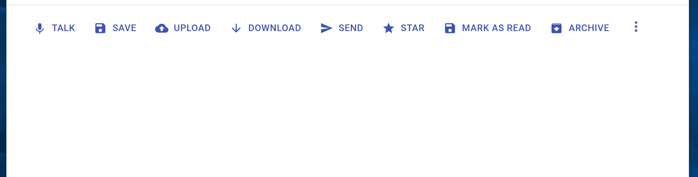

# 在与交叉点观察器反应中构建可折叠菜单

> 原文：<https://javascript.plainenglish.io/building-collapsible-menu-in-react-with-intersection-observer-64f355df9f0c?source=collection_archive---------4----------------------->

当人们谈论交叉点观察器时，想到的最常见的用例是**懒惰加载图像**和**无限滚动**。然而，交叉点观察器可以用在更多的交互中。

在这篇文章中，我们将实现一个这样的交互，这是一个**可折叠菜单，**，其中只有可以占用可用空间的项目才会显示在最前面，其余的将放在溢出菜单中。

Collapsible menu

**为什么是交集观察者？**

> 交叉点观察器 API 提供了一种异步观察目标元素与祖先元素或顶层文档的[视口](https://developer.mozilla.org/en-US/docs/Glossary/Viewport)的交叉点变化的方法。—[developer.mozilla.org](https://developer.mozilla.org/en-US/docs/Web/API/Intersection_Observer_API)

对于我们的设计，IntersectionObserver 可能是一个很好的选择，因为它可以提供关于溢出容器的菜单项(即在容器中不可见)的信息。

## 开始吧！

我们的分析:

*   我们需要知道容器中存在的所有元素。
*   我们还需要关于哪些是可见的，哪些在调整大小时溢出容器的信息。
*   一旦我们有了这两个信息，我们就可以用 CSS 控制元素的可见性，并在溢出菜单中呈现溢出的项目。

首先，我们从最初的代码块开始，它将菜单项呈现为容器中的子级。出于本文的目的，我使用静态内容的 Material-UI，但是同样的概念也可以扩展到任何组件库或定制组件和动态内容。

Rendering our menu items as child elements to IntersectionObserverWrapper

请注意，我们正在将唯一属性 **data-targetid** 传递给**intersection observer wrapper、**的每个子对象**。**

现在让我们深入核心逻辑，在这里我们将实现**intersection observer wrapper**。

*   创建一个 [**的新实例 intersect observer**](https://developer.mozilla.org/en-US/docs/Web/API/Intersection_Observer_API)**。**
*   传递根元素作为子元素的容器。(我们示例中的 navRef.current)
*   将阈值设置为 1。这意味着，在 100%的目标可见性中的任何变化，我们的观察者回调都将被执行。
*   在观察者回调中，我们将更新一个状态图来跟踪元素的可见性。
*   创建完观察者后，我们需要观察我们的目标，即菜单项。为此，我们获得祖先节点的所有子节点，在我们的例子中，它是用 navRef 引用的，并且只有当它具有一个 **data-targetid** 属性时，才作为目标添加。
*   创建观察者和添加目标的逻辑都可以添加到运行后期初始渲染的 **useEffect** 中。
*   记得在卸载组件时断开观察器。

Basic implementation of IntersectionObserverWrapper with IntersectionObserver setup

现在我们已经准备好处理维护可见性状态的逻辑了( **visibilityMap** )。

IntersectionObserver callback

现在我们已经有了每个菜单项的可见性状态，我们可以通过使用[**React.cloneElement**](https://reactjs.org/docs/react-api.html#cloneelement)添加额外的**类名**来控制它们在渲染过程中的可见性(是的，必须使用 react . cloneelement，对于静态子元素不能用其他方式)。可见性可以通过设置 CSS 属性**可见性**或**不透明性**来控制。

Render menu items with additional className property based on visibilityMap

到目前为止，我们的实现如下所示:

## 坚持住。它还没有完成…

让我们实现溢出菜单

对于溢出菜单，我们需要将所有菜单项及其可见性状态作为道具传递下去。

**注意**:我们可以选择在所有情况下在容器外部或者容器内部呈现溢出菜单，这样它就在最后一个可见元素的旁边，而不是总是在容器的末尾。对于这个演示，我将把它添加到容器中，因为它比在容器外渲染要复杂得多。

请注意，我们没有将 prop **data-targetid** 传递给 **OverflowMenu** 组件，因为我们不希望我们的 IntersectionObserver 在上面进行观察。

溢出菜单的呈现逻辑很简单，我们只过滤和呈现菜单中可见的元素

OverflowMenu rendering logic

同样，将溢出菜单对齐到最后一个可见元素右侧的关键是使用带有订单属性的 **flexbox。可见元素的顺序值小于溢出菜单的顺序值，不可见元素的顺序值大于溢出菜单的顺序值。**

Our CSS styles

这就是构建可折叠菜单所需的一切！

CodeSandbox Playground

## **结论**

我们在 react 中成功做了一个可折叠菜单。我们的应用程序只呈现容器中可见的项目，溢出的元素呈现在溢出菜单中。

在这里看一下代码[的完整实现](https://github.com/mayankshubham/react-collapsible-menu/tree/main/src)。

*更多内容看*[***plain English . io***](https://plainenglish.io/)