# 用 Hypi 的低代码后端构建数据驱动的应用程序

> 原文：<https://javascript.plainenglish.io/building-data-driven-applications-with-hypis-low-code-backend-f4e0ac17fb67?source=collection_archive---------8----------------------->

Screenshot from [https://www.youtube.com/watch?v=__qDWbNlHT4&t](https://www.youtube.com/watch?v=__qDWbNlHT4&t)

Hypi 的低代码后台是 2021 年最具**特色的平台之一。Hypi 为开发者提供了许多特性。本文将详细探讨其中的一些。**

首先，让我们看看什么是 **Hypi** ，然后我们将通过一些 **Hypi 的功能**。然后，我们将使用 Hypi 的低代码平台构建一个快速、可扩展的数据驱动应用程序。

# Hypi 简介

在构建应用程序时，开发前端只是冰山一角。后端功能的实现需要时间。对于希望尽快将其应用推向市场的企业来说，时间是至关重要的。 **Hypi 省时省力**。

它提供基础设施和无服务器计算。如果需要，您可以使用企业选件在自己的服务器上运行。 **Hypi 可满足任何数据量、种类或速度的存储需求。**

Hypi 遵循干燥原则。它充当了一个**可重用组件**并节省了构建常用后端功能的工作量。切换到低代码有助于开发人员避免反复编写相同的代码。

最重要的是，Hypi 是与语言和平台无关的。客户端应用可以使用任何语言(PHP、JavaScript、Java、Kotlin、Go、Rust 等)或平台(Angular、React、Flutter、Android、iOS 等)。它超级兼容编程世界中的大多数技术。

Hypi 可以作为不同类别的应用程序的后端，如消息应用程序、社交媒体应用程序、支付系统、数据驱动的应用程序(如日历/词典等)。

# Hypi 的特点

Hypi 提供了各种功能。它充当**后端即服务(BaaS)平台**。Hypi 提供后端功能，如关系数据库查询、实时订阅 T21。Hypi 使得执行 **CRUD 操作、聚合、数学运算**等变得容易。所有这些都可以通过低代码实现。我们可以简单地重用 Hypi 开发的代码，而不是从头开始编写复杂的代码。

如今，数据安全至关重要，Hypi 提供的**API 高度安全**。成功登录后，将为用户创建基于 JWT 的授权令牌。需要此令牌来访问 Hypi 的功能。您可以根据应用程序的安全级别启用/禁用基于授权的访问。授权策略用于控制资源。因此， **Hypi 拥有强大的认证和授权功能基础**。

Hypi 推广**无服务器计算**——简单地用你最喜欢的语言编写你的处理程序，一推就忘！Hypi 中的无服务器功能与系统的其余部分紧密集成，因此您可以像使用内置的 Hypi 功能一样使用它们。

工作流、触发器、Webhooks、REST APIs、文件上传是 Hypi 提供的一些高级功能。如果 Hypi 不能通过它的 API 实现任何东西，你可以使用 Groovy 或者 Velocity 模板(或者当然使用已经提到的无服务器函数)来编写**用户定义函数**。

# Hypi 入门

**一个 App 是 Hypi** 的核心积木。你可以用不同的应用程序来实现不同的模块。把一个 app 想象成一个微服务，自己处理数据和功能。您也可以在提供相同后端功能的不同应用程序开发中重用这些应用程序。**一个 app 封装了一组数据结构和无服务器功能**。

每个应用可以有不同的**版本**。您可以在每个版本中构建名为 **schema** 的数据模型。确定实现后端所需的结构化数据。基于该结构生成表/对象。只需使用超级简单的 Hypi 界面将它们添加到应用程序的模式中。数据模型和 API 在应用程序的模式中进行配置。

**数据模型是用 GraphQL 的 SDL** 编写的。如果你懂 GraphQL，那么建立 schema 是超级容易的。即使你不懂 GraphQL，也没必要写代码做数据模型。如果您可以用 GraphQL 编写数据模型，那么您可以选择定制。

一个应用程序可能依赖于一个或多个应用程序。你可以使用**依赖**功能借用其他应用的功能。您还可以添加带有键值对的**环境设置，为您的应用程序定义配置选项。**

如果您将一个应用程序视为一个模板，那么一个**实例**就是该模板的部署版本。它也是一个 app 的**孤立副本。这意味着默认情况下，在一个实例中创建的数据不能被另一个实例访问(但是如果两个实例都有权限，就可以访问)。一个版本可能有许多实例，使开发人员只需点击一个按钮就可以在 API 中获得多租户支持。**

每个实例都有自己的**域**。默认情况下，Hypi 生成域。但是，您可以设置一个以 **.apps.hypi.app** 结尾的唯一名称。域有一组唯一的属性值。**该域允许您访问 Hypi** 提供的 API。

Hypi 的用户界面非常容易[入门](https://docs.hypi.app/docs/get-started/?utm_source=plainenglish&utm_campaign=hypi_features&utm_medium=intro&utm_term=get_started)App 开发。一定要去看看！

# API 设置

Hypi 是基于 API 的低代码平台。在实例上创建的 Hypi 域允许您访问这些 API。我们可以说 API 是你和 Hypi 连接的钥匙。

你如何与 Hypi 的低代码平台上创建的应用程序连接？

**应用程序可以被视为 npm 包或依赖关系**并保存在您的工作区中。或者你通过**一个 HTTP 请求、REST APIs 或者 WebSockets 连接**与 Hypi APIs 连接。

让我们看看如何设置 API。

# HTTP 标题

建立 HTTP 连接需要以下三个头。

1.  内容类型:'**应用程序/json'**
2.  hypi 域名:' **abc.apps.hypi.app**
3.  授权:**‘实例的授权令牌’**

Hypi 域是向其发出 HTTP 请求的实例。授权令牌在登录到帐户后生成。这两个值在用户界面上都可用。

# API URLs

如前所述，您可以通过三种方式连接 Hypi APIs。使用 API 端点，使用 REST APIs，或建立 WebSockets，如果您有高性能要求，您可以通过 Hypi 的 Pulsar 流集成将高速数据传输到您的应用程序中。为此，下面三个 URL 是安全的。

https://api.hypi.app/graphql—这是一个端点，表示 Hypi 域中的一个对象或对象集合。**将您的 HTTP 客户端指向这个端点，以便与 Hypi 数据资源进行交互**。您可以在与此 API 端点连接时执行 Hypi APIs。

https://api.hypi.app/rest——RESTful API 是 Hypi 的重要特性之一。您可以向该 URL 发送类似 REST 的请求。

WSS://API . hypi . app—**web socket 连接促进了持久连接，并允许在客户端和服务器之间传递消息**。订阅 API 使用这个 WebSocket URL 工作。

Hypi 博客上的这篇文章展示了如何在 JavaScript 代码和 Hypi 的底层代码之间建立联系。你会发现理解 Hypi 的工作模式很有用。

# 使用 Hypi 进行 CRUD 操作

[CRUD 操作](https://docs.hypi.app/docs/crud/?utm_source=plainenglish&utm_campaign=hypi_features&utm_medium=intro&utm_term=crud)在任何数据驱动的应用中都非常重要。Hypi 的 CRUD APIs 很好地完成了数据处理的工作。简而言之，我将带你经历一次旅程**使用 Hypi 的 CRUD API**实现社交媒体帖子。

下面是执行 CRUD 操作的社交媒体帖子的**模式**。

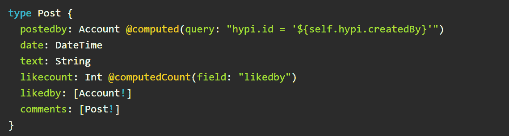

Post 数据类型就像一个表，Post 的字段就像列。`postedby`是创建 Post 对象的人的帐户。账户被一个唯一的用户名或电子邮件识别。Account 是 Hypi 中固有的核心数据类型。`@computed`是 Hypi 提供的指令。我们可以用它来运行一个查询，提取创建这篇文章的帐户用户名。`likecount`代表帖子上的赞数。`likedby`提供喜欢该帖子的账户。`comment`编辑帖子上的评论列表。评论被认为和其他文章一样。不同的用户可以对特定帖子发表评论，该评论可能会被其他用户进一步喜欢/评论。

当我们在这个 Post 表中插入数据时，就会创建行。每行代表一个 Post 对象，而**魔术 Hypi 对象**成为这个 Post 对象的一部分。

Hypi 对象保存诸如**唯一 Hypi ID** 、对象创建日期、创建对象的用户帐户 ID、对象创建/更新日期等信息。它还有其他字段，您可以在 Hypi 提供的[综合文档](https://docs.hypi.app/docs/magic-hypi-object/?utm_source=plainenglish&utm_campaign=hypi_features&utm_medium=intro&utm_term=documentation)中查看。因此，每个 Post 对象都有一个惟一的`hypi.id`，它赋予 Post 对象自己的身份。

在 CRUD 操作中，我们在插入、更新或删除数据时在 GraphQL 中执行变异。在检索数据时，我们执行查询。

# 创建数据

`upsert` 功能用于创建数据或将数据插入对象中的字段。

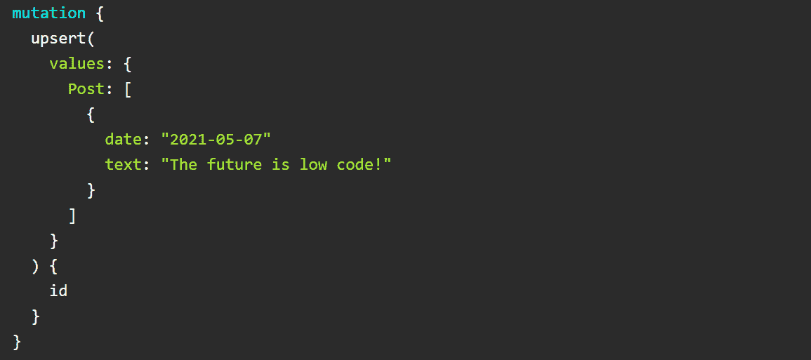

上面的变化创建了 Post 对象并将文本添加到 Post 中。发帖人会在`postedby`字段中自动更新。

`values`参数有你想用`upsert`突变创建的对象。您必须在 Hypi 对象中指定您希望作为响应接收的字段。在这里，只有对象`id`被选中，因此只有这个被返回。

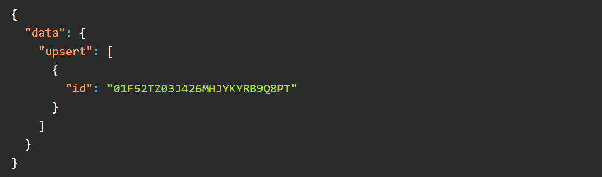

# 更新数据

更新数据也是一种变异，同样的`upsert`函数用于更新数据。唯一的区别是，在创建数据时`hypi.id`被生成，而在更新数据时**需要与数据**一起提供，数据必须为特定对象保存。

假设**两个人 Hypi 和 CRUD 喜欢帖子**，我们想在创建的**帖子**对象中更新这个信息。我们必须向`likedby`帐户列表提供 **Hypi** 和**CRUD**帐户对象的`hypi.id`。必须提供最后一段代码中返回的`hypi.id`来更新 Post 对象。

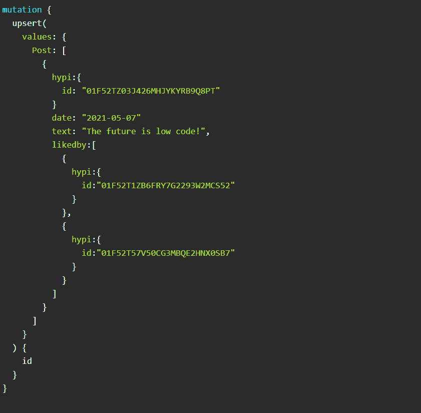

我们收到与之前相同的响应/ `hypi.id`。

现在，假设**某个用户对帖子**发表了评论，我们想从帖子对象更新评论字段。因此，另一个用户应该有权访问 Post 对象中的**评论**字段。您需要在 Hypi 的用户界面上启用这些权限。之后，只需将评论更新到之前创建的 Post 对象。如前所述，传递 Post 对象的同一个`hypi. id`来更新字段。我们得到同样的回应。

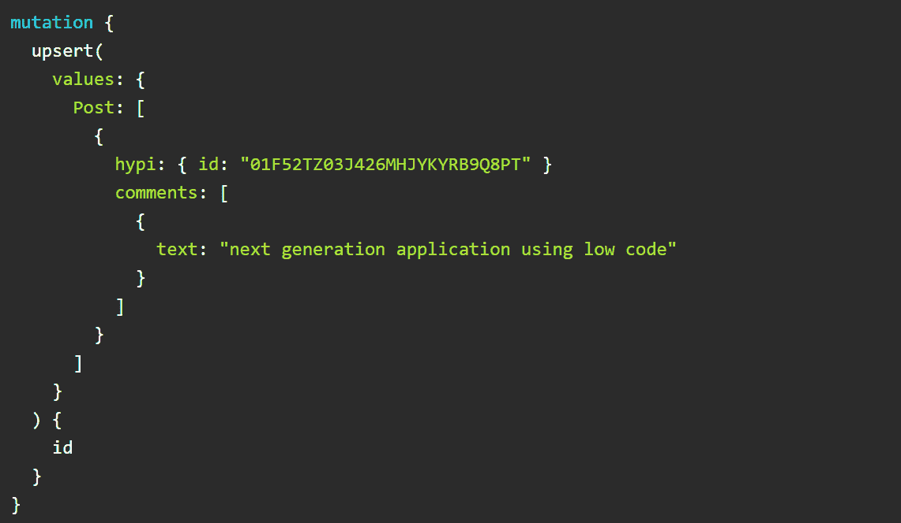

# 读出数据

读取数据就像执行查询从表/对象中检索数据。有两个用于检索数据的 Hypi APIs`get`和`find`。

用户可能希望**分享帖子(好消息还是坏消息！)与社交媒体上的其他用户**。您可以**使用 get 功能访问帖子的详细信息**。

必须将类型和 id 作为参数提供给`get`函数。该函数返回被查询对象的字段。您需要提供对象所需的字段。将只返回那些字段。

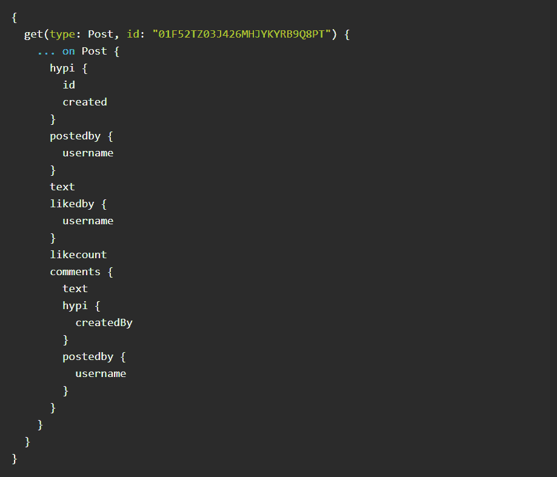

回应如下:

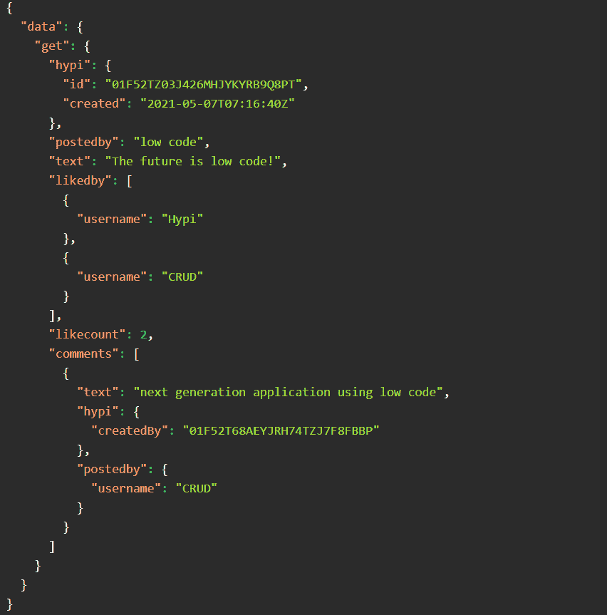

现在，你需要**显示一个用户在他的时间轴**上的所有帖子。你会怎么做？只需**使用 find 函数访问所有 Post 对象**。这将检索用户创建的所有帖子的详细信息。

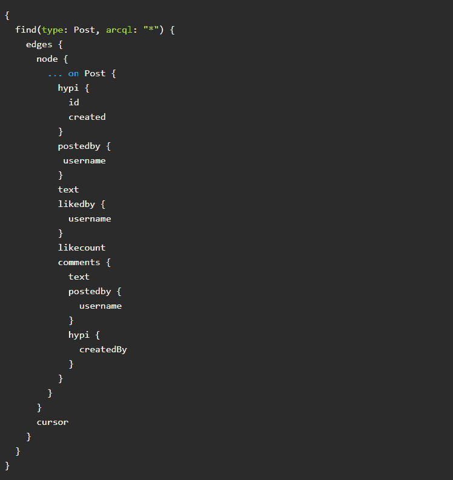

结果如下:

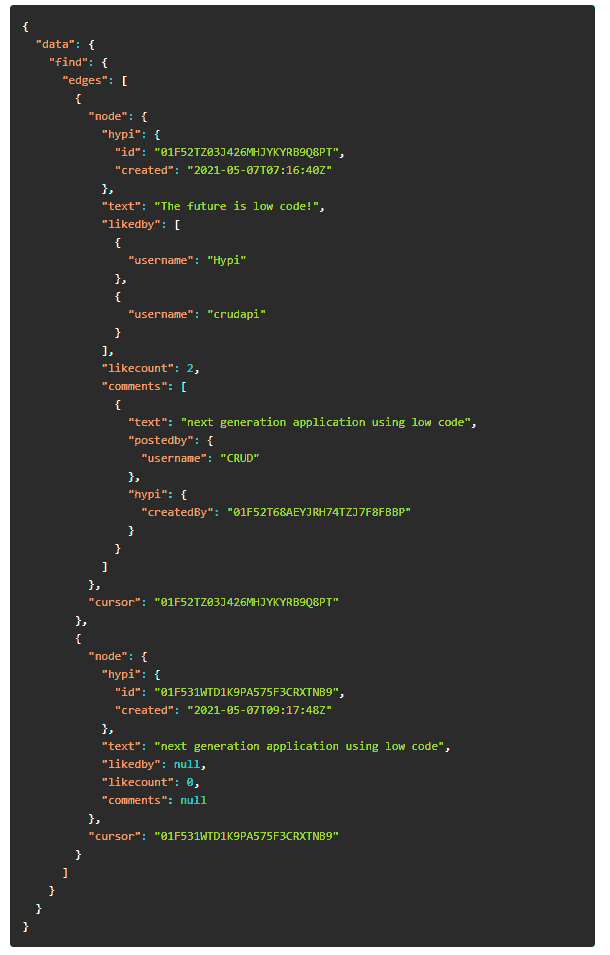

*** `*find*` *函数将评论字段视为一个单独的帖子对象。*

您可以使用 **ArcQl 查询**来过滤数据，以检索特定的结果。在上面的查询中，我们使用了`*`来检索所有的 Post 对象。

# 删除数据

**删除**是从表中删除数据的一种变异。您可以**执行软删除来临时删除数据**。`trash`功能用于执行软删除。垃圾数据“似乎”被删除，但您可以在需要时恢复它。

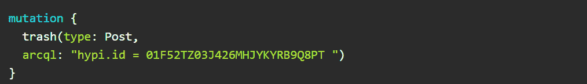

被丢弃的对象不能用 get 函数获取。使用查找功能时，需要将`includeTrashed`参数设置为`true` 来检索垃圾对象。

要从无用数据中删除标记，只需使用`untrash`功能。使用该函数的格式是相同的。**`**trash**`**和** `**untrash**` **两个函数都返回已丢弃/未丢弃的记录数。****

****使用** `**delete**` **功能永久删除帖子**。**

**如果不同对象之间存在一对一或一对多的关系，则将`clearArrayReferences` 参数设置为`true`。在这里，原始帖子和评论帖子被取消链接，对象被删除。**

**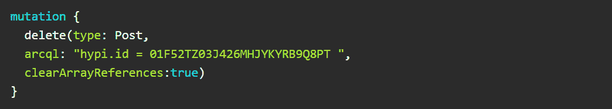**

# **使用 ArcQL 过滤器查找数据**

****我们如何使用 find 函数检索特定数据？Hypi 开发了一种强大的类似 SQL 的查询语言，即 ArcQL。使用 ArcQL，您可以从表中选择行，然后使用 find 从这些行中检索数据。****

**有不同类型的 ArcQL 查询，如**短语查询、术语查询、前缀查询、通配符查询、排序查询、范围查询**等。构建查询取决于您希望如何获取数据。**布尔逻辑也可以用于带有** `**AND**` **和** `**OR**` **运算符的各种查询。****

****术语查询**:这是一个简单的过滤器，与提供的值完全匹配。它过滤 arcql 语句中询问的数据。**

**`**arcql:"postedby.username = ‘user2’ OR postedby.username = ‘user1’"**`**

**以上术语查询通过`user1`和`user2`搜索帖子。**

****前缀查询**:该查询返回以查询中提供的前缀开始的记录。**

**`**arcql:"address.city^’P’"**`**

**这将返回居住在以字母`P`开头的城市中的用户的数据**

****短语查询**:使用语句中提供的单个单词或短语过滤数据。**

**`**arcql:"text~’low code’"**`**

**我们得到文本中包含短语`low code`的帖子。**

****排序查询**:您可以像这样对记录进行升序或降序排序。**

**`**arcql:"* SORT text ASC"**`**

**范围查询:搜索特定范围内的数据。`IN`从句用于说明。**

**`**arcql:"date IN (‘2010–01–01’,’2011–01–01')"**`**

# **结论**

**我们看到了 Hypi 作为一个低代码平台所提供的一瞥。我们已经看到了 Hypi 如何作为 BaaS 提供商发挥作用。**

**对常用 CRUD 操作的简单演示将带您了解 Hypi CRUD APIs 是如何工作的。我们还研究了简单而强大的 ArcQL 查询。板上还有很多其他的 API 和功能，一定要去看看！**

**最后，我建议尝试一下 Hypi。如果你有，一定要在评论中让我们知道你的想法！**

***多内容于* [***浅显易懂***](http://plainenglish.io)**