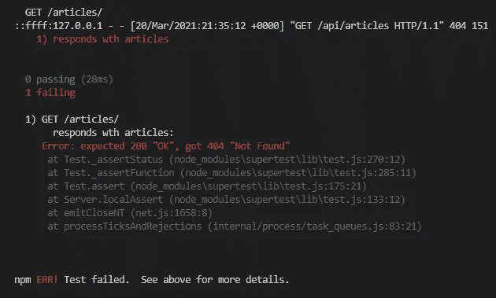
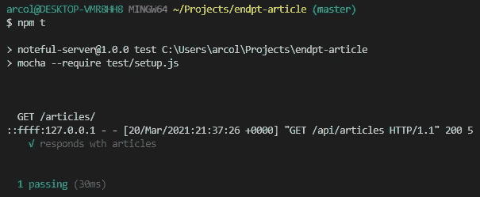
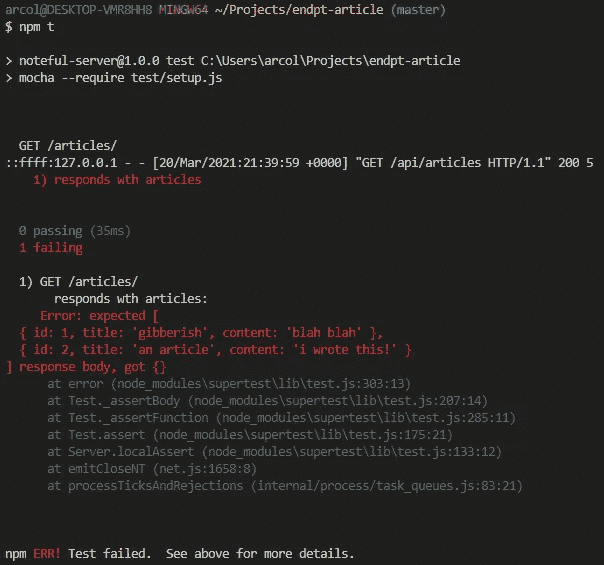
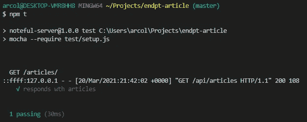

# 使用测试驱动开发在 Express 中构建端点

> 原文：<https://javascript.plainenglish.io/building-endpoints-in-express-js-with-test-driven-development-8b1800d355fc?source=collection_archive---------15----------------------->

## 针对初学者的简单演练，用于改进您构建的 API。


Photo by [Arnold Francisca](https://unsplash.com/@clark_fransa?utm_source=medium&utm_medium=referral) on [Unsplash](https://unsplash.com?utm_source=medium&utm_medium=referral)

我们都知道良好测试的重要性。这使得我们的代码更可靠，更易于维护。现在想想你构建的最后一个项目，想想你有多少测试覆盖率。75%?50%?…10%?当涉及到我的个人项目时，我肯定会因忽视测试而感到内疚。我告诉自己，我会回去添加测试，因为我知道我的应用程序只能受益，但我很少这样做。相反，我会继续下一个项目。

这就是测试驱动开发(TDD)真正闪光的地方。这是同时获得高质量代码和高测试覆盖率的最简单的方法。

按照罗伯特“鲍勃叔叔”马丁的说法，TDD 有三条规则:

1.  除非是为了通过失败的单元测试，否则不允许编写任何生产代码。
2.  不允许你写更多足以失败的单元测试。
3.  除了通过一个失败的单元测试所必需的，你不允许写更多的产品代码。

这些规则迫使我们保持代码的简单性，并真正理解我们要做什么以及如何去做，在我们开始写任何代码之前。我们必须了解我们希望我们的代码做得足够好，以便为该功能编写一个测试。只有在我们写完一个测试之后，我们才能真正地写代码，而且只能写通过测试所必需的代码。

另一种简单的思考 TDD 的方法是分三个阶段:红色→绿色→重构。我们编写一个我们想要的功能的测试，运行那个测试，它失败了(红色)。然后，我们去构建必要的功能，使测试通过(绿色)。最后，我们可以重构我们的代码。

# **计划**

我们的应用程序是一个简单的博客平台。我们将编写一个端点，一个 GET 端点，它将从我们的数据库中返回所有的文章。在本文中，我不打算设置数据库或与它交互的方法，但它们会出现在代码中，我会尽力解释它们。

## **科技**

快速—后端框架

Mocha —测试框架

Chai 断言库

超级测试— HTTP 断言库

Knex —数据库连接

## **第一步。编写一个初始测试**

这个测试应该简单地检查一个端点是否存在，以及它是否正确响应。

```
describe('GET /articles/', () => {
    it('responds with articles', () => {
        return supertest(app).get('/api/articles').expect(200)
    })
})
```

注意，我们并没有检查端点是否真的响应了这里的文章。我们只是测试端点是否存在，并给出正确的 HTTP 响应 200。

如果我们现在运行测试，它将失败:



Failing Test. We get a 404 Not Found response, since our endpoint isn’t built yet.

太好了！这就是我们想要的。我们还没有编写端点，所以我们的测试是正确的“失败”。记住，红色→绿色→重构。

## **第二步。使测试通过**

现在，我们只需要构建能够通过测试的端点。在这一点上，我们所做的就是让端点存在。它实际上不会做什么，只是给出一个 200 OK 的响应。请记住，我们正在编写足够的代码来使我们的单个失败单元测试通过，仅此而已！

```
app.get('/articles', (req, res) => {
    res.status(200).send('stuff')
})
```

再次运行我们的测试。它过去了！



Passing Test! Our endpoint exists, and gives the response we’re looking for.

但是我们的端点现在没有做任何事情。它只给出一个 200 的响应，以及一个表示“东西”的字符串。我们的测试通过了，但是我们的端点实际上并没有像我们希望的那样返回文章。

## **第三步。重构以测试实现**

是时候重构和扩展我们的测试，以涵盖我们希望从这个端点获得的全部功能了。

```
describe('GET /articles/', () => {
    it ('responds with articles', () =>{
        const testArticles = makeArticlesArray()
        return supertest(app).get('/api/articles')
               .expect(200, testArticles)
    })
})
```

这里有几个新东西！我们使用了一个助手函数，它创建了一个伪文章数组，可以从我们的测试数据库中插入和返回这些文章。设置测试数据库和数据库连接超出了本文的范围，所以只需知道`makeArticlesArray()`创建了一个我们期望从端点返回的文章数组。

再次运行测试，我们看到它失败了:



Our test fails again, this time because we don’t get the content we expect in the response body.

第一次，我们的测试失败了，因为它期望一个 200 OK 响应，并得到一个 404 Not Found 响应。这一次，我们得到了 200 OK 的响应，但是响应体的内容并不是我们所期望的。我们期望得到一个对象数组，每个对象代表一篇文章。相反，我们得到了一个空对象。

## **第四步。使重构后的测试通过**

我们现在回到红色。我们必须改变我们的端点，以便它实际上响应我们期望的数据。

```
app.get('/articles', (req, res) => {
    const db = req.app.get('db')
    ArticlesService.getAllArticles(db)
    .then((articles)=> res.json(articles)
})
```

哇，更大的变化！事情是这样的。第 2 行正在建立到我们数据库的连接。第 3 行是我们构建的使用 Knex 从数据库中检索所有文章的方法。当我们从数据库取回文章时，我们使用`res.json()`方法以 JSON 格式将其发送回客户端。

在一个完整的应用程序中，我们将建立一个测试数据库，并在运行测试之前用虚拟数据填充它，测试将在调用端点时接收虚拟数据。但是，这超出了本文的范围。

让我们再次运行我们的测试。



Our test is back to passing

太好了！我们的测试通过了。

我们已经建立了一个简单的端点，让我们可以访问我们博客平台上的所有文章，我们可以放心，它工作正常，因为我们的测试已经通过了。如果我们的代码以任何方式改变，打破了这个端点，这个测试将失败，我们将更容易在它进入生产并给我们的用户带来问题之前捕捉到它。

# 结论

这是一个相对简单的例子。在“现实生活”中，您可能不会将事情分解得太多，而是简单地从头开始编写完整的测试，然后创建完全实现的端点来通过测试。此外，您还需要担心我们在这里跳过的东西，比如数据库连接。但是希望，这说明了测试驱动开发的红色→绿色→重构循环，并且稍微揭开了这个过程。

如果你喜欢这篇文章，觉得它有帮助，或者不同意它，我很乐意听到你的反馈。我在 Medium 上写了很多，并且一直在寻求改进。我还在 Twitter 上写了一堆关于我在技术领域的日常建设和学习的文章！这里可以关注我[。](https://twitter.com/ARColeburn)