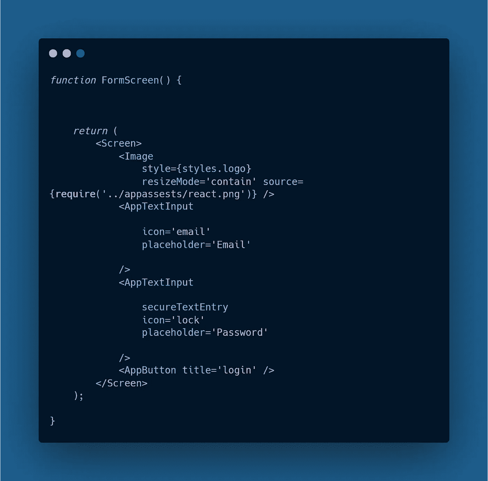
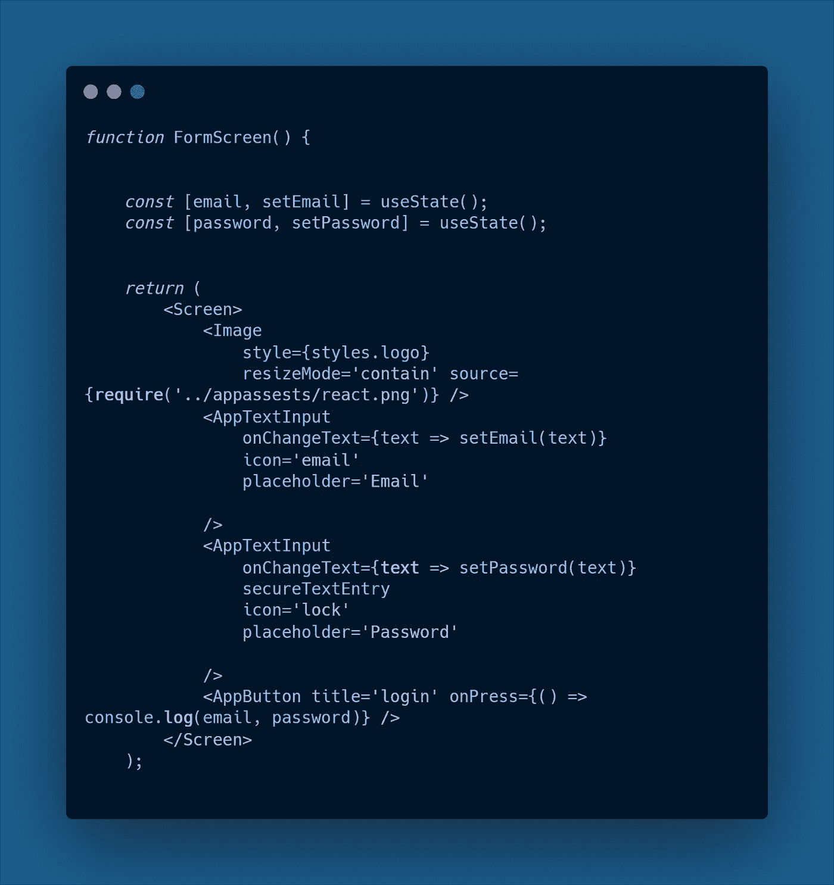
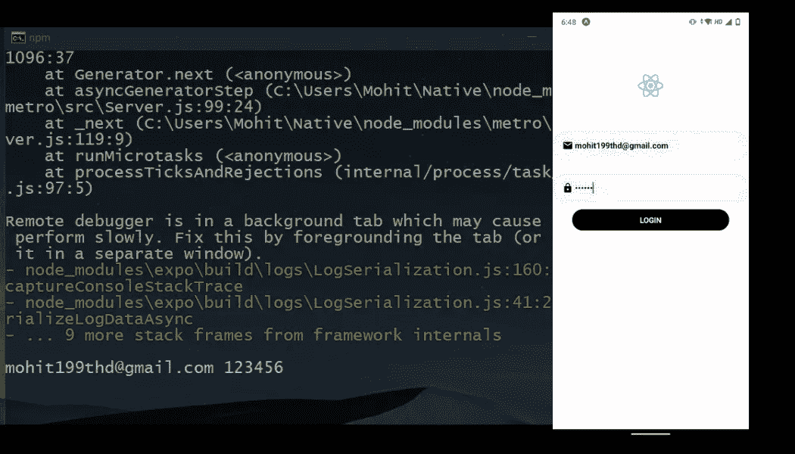
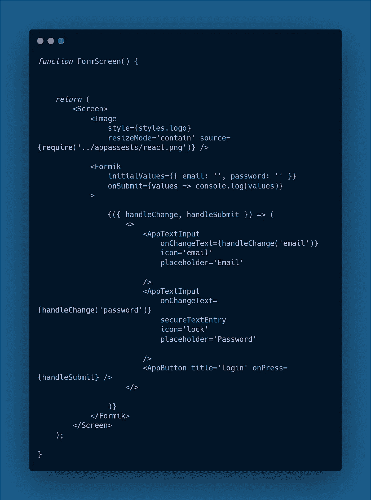
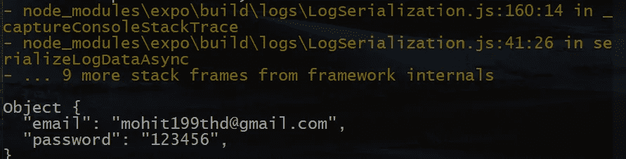
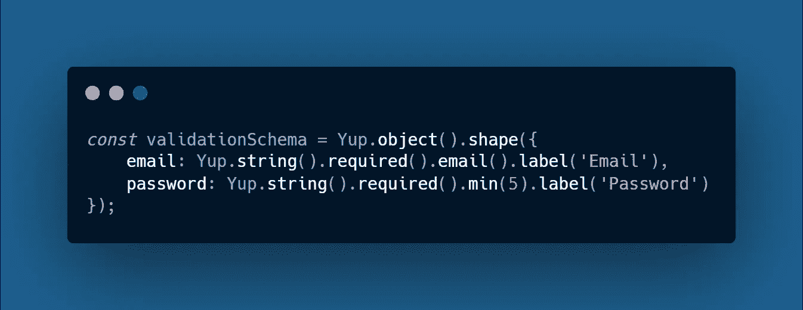
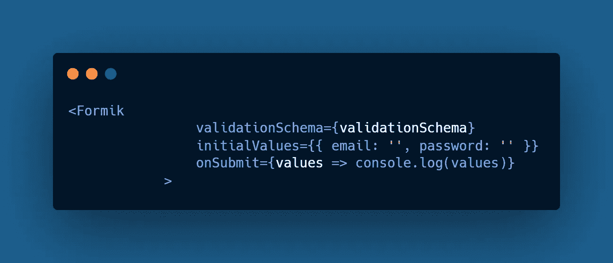

# 在 React Native 与 Formik 中构建表单

> 原文：<https://javascript.plainenglish.io/building-forms-in-react-native-with-formik-474be9d54a62?source=collection_archive---------11----------------------->

## React Native 中带有验证的更好的表单

# 为什么是福米克？

每个 **React-Native** 应用程序都需要添加表单来处理用户输入交互。在没有 **Formik** 的情况下，处理来自输入字段的用户凭证变得非常痛苦，因为我们必须处理多个输入表单的状态，另一方面，在处理错误的同时进行验证。有了 **Formik** 表单更加有条理，具有超级简单的测试和重构特性。

我们将了解如何使用 Formik 构建表单，以及为什么它更好:

*   使用 **useState** 钩子处理表单状态。
*   用 **Formik** 构建模板。
*   用**验证表单是**。

## 使用 useState 挂钩处理窗体状态

*   在给定的示例中，有两个组件需要查看，一个是带有图标道具的漂亮的文本输入组件**AppTextInput**，另一个是包装在可触摸的内的视图组件**AppButton**组件**。**

*现在为了让这个表单能够处理状态，我们将在 React 中使用****useState****钩子。*

**Forms Without Hooks**

**Forms With Hooks**

*   我们已经使用 **useState** 钩子在函数组件中定义了两个 **const** 变量，其中 email & password 将存储我们的输入值，而**set email**&**set password**是负责改变表单状态的函数。
*   为了使我们的表单能够处理状态，我们使用了 **AppTextInput** 组件中的 **onChangeText** 属性，它存储一个值，并将该值传递给 **setEmail** 在我们的电子邮件表单字段&中，类似地，在密码字段中，我们将文本传递给 **setPassword。**
*   在 **AppButton** 组件中，我们记录用户在表单字段中输入的电子邮件和密码。
*   当我们按下*登录按钮*时，我们可以在控制台上看到记录的数值。

## 使用 Formik 构建表单

要使用 **Formik** ，请使用 ***npm 在您的项目目录中安装 formik*** ，并导入它。现在，为了实现相同的功能，我们必须配置一些属性:

*   负责输入表单值的 **initialValues** ，在我们的例子中就是 **email** 和 **password** 值。
*   **onSubmit** 属性处理输入值的日志记录部分(在我们的例子中，我们在控制台中记录它们)。
*   之后，我们将三个主要组件(**AppTextInput**&**AppButton**)移动到一个片段中，或者你可以说一对尖括号，因为我们在 Formik 组件中渲染了多个组件
*   我们还定义了两个函数来处理表单的状态-(**handle change**&**handle submit**)，这两个函数在我们将 **handleChange** 传递给 **AppTextInput** 组件中的 **onChangeText** 属性以及将 **handleSubmit** 传递给 **AppButton** 组件时跟踪表单的状态。

在我们的表单中完成这些配置后，我们能够构建具有相同特性的表单，而无需使用 ***useState*** 钩子，现在我们不再在函数组件中处理多个状态。

**Adding Formik In Our Form**

**Logged results on the console (returns an object)**

## 用 Yup 验证表单

由于 **Formik** 内置了对 **Yup** 的支持特性，因此使用 Yup 来实现表单验证非常容易。

要安装 Yup:

**NPM I Yup&**import as**-(**import * as Yup from‘Yup’； **)**

*   要使用 Yup 在我们的电子邮件和密码字段中添加表单验证，我们必须定义一个 **valiationSchema** 来保存我们表单的所有验证规则。为此，我们只需在函数组件外部定义一个 const，这样它就不会在每次表单状态改变时重新呈现。

*   在 Yup 中有很多方法可以用于表单验证，在我们的例子中，我们将简单地为电子邮件和密码字段设置验证模式。
*   在定义了验证模式之后，我们所要做的就是将它传递给我们的 **Formik** 组件中的 **validationSchema** 属性，这样我们就完成了在表单中设置验证的工作。

