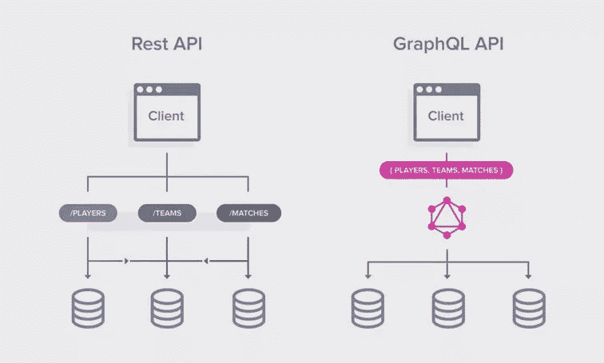
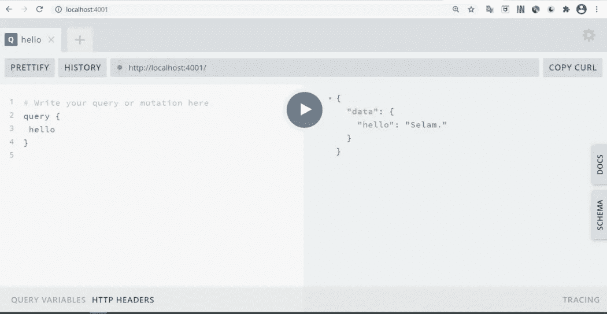
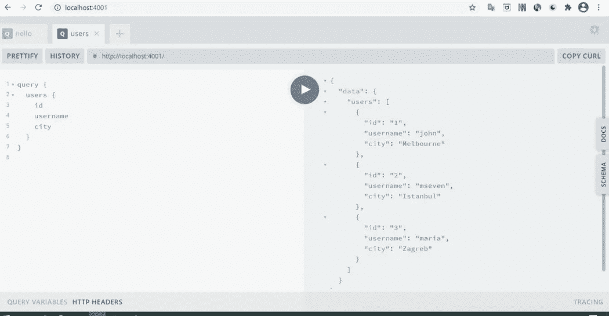
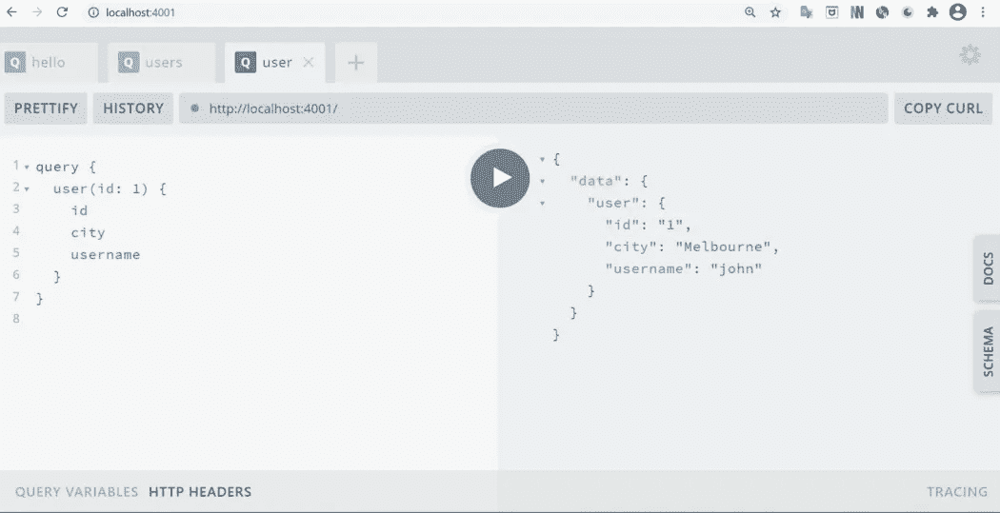
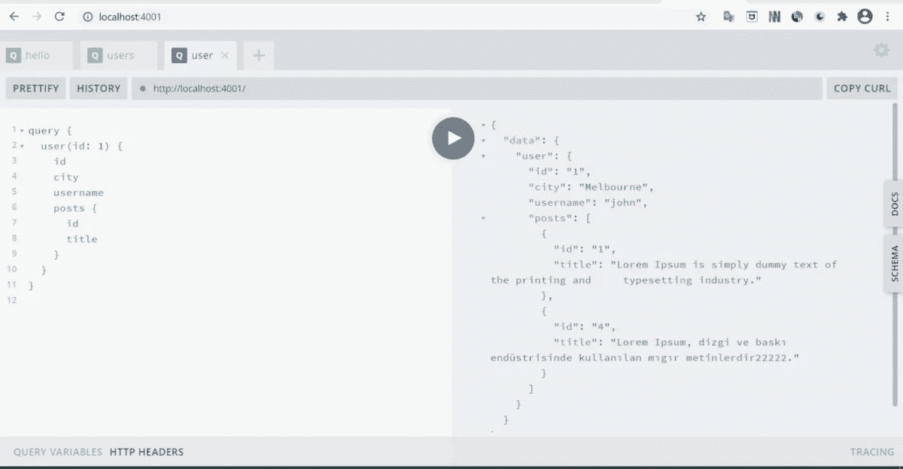
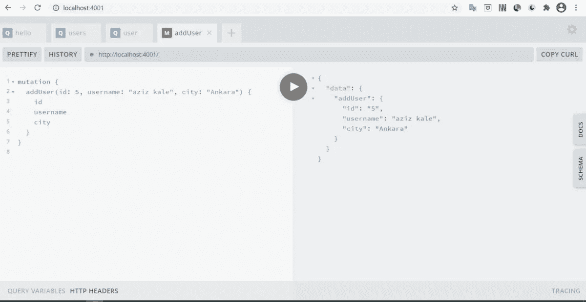
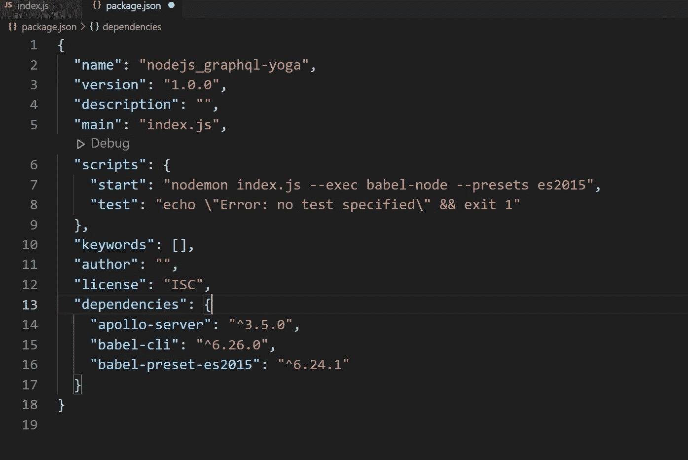
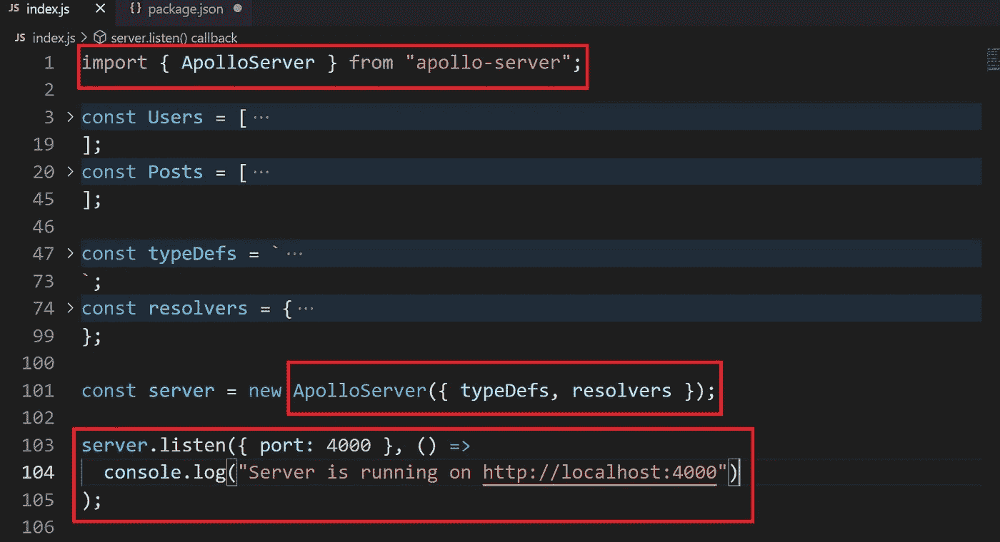
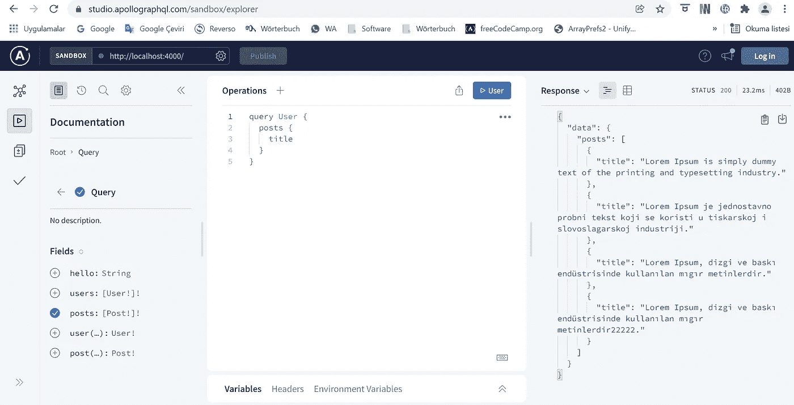

# 让我们用 Node.js 构建一个 GraphQL 服务器

> 原文：<https://javascript.plainenglish.io/building-graphql-server-with-node-js-c31ee3f54761?source=collection_archive---------18----------------------->



***GraphQL*** 是一种查询语言，由脸书开发。可以说它是 REST 方法的改进版本。在这篇文章中，我想谈谈如何使用它，而不是它是什么。然而，与 REST 相比，我们可以说 *GraphQL* 有以下优点:

**1。在 REST 查询中，你需要端点。而且只要这些*端点*拉长，就很难读取。例如:**

[https://domain . com/API/customers/customerId/products/productId/orders/orderId/](https://domain.com/api/customers/customerId/products/productId/orders/orderId/)

在 *GraphQL* 你不需要这样的查询。

**2。**在使用 REST 查询时，许多您不需要的数据会随您调用的数据一起出现。这样，服务器就超载了。GraphQL 让你摆脱获取你不需要的数据。

**3。** *嵌套查询*表示在 REST 中的连续查询。在 *GraphQL 中进行嵌套查询更容易。因为你只需要一个查询。 *GraphQL* 将这些查询进行分片，得到相关数据作为 *Promise* 并重新汇总后返回给我们。这为我们节省了时间。*

**4。GraphQL 提供了一个叫做 *Playground* 的 UI，我们可以在上面测试我们的 API。**

**5。**因为*typedef*(schema-graph QL 的一部分)中的所有字段都必须已经指定，所以后端开发人员不会忘记给函数添加一些*字段*。使用或不使用这些*字段*取决于 API 用户。

让我们来看看 *GraphQL* 的结构:

*GraphQL* 由两个主要部分组成:

***1。TypeDefs:*** 我们指定 API 模式的部分。在本节中，确定了函数和变量的类型。

**2。解析器:**定义函数的部分。 *CRUD* 功能在 *GraphQL* 中的*解析器*下分两部分处理；“读取”功能在“*查询*下定义，其他在“*突变*下定义。

让我们通过一个简单的例子来看看这些特性。

由于 *GraphQL* 是一种查询语言，我们需要一个工具来使用它。我更喜欢使用 *graphql-yoga* ，因为我们正在用 Node.js 创建一个服务器。然而，在 https://graphql.org/code/[的链接](https://graphql.org/code/)上可以找到适合每种语言的多种工具。

首先，我在文件夹中创建 *package.json* 文件，我将在其中安装我的服务器:

```
npm init –y
```

然后我安装了 JavaScript 编译器 *babel* :

```
npm i babel-cli babel-preset-es2015
```

*Babel* 基本上提供了语法上的便利。它将使用 ES 2015 和更高版本编写的代码转换为与浏览器兼容的 JavaScript。

现在让我们安装 *graphql-yoga* 工具。

```
npm i graphql-yoga — save
```

让我们创建一个 ***index.js*** 文件，在这个文件中，我们在主目录中写入我们的服务器代码，并在其中添加以下代码:

```
import { GraphQLServer } from “graphql-yoga”;
const typeDefs = `
  type Query {
    hello: String
  }
`;
const resolvers = {
  Query: {
    hello: () => “Selam.”,
  }
};const server = new GraphQLServer({ typeDefs, resolvers });server.start(() => console.log(“Server is running on localhost:4000”));
```

我更喜欢通过 *nodemon* 运行 **index.js** 。nodemon 是一个 node.js 包，它可以让你在开发阶段停止和重启你的项目。

```
npm i –g nodemon
```

让我们将以下代码添加到 package.json 文件的脚本中。

```
“start”: “nodemon index.js — exec babel-node — presets es2015”,
```

我们的服务器现在正以最简单的形式工作。

简单提一下:

*   在第一行中，我们导入了相关的工具/包
*   我们在*类型定义*下指定了类型
*   我们在*解析器*中定义函数
*   最后，我们从安装的 *graphql-yoga* 包中获得实例，并运行服务器。

*GraphQL* 默认运行在 4000 端口。您可以使用以下代码在不同的端口上运行。

```
server.start({ port: 4001 }).then(console.log(“server runs on port localhost:4001”));
```

让我们现在运行我们的项目。

```
npm start
```

在浏览器中，游乐场 UI 来自我们上面提到的。



我们可以在左边调用我们定义的函数，在右边看到结果。

现在让我们做一些不同的查询。为此，让我们创建由两个*数组*组成的假数据。我们可以在 TypeDefs 上面添加假数据。

```
const Users = [
  {
    id: 1,
    username: “john”,
    city: “Melbourne”,
  },
  {
    id: 2,
    username: “mseven”,
    city: “Istanbul”,
  },
  {
    id: 3,
    username: “maria”,
    city: “Zagreb”,
  },
];const Posts = [
  {
    id: 1,
    title:“Lorem Ipsum is simply dummy text of the printing and     typesetting industry.”,
    userId: 1,
  },
  {
    id: 2,
    title:"Lorem Ipsum je jednostavno probni tekst koji se koristi u tiskarskoj i slovoslagarskoj industriji.”,
    userId: 3,
  },
  {
    id: 3,
    title:“Lorem Ipsum, dizgi ve baskı endüstrisinde kullanılan mıgır metinlerdir.”,
    userId: 2,
  },
  {
    id: 4,
    title:"Lorem Ipsum, dizgi ve baskı endüstrisinde kullanılan mıgır metinlerdir22222.”,
    userId: 1,
  },
];
```

简而言之，数据表示用户数组中的用户以及由这些用户发出的组成帖子数组的帖子。

首先，让我们在*typedef*下创建数据的模式。

```
const typeDefs = `
  type Query {
    hello: String
  }  
  type User{
   id: ID!
   username: String!
   city: String
  }  
  type Post{
   id: ID!
   title: String!
   userId: ID!
  }`;
```

这里我想说一下 *GraphQL* 的两个特点。" *ID* "类型是 GraphQL 中赋予' ID '的一种特殊类型。以这种方式指定的 id 参数可以作为*字符串*或 *Int* 传递给函数。另一个特点是感叹号。带感叹号的变量是不可空的变量。

现在让我们指定函数的类型:

```
type Query {
  hello: String
  users: [User!]!
  posts: [Post!]!
}
```

由于这些函数将列出所有用户和帖子，我们将它们的类型写在“[]”中。这意味着它将返回一个数组给我们。括号内的感叹号表示该字段是必需的，并且以用户类型返回的结果不能为空，括号外的感叹号表示以数组类型返回的结果不能为空。

现在让我们定义我们在*解析器*中形成模式的函数。由于这些函数是“读”函数，我们将在*查询*下定义它们。

```
const resolvers = {
  Query: {
    hello: () => “Selam.”,
    users: (parent, args) => Users,
    posts: (parent, args) => Posts,
  },
};
```

我将在本文后面提到概念*父*和*参数*。

当我们运行项目并在*操场*的左侧进行相关查询时，我们得到了出现在右侧的输出:



我们在 *Playground* 中用 *query* 关键字调用我们定义为查询的函数。并且我们可以自己确定需要返回的*字段**。例如，当您删除城市*字段*时，该功能仍然有效。然而，至少有一个*字段*必须保留。*

*现在让我们尝试通过将用户 id 传递给查询来获取用户。*

*首先，在模式中，我们确定函数类型、参数及其类型:*

```
*type Query {
  hello: String
  users: [User!]!
  posts: [Post!]!
  user(id: ID!): User!
}*
```

*然后我们定义解析器中的函数:*

```
*const resolvers = {
  Query: {
    hello: () => “Selam.”,
    users: (parent, args) => Users,
    posts: (parent, args) => Posts,
    user: (parent, args) => Users.find((user) => String(user.id) ===     args.id),
  },
};*
```

*这里我想说一下概念 *args* 。 *Args* 是一个*对象*，实际引用的是已定义函数的参数。如上面的用户函数所示，传递的 id 表示为“ *args.id* ”。*

*现在，当我们运行项目并执行左边出现的查询时，我们会得到右边的结果:*

**

*已获得 id 为 1 的用户。由于 id 参数的类型是 *ID* ，所以可以传递给函数作为 *Int* 或 *String* 。*

# ***graph QL 中的嵌套查询***

*让我们制作一个嵌套查询示例:*

*例如，假设一个作者有不止一篇文章。根据我们的假数据，id 为 1 的用户已经有两个帖子了。但是，由于一个帖子不能有多个作者，每个帖子将对应一个用户。*

*现在让我们形成返回作者的帖子和帖子作者的查询。同样，我们首先从模式开始。在 *TypeDefs* 中，我们添加“用户”*字段*到帖子，添加“帖子”*字段*到用户:*

```
*type User{
  id: ID!
  username: String!
  city: String
  posts: [Post!]
}
type Post{
  id: ID!
  title: String!
  userId: ID!
  user: User!
}*
```

*但是当我们查看数据时，就像用户数组中没有*的帖子字段*一样，在帖子数组中也没有*的用户字段*。我们将通过在*解析器*中定义匹配用户 Id 和文章用户 id 的函数来解决这个问题。然而，由于这些*字段*在数组中不可用，我们无法在*查询*下定义它们。*

*为了将用户添加到 Post 类型中，我们定义了一个单独的*解析器*，称为 Post。同样，我们定义了一个单独的*解析器*，它被称为 User，为用户定义一个帖子*字段*:*

```
*const resolvers = {
  Query: {
    hello: () => “Selam.”,
    users: (parent, args) => Users,
    posts: (parent, args) => Posts,
    user: (parent, args) => Users.find((user) => String(user.id) === args.id),
  },  Post: {
    user: (parent, args) => Users.find((user) => user.id ===   parent.userId),
  },  User: {
    posts: (parent, args) => Posts.filter((post) => post.userId === parent.id),
  },
};*
```

*这就是*母*概念出现的地方。顾名思义，在*嵌套查询*中，“父查询”的参数由“ *parent* ”参数表示，以便我们在子查询中使用。*

*比如我们来读第二个函数。为了获取 Id 为 1 的用户的帖子，它检查 posts 数组并获取其 userId 等于所需的用户 id 的帖子。*

**

*现在让我们进行一个*突变*查询。让我们创建一个向用户数组添加新用户的函数。我将以下代码添加到 TypeDefs 中:*

```
*type Mutation{
 addUser(id:ID!, username:String!, city:String! ): User
}*
```

*让我们定义这个函数的*解析器*，我们已经指定了它的模式。在*解析器*中，我们在*突变*下编写以下代码:*

```
*Mutation: {
  addUser: (_, { id, username, city }) => {
    const newUser = {
    id: id,
    username: username,
    city: city,
  };  Users.push(newUser);
  return newUser;
},
},*
```

*这里我们看到函数的第一个参数是一个下划线。由于我们在这里没有使用*父*参数，我们可以更喜欢这种实用的语法。第二个参数实际上是一个*对象*，它由三个参数组成，我们将它们传递给函数。(在大括号中)*

*当我们运行该函数并运行左边的查询时，我们得到以下结果:*

**

# ***结论***

*综上所述，我们通过使用 *graphql-yoga* 库，在 Node.js 中搭建了一个 *GraphQL* web 服务器。我们通过解释概念*typedef*和 *resolvers* 来举例说明，这是构成 *GraphQL* 的两个主要元素。*

*您可以通过以下链接访问整个项目:*

*[https://github . com/Aziz kale/Web-Server-in-NodeJS-with-graph QL](https://github.com/azizkale/Web-Server-in-NodeJS-with-GraphQL)*

*更多信息，可以访问 *GraphQL* 官方网站。*

*[](https://www.graphql.org) [## API 的查询语言

### 一种用于 API 的查询语言——graph QL 提供了 API 中数据的完整描述，为客户提供了…

www.graphql.org](https://www.graphql.org) 

## 更新(2021 年 12 月 17 日):

您还可以用另一个更新的包:apollo-server 构建一个 GraphQL 服务器

您只需要将 apollo-server 添加到项目中:

```
npm i apollo-server — save
```

您的 package.json 文件应该如下所示:



在文件 **index.js** 中你应该做三个修改:



我们从文件 **apollo-server** 中导入 **ApolloServer**

代替

**GraphQLServer** 来自 **graphql-yoga**

我们用类 **ApolloServer** 而不是 **GraphQLServer 来定义**服务器**对象。**

最后，我们用**方法运行服务器。听()**代替**。start()**

当您访问浏览器中的“http://localhost:4000”地址后，一个更现代化的界面( *GraphQL-Apollo* 欢迎我们:

*