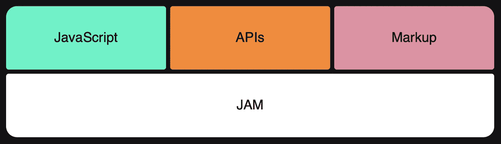

# 使用 Jamstack 构建现代网站和应用程序

> 原文：<https://javascript.plainenglish.io/building-modern-websites-and-apps-using-the-jamstack-67fdbb395912?source=collection_archive---------13----------------------->

## Jamstack 和 Headless CMS 简介

Photo by [Luis Cortés](https://unsplash.com/@luiskcortes?utm_source=medium&utm_medium=referral) on [Unsplash](https://unsplash.com?utm_source=medium&utm_medium=referral)

# **从灯到卡纸堆叠**

根据 history.com 的说法，1991 年 8 月 6 日，当伯纳斯·李出版了第一个网站时，Web 作为互联网上的一种公共服务开始出现。对内容管理系统(CMS)的需求很快出现了。

LAMP stack，代表 Linux、Apache、MySQL 和 PHP/Perl/Python，于 1998 年推出，是当时 web 的黄金标准，托管了第一代 CMS 软件的大部分。

最常用的开源 CMS 是 WordPress，它存储、管理和呈现内容。这种整体解决方案没有像 web 那样快速发展，而且它们暴露了许多稳定性问题，不容易扩展。

2015 年，Netlify 的首席执行官马蒂亚斯·比尔曼(Mathias Biilmann)将 JAMstack 定义为“基于客户端 JavaScript、可重用 API 和预建标记的现代 web 开发架构”。

What is JAMstack

JAMstack 的优势包括:

*   速度(比动态 CMS 快)
*   可伸缩性(静态请求立即得到响应)
*   安全性(没有请求直接命中底层数据库)

Rise of JAMstack | Mathias Biilman

# **无头 CMS**

无头 CMS 没有表示层，通过 API 提供内容。与传统 CMS 相比，无头 CMS 具有以下特性:

*   多个频道/设备的内容
*   分离创作、开发和呈现
*   通过访问控制轻松管理数字资产

Traditional CMS vs Headless CMS | Image Source: sanity.io

# **交易的工具**

大多数 JAMstack 站点都是由静态站点生成器驱动的，流行的有 Gatsby、Next.js、Hugo、Nuxt.js 和 11ty。

无头 CMS 的首选是 Strapi 和 Sanity。(理智是一个很好的工具，但不是完全免费的)

JAMstack Satisfaction | Image source: netlify.com

# 我的选择

我选择 Eleventy (11ty)作为静态站点生成器，选择 Strapi 作为无头 CMS。

Eleventy 是一个新来者，给许多用户留下了深刻的印象。它的模板系统非常灵活，学习起来非常简单，而且非常强大，可以处理高要求的生产需求。

Template Supported by 11ty | Image source: 11ty.dev

Strapi 声明它是开发者第一。它确实有极好的文献和非常健康的生态系统。Strapi 与许多前端解决方案配合使用，11ty 无疑是它最喜欢的解决方案之一。

 [## 与 11ty 和 Strapi 一起创建博客

### Eleventy 是一个优雅的 JavaScript 静态站点生成器，以其默认的零配置设置而闻名。在本教程中…

strapi.io](https://strapi.io/blog/building-a-blog-with-11ty-and-strapi) 

试试看。你会惊讶地发现东西可以建造得如此之快。

*更多内容请看*[*plain English . io*](http://plainenglish.io/)