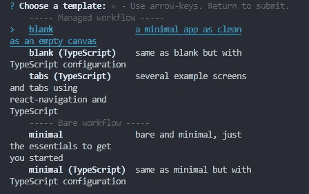

# 构建您的第一个 React 原生应用

> 原文：<https://javascript.plainenglish.io/building-your-first-react-native-app-fe4f6a1785c1?source=collection_archive---------17----------------------->

## *本土发展下滑的原因*


Photo by [XPS](https://unsplash.com/@xps?utm_source=unsplash&utm_medium=referral&utm_content=creditCopyText) on [Unsplash](https://unsplash.com/?utm_source=unsplash&utm_medium=referral&utm_content=creditCopyText)

# 介绍

应用程序开发已经从完全面向对象的本地语言转向 JavaScript。虽然你可能认为这在性能方面有很多缺点，但你错了。React Native 已经做出了巨大的努力来创建尽可能具有原生感觉的应用程序，他们做得非常好。

[React Native](https://reactnative.dev/) 是由脸书的开发团队制作的。它背后有很多来自开源社区的积极开发。他们从基于类的组件变成了 React hooks，并且他们每天都在做出改变以提高性能和增强开发者体验。

# 装置

我以前写过关于不使用 Expo 的 [React Native 的文章，但它是最容易设置的。我建议你看看 React Native CLI vs Expo，为你的第一个真正的应用找到一个合适的选择。世博会让很多事情变得更容易，但它也有不好的一面。更大的应用文件大小。但是对于你的第一个应用来说，这并不重要。](https://reactnative.dev/docs/environment-setup)

我假设您已经安装了 **npm** 。接下来我们需要安装到全球 **expo-cli** 和 Expo 提供的官方手机 app [。](https://expo.io/)

```
npm install -g expo-cli
```

移动应用将用于在上运行你的应用。它具有快速刷新等特性，使开发变得非常容易。你不需要一个帐户，但它确实有一些小津贴。

现在，让我们创建所有的应用程序文件，我们可以通过运行

```
expo init ProjName --npm
```



系统将提示您选择一个模板。我们将使用*空白*模板。而不是 TypeScript 变体。

安装完成后，进入新目录，运行`npm start`。这将在您的浏览器中打开一个带有二维码的新窗口。你可以用手机扫描它，它会通过 Expo 应用程序打开你的应用程序。

很酷吧？我们继续。

# 基础知识

如果我们打开`App.js`文件，我们可以看到一些东西。我们在顶部有一些导入，这些是 Expo 附带的*组件*并且本地反应。这些也可以是你自己的组件。但我们稍后会谈到这一点。

在中间有一个`export default function`，它是`App.js`返回以作出反应的组件。`App.js`是整个应用的基础。虽然许多开发人员为组件或页面创建目录，但你可以简单地将它们都保存在`App.js`中，但这将导致大量难以维护的代码。在函数中，我们返回一些看起来像 HTML 的东西。这叫做 JSX。React 使用的是 JavaScript 和 HTML 的混合体。

在底部我们声明了一个样式表。对于了解的人来说，这种语法非常类似于 CSS。风格也可以做在线一样，我们会看到更远的未来。

试着通读一下`App.js`文件，看看发生了什么。父组件是一个`View`，中间有一些`Text`。尝试更改文本和保存文件，看看博览会的快速刷新。

# 按钮和 OnPress 事件

大多数应用程序都有按钮。在 React Native 中，我们有`<Button>`组件。基本语法非常简单。

尝试将它添加到`<Text>`组件下面，看看会发生什么。如果出现错误，请确保按钮组件是从 React Native 导入的。

我们现在有了一个什么都不做的按钮。你可以按下它，它会根据你的操作系统作出正常的反应。

添加一个`onPress`事件一点也不难，这只是另一个属性，就像`title`需要一个函数作为输入。

更新按钮，使其包含一个带有`console.log`的`onPress`事件。如果你点击按钮，你会看到一些东西被打印到你的电脑上运行的控制台。现在这还不是真正有用的东西，但是很高兴知道它正在工作。

## 状态

为了给我们的按钮增加更多的功能，比如切换显示的文本，我们需要使用一些内存。这是通过我们从 React 导入的`useState`钩子来完成的。

使用`useState`钩子，我们声明两个变量。一个变量`state`和一个函数`setState`。

`state`是一个常量，不能直接改变，但是我们*可以用`setState`函数*改变它。我们还将默认状态设置为`false`，但这可以是任何常规的 JavaScript 类型或对象。

在我们的 JSX 中，我们已经更改了`Text`，根据`state`的条件显示‘真’或‘假’。在按钮的`onPress`中，我们使用`setState`来切换状态。

## 制作我们的应用

我们将一起制作的应用程序是一个很好的练习。应用商店里可能有成千上万个这样的东西。一款随机化应用。

这是一个很容易做到的事情，如果你已经做到这一步，你也可以自己去做。

对于将要显示的数字，我们只需要一个状态，并且我们需要一个函数来使用`Math.random()`将状态改变为一个随机数。事实上，它不必是一个函数，如果你愿意，可以直接在按钮的`onPress`属性中完成。

我还在`Text`组件上添加了一个内嵌样式，所以你可以看到它是如何工作的。它只是一个带有特定名称的 JavaScript 对象，如`fontSize`，而不是通常的 CSS `font-size`。

这是我们迄今为止的第一个应用程序，它工作，它显示一个从 1 到 6 的随机数字，它有一个按钮，当我们想要生成一个新的数字。现在，当骰子在某处丢失时，你可以成为游戏之夜的英雄。

# 结论

下一步是什么？你可以尝试扩展这个小应用程序，使它更有风格，将“骰子”组件分离到另一个文件中，或者尝试添加导航来添加更多的骰子样式，例如龙与地下城的 D20。

希望这篇文章对某人有所帮助。

感谢您的阅读。