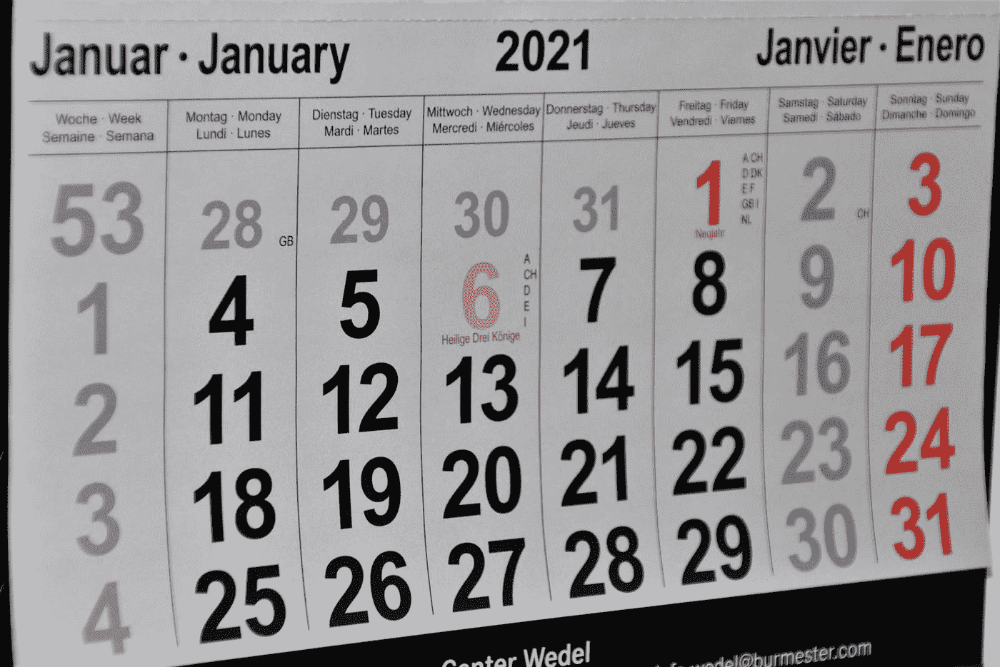
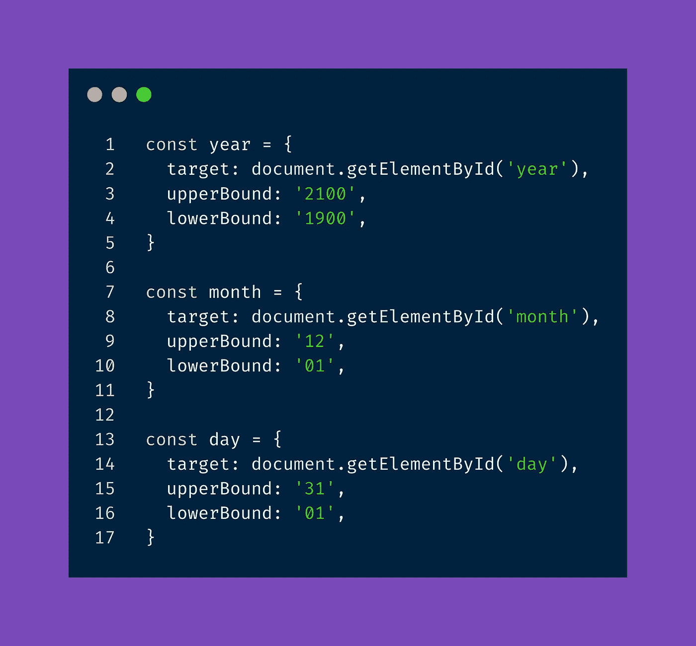
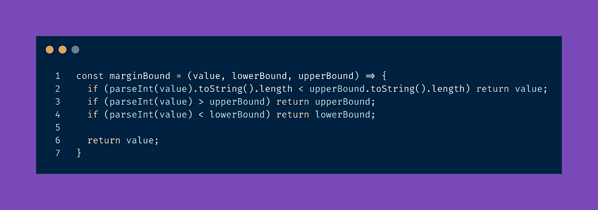

# 如何使用普通 JavaScript 构建自定义日期组件

> 原文：<https://javascript.plainenglish.io/bulding-a-custom-date-component-using-vanilla-javascript-4cb6e8f547a?source=collection_archive---------8----------------------->

Photo by [Waldemar Brandt](https://unsplash.com/@waldemarbrandt67w?utm_source=medium&utm_medium=referral) on [Unsplash](https://unsplash.com?utm_source=medium&utm_medium=referral)

最近，我们有理由重新设计我们收集生日的方式(以及其他日期在 [Seraphin](https://seraphin.be) )。虽然默认的浏览器实现在开始时可以做到这一点，但我们面临着几个问题:

1.  并非所有浏览器的实现都是一致的。
2.  大多数浏览器打开的日历输入都聚焦于今天的日期，这让我们的用户很难输入他们的生日。

我们决定创建日期输入组件来解决这个问题(使用 Vue.js)。

虽然结果非常好，但它确实让我问自己，如果我们用普通的 JavaScript 编写相同的行为，会有什么不同。

因此，这是本系列的第二篇文章，展示了我用普通 JavaScript 编写的自定义日期组件。在[第一部分](https://pablo-curell-mompo.medium.com/building-a-custom-date-input-component-in-vue-js-b5641b7b7c2b)中，我们探索了如何在 Vue.js 中构建相同的元素，我们将通过比较两者来结束这个系列。

# 规格

我们的 DateInput 组件的规范表现为浏览器上的本地日期输入减去日历选择，即:

*   我们只能输入两位数来表示日和月。
*   我们只能输入四位数的年份。
*   这一天应该在 1 到 31 之间
*   月份应该在 1 到 12 之间
*   年份应该在 1900 年到 2100 年之间(这个是我们的，不是浏览器的)
*   我们需要通过直接输入数字或用箭头键上下移动来输入日期。
*   如果我们用箭头键输入日期，并达到上限或下限，显示的数字应该循环。
*   如果我们通过输入数字来输入日期，输入应该是有边界的(max(输入，高边界)或 min(输入，低边界)
*   我们应该以直观的方式让用户进入下一个领域。
*   我们应该证实日期是正确的。

# date-input.html

下面是日期输入的代码(你也可以在这里找到)。你应该能够复制粘贴它，并使用它:)

# 关注关键要素:

每一天、年和月都有一个专用对象:

这些对象将允许我们在一个循环中处理它们(尽管我们必须考虑年份输入)。在这个循环中，我们有一个案例，它将检查被按下的输入键，并做出相应的反应。

我们有四种方法来处理不同的输出:

当我们按下向上箭头时，将增加值

当我们按下向下箭头时会减少数值

会根据我们通过键盘输入的数字做出反应

当我们按退格键时，将清除输入字段

然后，我们总是格式化该值，并检查它是否落在页边距内:

和

最后，我们检查在输入数字的情况下是否应该将用户发送到下一个元素。

与我们的 Vue 日期输入组件一样，我们需要检查错误，当我们模糊年份输入时，我们使用相同的技巧:

# 我应该用这个吗？

如果您不想导入一个漂亮的日期选择器库，或者想要一个没有让用户使用日期选择器的选项的输入，这是一个相当容易实现且使用直观的方法。

如果可能的年份范围相对较大，那么与日期选择器相比，这种日期输入甚至更有帮助(因为在日期选择器中更改年份通常很麻烦)。

# 结论

用 vanilla 语言制作一个定制的日期组件是很复杂的。尽管如此，它背后的逻辑非常简单(我花了几个小时从我的 Vue.js 自定义日期输入中翻译出来，我花了大部分时间试图对它进行一点重构。

如果使用日期选择器对用户来说有问题，您也许可以使用这样的组件。

请继续关注第 3 部分，并在 Twitter 上关注 [@pcurell](https://twitter.com/PCurell) 以了解我何时发布它:)

*更多内容看* [***说白了. io***](http://plainenglish.io/) ***。*** *报名参加我们的**[***免费每周简讯点击这里***](http://newsletter.plainenglish.io/) ***。****