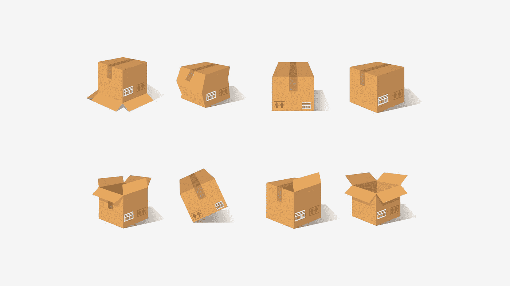
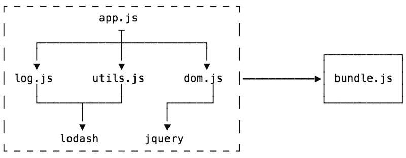
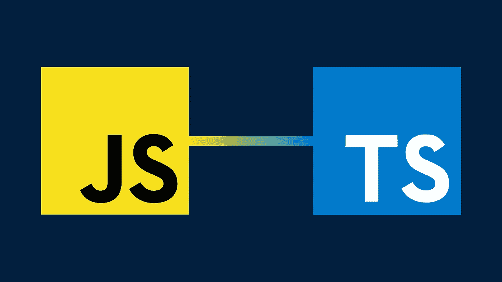

# bun:2022 年 JavaScript 开发者需要了解的 Bundler

> 原文：<https://javascript.plainenglish.io/bun-the-bundler-you-need-to-know-as-a-javascript-developer-in-2022-57279486e965?source=collection_archive---------1----------------------->

您可能在过去遇到过 JavaScript bundler。像 Rollup 或 Webpack 这样的工具在这方面做得很好，但还有一些令人兴奋的事情即将发生。

让我来和你谈谈 Bun，这个 bundler 是你作为一个 JavaScript 开发者在未来几年需要了解的！

# 什么是 JavaScript bundler？

正如你可能从名字中猜到的那样，捆绑器将你所有的**独立的 JavaScript 文件**和**捆绑在一起**在一个**单个文件**中，准备好进行部署。

这可能听起来很简单，但它会变得非常困难，非常快。当我们将 TypeScript 和 CSS 混合在一起时，这种捆绑可能会导致一些严重的头痛和键盘损坏。

流行的 JavaScript bundlers 的一些例子有 Webpack 和 Rollup，但是他们最好小心，因为有一个新的竞争者即将出现。

**准备好馍！**

# Bun 是什么，有什么特别之处？

**Bun 是一个 JS & CSS bundler，JS transpiler，JS 运行时环境，任务运行器等等**！Bun 的特别之处在于它令人难以置信的性能。

Bun 的贡献者制定的一些快速基准:

*   重新加载 CSS 的速度比 Next.js 快 14 倍
*   在几毫秒内从 dist 和 node_modules 中清理项目

Bun 是用类似于 Rust 的语言, [Zig](https://github.com/ziglang/zig) 写的。编译成本机代码的低级语言。

## 作为任务执行者的 Bun

任务运行器是我们用来运行我们的`package.json`文件中的脚本的。在过去，你可能已经用像`npm run clean`或`yarn clean`这样的命令做到了。Bun 还提供了通过 Bun 运行它们的能力。这样你的脚本将会比以前运行得更快。你使用与 npm 和 yarn 相同的语法，但是有 Bun 的力量！
例如，我们的干净的带有发髻的脚本看起来像这样`bun clean`或`bun run clean`。

## 带打字稿的面包

TypeScript ，这种正在席卷 web 开发世界的语言是 Bun 完全支持的**。最棒的部分是什么？它甚至不需要任何额外的配置，**它就是工作**！Bun 会自动将你的打字文件转换成普通的旧 JavaScript！**

# Bun 是使用的正确工具吗？

Bun 背后的团队建议您**只在应用程序的**T2 开发期间使用 Bun。生产捆绑器的一个很大的部分是缩小和死代码消除。 **Bun 还没有缩小你的代码**并且**死代码消除不是最优的**。

这在开发环境中并不重要，但是在生产环境中**会产生严重的后果**。

Bun 仍处于非常早期的开发阶段，让一切准备就绪是路线图上的一个主题。
现在，建议您只在开发环境中使用 Bun。

他们提到的另一点是，Bun 是网站和网络应用的一个很好的工具，但是如果你想让 T21 建立一个库，还有更好的选择，比如 Rollup 或者 esbuild。

# 我在哪里报名？！

截至目前(2021 年 11 月 9 日)，Bun 仍处于**早期访问**阶段，许多组件尚未按预期工作，但由于开源的力量，团队取得进展的速度是惊人的。

如果你想在 Bun 接管世界之前加入行动，你可以去他们的网站[然后从那里加入社区不和服务器！加入后，您可以**要求提前加入聊天**。](https://bun.sh/)

如果你在不久的将来读到这篇文章，那可能已经改变了，很有可能你将能够直接从网站上安装它！

注意:在撰写本文时，Bun 仅适用于 macOS 和 Linux 系统！

# 总之

Bun 是 Webpack、esbuild 和其他 bundlers 的替代产品，它是用 Zig 编写的。Bun 目前处于早期接入阶段，但已经比其竞争对手快了 14 倍。

在我看来，这是一个值得关注的工具，因为它将彻底改变我们捆绑 JavaScript 的方式！

祝你有一个发现的一天！💚

*更多内容请看*[***plain English . io***](http://plainenglish.io/)