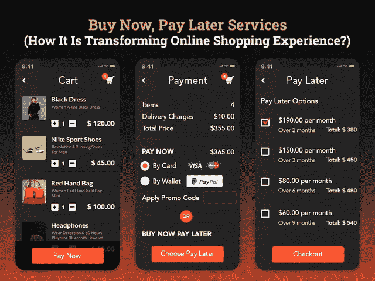

# “先买后付”服务:它是如何改变网上购物体验的

> 原文：<https://javascript.plainenglish.io/buy-now-pay-later-service-how-is-it-transforming-the-online-shopping-experience-9e9187d6d1cf?source=collection_archive---------13----------------------->

## 了解“先买后付”服务如何改变网上购物的面貌。

像每年一样，假期即将来临，人们正在全力庆祝，并准备打开他们的钱包。但是在疫情之后，事情并没有一成不变。流行病的严重打击导致了消费者行为的巨大转变。因此，虽然许多人要么被解雇，要么被减薪，但收入的不确定性限制了消费者的购买力，并使他们的消费模式转向必需品。

然而，另一方面，我们不能忽视的事实是，近年来，网上购物的格局发生了巨大的变化，改变了电子商务的运作方式。此外，电子商务已经成为一个快速增长的平台和主要的购物渠道。

但你们中的许多人都想知道，在全球经济一片混乱的时候，网上购物或电子商务是如何蓬勃发展的。

在这种背景下，“现在购买，以后支付”(BNPL)服务在电子商务行业获得了巨大的欢迎，并允许电子零售商向他们的用户提供小额贷款模式或信贷系统。

因此，无论你是计划将你的实体业务转移到在线平台，还是考虑更新电子商务业务的服务，在 2022 年，将 BNPL 服务应用到你的在线购物应用程序将会改变游戏规则。

如果你认为你的零售业务只有一个电子商务应用程序就足以在这个竞争激烈的世界中生存，那么你错了。你需要适应市场不断变化的需求。BNPL 服务是电子商务的新常态。

*如果你是第一次接触这个术语，你一定会对电子商务中“先买后付”服务的确切含义感到惊讶。*

*在这里我们向你解释…*

## **先买后付服务如何改变网上购物体验？**

最近，新冠肺炎疫情为全球经济带来了范式转变，并迫使电子商务企业采用新的支付方式，以减轻客户的整个购物体验负担。这就是与流行病相关的在线购物和数字支付的转变带来了几个子行业机会的进步浪潮，其中一个潜在的机会是“现在购买，以后支付”。

由于金融科技行业已经迅速释放了客户和企业之间的信用差距，因此，他们最近推出了许多支付服务，以满足购物时无缝信用访问的迫切需求。

在我们深入探讨为什么电子商务行业中的 BNPL 服务需求激增的概念之前，理解为什么电子商务行业中的 BNPL 服务迅速变得重要是很重要的。

当你决定把你的品牌放在网上的时候，你的目标买家中肯定有很大一部分是千禧一代，他们必须足够成熟，有足够的钱自己消费。在直接进入雇佣 [**应用开发公司**](https://www.xicom.biz/services/mobile-app-development/) 的流程之前，你需要明白千禧一代有望成为电子商务支出增长的主要驱动力，为了抓住这一增长，零售商必须明白 BNPL 服务可以为他们提供无缝购物选择。

“先买后付”服务可以提供免息和先买后付的分期付款选项，直接面向千禧一代。

大多数电子商务企业都进退两难，在他们的网上购物平台上实现这些服务是否是一个有价值的决定？对于许多企业来说，BNPL 服务完全以客户为中心。在你相信这种说法之前，你需要了解为什么它现在变得越来越流行，以及“现在购买，以后支付”服务是如何工作的。

## **为什么您应该将 BNPL 解决方案纳入您的电子商务解决方案？**

既然现在你已经理解了这个概念及其工作模式，那么你一定很想知道为什么将 BNPL 服务整合到你现有的电子商务应用中是如此重要。

首先，BNPL 的服务正在全球扩张，在这种背景下，人们普遍认为这些服务主要面向时尚行业。然而，事实是，这些支付选项可以用于广泛的产品。

例如，亚马逊本身就选择了 BNPL 服务来提供大量产品选择，如电子产品、公用事业账单等。

> 如果你还在疑惑，那么你需要检查一下“先买后付”服务的这些市场洞察力:

*   根据调查报告，已经发现大约三分之一的英国顾客在购买休闲装时习惯于使用“先买后付”服务。
*   31.4%的顾客在外就餐时使用 BNPL 服务。
*   据报道，25.7%的受访者在购买美容产品时使用了 BNPL 服务。
*   20%的 BNPL 服务用于购买科技产品。
*   18%的 BNPL 服务用于旅游购物。

根据这些统计数据，可以说“先买后付”服务越来越受欢迎，消费者希望将来在网上购物时可以选择付款方式。你可以雇佣一家 [**软件开发公司**](https://www.xicom.biz/) 来为你现有的电子商务应用添加这一功能，或者要求为你的企业定制支付应用。不考虑商业垂直，增加不同分期付款的可能性会很棒。这样你可以吸引更多的顾客，鼓励他们购买更多的产品。

## **在电子商务行业，先买后付的服务是如何运作的？**

“现在购买，以后支付”服务也熟悉“现在购物，以后支付”的名称，它向客户提供以后支付的选项，并允许他们选择适合他们偿还金额能力的融资计划。零售商可以利用这一机会，使顾客能够购买他们想要的任何东西，而不必预先支付全部费用。

在过去几年中，金融科技行业变得比以往任何时候都更加强大，并无缝解决了围绕融资演变的痛点，如处理信用卡的复杂性及其高利息费用等。

如今，金融科技行业已使电子商务企业能够提供“后付”解决方案，允许购物者购买他们的产品，并按照他们需要在一段时间内支付的预定次数分期付款。你只需要雇佣一家移动应用开发公司，帮助你在网上购物平台上实现这些服务。但仍未回答的核心问题是，它是如何工作的？

像亚马逊这样的领先电子商务应用已经通过与一家银行/非银行金融服务公司合作引入了 BNPL 服务。

在结账过程中，亚马逊提供了通过选择“稍后支付”支付选项进行支付的功能。如果用户选择此付款选项，他们将被进一步要求选择还款选项。但在首次购物的情况下，用户必须完成 KYC，并获得应用程序批准的信用额度。

如果你真的对亚马逊的还款服务印象深刻，那么可以通过两种方式实现:

## **1。电子商务应用程序中的稍后支付选项**

*   **手动还款选项**

如果你正在考虑像亚马逊一样实现还款选项，那么它为你提供了一个手动还款的仪表盘。您可以将金额分成不同的分期付款，并在从银行扣除分期付款后检查未清余额。

以下是你可以考虑在应用程序中包含的一些内容:

*-后付:30 天后全额还款。
-还款:将以后的分期付款分成 3 期或 4 期等额无息分期付款。
-融资金额:昂贵的购买金额可以分成 36 个月支付，但可能会收取一些利息。*

*   **自动还款选项**

这是最方便的还款方式之一，与注册期间或用户首次使用电子商务购物平台购物时的一次性设置无缝配合。为了让这个选项完美地工作，您可以 [**雇用一个移动应用程序开发人员**](https://www.xicom.biz/offerings/hire-mobile-developers/) 来帮助您设置自动还款设置，并允许客户通过完成最低金额的一次性交易验证来安全地链接他们的借记卡或选定银行的银行账户。该金额将在 5 到 7 个工作日内退还到您的银行账户。

一旦设置完毕，金额将自动从关联账户或银行中扣除。

## **2。顾客对以后付款或结账的看法**

通常情况下，客户在接入电商购物时会发生什么？

一旦他们登陆电子商务购物应用程序，他们就会找到自己喜欢的商品，将其添加到购物车中，并检查整个过程。但介于两者之间的是，除了信用卡、借记卡或 PayPal 等传统支付方式之外，还提供 BNPL 服务。因此，如果你正在考虑聘请一名应用程序开发人员，在你的电子商务应用程序中实现这一支付选项，那么你只需要添加另一个选项，即现在购买，以后用应用程序购买。该选项实际上鼓励顾客通过灵活的支付选项购买更多商品，并满足他们当前的购物需求。

## **3。稍后在销售点支付**

通过“现在购买，以后支付”进行的购买，通常记入他们的帐户，并选择在 30 天内立即支付或通过融资支付。这些类型的支付通常通过电子商务应用程序进行，并允许客户在销售点生成可以扫描的二维码。零售商从应用程序中获得信用，客户将在稍后偿还金额。

***简而言之:*** *“现在购买，以后付款”的服务是双向的。一方面，它提供了选择还款方式和时间的能力，而不必支付利息，并增加了客户的消费能力。然而，另一方面，它允许零售商在购买时得到付款。这种“现在购买，以后支付”的服务在电子商务应用程序中发挥作用，并使你的应用程序准备好满足未来的需求。*

# “先买后付”的服务比信用卡更好吗？

这些先买后付的服务会取代信用卡吗？这些服务如何比使用信用卡更好？如果你仍然不知道为什么这些 BNPL 服务的需求激增…

以下是它们在网上购物中越来越受顾客欢迎的几个原因:

*   **易于使用和即时处理**

使用 BNPL 服务比使用信用卡最大的好处就是方便。为了使用这些信用卡，用户需要在开始购物前验证他们的消费限额。而且要求他们完成一个基本的信息流程，即时获得信用额度。然而，通过雇佣一个 [**移动应用程序开发公司**](https://www.xicom.biz/services/mobile-app-development/) ，你可以减少使用信用卡额外信用额度的麻烦。在 BNPL 的情况下，任何 18 岁以上的人都必须完成 KYC 程序，并检查哪个主要合作伙伴批准信贷贷款。其余的，他们需要链接银行账户详细信息或借记卡详细信息，以使他们的进一步进程工作。

*   **保持支付透明**

BNPL 的服务比使用信用卡更透明，也更简单。你只需要每月分期付款，就这样。后付费选项是无息的、透明的，并确保一键用户体验。信用卡不太适合那些不熟悉信用支付方式的人，最终可能会陷入巨大的债务陷阱。

此外，信用卡选项伴随着 OTP 和支付失败的痛苦，其中 BNPL 服务是绝对免费的，并允许客户立即支付。这是客户倾向于这种支付方式的主要原因。

*   **无入职费**

与信用卡相关的最大痛苦是它们通常会增加各种隐性成本，如加盟费、年度服务费、滞纳金等等。然而，BNPL 的服务简单、清晰、易于上手，无需支付任何入职费用。

*   **无息贷款**

说到信用卡，它们通常有长达 45 天的免息信用期。然而，使用 BNPL 服务，客户可以将昂贵的购物金额分成 36 个月分期付款，而且没有利息费用。

***简而言之:*** *对于那些没有任何信用记录但正在寻找短期信贷选择的人来说，现在购买以后支付服务是一个很好的选择。通过在电子商务业务中加入 BNPL 服务，您可以提供更好的付款计划，而无需支付利息费用，这将最终提高购买力。*

## **零售商如何利用现在购买以后支付的服务优势？**

当谈到管理在线购物平台时，有几家零售商与该平台相关联，以提供各种产品。因此，作为这些零售商的主人，你同样有责任向零售商提供压倒性的商业体验。你可能已经 [**雇佣了一个移动应用程序开发者**](https://www.xicom.biz/offerings/hire-mobile-developers/) 来确保应用程序出色的 UI/UX 设计，但是你还需要确保零售商在客户购买后会立即得到他们的资金转移。

许多电子商务企业害怕提供这一功能以避免信用风险。但是增加这种“以后支付”的选项就更好了，每个人都受到了保护。通过实施这一功能，您可以为零售商提供多种好处。

*以下是零售商通过实施 BNPL 选项将享受到的一些好处:*

*   **提高销量和转化率**

根据“先买后付”的调查报告，服务可以增加平均购物篮大小的 20-30%。

无论你是直接从银行账户中拿出一大笔钱进行投资，还是使用高利率的信用卡，购买价格昂贵的物品总是很困难的。在这方面，BNPL 服务可以改变客户的购买态度，鼓励他们现在购买，以后再支付昂贵的产品，而无需支付任何利息费用。

向顾客提供每月还款选项可以减少废弃的购物车，并鼓励购物者完成购买，而无需承担提前支付全部费用的压力。

*   **提高客户忠诚度**

与网上购物相关的一个问题是，顾客总是想用手指触摸面料的质量，或者想看看产品是否符合他们的需求。这就是“现在购买，以后支付”服务允许客户购买产品，而不必预先支付任何金额。

根据调查报告，66%的顾客表示，他们在最终购买之前会查看退货政策，大多数商店都有严格的退货政策。

比方说，你需要买一件婚纱，但没有看到衣服或尝试它，你可能现在做，以后拒绝它，然后不得不把它退回来获得退款总是具有挑战性。但是 BNPL 的服务允许你免费订购你想要的礼服。甚至回报都是安全免费的。这增加了平均订单价值，并允许客户购买比他们预期更多的东西，因为没有提前支付全部购物金额的负担。

通过提供这些 BNPL 服务以及简单而免费的退货，将有助于企业与客户建立更好的关系，并为他们提供更可靠的购物空间。

*   **确保更好的客户体验**

虽然这是管理网上零售业务时你不能忽略的最重要的方面之一。由于主要客户群是千禧一代，他们喜欢网上购物，浏览产品的最终数量，并喜欢简单的交付。同样，他们也要求无缝的用户界面，并期待卓越的购物体验，鼓励他们在你的网站上一次又一次地购物。

因此，现在购买以后支付的服务不仅可以满足他们的紧急信用需求，还可以鼓励他们进行更多的购物，以便在他们的购物帐户中有更多的奖励积分。

# **结论**

无论你是在经营电子商务业务，还是打算在这个价值数十亿美元的电子商务行业蓬勃发展，你的目标客户都需要成为你的重中之重，并相应地为你的客户提供增值服务。将你的业务与“先买后付”服务相结合，就是让你的应用为未来客户做好准备的一个步骤。

为了增加以后付款的可能性，你可以雇佣一家 [**移动应用程序开发公司**](https://www.xicom.biz/services/mobile-app-development/) ，它允许客户通过选择以后加入免息每月分期付款从任何地方购买任何东西。这对顾客和零售商都有好处。对于客户来说，它提供了以后付款的灵活性，而且没有利息。

因此，如果您正计划推出一款电子商务移动应用程序，或者期待升级您现有的在线购物应用程序，提供“立即购买，稍后支付”服务，那么您可以 [**联系我们**](https://www.xicom.biz/contact/) 或者在下面提出疑问。

感谢您的阅读。

======================================

*更多内容请看*[*plain English . io*](http://plainenglish.io/)*。报名参加我们的* [*免费周报在这里*](http://newsletter.plainenglish.io/) *。*