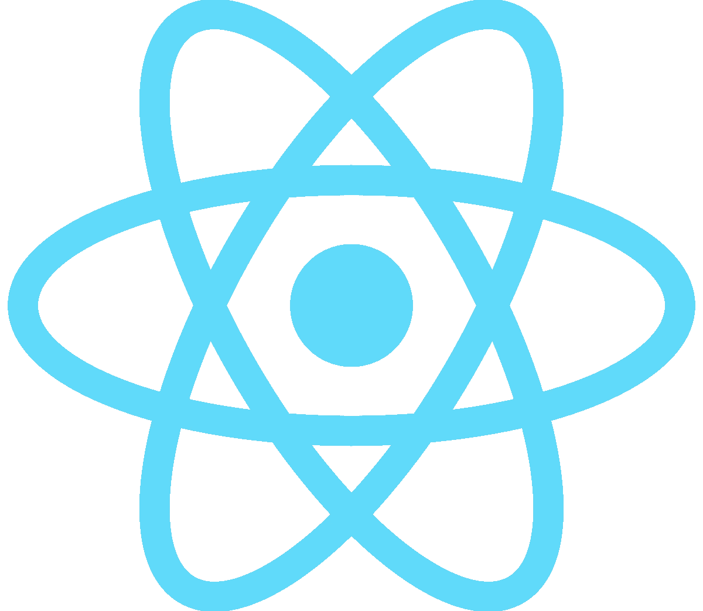
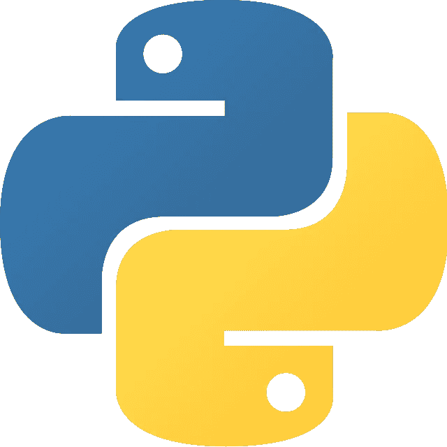

# c 与 JavaScript:50 年前的语言和将近 30 年前的语言的比较

> 原文：<https://javascript.plainenglish.io/c-vs-javascript-a-comparison-between-a-50-year-old-language-and-a-nearly-30-year-old-language-9c5e313a401c?source=collection_archive---------4----------------------->


Photo by [Joan Gamell](https://unsplash.com/@gamell) on [Unsplash](https://unsplash.com/photos/ZS67i1HLllo)

**概述:**

根据[一项堆栈溢出调查](https://insights.stackoverflow.com/survey/2021#most-popular-technologies-language)，JavaScript 是最常用的编程语言。然而，有一种有 50 年历史的语言，在调查中大约有五分之一的开发人员仍在使用它:C。本文将展示 C 和 JavaScript 之间的差异以及为什么 C 仍然存在。

**语言类型:**

C 是一种过程编程语言，而 JavaScript 既可以作为过程语言又可以作为面向对象的语言。如果只看那个方面，你可能会认为 JavaScript 在每个领域都可以取代 C。然而，它不能，因为 C 是一种编译语言，而 JavaScript 是一种解释语言，编译语言在编译成本机代码时往往更快。

**类型系统**

c 是一种静态类型语言，这意味着变量类型在编译时是已知的。您需要记住它们并在使用它们之前声明它们，因为每个都有一个格式说明符。如果你是编码新手，你可能会发现它很复杂。此外，如果您想以另一种格式存储变量值，您必须创建一个新变量。

另一方面，JavaScript 是一种动态类型语言，这意味着类型检查是在运行时执行的。它也是一种弱类型语言，所以变量类型可以改变，这取决于您如何在源代码中使用它。对于初学者来说，这听起来很方便，因为您不必像在 c 中那样记住变量类型或声明它们。

看看这个例子，试着猜测变量 **a** 的值。

```
a = 5;
a += 1;
a += ‘1’;
a += 2;
print(a);
```

如果你对 JavaScript 一无所知，你能给出正确答案吗？答案就在这里:[https://ideone.com/47zicp](https://ideone.com/47zicp)
另一个例子是:

```
answer = 100;
answr = (answer * 10) / 4;
print(answer);
```

在上面的例子中，第二行中的变量拼写错误。因为编译器认为拼写错误的变量是一个新变量，所以它的值不会改变。如果有任何变量拼写错误，编译器无法检查。因此，您只在运行时才意识到问题！

**应用:**

JavaScript 用于开发带有 web 框架的网站和 app，[如 React 和 Express](https://www.statista.com/statistics/1124699/worldwide-developer-survey-most-used-frameworks-web/) 。程序员也可以用它来进行[人工智能](https://www.tensorflow.org/js)和[游戏开发](https://phaser.io/)。原因是 [JavaScript 是一种基于原型的语言](https://developer.mozilla.org/en-US/docs/Learn/JavaScript/Objects/Object_prototypes)，开发者很容易对产品进行维护和升级。用 JavaScript 编写的应用程序包括脸书、Instagram、Discord、Pinterest、Wix 和沃尔玛。



React. Image source: Internet

与 JavaScript 的广泛使用形成对比的是，现在开发人员主要将 C 用于嵌入式系统、驱动程序、内核或库。虽然 C 不支持面向对象编程，但它非常快，并且稳定性是这些领域的主要要求。一个典型的例子就是 C 在 Linux 内核中的使用，[有 90%以上是用 C 写的](https://github.com/torvalds/linux)。另一个有趣的例子是，大约三分之一的标准 Python 库是用 c 实现的



Python. Image source; Internet

感谢您的阅读！

*更多内容看* [***说白了。报名参加我们的***](https://plainenglish.io/) **[***免费周报***](http://newsletter.plainenglish.io/) *。关注我们*[***Twitter***](https://twitter.com/inPlainEngHQ)*和*[***LinkedIn***](https://www.linkedin.com/company/inplainenglish/)*。加入我们的* [***社区***](https://discord.gg/GtDtUAvyhW) *。***