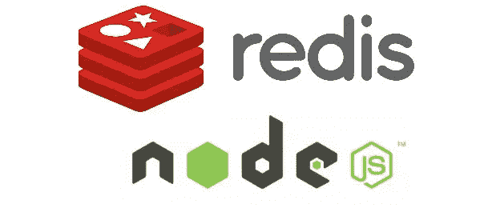
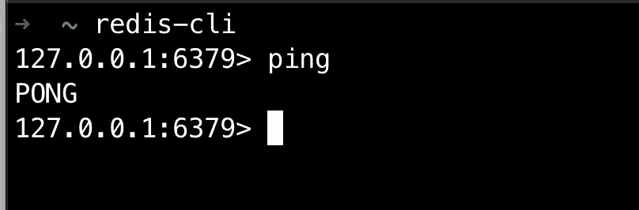
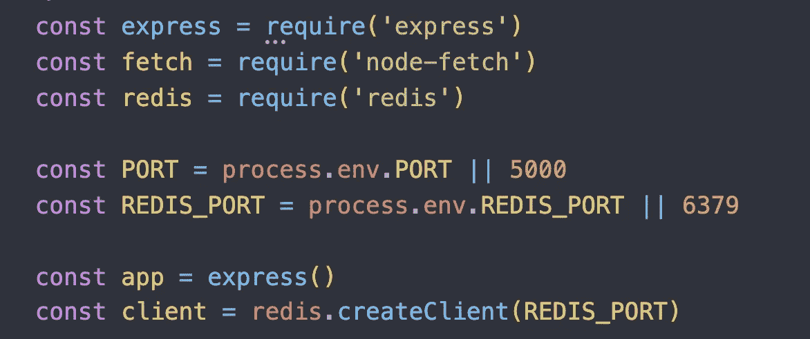
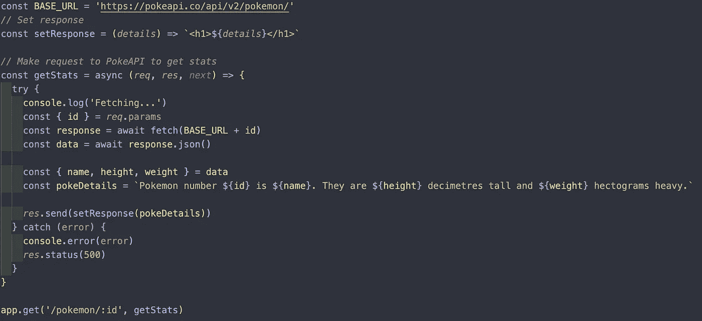
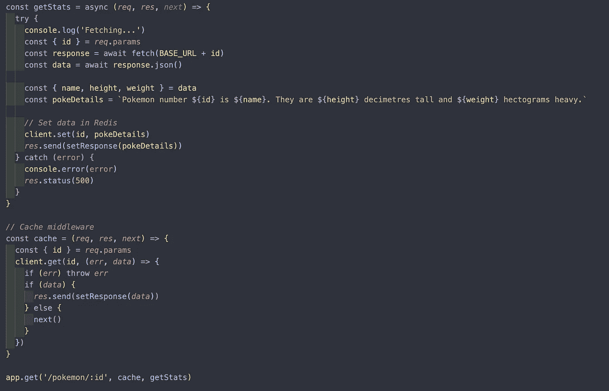
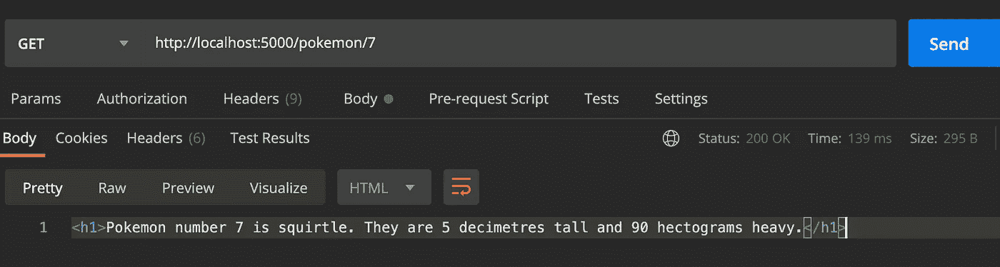
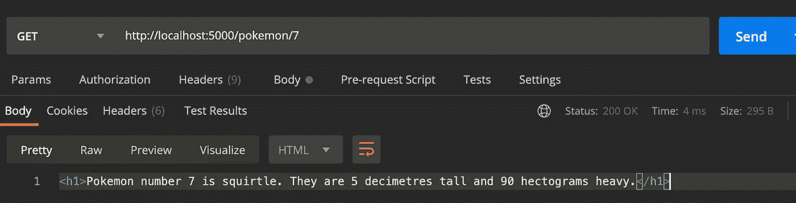

# 使用 Redis 在 Node.js 中缓存

> 原文：<https://javascript.plainenglish.io/caching-in-node-js-with-redis-5d367de7187a?source=collection_archive---------6----------------------->

在本教程中，我将向您快速介绍 Redis。我们还将使用 Redis 为一个节点应用程序创建一个简单的缓存，看看它如何影响其性能。

# Redis 是什么？

Redis 是一个开源的内存数据结构存储，用作数据库、缓存和消息代理。

您可以把它想象成一个非 SQL 数据库，它将数据作为一个键值对存储在系统内存中。如果需要，Redis 也支持磁盘持久数据存储。

Redis 支持存储多种数据结构和数据类型，包括字符串、列表、散列、集合和有序集合。受支持的数据结构为 Redis 提供了许多用例的通用性。

Redis 最适用于需要在最少的*时间内检索数据并交付给客户机的情况。*

# Redis 用于缓存

虽然有更多的用例，但总的来说，Redis 最流行的用途是用于缓存。

## **什么是缓存？**

缓存是将数据副本存储在缓存中以允许应用程序更快地访问和检索数据的过程。缓存的目标是比数据库或远程服务器更好地加速数据访问操作。对于昂贵的操作来说尤其如此，比如从外部 API 获取数据。

作为后端开发人员，我们的任务是尽快完成客户的请求。有时，查询需要几项操作，如从数据库中检索数据、执行计算、从其他服务中检索附加数据等。，这拖累了我们的表现。

这正是缓存的优势所在，因为我们可以一次性处理数据，将其存储在缓存中，然后直接从缓存中检索，而无需执行所有这些昂贵的操作。然后，我们会定期更新缓存，以便用户可以看到更新的信息。

## **缓存& Redis**

因为 Redis 是一个内存数据库，所以它的数据访问操作比任何其他磁盘数据库都要快。这使得 Redis 成为缓存的完美选择。它的键值数据存储是另一个优势，因为它使数据存储和检索更加简单。

在本教程中，我们将了解如何在 Node.js (Express)应用程序中实现 Redis。

# 使用节点和 Redis 缓存

现在，让我们从本教程的主要焦点开始:在我们的节点应用程序中使用 Redis 进行缓存。

用 Redis 缓存的过程真的很简单。当我们收到用户对启用了缓存的路由的请求时，我们将首先检查所请求的数据是否已经存储在缓存中。如果是，我们可以快速从 Redis 检索数据并发送响应。

## **项目设置**

如果你还没有，你需要在你的机器上安装 Redis。你可以用自制软件做到这一点:brew 安装 redis。为了确保 Redis 服务器运行没有问题，使用`redis-cli`向服务器发送一个 ping。您可以向 Redis 服务器发送 ping 命令，如果它用 PONG 响应，您就可以开始了。

一旦在你的机器上设置好 redis，我们就初始化我们的项目并安装以下包:express、node-fetch(可以根据你的喜好用 requests 或 axios 代替)和 Redis。然后，我们在端口 6379 上初始化我们的客户机 Redis 监听的默认端口。

## **从 PokeAPI 获取数据**

在我们的应用程序中，我们将从 PokeAPI 中获取一些数据，将其缓存在 Redis 中，并测量性能改进。

我们将首先定义一个 route '/pokemon/:id '，其中用户将能够传入 pokemon 的 pokedex id，我们将获取该特定 id 的姓名、身高和体重。在我们解析了来自 PokeAPI 的响应并构建了我们的细节字符串之后，我们只是返回一个简单的 h1 标记。很容易..但是这些请求中的每一个都至少需要***125 毫秒*** 。虽然还不算太糟，但可以用 Redis 大大改进。

使用 Redis 非常简单，因为大部分交互都是以设置或获取数据的形式进行的。我们将对 getStats 方法稍作调整，首先在响应前进行缓存。之后，我们将需要构建一个额外的中间件来检查我们是否可以从 Redis 缓存中提取信息，而不是再次获取外部 API。

随着我们的缓存中间件的建立，我们可以通过在 Postman 中测试来衡量改进。

我们最初向 API 请求杰尼龟的信息用了 139 毫秒…

但启用 Redis 后，我们可以将其缩短到 5 毫秒以下。对于几行代码来说还不错。

# 摘要

希望您可以看到在您的应用程序中实现缓存是多么简单和实用。利用 Redis 来缓存频繁查询的数据可以大大提高应用程序的性能！