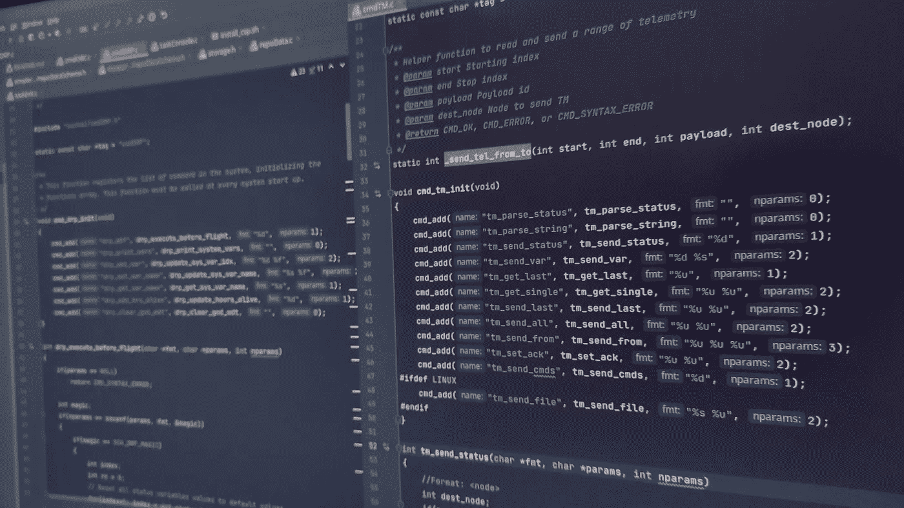

# 从 JavaScript 调用本机函数

> 原文：<https://javascript.plainenglish.io/call-native-functions-from-javascript-c0fa6e03ee90?source=collection_archive---------4----------------------->

*WasmEdge 支持 JavaScript 调用共享库中的本地函数*



Photo by [Carlos Gonzalez](https://unsplash.com/@carlgonz?utm_source=unsplash&utm_medium=referral&utm_content=creditCopyText) on [Unsplash](https://unsplash.com/s/photos/c-programming?utm_source=unsplash&utm_medium=referral&utm_content=creditCopyText)

在我之前的文章中，我解释了[为什么以及如何在 WebAssembly 沙箱](https://www.secondstate.io/articles/run-javascript-in-webassembly-with-wasmedge/)中运行 JavaScript 程序。我还讨论了[如何使用 Rust](https://www.secondstate.io/articles/embed-rust-in-javascript/) 为 WasmEdge 创建定制的 JavaScript APIs。

然而，为了完全访问底层系统的操作系统和硬件特性，我们有时需要为基于 C 的本地函数创建 JavaScript APIs。也就是说，当 JavaScript 程序调用预定义的函数时，WasmEdge 会将其传递给 OS 上的原生共享库来执行。

在本文中，我们将向您展示如何做到这一点。我们将创建以下两个组件。

*   自定义构建的 WasmEdge 运行时，允许 WebAssembly 函数调用外部本机函数。
*   一个定制的 QuickJS 解释器，它解析 JavaScript 中的函数调用，并将外部函数调用传递给 WebAssembly，web assembly 再将它们传递给本机函数调用。

为了跟进，您需要从 Github 中[派生](https://github.com/second-state/wasmedge-quickjs/fork)或克隆 [wasmedge-quickjs 库](https://github.com/second-state/wasmedge-quickjs/)。该示例位于该存储库的`[examples/host_function](https://github.com/second-state/wasmedge-quickjs/blob/main/examples/host_function/)`文件夹中。

```
$ git clone [https://github.com/second-state/wasmedge-quickjs/](https://github.com/second-state/wasmedge-quickjs/)
```

# 将基于 C 的函数嵌入 WasmEdge

首先，我们将向 Wasmedge 运行时添加一个基于 C 的函数，以便我们的 JavaScript 程序稍后可以调用它。我们使用 WasmEdge C API 创建一个`HostInc`函数，然后将其注册为`host_inc`。

`[wasmedge_c/demo_wasmedge.c](https://github.com/second-state/wasmedge-quickjs/blob/main/examples/host_function/wasmedge_c/demo_wasmedge.c)`文件包含主机函数的完整源代码及其在 WasmEdge 中的注册。

```
#include <stdio.h>
#include "wasmedge.h"WasmEdge_Result HostInc(void *Data, WasmEdge_MemoryInstanceContext *MemCxt, const WasmEdge_Value *In, WasmEdge_Value *Out) {
  int32_t Val1 = WasmEdge_ValueGetI32(In[0]);
  printf("Runtime(c)=> host_inc call : %d\n",Val1 + 1);
  Out[0] = WasmEdge_ValueGenI32(Val1 + 1);
  return WasmEdge_Result_Success;
}// mapping dirs
char* dirs = ".:..\0";

int main(int Argc, const char* Argv[]) {
  /* Create the configure context and add the WASI support. */
  /* This step is not necessary unless you need WASI support. */
  WasmEdge_ConfigureContext *ConfCxt = WasmEdge_ConfigureCreate();
  WasmEdge_ConfigureAddHostRegistration(ConfCxt, WasmEdge_HostRegistration_Wasi);
  /* The configure and store context to the VM creation can be NULL. */
  WasmEdge_VMContext *VMCxt = WasmEdge_VMCreate(ConfCxt, NULL);
  WasmEdge_ImportObjectContext *WasiObject = WasmEdge_VMGetImportModuleContext(VMCxt, WasmEdge_HostRegistration_Wasi);
  WasmEdge_ImportObjectInitWASI(WasiObject,Argv+1,Argc-1,NULL,0,&dirs,1,NULL,0);

  /* Create the import object. */
  WasmEdge_String ExportName = WasmEdge_StringCreateByCString("extern");
  WasmEdge_ImportObjectContext *ImpObj = WasmEdge_ImportObjectCreate(ExportName, NULL);
  enum WasmEdge_ValType ParamList[1] = { WasmEdge_ValType_I32 };
  enum WasmEdge_ValType ReturnList[1] = { WasmEdge_ValType_I32 };
  WasmEdge_FunctionTypeContext *HostFType = WasmEdge_FunctionTypeCreate(ParamList, 1, ReturnList, 1);
  WasmEdge_HostFunctionContext *HostFunc = WasmEdge_HostFunctionCreate(HostFType, HostInc, 0);
  WasmEdge_FunctionTypeDelete(HostFType);
  WasmEdge_String HostFuncName = WasmEdge_StringCreateByCString("host_inc");
  WasmEdge_ImportObjectAddHostFunction(ImpObj, HostFuncName, HostFunc);
  WasmEdge_StringDelete(HostFuncName);

  WasmEdge_VMRegisterModuleFromImport(VMCxt, ImpObj);

  /* The parameters and returns arrays. */
  WasmEdge_Value Params[0];
  WasmEdge_Value Returns[0];
  /* Function name. */
  WasmEdge_String FuncName = WasmEdge_StringCreateByCString("_start");
  /* Run the WASM function from file. */
  WasmEdge_Result Res = WasmEdge_VMRunWasmFromFile(VMCxt, Argv[1], FuncName, Params, 0, Returns, 0);

  if (WasmEdge_ResultOK(Res)) {
    printf("\nRuntime(c)=> OK\n");
  } else {
    printf("\nRuntime(c)=> Error message: %s\n", WasmEdge_ResultGetMessage(Res));
  }

  /* Resources deallocations. */
  WasmEdge_VMDelete(VMCxt);
  WasmEdge_ConfigureDelete(ConfCxt);
  WasmEdge_StringDelete(FuncName);
  return 0;
}
```

您可以使用标准的 C 编译器(如 GCC)来编译 C 源代码。

```
#build custom webassembly Runtime
$ cd wasmedge_c#build a custom Runtime
wasmedge_c/$ gcc demo_wasmedge.c -lwasmedge_c -o demo_wasmedge
```

编译器为包含宿主函数的 WasmEdge 运行时的定制版本生成一个二进制可执行文件`demo_wasmedge`。

# 创建一个 Rust 程序，将函数绑定到 JavaScript

接下来，我们需要在 Rust 中创建一个定制的 JavaScript 解释器。它解释对`host_inc`的 JavaScript 调用，并通过定制的 WasmEdge 运行时(`demo_wasmedge`)将调用定向到本机 C 函数。 [src/main.rs](https://github.com/second-state/wasmedge-quickjs/blob/main/examples/host_function/src/main.rs) 文件包含注册外部函数的完整 Rust 源代码。

```
mod host_extern {
    use quickjs_rs_wasi::{Context, JsValue}; #[link(wasm_import_module = "extern")]
    extern "C" {
        pub fn host_inc(v: i32) -> i32;
    } pub struct HostIncFn;
    impl quickjs_rs_wasi::JsFn for HostIncFn {
        fn call(ctx: &mut Context, _this_val: JsValue, argv: &[JsValue]) -> JsValue {
            if let Some(JsValue::Int(i)) = argv.get(0) {
                unsafe {
                    let r = host_inc(*i);
                    r.into()
                }
            } else {
                ctx.throw_type_error("'v' is not a int").into()
            }
        }
    }
}use quickjs_rs_wasi::*;fn main() {
    let mut ctx = Context::new();
    let f = ctx.new_function::<host_extern::HostIncFn>("host_inc");
    ctx.get_global().set("host_inc", f.into());

    // Run the embedded JavaScript
    ctx.eval_global_str("print('js=> host_inc(2)=',host_inc(2))");
}
```

Rust 程序创建一个定制的 QuickJS 解释器，然后执行一个 JavaScript 程序，该程序又调用注册在 WasmEdge 运行时中的基于 C 的本地函数。

```
$ cargo build --target wasm32-wasi --release
```

带有嵌入式 JavaScript 程序的定制 QuickJS 解释器可在`target/wasm32-wasi/release/host_function.wasm`获得。

# 调用 JavaScript 函数

嵌入式 JavaScript 程序调用`host_inc()`函数。JavaScript 解释器(`host_function.wasm`的 Rust 程序)将这个调用路由到 WebAssembly `host_inc()`调用。定制的 WasmEdge 运行时(`demo_wasmedge`的 C 程序)将 WebAssembly 调用路由到本地 C 函数。

```
print('js=> host_inc(2)=',host_inc(2))
```

> *当然，你也可以编写一个通用的 Rust 程序，从文件中读取 JavaScript。*

要运行这个 JavaScript，您需要在我们定制的 WasmEdge 运行时中使用我们定制的 QuickJS 解释器。解释器和运行时都支持`host_inc`本地函数调用。

```
$ cd wasmedge_c
$ export LD_LIBRARY_PATH=.
$ ./demo_wasmedge --dir .:. ../target/wasm32-wasi/release/host_function.wasm
js=> host_inc(2)= 3
```

# 下一步是什么

通过一个简单的例子，我展示了如何将基于 C 的原生函数转换成 JavaScript API。您可以使用相同的方法向 JavaScript 添加许多本地 API。很兴奋看到你想出的东西！

本系列文章:

*   [使用 WasmEdge 在 WebAssembly 中运行 JavaScript](https://www.secondstate.io/articles/run-javascript-in-webassembly-with-wasmedge/)
*   [将 JavaScript 整合到 Rust 应用中](https://www.secondstate.io/articles/embed-javascript-in-rust/)
*   [使用 Rust 创建高性能 JavaScript API](https://www.secondstate.io/articles/embed-rust-in-javascript/)
*   [从 JavaScript 调用本地函数](https://www.secondstate.io/articles/call-native-functions-from-javascript/)

云原生 WebAssembly 中的 JavaScript 仍然是下一代云和边缘计算基础设施中的新兴领域。我们才刚刚开始！如果您感兴趣，请加入我们的 [WasmEdge 项目](https://github.com/WasmEdge/WasmEdge)(或者通过提出功能请求问题告诉我们您想要什么)。

*更多内容尽在*[***plain English . io***](http://plainenglish.io/)