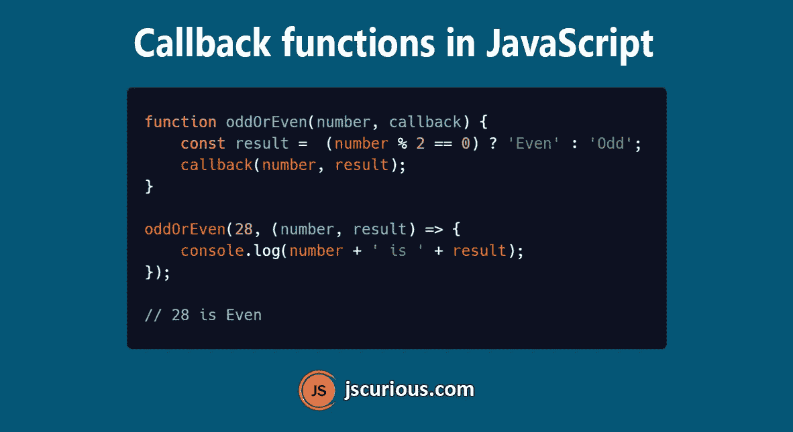

# JavaScript 中有哪些回调函数？

> 原文：<https://javascript.plainenglish.io/callback-functions-in-javascript-b90684dbae6d?source=collection_archive---------3----------------------->



(posted in jscurious.com)

回调是作为参数传递给另一个函数的函数，稍后可以在该函数内部调用。

# 同步回调

同步意味着代码语句以连续的方式一个接一个地执行。

```
function print(number, result) {
    console.log(`${number} is ${result}`);
}function checkEvenOrOdd(number, callback) {
  const result =  (number % 2 === 0) ? 'Even' : 'Odd';
  callback(number, result);
}checkEvenOrOdd(56, print);
// 56 is Even
```

这里回调是立即执行的，它不等待任何异步操作完成。这就是为什么它是一个同步回调。

# 异步回调

如果回调是在异步操作完成后执行的，那么它就是异步回调。

让我们看一个例子，我们将接受一个订单并打印它。

```
function takeOrder() {
    setTimeout(() => {
       return (Math.random() * 10) <= 5 ? 'Coffee' : 'Tea';
    }, 1000);
}let order = takeOrder();
console.log('Order is for: ' + order);
// Order is for: undefined
```

在这里的`takeOrder`函数中，`setTimeout`将在 1 秒后运行，此时`console.log`语句已经执行，因此订单的打印值为`undefined`。

现在，如果我们能够在数据从`takeOrder`返回后将消息记录到控制台，我们就可以解决这个问题了。这可以通过向`takeOrder`传递一个回调函数来完成，该函数将在`takeOrder`函数内部被调用。

```
function takeOrder(callback) {
    setTimeout(() => {
        const order = (Math.random() * 10) <= 5 ? 'Coffee' : 'Tea';
        callback(order);
    }, 1000);
}takeOrder((order) => {
    console.log('Order is for: ' + order);
});// Order is for: Tea
```

这里，1 秒钟后，回调函数将被调用，控制台语句将以正确的顺序值执行。

> *注:* `*takeOrder*` *功能的输出可能因您的情况而异，因为我们使用* `*Math.random()*` *来决定订单值。*

# 用回调处理错误

我们可以为成功和失败的场景传递不同的回调。

```
function takeOrder(success, failure) {
    setTimeout(() => {
        const random = (Math.random() * 10);
        if(random < 8) {
            const order = random < 4 ? 'Coffee' : 'Tea';
            success(order);
        } else {
            failure('Order Not Available');
        }

    }, 1000);
}takeOrder(
    (order) => {
        console.log('Order is for: ' + order);
    },
    (error) => {
        console.log(error);
    }
);
```

# 嵌套回调

我们一个一个来看订单流程。

```
function takeOrder(callback) {
    setTimeout(() => {
        const order = (Math.random() * 10) <= 5 ? 'Coffee' : 'Tea';
        callback(order);
    }, 1000);
}function makeOrder(order, callback) {
    setTimeout(() => {
        callback(order + ' is prepared');
    }, 1000);
}function serveOrder(order, callback) {
    setTimeout(() => {
        callback(order + ' is served');
    }, 1000);
}takeOrder((order) => {
    console.log('Order is for: ' + order);
    makeOrder(order, (orderStatus) => {
        console.log(orderStatus);
        serveOrder(order, (orderStatus) => {
            console.log(orderStatus);
        })
    })
});
```

输出

```
Order is for: Coffee
Coffee is prepared
Coffee is served
```

这里，当来自`takeOrder`的响应到来时，调用`makeOrder`。类似地，当来自`makeOrder`的响应到来时，调用`serveOrder`。在这里，我们将回调函数嵌套在另一个回调函数中，以便按顺序执行函数。

如果回调的嵌套增加了，那么它被称为**回调地狱，**在这里很难管理回调，并且它降低了代码的可读性。看看回调地狱的一个例子。

```
takeOrder((order) => {
    makeOrder(order, () => {
        serveOrder(order, () => {
            provideBill(order, () => {
                takeBill(order, () => {
                    // some more callbacks
                })
            })
        })
    })
});
```

这个回调地狱可以通过使用[承诺](https://jscurious.com/a-brief-guide-to-promises-in-javascript/)和[异步/等待](https://jscurious.com/understanding-async-and-await-in-javascript/)来修复。

JavaScript 中有一些内置方法接受回调作为参数。

```
// Array.map()
array.map((element) => {
    // your code here
});// setTimeout
setTimeout(() => {
    // your code here
}, timeout);
```

让我们看看其他一些接受回调的方法。

`Array.filter()`、`Array.reduce()`、`Array.find()`、`Array.sort()`、`Array.forEach()`、`setInterval()`、`addEventListener()`、`Promise.then()`、`Promise.catch()`等。

## 你可能也喜欢

*   [JavaScript 中承诺的简要指南](https://jscurious.com/a-brief-guide-to-promises-in-javascript/)
*   [理解 JavaScript 中的异步和等待](https://jscurious.com/understanding-async-and-await-in-javascript/)
*   [JavaScript 获取 API 以发出 HTTP 请求](https://jscurious.com/javascript-fetch-api-to-make-http-requests/)
*   [20 种节省你时间的 JavaScript 速记技巧](https://jscurious.com/20-javascript-shorthand-techniques-that-will-save-your-time/)
*   [使用 JavaScript 中的通知 API 发送推送通知](https://jscurious.com/the-notification-api-in-javascript/)
*   [用 JavaScript 中的 HTMLAudioElement API 播放音频](https://jscurious.com/play-audio-with-htmlaudioelement-api-in-javascript/)
*   [JavaScript 中的地图，当它是比对象更好的选择时](https://jscurious.com/map-in-javascript-and-how-it-is-better-than-object/)
*   [JavaScript 设置对象存储唯一值](https://jscurious.com/javascript-set-object-to-store-unique-values/)
*   [JavaScript 中的生成器函数](https://jscurious.com/generator-functions-in-javascript/)
*   [JavaScript 中的震动 API](https://jscurious.com/the-vibration-api-in-javascript/)

*感谢您抽出时间* ☺️
如需更多网络开发博客，请访问[jscurious.com](http://jscurious.com/)