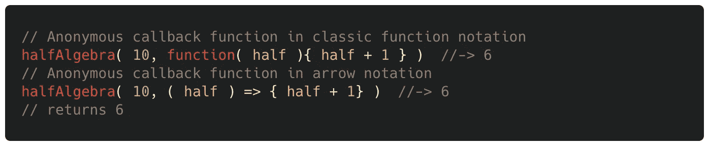

# 通过例子解释 JavaScript 回调

> 原文：<https://javascript.plainenglish.io/callbacks-in-js-explained-via-examples-9839eedad662?source=collection_archive---------10----------------------->

## 软件工程

## 编写优雅的函数，将一个函数注入另一个函数，并通过使用回调来实现递归行为

Photo by [Eduardo Sánchez](https://unsplash.com/@eduardoequis?utm_source=unsplash&utm_medium=referral&utm_content=creditCopyText) on [Unsplash](https://unsplash.com/?utm_source=unsplash&utm_medium=referral&utm_content=creditCopyText)

# 👁‍🗨在调用函数时使用回调来公开中间结果

你有没有想过`.forEach`循环中的`element`或`(value, key)`等*神奇的*参数是从哪里来的？

当你读到这一节的末尾时，你就会明白了。

假设您有一个名为`halfAlgebra`的函数。它接受一个数字作为它的第一个参数，将它分成两半，然后允许你在另一个函数中使用结果，你可以提供这个函数作为`halfAlgrebra`的第二个参数。

下面是编写这样一个函数的方法:

以上，最后执行`anotherFunction( half )`。这使得变量`half`可以被任何回调函数访问，这些回调函数可以作为`halfAlgebra`函数的第二个参数输入。方法如下:

这里，提供`addOne`作为回调参数会导致该函数被隐式执行，并使用`half`作为其参数。因此，它被有效地执行为`addOne( half )`。

也可以直接输入函数作为回调参数(即匿名函数)。匿名回调函数也可以访问`half`变量:

顺便说一下，您不必调用变量`half`。您可以随意引用它(重要的是参数位置，而不是名称):

所以，当你在 JavaScript 中看到回调变量时，比如在`.forEach`方法的`element`或`(value, key)`中，现在你知道它们是如何产生的了。

# 🔗使用回调使一个函数作为另一个函数的一部分运行

Photo by [Craig Washington](https://unsplash.com/@pcjw412?utm_source=unsplash&utm_medium=referral&utm_content=creditCopyText) on [Unsplash](https://unsplash.com/?utm_source=unsplash&utm_medium=referral&utm_content=creditCopyText)

假设您有一个可以将两个单词缝合在一起的函数:

假设您想在单词连接在一起后进一步修改这个函数的输出，但是您不确定如何修改。你要确保这种修改是可能的，但留下具体的开放性。

您可以通过添加一个回调参数来实现这一点，该参数指的是在`stitch`结束运行之前运行的回调函数:

这里，回调参数有一个默认的匿名函数。默认的回调函数确保在调用该函数时，如果没有输入回调参数，`stitch`正常运行。

想象一下，你有另一个让一切听起来都很兴奋的功能:

您现在可以添加`excited`函数作为`**stitch**`函数的回调参数，修改它的输出:

你可以把`excited`这个看作是*的插件*到`stitch`。

您还可以添加一个匿名函数作为回调参数，以便随时对输出进行自定义修改:

# 📚在方法中使用回调

当然，也可以在方法中使用回调。下面是一个例子:

# 最后

您可以使用回调从函数中获取中间结果，并在函数调用的下一部分中使用这些结果。

也可以使用回调将一个函数注入到另一个函数中。

我希望你喜欢阅读！

*更多内容看* [***说白了就是 io***](http://plainenglish.io/) *。报名参加我们的* [***免费周报***](http://newsletter.plainenglish.io/) *。在我们的* [***社区获得独家访问写作机会和建议***](https://discord.gg/GtDtUAvyhW) *。*