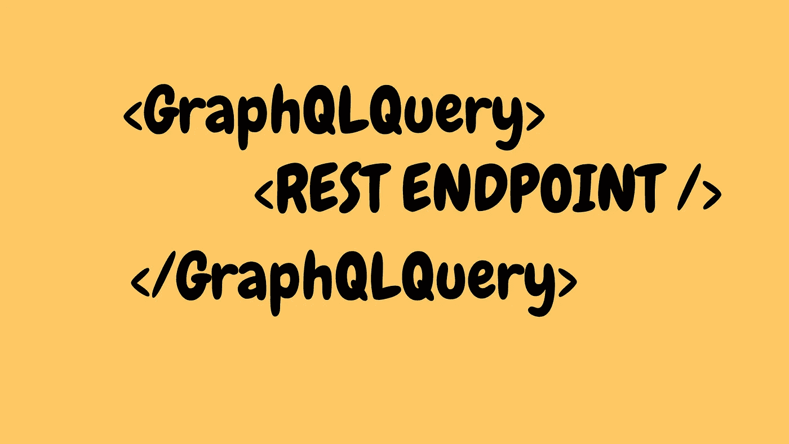
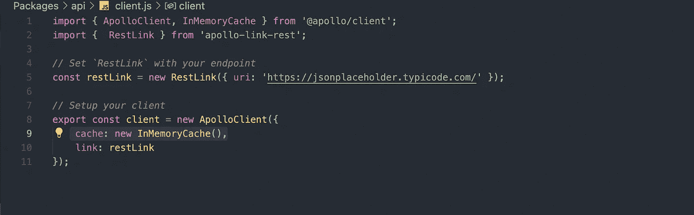

# 在 GraphQL 查询中调用 REST API

> 原文：<https://javascript.plainenglish.io/calling-rest-api-inside-graphql-queries-e715c0f2da44?source=collection_archive---------6----------------------->

您不需要将后端从 REST 切换到 GraphQL。获取 GraphQL 中的 REST 查询。



[iHateReading](http://ihatereading.in/creativity)

我相信 GraphQL 将成为在前端获取数据的未来。GraphQL 有许多优点，我个人最喜欢的一个优点是后端和前端的解耦，使用 GraphQL，我们可以将后端和前端视为一个独立的实体，这有助于两个实体无中断地独立存在。

# **问题**

GraphQL 是脸书在 2015 年公开发布的，REST API 很早以前就可以使用，所以今天，那些想将后端升级到 GraphQL 的公司不会那么容易。此外，GraphQL 目前只在 apollo 服务器上运行，转移服务器和架构需要几个月甚至一年的时间(显然取决于存储库的大小)。我觉得执行这一重大转变是不可行的，它还会导致公司在业务环境中陷入困境。

# **备选方案**

Apollo GraphQL 确实理解这个问题，所以他们提出了一个包装器的解决方案。他们创建了一个 npm 包，在 REST 端点上提供了一个 GraphQL 的包装器，所以我们只需用 GraphQL 包装器包装一个 REST 端点，并对我们的 REST API 进行 GraphQL 查询。听起来很有趣，我们只是不需要改变后端架构和框架，在前端，我们将对 REST 端点进行 GraphQL 查询。

# **我的经历**

我正在为一个加密货币交易应用程序制作图表。我用的是一个名为“[***victor-native***](https://formidable.com/open-source/victory/docs/native/)****【react-native】***的库。到目前为止，整个图表已经开发出来了，我们面临的唯一问题是我们的图表有点慢，用户互动时间滞后了一秒钟。对问题进行调试后，我们找到了问题原因，*

***问题** —我们是一个用户，为一个图表获取大量数据，但是为了创建一个图表，你只需要一个特定点的两个值(x 轴值和 y 轴值)。*

*我想到的唯一解决方案是创建一个新的 API 端点，它将只返回图表所需的数据，但是要执行这个更改，我必须联系**后端开发人员**加上我们的**工程师经理**并向他们推销这个想法，这似乎是一个相当耗时的过程。我们发现的另一种方法是将 API 请求作为 GraphQL 查询，我们将只获取所需的数据。最后，在阅读了成吨的文章，观看了一些 **Youtube** 视频之后，我们已经通过 Apollo 本身得到了这个包，以便对 REST endpoint 进行 GraphQL 查询。*

# *阿波罗-链接-休息*

*Apollo 提供了一种用 GraphQL 包装器包装 REST 端点的方法。该解决方案有以下好处:
您所在的前端开发团队希望尝试 GraphQL，而不要求后端团队实现 GraphQL 服务器。*

*   *您无权更改后端，因为它是一组现有的 API，可能由第三方管理。*
*   *您已经有了一个现有的代码库，但是您正在考虑评估 GraphQL 是否能够满足您的需求。*
*   *您有一个很大的代码库，GraphQL 迁移正在后端进行，但是您想立即使用 GraphQL*！**

```
****Package:** apollo-link-rest** 
```

*****Apollo-link-rest***包接受 REST 端点 URL 作为参数，并返回作为包装器的 GraphQL 客户端。**

# ****执行****

**我们需要一个具有***Apollo-link-RES***t 的对等依赖包来执行。最重要的包是 **"@apollo/client"** ，这个 javascript 库帮助您编写 GraphQL 查询，使用 GraphQL 获取、更新和修改应用程序的数据。运行以下命令安装所需的包。**

```
****yarn run @apollo/client apollo-link-rest** **graphql qs****
```

**在安装了上述软件包之后，我们将把 GraphQL 查询与 REST 查询分离开来。我们将在包内创建一个名为“GraphQL”的单独文件夹，并使用一个示例 **GET REST API** 在前端获取数据，但使用 graphQL 查询。**

# ****终点****

**我们将使用的示例 GET 端点如下-**

```
**[https://jsonplaceholder.typicode.com/users](https://jsonplaceholder.typicode.com/users)**
```

**该端点将以对象数组的形式返回用户列表。数组中的每个对象都是具有键值对的 JSON 对象。每个对象看起来都如下所示:**

```
**const singleUser = { 
  id: string,
  username: string,
  email: string,
  phone: string,
  Website: string,
  adddress: {
    street: string,
    city: string 
  },
  company: {
    name: string
  }
}**
```

**我们的主要议程是只从查询中获取所需的数据(键值对)。例如，我们只需要 id、电子邮件、用户名和公司名称作为键值，所以我们将使用 GraphQL 获取所需的唯一数据，而不是使用 REST 获取整个数据。**

# **假设**

**我假设，您对 GraphQL 查询以及我们如何在前端编写 GraphQL 查询有一点了解。**

# **执行**

**在包内创建一个单独的文件夹后，我们将为 GraphQL 查询定义客户机。该客户端将接受查询参数。我们在 client.js 中的客户端看起来像这样**

```
**import { ApolloClient, InMemoryCache } from '@apollo/client';
import {  RestLink } from 'apollo-link-rest';*// Set `RestLink` with your endpoint* const restLink = new RestLink(
      { uri: 'https://jsonplaceholder.typicode.com/' }
);*// Setup your client* export const client = new ApolloClient({
   cache: new InMemoryCache(),
   link: restLink
});**
```

****

**client.js**

**我们已经使用 restLink 构造函数创建了 **restLink** ，该构造函数将接受 URL 作为参数。使用 ApolloClient 构造函数，我们将 URL 作为链接传递，其值作为键-值对传递。这是我们 GraphQL 的基本客户端。**

**这个客户端类似于获取对象，如果你已经在前端使用获取包。将其视为使用 **fetch** 包在前端发出请求，在其中我们将 body 作为参数传递，类似地，在 GraphQL 中，每个请求都是 POST，因此我们需要将 GraphQL 查询作为参数传递给我们的客户端对象。**

# ****写作查询****

**GraphQL 将每个 API 请求都视为 POST 方法，在 GraphQL 中没有称为 GET request 的术语。在幕后，GraphQL 将其 API 称为查询或变异。你可以像下面这样映射它们-**

```
**GRAPHQL => REST API
 Query => GET request in REST API, 
 Mutation => POST, PUT, DELETE, UPDATE request in REST API**
```

**我们的第一个查询将包含路径、查询类型和发出请求所需的主体数据。此外，我们需要在 GraphQL 查询中提到“@rest”构造函数来告诉我们的**客户端**我们正在对我们的 rest 端点进行 GraphQL 查询。**

```
**import { gql } from '@apollo/client';
export const usersQuery = gql`
 query User {
  users @rest(type: "User", path: "users"){
   id,
   username,
   email,
   company {
     name
   }
  }}
`;**
```

## ****映射内容****

*   ****查询** = >请求的类型(枚举["查询"，"突变"])**
*   ****用户** = >请求的名称(可以是任何名称，但不要使用大写字母)**
*   ****用户** = >数据将使用 this(users)作为“**键”**返回**
*   ****@rest** = >操作符通知我们的客户端我们发出请求的方式(在我们的例子中，我们必须使用@rest，因为我们正在向 rest 端点发出 GraphQL 请求)**
*   ****路径** = >到端点的路径**
*   ****{ id，用户名，邮箱}** = >在 API 的响应中提到我们在前端需要的数据结构**

# ****获取数据****

**现在，我们的客户端对象就像一个样本获取方法，它将使用查询作为主体参数发出请求，并且我们的客户端确实需要将**查询** **对象**作为值，将**查询**作为键。**

```
**const **apiRequest** = client.**query**({ query: **queryObject** })**
```

*****API request***如果你的控制台是一个**的承诺**，那么我们只需要使用。**然后**和。**捕捉**方法来获取我们的 REST 端点返回的数据。**

```
**client.**query**({ query: **userQuery** }).then(response=> {
   console.log(response.data.**users**)
}).catch(error => console.log('error', error)**
```

# ****结论****

**我个人喜欢这个包装器，它让前端的一切变得如此简单，而不需要改变后端的技术堆栈。如果你真的想为你的团队添加一个 GraphQL 作为新的技术栈，那么这是最好的方法。**

**直到下一次，祝大家愉快**

```
**Repository => [https://github.com/shreyvijayvargiya/iHateReadingLogs/tree/main/TechLogs/GraphQLWithRESTAPI](https://github.com/shreyvijayvargiya/iHateReadingLogs/tree/main/TechLogs/GraphQLWithRESTAPI)**
```