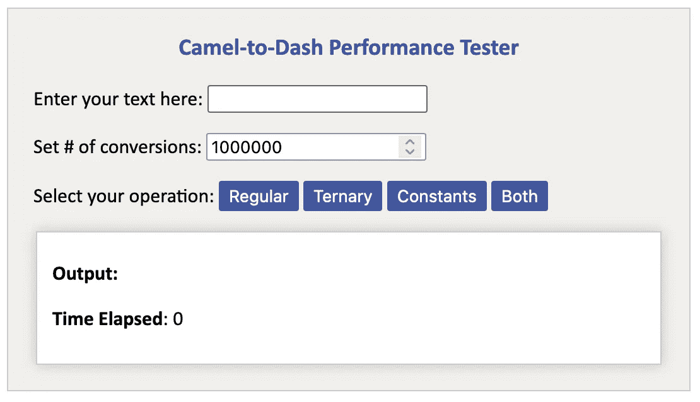
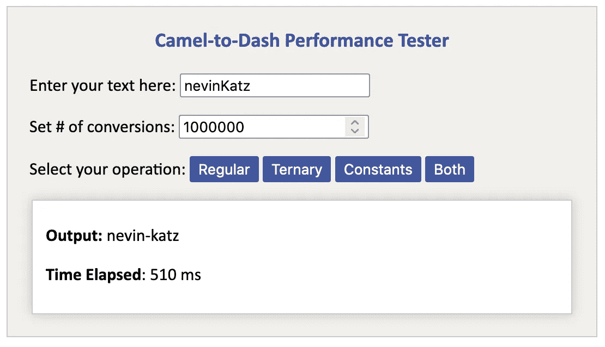

# Camel 案例回顾:优化 JavaScript 中的字符串转换

> 原文：<https://javascript.plainenglish.io/camel-to-dash-revisited-optimizing-a-javascript-string-conversion-df6610dc6804?source=collection_archive---------17----------------------->


Image provided by [vectorjuice](https://www.freepik.com/vectorjuice) on [freepik.com](https://www.freepik.com)

你好，谢谢你过来。如果您来到这里是因为想学习更多关于 JavaScript 和性能测试的知识，那么您来对地方了。在之前的一篇文章中，我们仔细检查了一段代码，这段代码将一个用 camelCase 编写的字符串翻译成 dash 语法中的等价字符串。

A code snippet

例如，这个函数会将 JavaScript 对象上的`dataTarget`转换成 DOM 元素上的`data-target`。我们深入了解了这一功能的复杂性，总体来说玩得很开心。

当我骄傲地喝着咖啡，欣赏这篇完成的文章时，我注意到了另一位作者 Jason Knight 的评论，他指出了一些低效之处，并提出了一些优化代码速度的方法。

事实上，虽然上面的函数完成了工作，但是它可能没有它应该完成的速度快，尤其是如果您必须多次运行它的话。所以我做了一些测试，看看不同的方法是否能让字符串转换运行得更快。

除了上面的函数，我还尝试了 Jason 建议的另外两个函数:一个使用三元运算符，另一个使用预定义的常数。作为第四种方法，我尝试了一个既有三元运算符又有预定义常数的函数。

对于每个测试，我运行给定的函数一百万次。为什么？因为当运算数量增加时，算法效率的差异通常会变得更加明显。

为了测量速度，我在每个百万函数循环的开始和结束时使用了 JavaScript 的`performance.now()`方法来测量所用的时间。

我的预测是，这两种方法——三元运算符和预定义常数——都会带来明显更好的性能。我还觉得在一个函数中同时使用这两种方法会给我们带来最快的结果。让我们看看我是不是对的。

# 该测试设备

我首先设置了我的测试设备，在那里我可以测试四种不同的字符串转换方法。如您所见，默认行为是运行给定的方法一百万次。



下面是输入`nevinKatz`的结果。我们可以看到，将它转换成`nevin-katz`花了 510 毫秒，或者半秒多一点。



您可以在下面的代码栏中试用这个小工具。

下面是底层标记。

The HTML markup for the tester.

我将在最后讨论 CSS，但是首先，让我们关注测试、逻辑、结果以及我是如何解释它们的。

# 测试

我的目标是比较四个不同的 camel-to-dash 函数将`nevinKatz`转换为`nevin-katz`一百万次所花费的时间。下面是四个函数。

*   `regular`，就是我上面用的那个。
*   `ternary`，使用三元运算符代替 if/then。
*   `constants`，使用预定义的常量。
*   `ternary_and_constants`，两种手法都用。

对于我的 CodePen 测试，我创建了一个名为`converter`的对象来保存这些测试函数。

```
let converter = {};
```

因为这些函数被附加到`converter`对象上，所以它们也可以被称为`methods`。让我们更详细地检查一下。

## 正则函数

我首先添加了我在上一篇文章中使用的函数，这次命名为`regular`。

The original camel-to-dash function, this time as a method attached to the converter object.

## 三元运算符

下面是带有三元运算符的函数。问题是删除`if`语句是否会带来一些开销。

The ternary function.

## 预定义常数

下面是我们的`constants`函数以及它使用的三个预定义常数:

*   `camelToDashRx`存储匹配大写字母的正则表达式`/[A-Z]/g`。
*   `camelToDashFn`添加破折号并将字母改为小写。
*   `camelToDash`获取字符串中的每个大写字母，并通过`camelToDashFun`运行每个字母，添加破折号并使其小写。

A conversion function that uses constants.

## 带常数的三元

下面是同时使用三元运算符和预定义的`camelToDash`函数的方法，该函数被初始化为常量。

A function that uses both the ternary operator and the predefined camelToDash function.

# 测试逻辑

下面是程序启动时运行的测试逻辑。如您所见，我们为每个按钮添加了一个`click`监听器，按钮的`data-func`属性用于标识要调用的函数。

你可以看到我从输入框中拉出了`num-ops`，函数被调用了这个次数。对于这次行动，我只是把数字留在 100 万。

下面是做繁重工作的循环，前后都有时间检查。在循环中，注意括号语法被用来访问`converter`上选择的函数。

```
let start = performance.now();for (var i = 0; i < num_ops; ++i) {                                         
     output = converter[func](str);                                  
}
let end = performance.now();
```

我们在后面的函数中找到了`end`和`start`之间的差异来计算所用的时间。

```
let time_diff = parseFloat(end - start);
```

我承认`time_diff`会考虑到`for`循环产生的任何开销，但是我相信对于四个函数中的每一个来说，任何开销通常都是相同的。

# 结果

我注意到的一件事是，任何函数在页面刷新后直接运行时，平均运行时间都要长一些。如果我刷新页面并运行一个初始函数，那么它之后的任何函数都会运行得更快。

## 刷新后测试

下面是每个函数在页面刷新后直接启动时所用的平均时间(以毫秒为单位)，换句话说，在它们之前没有其他操作发生。对于每个功能，平均时间是通过 20 次试验计算的。

```
regular: 522 ms
ternary: 520 ms
constants: 509 ms
ternary with constants: 508 ms
```

## 后续功能测试

以下是运行之前的操作后触发每个功能所花费的平均时间。例如，我会刷新页面并按一次“常规”按钮。随后，我又按了 20 次同样的按钮，记录下每次按下的时间。

```
regular: 180 ms
ternary: 181 ms
constants: 176 ms
ternary with constants: 176 ms
```

# 外卖食品

基于这个数据，使用三元运算符代替`if`语句导致转换运行速度平均快了 2 毫秒。在随后的函数测试中，三元函数平均运行慢了 ms。在这两种情况下，意义都是值得怀疑的。

另一方面，使用预定义的常数会导致更显著的性能提升。平均而言，在刷新后测试中，`constants`函数比`regular`函数快 13 毫秒，比`ternary`函数快 11 毫秒。在随后的功能测试中，它比`regular`快了 5 ms，比`ternary`快了 6 ms。

`ternary with constants`函数可能稍微受益于三元运算符，因为它在刷新后测试中比`constants`快 1 ms。然而，在随后的功能测试中没有任何变化。

我的主要观点是，如果你想提高性能，预先定义那些字符串函数和正则表达式。字符串操作开销很大，因此只定义一次字符串操作有助于优化代码。三元运算符的附加值更值得怀疑，因此我现在还不能说我的预测是正确的——与其说三元运算符和预定义常数都提供了性能提升，倒不如说常数似乎真的有很大的不同。

尽管如此，这只是在一台笔记本电脑上的一种浏览器(Firefox)上运行的 CodePen 上的一个非常小的数据集。因此，需要收集更可靠的数据来证实或反驳这些结论。

# 器械类型

为了更加美观，下面是 CSS，以防你想创建一个看起来像这样的测试设备。

The tester CSS.

# 后续步骤

如果您想更深入地研究这个性能测试示例，下面是您可以尝试的一些附加步骤。

*   试着在同一个 CodePen 上运行你自己的测试，看看你的数据和我的相比如何。
*   修改您运行每个函数的次数，并查看它如何影响您的数据。
*   如果您输入一个包含更多大写字母的更长的字符串，函数将花费更长的时间。尝试用更长的单词进行额外的测试，看看这种趋势是否持续。
*   分叉 CodePen 并修改它，这样您就可以对您感兴趣的函数运行一些性能测试。
*   如果你尝试以上任何一种测试，请在下面的评论中告诉我你的发现。
*   在介绍“常规”camelCase to dash 语法函数的文章中了解更多信息。

[](/from-camel-case-to-dash-syntax-in-javascript-c685206ee682) [## JavaScript 中从骆驼大小写到破折号的语法

### 仔细看看一个概念丰富的代码片段。

javascript.plainenglish.io](/from-camel-case-to-dash-syntax-in-javascript-c685206ee682) 

我希望你已经发现这些非正式测试的结果是有趣和有帮助的。

# 承认

非常感谢 [Jason Knight](https://deathshadow.medium.com/) 提供了如何优化这段代码的建议。我感谢他提供了三元运算符转换函数、常数相关转换函数和常数表达式的语法，以及促使我撰写本文的一般反馈。此外，他对为什么特定类型的语法可以使包含字符串操作的函数运行得更快有一些有用的见解。

*更多内容看* [***说白了. io***](http://plainenglish.io/) ***。*** *为无限制访问我的文章，考虑* [***加盟中***](https://medium.com/@nevkatz/membership) ***。***