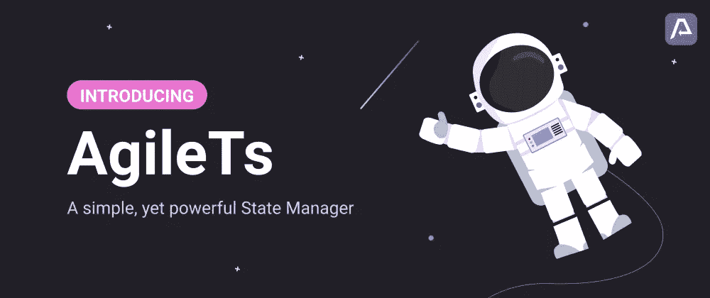
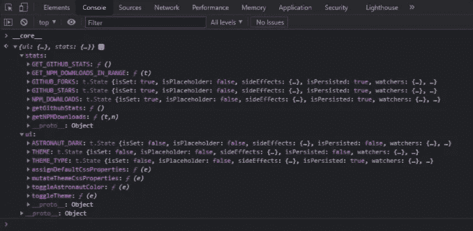
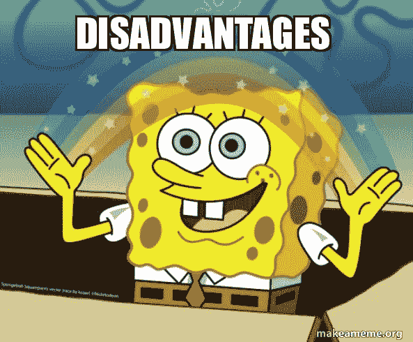

# 引入 AgileTs:全球状态管理还能比这更简单吗？

> 原文：<https://javascript.plainenglish.io/can-global-state-management-get-more-straightforward-than-this-a6db6abeeaf?source=collection_archive---------9----------------------->



最难解决的问题之一，尤其是在大型前端应用程序中，是管理全局状态。虽然已经有几种解决全局状态管理问题的优秀方法，但大多数都与特定的工作流相关联。您经常被迫在一个真实来源的存储对象中定义所有的东西，这降低了灵活性和简洁性。但是，您是否考虑过将您的状态作为全局个体(`atoms`)进行管理，这些个体可以根据偏好进行结构化，并动态绑定到任何 UI 组件以进行反应？

我非常兴奋地向您介绍 [AgileTs](https://agile-ts.org/) 。**一个简单、灵活、测试良好的 JavaScript/TypeScript 应用程序状态管理库。** AgileTs 支持直接创建单独和独立的状态(`createState("Hello World");`)，同时提供了一个强大的工具集，专注于围绕这些状态的开发人员体验。

将全局状态作为个体来管理所提供的灵活性使得 AgileTs 对两者都适用，开发人员构建更小的应用程序([风格指南](https://agile-ts.org/docs/style-guide#-inspiration-1))会担心写太多样板代码。对于创建大型应用程序的团队来说([风格指南](https://agile-ts.org/docs/style-guide#-inspiration-2))试图创建可读、可维护和可测试的代码。

在我们深入一个小例子之前，应该注意到没有“完美的”管理全局状态的方法。每种状态管理方法都有**的好处**和**的弊端**。根据您正在构建的应用程序类型和您偏好的代码风格，您应该权衡哪种状态管理库最适合您的需求。**稍后将详细介绍 AgileTs 的优点和缺点。**

# 👨‍💻React 和 AgileTs 入门

让我们看看 AgileTs 如何与 React 一起工作。为了展示它的基本功能，我将向您展示如何使用 AgileTs 和 React 构建一个简单的应用程序。我们将看到的示例项目是一个小计数器，当我们单击“更新状态”按钮时，它允许我们增加一个数字。这可能并不吸引人，但是它展示了 React + AgileTs 应用程序的所有基本部分。

## 1️⃣装置

安装 AgileTs 就像安装任何其他 npm 软件包一样简单。首先，让我们使用`npm`或`yarn`来安装它。为了在 React 环境中正确使用 AgileTs，我们需要在现有的 React 应用程序中添加两个不同的包。

**📁@agile-ts/core**

```
npm install [@agile](http://twitter.com/agile)-ts/core 
```

`[core](https://agile-ts.org/docs/core)`包包含了敏捷的状态管理逻辑，因此提供了强大的类，比如`[State Class](https://agile-ts.org/docs/core/state)`。

**📂@agile-ts/react**

```
npm install [@agile](http://twitter.com/agile)-ts/react
```

另一方面， [React 集成](https://agile-ts.org/docs/react)是一个 React 接口，并提供有用的功能，如`[useAgile()](https://agile-ts.org/docs/react/hooks#useagile)`挂钩，以轻松绑定状态，从而对组件的反应性做出反应。

> 😎如果你想从头开始建立一个项目，你也可以使用 AgileTs 的官方`*create-react-app*`模板。
> 
> //JavaScript
> **npx create-react-app my-app—模板敏捷**
> 
> //TypeScript
> **npx create-react-app my-app—template agile-TypeScript**

## 2️⃣创建国家

```
const MY_FIRST_STATE = createState("Hello World");
```

成功安装 AgileTs 后，我们可以开始创建我们的第一个独立的 AgileTs 状态。实例化一个状态只需要调用`createState()`并指定一个初始值。在我们的例子中，我们将初始值“Hello World”赋给了 State。如果你想知道为什么我们要写大写的 AgileTs 状态。它有一个简单的优点。我们可以很容易地在我们的 UI 组件中区分全局和局部状态(参见 3️⃣).步骤

## 3️⃣将初始化状态绑定到反应组件

```
const RandomComponent = () => {
    const myFirstState = useAgile(MY_FIRST_STATE); // <-

    return (
        <div>
            <p>{myFirstState}</p>
        </div>
    );
}
```

这里(`// <-`)我们使用`[useAgile()](https://agile-ts.org/docs/react/hooks#useagile)`钩子将刚刚创建的状态绑定到 React 组件(‘random Component’)。这种绑定确保组件在状态`value`变化时重新呈现。`useAgile()`钩子返回当前`value`的状态。所以在我们的例子中，类似于“Hello World”。

## 4️⃣更新状态值

```
MY_FIRST_STATE.set(`Hello World ${++helloWorldCount}`);
```

为了给我们的小应用程序带来一些活力，我们在每次按下“更新状态”按钮时，借助状态的`.set()`函数来更新状态`value`。因此，我们按升序增加外部集合`helloWorldCount`。

## 😎所有东西放在一起

这里我们看到了完整的反例。

```
// 2️⃣ Create State with the initial value "Hello World"
const MY_FIRST_STATE = App.createState("Hello World");

let helloWorldCount = 0;
const RandomComponent = () => {
    // 3️⃣ Bind initialized State to the 'RandomComponent' for reactivity
    const myFirstState = useAgile(MY_FIRST_STATE);

    return (
        <div>
            <p>{myFirstState}</p>
            <button
                onClick={() => {
                    // 4️⃣ Update State value on Button press
                    MY_FIRST_STATE.set(`Hello World ${++helloWorldCount}`);
                }}
            >
                Update State
            </button>
        </div>
    );
}
```

如果你渴望了解更多关于 AgileTs 的知识，看看我们的[文档](https://agile-ts.org/docs/quick-start/react)。

# 👨‍💻开始使用[x]和 AgileTs

不幸的是，这篇博文不能涵盖如何在 React 之外的其他前端框架中使用 AgileTs，因为那超出了范围。然而，AgileTs 的核心原则在每个 UI 框架中都是相同的。唯一可能不同的部分是如何将状态绑定到 UI 组件以进行反应(步骤 3️⃣).

这里是每个已经支持的 UI 框架的代码沙箱，具有与上面 React 示例部分相同的`counter-example`:
-[React](https://codesandbox.io/s/agilets-first-state-f12cz)
-[React-Native](https://snack.expo.io/@bennodev/agilets-first-state)
-[Vue](https://codesandbox.io/s/agilets-first-state-i5xxs)

# ⚛️是一个“原子”国家管理者吗？

是的，AgileTs 遵循与“原子”状态管理库相同的模式，如[反冲](https://recoiljs.org/)。AgileTs 中的状态是单独创建的，位于 UI 层之上，同时它们可以动态绑定到任何 UI 组件(例如通过钩子)。在 AgileTs 中，状态不被称为原子，而是单个或单态。然而，与反冲的主要区别是敏捷不依赖于反应，可以在反应树之外使用，功能更丰富，对初学者更友好。

# 👍是什么让 AgileTs 如此特别？

在我们对 AgileTs 如何在 React 中工作进行了小范围的探索之后，我们已经了解了它的基本 API 和功能。所以让我们来谈谈到底是什么让 AgileTs 如此特别，以及使用它的一些好处。

## 🚅坦率的

```
// Update State value to 'hi'
MY_STATE.set('hi');// Undo latest State value change
MY_STATE.undo();// Check if the State value is equal to '{hello: "jeff"}'
MY_STATE.is({hello: "jeff"});// Reset State to its intial value
MY_STATE.reset();// Preserves the State `value`  in the corresponding external Storage
MY_STATE.persist();// Update State value in 200ms intervals
MY_STATE.interval((value) => value++, 200);
```

## 🤸‍灵活

在 AgileTs 中，状态被创建为彼此分离，并且具有独立的存在。可以把 AgileTs 状态看作是全局变量，可以根据需要构造，并动态绑定到任何 UI 组件。敏捷状态部分类似于 UI 组件，因为 UI 组件也只是嵌入在其他 UI 组件中的全局变量。


给定的灵活性有很多优点。然而，在任何地方初始化状态的能力可能会导致一个非结构化的、不透明的应用程序，它很快就会变得一团糟。为了帮助你不在那里结束，我们已经创建了一些[风格指南](https://agile-ts.org/docs/style-guide)，给你一些如何使用 AgileTs 构建前端应用程序的灵感。

## 🐻强大的国家扩展

基于基本 AgileTs 状态的功能，我们创建了更多有用的类，例如:

**👨‍🏫** [**计算状态**](https://agile-ts.org/docs/core/computed)

计算状态是一个强大的概念，它允许我们根据其他数据构建动态数据。为了避免不必要的重新计算，Computed 类缓存计算出的值，并且只在实际的依赖关系发生变化时才重新计算它。

```
const INTRODUCTION= App.createComputed(() => {
   return `Hello I am '${MY_NAME.vale}'.`;
});
```

一个 Computed 会神奇地跟踪所使用的依赖项(如状态),并在它的一个依赖项更新时自动重新计算。例如，在上面的代码片段中，当`MY_NAME`的当前值从‘Jeff’变为‘Hans’时，它会重新计算。

```
INTRODUCTION.value; // Returns “Hello I am ‘jeff’.”
MY_NAME.set(‘hans’);
INTRODUCTION.value; // Returns “Hello I am ‘hans’.”
```

[代码沙箱](https://codesandbox.io/s/agilets-first-computed-kisgr)

[**👨‍👩‍👧收藏状态**](https://agile-ts.org/docs/core/collection/)

当管理一组信息时，例如待办事项或用户列表时，收集状态很方便。集合是专门为遵循相同模式的`data objects`数组设计的。这些数据对象中的每一个都需要一个唯一的`itemKey`，以便以后正确识别。想象一个类似数据库表的集合，它存储一个曾经由 id ( `itemKey`)作为关键字的数据对象。

```
const JOKES = App.createCollection();
```

在上面的例子中，我们创建了一个存储笑话列表的集合。然而，没有笑话的笑话列表并不好笑。
那么让我们给新创建的笑话集添加一个有趣的笑话吧。

```
JOKES.collect({
  id: 1, 
  joke: "Why do Java programmers have to wear glasses?\n 
         Because they don't C#"
}, ['programming']);
```

我们刚刚添加的笑话属于“编程”类别。因此，我们把它归类到`programming`组。组允许我们轻松地将集合中的数据聚集在一起，作为一个项目键数组。

```
JOKES.getGroup(‘chucknorris’).output; // Returns Chuck Norris Jokes
JOKES.getGroup(‘programming’).output; // Returns Programming Jokes
JOKES.getDefaultGroup().output; // Returns All Jokes
```

[代码沙盒](https://codesandbox.io/s/agilets-first-collection-uyi9g)

## 🚀增强性能

AgileTs 通过批处理重新呈现作业和仅在实际绑定状态发生变化时重新呈现 UI 组件来确保性能优化。你可以更进一步，只将状态值的特定属性绑定到 UI 组件，或者使用内置的[代理功能](https://agile-ts.org/docs/react/hooks#useproxy)。

```
// Component re-renders only when ‘user.name’ mutates
const name = useSelector(MY_USER, (value) => value.name);
console.log(name); // Returns ‘jeff’// Component re-renders only when ‘user.age’ mutates
const user = useProxy(MY_USER);
console.log(user.age); // Returns ‘8’
```

## 🐞易于调试

AgileTs 还没有高级的开发工具。
但是，您可以将您的状态绑定到`globalThis`
并在浏览器控制台中轻松访问它们。

```
const MY_STATE = createState(‘jeff’);
const MY_COLLECTION = createCollection();globalBind(‘__core__’, {
 MY_STATE,
 MY_COLLECTION
});
```

这允许您在运行时预览和编辑全局绑定状态。例如， [AgileTs 文档](https://agile-ts.org/)的`core`是全局绑定的，以便更好地调试。



请注意，您应该避免将您的应用程序状态附加到**生产**中的`globalThis`上，因为这样第三方很容易干涉您的内部应用程序逻辑。因为 AgileTs 文档没有易受攻击的逻辑，所以`core`在生产中也是可访问的。因此你可以摆弄 AgileTs 文档`core`，例如，更新`NPM_DOWNLOADS`状态或者更新宇航员的颜色。

```
__core__.stats.NPM_DOWNLOADS.set(999999);
```

# 👎使用 AgileTs 的缺点？

像任何其他优秀的全球状态管理器一样，AgileTs 也有一些我们应该讨论的缺点。我们正在努力减少和摆脱这些。如果你对使用 AgileTs 有任何疑问，请在评论中告诉我。然后我可以把它们列在这里，甚至可以抵消它们😁。谢谢你的支持。



## 🐘大捆尺寸

大多数州经理都很轻量级，但这一个不是。AgileTs 有一个缩小的尺寸 [58.3kB](http://@agile-ts/core">https://bundlephobia.com/result?p=@agile-ts/core) (树摇 18kB)，和它的同伴相比相当重。然而，它提供了 100%的类型安全性、可预测的运行时、专注于开发人员体验的 API，以及更多回报。大的包大小并不意味着 AgileTs 会显著降低应用程序的速度。用下面列出的 AgileTs 压力测试说服自己:
- [大状态(反应)](https://codesandbox.io/s/agilets-large-state-pyo63)-[频繁更新(反应)](https://codesandbox.io/s/agilets-frequent-updates-5tprm)

我们还创建了一些[基准](https://github.com/agile-ts/agile/tree/master/benchmark)，在性能方面比较不同的状态管理方法。

## 🌍没有大型社区

AgileTs 直到现在(2021 年 7 月)
才正式发布，而且我还没有设法在图书馆周围建立一个社区。这主要是因为我认为 AgileTs 还不够好，不能给任何人看。但是，除了我在开发敏捷时学到的许多其他东西之外，我还学到了寻求反馈永远不会太早。😅

如果你想成为 AgileTs 社区的一员，不要犹豫，加入我们的[社区 Discord](https://discord.gg/T9GzreAwPH) 。在那里，你可以问任何与 AgileTs 或编程相关的问题，告诉我们你对 AgileTs 的看法或我们可以做得更好的地方。

## 🌲只有一个贡献者/维护者

这可能很奇怪，但是如果我(唯一的贡献者)被树或其他东西击中而死亡，AgileTs 将不再有维护者。我试图创建一个尽可能对贡献者友好的代码库。但是，如果没有人能够合并/发布这些变更，那么有多少人能够理解代码并修复可能发生的问题并不重要。

# ❓结论

总之，AgileTs 提供了一个简单而强大的 API，它专注于开发人员的体验，并且通过无需编写任何样板代码的可伸缩性来满足小型和大型应用程序的需求。因此，AgileTs 看起来是状态管理的一个很好的选择。虽然它不是轻量级的，但它通过批处理重渲染和提供基于代理的功能(如`[useProxy()](https://agile-ts.org/docs/react/hooks#useproxy)`钩子)来尽可能优化我们应用程序的性能。

最后，感谢您花时间阅读这篇文章。如果能在评论中听到你对 AgileTs 的看法，我将不胜感激。如果您有任何进一步的问题，请不要犹豫，加入我们的[社区 Discord](https://discord.gg/T9GzreAwPH) 或在我们的 [subreddit](https://www.reddit.com/r/AgileTs/) 上提问。我们渴望帮助。如果你喜欢 AgileTs 的概念或/和想要支持我们，请在 Github 上给我们一个⭐️(星星)并与你的朋友分享。谢谢你的支持😊

干杯🎉

*   Github: [https://github.com/agile-ts/agile](https://github.com/agile-ts/agile)
    - 网站: [https://agile-ts.org/](https://agile-ts.org/)
    - Discord: [https://discord.gg/T9GzreAwPH](https://discord.gg/T9GzreAwPH)
    - Twitter: [https://twitter.com/AgileTypeScript](https://twitter.com/AgileTypescript)
    - Reddit: [https://www.reddit.com/r/AgileTs/](https://www.reddit.com/r/AgileTs/)

*More content at* [***plainenglish.io***](http://plainenglish.io/)