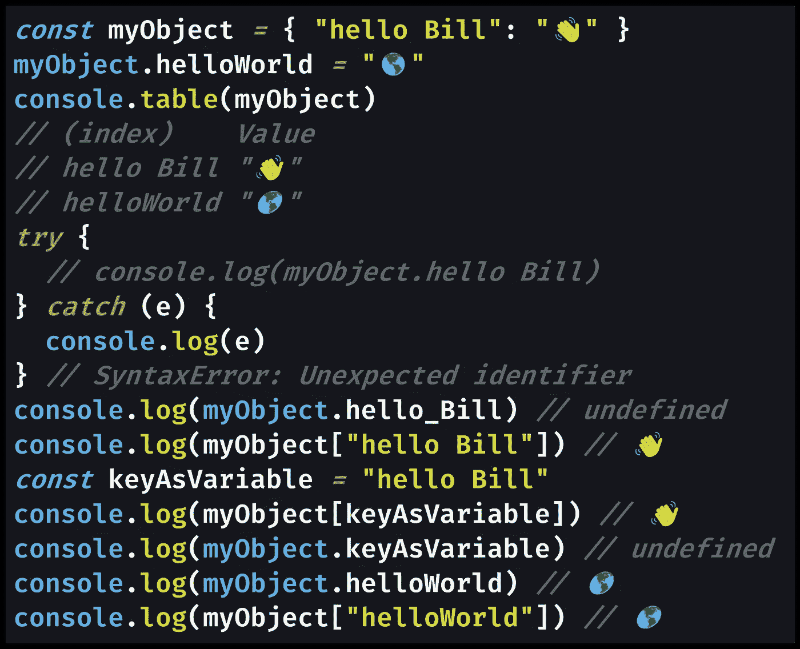
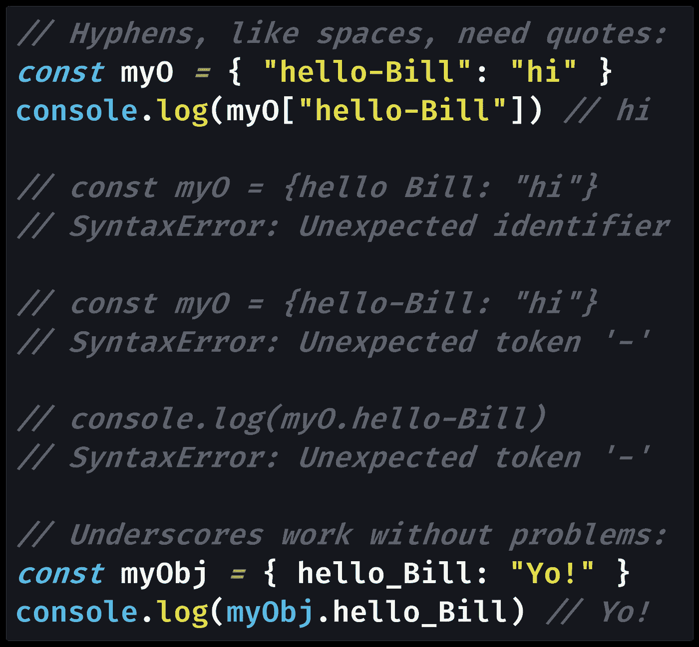

# JavaScript 对象键可以有空格吗？

> 原文：<https://javascript.plainenglish.io/can-javascript-object-keys-have-spaces-ed389758e5c3?source=collection_archive---------2----------------------->

## JavaScript 对象有一些有趣的规则，关于什么可以作为对象键，什么不可以。下面是关于空间的对象属性的内幕。


“Lost Angeles”: Valid JS object key? Or not? (Photo by [JOSHUA COLEMAN](https://unsplash.com/@joshstyle?utm_source=medium&utm_medium=referral) on [Unsplash](https://unsplash.com?utm_source=medium&utm_medium=referral))

JavaScript 对象是键值对的集合，其中每个对象键(也称为对象属性)都有一个特定的值。

对象键是[字符串](https://medium.com/javascript-in-plain-english/how-to-check-for-a-string-in-javascript-a16b196915ff)(或[符号](https://medium.com/p/30c3f294ea65)，但值可以是[所有不同类型的](https://medium.com/p/e34a4939befc)，包括[数组](https://medium.com/javascript-in-plain-english/how-to-check-for-an-array-in-javascript-6ad20f7a0e21)和[对象](https://medium.com/p/3b2632330296)。

如果需要使用任何一个[原语类型](https://medium.com/p/671909def6ca)(或者[对象引用](https://medium.com/p/131338898d7a))作为对象键，应该使用一个`[Map](https://medium.com/javascript-in-plain-english/are-javascript-object-keys-ordered-and-iterable-5147eedb26ce)`而不是一个对象。

我们通常使用 camelCase 编写 JavaScript 对象属性，不带空格，但是如果您愿意，也可以在键中使用空格。只是要确保包含引号来指定要用作对象键的字符串。

下面是一个包含空格的 JavaScript 对象键的代码示例，`myObject["hello Bill"]`:



[View raw code](https://gist.github.com/DoctorDerek/b73ce7c0e2762866a49a7f3847e9a086) as a GitHub Gist

您必须使用方括号`[]` [属性访问器](https://medium.com/p/5a1bfb4339c4)来访问带有空格的对象键，就像您将对象键存储为变量名一样。该示例显示了这两种情况。

dot `.`语法属性访问器不能处理包含空格的对象键，但是可以处理 camelCase 变量。

从这个意义上说，连字符大小写(也称为串大小写或串大小写)变量如`my-variable`的功能与带空格的对象键相同:你必须使用括号`[]`语法。

否则，JavaScript 认为连字符是减法运算符( `[-](https://developer.mozilla.org/en-US/docs/Web/JavaScript/Reference/Operators/Subtraction)`)，这不是我们想要的。

带下划线的变量(也称为 snake case 或 snake_case)的工作方式与 camelCase 相同，不会导致任何错误:



[View raw code](https://gist.github.com/DoctorDerek/b73ce7c0e2762866a49a7f3847e9a086) as a GitHub Gist

虽然 Bill 可能对在示例(`“Don’t box me in!” — Bill`)中成为`[undefined](https://medium.com/coding-at-dawn/how-to-check-for-undefined-in-javascript-bcedd62c8ad)`感到非常满意，但是在使用 JavaScript 对象键时，请注意您的空格&连字符。

否则，您可能会因为无效的属性名而以`[SyntaxError](https://developer.mozilla.org/en-US/docs/Web/JavaScript/Reference/Global_Objects/SyntaxError)`和`[ReferenceError](https://developer.mozilla.org/en-US/docs/Web/JavaScript/Reference/Global_Objects/ReferenceError)`结束。

当你写一个包含空格的对象键时，使用哪个引用字符有关系吗？(单引号`'`还是双引号`"`？)如果你不确定，可以看看我的文章:

[](https://medium.com/javascript-in-plain-english/the-real-difference-between-single-quotes-and-double-quotes-in-javascript-3d00bf720bcd) [## JavaScript 中单引号(' ')和双引号(" ")的真正区别

### JavaScript 中字符串应该用“”还是“”呢？答案让我大吃一惊:除了…

medium.com](https://medium.com/javascript-in-plain-english/the-real-difference-between-single-quotes-and-double-quotes-in-javascript-3d00bf720bcd) 

在现实世界中，您使用哪个字符作为字符串应该在您的[漂亮的](https://levelup.gitconnected.com/how-to-format-all-files-in-a-directory-with-prettier-5f0ff5f4ffb2)配置文件中设置:`[.prettierrc](https://prettier.io/docs/en/configuration.html)`可能会以 JSON 格式读作`{ "singleQuote": true }`。

对于`"singleQuote"`，`.prettierrc`中的默认值为 false，这意味着`"`是 Prettier 的默认设置:总是使用双引号。漂亮会自动格式化你的代码的基础上的偏好。(代码格式化提高了 Git 提交的一致性。)

您也可以在[您的 VS 代码设置](https://medium.com/better-programming/how-to-set-up-vs-code-like-a-pro-in-just-5-minutes-65aaa5788c0d)中配置更漂亮的:

[](https://medium.com/better-programming/how-to-set-up-vs-code-like-a-pro-in-just-5-minutes-65aaa5788c0d) [## 如何在短短 5 分钟内像专业人士一样设置 VS 代码

### 初学者指南

medium.com](https://medium.com/better-programming/how-to-set-up-vs-code-like-a-pro-in-just-5-minutes-65aaa5788c0d) 

由于您应该使用类似 Prettier 的代码格式化程序，这意味着如果您键入一个引号字符(`"`)，您将在格式化后自动获得另一个(`'`)——因此您键入哪个并不重要。

或者你可以使用反斜线文字```来创建一个带有空格的对象键，这将允许你使用[变量插值](https://thebittheories.com/the-3-advantages-of-backtick-literals-in-javascript-f6beade4a9cf):

[](https://thebittheories.com/the-3-advantages-of-backtick-literals-in-javascript-f6beade4a9cf) [## JavaScript 中反斜线文字(``)的 3 个优点

### 这些“奇特的字符串”插入变量，避免需要转义引号字符，并允许多行字符串…

thebittheories.com](https://thebittheories.com/the-3-advantages-of-backtick-literals-in-javascript-f6beade4a9cf) 

正如您可能知道的，如果在第一个示例中使用反斜线文字(`myObject[`hello Bill`]`)，不会有任何区别。

用空格创建对象键的最后一种方法是使用`[Symbol](https://doctorderek.medium.com/how-to-check-for-a-symbol-in-javascript-30c3f294ea65)`[原始数据类型](https://doctorderek.medium.com/how-to-check-for-a-symbol-in-javascript-30c3f294ea65)，这是除了我们已经讨论过的字符串之外设置对象键的另一种方法。

是的，您可以使用从包含空格的对象键字符串创建的`Symbol`，但是根据定义，每个`Symbol`都是唯一的，那么重点是什么呢？`myObject[Symbol("Hello Bill")]`是你当天的琐事。

# 对象键是字符串

回到正题，如果希望 JavaScript 对象键有空格，只需要记住使用字符串和`[]`方括号符号:`object["Yes, spaces!"] = "🚀🌌"`

带有下划线和 camelCase(无空格)的对象键不需要括号语法，但带有空格和连字符的对象键需要。

您可能更喜欢`.`点语法的代码可读性，在这种情况下，您会希望在对象键中避免空格:您可以将`object.lostAngeles`写成 camelCase，而不是带有空格的`object["Lost Angeles"]`。

因为你必须明确地使用字符串和`[]`来创建带有空格的对象键，所以像 Prettier 这样的代码格式化程序会为你决定使用哪一个引号……除非你更喜欢反斜杠。

我希望本教程已经帮助您理解了对象键和字符串之间的关系，以及为什么有时(比如空格)在 JavaScript 中指定对象键时需要使用引号字符。

**编码快乐！**🌌🛰🚀🚀🚀

[德里克·奥斯丁](https://www.linkedin.com/in/derek-austin/)博士是《职业规划 [*:如何在 6 个月内成为一名成功的 6 位数程序员*](https://www.amazon.com/dp/B0BRJDLJ43) 的作者，现在亚马逊上有售。