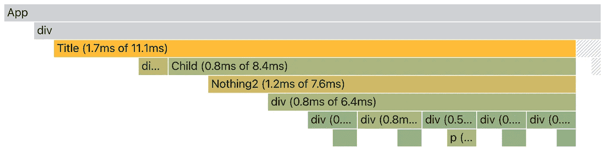
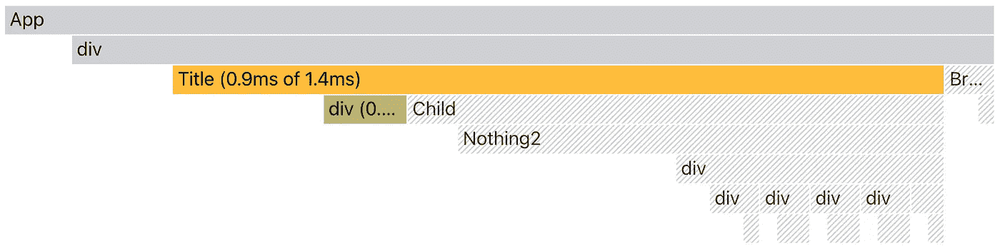
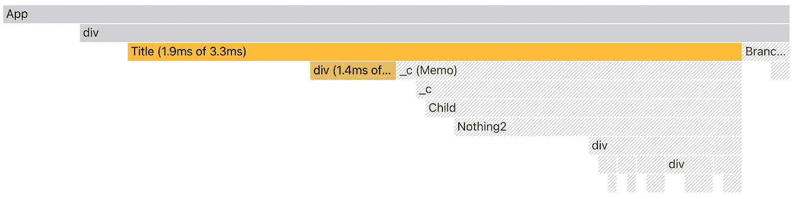

# React useMemo 可以用来跳过子渲染吗？

> 原文：<https://javascript.plainenglish.io/can-usememo-skip-a-child-render-94e61f5ad981?source=collection_archive---------4----------------------->

它不能，除非你知道什么是`useMemo`。

React 提供了一个开箱即用的优化引擎，只要它认为合适，就可以应用救助途径。而且大部分路径都是在幕后构建的，开发者都是口头知道的。有时我们会对使用某些功能产生错误的想法。

**什么是 useMemo？**

“memo”这个词给我们的感觉是使用了某种记忆模式。但是相反，如果你把一个任务叫做备忘录，那么编程本身就是一个巨大的备忘录引擎，这违背了使用这个词的目的。这样的话，React 也可以被称为一个巨大的备忘录，就像 fiberMemoizedReact，无论什么:)

开个玩笑，`useMemo`与任何经典记忆都没有关系，事实上它只是为了逃避一项任务。(检查文章， [React useMemo 不是经典的识记](/react-usememo-is-not-a-classical-memorization-432a21d28431))如果非要叫它 Memo，它存储的是之前的值。该死，任何变量不都是这样吗？

```
const a = useMemo(() => { return ... }, [a, b])
```

一个`useMemo`是一个单一的赋值语句替换，只在`a`或`b`改变时执行赋值。所以它可以用来跳过一些赋值。

## **救助一个孩子，失败了**

让我们看看这是如何相信它可以跳过一个子渲染。

```
const Title = () => { 
  const a = useMemo(() => {
    return "Hello World"
  }, []) return <Child a={a} />
}
```

挂载后会创建一个变量`a`，之后会存储一个原始的字符串值“Hello World”，所以从 Child 的角度来看，由于`a`不再改变，因此 Child 一直被保释。

这是真的吗？只有渲染父标题才能测试出来，不是吗？

```
const Title = () => {
  const [count, dispatch] = useState(0)
  const onClick = () => { dispatch(v => v + 1) } const a = useMemo(() => {
    return "Hello World"
  }, []) return (
    <>
      <Child a={a} />
      <div onClick={onClick}>{count}</div>
    </>
  )
}
```

我们添加了一个新的状态`count`和 dispatch，这样我们就可以在点击数字后触发渲染。

现在这个例子完成了，你真的认为这个孩子可以救助吗？



Child renders without a bailout with useMemo

上面的轮廓图确认了子渲染以及它下面的一切。您可能认为这有问题，但是这是 React 的默认设计。不仅如此，React 始终如一地做到这一点。

所发生的是，当标题在渲染后更新时，它协调所有的子元素，因此为子元素创建一对新的`props`。这将触发子渲染，而不管个人道具`a`是否改变。(查看文章，【React 如何基于变化进行渲染？)

那为什么大家会用`useMemo` for 呢？哈哈，这是用来跳过作业的，因为某个作业很重。在我们的例子中，我们只返回一个“Hello World ”,但它可能是一个搜索功能，可能需要 500 毫秒才能完成。如果我们能够限制赋值，我们可以节省相当多的时间，类似于 throttle 的想法，但是基于依赖关系的变化。

## 救助一个孩子，成功

这是不是意味着，我们不能用`useMemo`来救助一个孩子？有办法，但不是通过道具。请记住`useMemo`的设计目的，跳过任何格式的值的赋值。

让我们稍微修改一下救市法案。

```
const Title = () => {
  ... const child = useMemo(() => {
    return <Child a={"Hello World"} />
  }, [])return (
    <>
      <div onClick={onClick}>{count}</div>
      {child}
    </>
  )
}
```

在上面的代码中，我们创建了一个新变量`child`。它不是跳过道具的指定，而是跳过渲染的指定。

什么是`{child}`？

一个道具，不。

一种元素，是的。

父`<>`的一个`children`道具里面的一个元素，是的。

假设`<>`的`children`是一个元素数组，第一个是`div`，第二个是`Child`。上面的代码使第二个元素在挂载后保持与渲染相同的引用。



Child bails out with useMemo

现在你可以看到这个孩子做了紧急救助，由浅色阴影区域以及它下面的每一根纤维表示。可以修正孩子拿更多道具，让它更实用。

```
 const [d, ] = useState("Hello World") const child = useMemo(() => {
    return <Child a={d} />
  }, [d])
```

这就是这种方法的优点。我们能否救助一个孩子的控制权来自父母的决定。对于一个功能组件来说，一旦孩子开始渲染就为时已晚了，就像在`React.memo`中一样。

## 摘要

`useMemo`一般情况下不能救助任何东西，它只能跳过赋值。因此，为了使用它跳过渲染，它需要应用于渲染元素而不是道具。

**附录**

似乎可以根据依赖数组创建一个组件`Memo`来模拟救助。`Memo`是由`React.memo`根据对`useMemo`的理解做出的。

```
const Memo = React.memo(({ children, value }) => {
  return children
}, (prev, next) => prev.value === next.value)
```

现在我们可以这样使用它，

```
const Title = () => {
  ...
  return (
    <Memo value={a}>
      <Child a={a} />
    </Memo>
  )
}
```

如果`a`改变，子渲染，否则将子保释出来。



Child bails out with Memo component

有趣的是，依赖项内部的元素，比如`a`，会出现多次。但这是可以理解的，因为一个是在父节点指定的，一个是子节点需要的。

## 记忆孩子

如果这种方法有效，我们可以在更高阶的组件中将其一般化，以跳过对`children`道具的任何更改，同时响应所有其他道具。

```
import { memo } from 'react'const equalWithoutChildren = (prev, next) => {
  for (let k in prev) {
    if (k === 'children') continue
    if (prev[k] !== next[k]) return false
  }
  return true
}const memoChild = (Component) => {
  const Memo = memo(({ children, ...props }) => {
    return <Component children={children} {...props} />
  }, equalWithoutChildren) return Memo
}export default memoChild
```

那我们就可以用了。

```
const Child_ = memoChild(Child)const Title = () => {
  return (
    <Child_ a={a}>
      <Others b={b} />
    </Child_>
  )
}
```

所以现在如果`a`改变了，子组件得到一个渲染，独立于`b`或其他。

*更多内容尽在*[***plain English . io***](http://plainenglish.io)