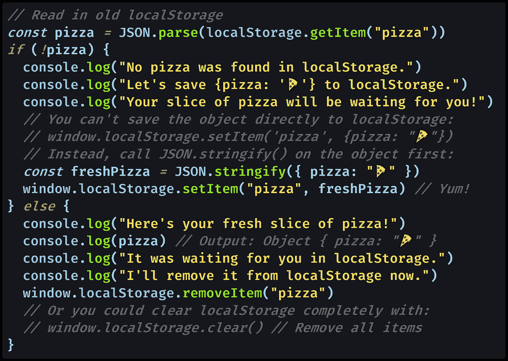

# 我们可以在 LocalStorage 中存储 JavaScript 对象吗？

> 原文：<https://javascript.plainenglish.io/can-we-store-javascript-objects-in-localstorage-b887181a7886?source=collection_archive---------9----------------------->

## 下面是如何在用户的 web 浏览器中的`localStorage`中存储一个 JavaScript 对象。本地存储也被称为 HTML5 `localStorage`、`window.localStorage`，或者浏览器的缓存。

Photo by [palesa](https://unsplash.com/@palesa08?utm_source=medium&utm_medium=referral) on [Unsplash](https://unsplash.com?utm_source=medium&utm_medium=referral)

# JavaScript 中的`localStorage`是什么？

当我们在 JavaScript 中调用`[window.localStorage](https://developer.mozilla.org/en-US/docs/Web/API/Window/localStorage)`时，我们能够存储持久保存在客户端浏览器上的数据，并且可以从运行在该浏览器中的客户端代码访问这些数据。

这意味着当用户离开网站，稍后再回来时，您的 JavaScript 代码可以从`window.localStorage`读取。

> "只读`**localStorage**`属性允许您访问`[Document](https://developer.mozilla.org/en-US/docs/Web/API/Document)`的[原点](https://developer.mozilla.org/en-US/docs/Glossary/origin)的`[Storage](https://developer.mozilla.org/en-US/docs/Web/API/Storage)`对象；存储的数据跨浏览器会话保存。”— [MDN 文档](https://developer.mozilla.org/en-US/docs/Web/API/Window/localStorage)

用户喜欢能够从他们离开的地方继续，尤其是不需要任何类型的帐户或登录。

除非用户清除缓存，否则即使浏览器关闭， `localStorage`中的数据也会在浏览器会话之间持续存在。

> `localStorage`与`[sessionStorage](https://developer.mozilla.org/en-US/docs/Web/API/Window/sessionStorage)`类似，只是存储在`localStorage`中的数据没有到期时间，而存储在`sessionStorage`中的数据会在页面会话结束时(即页面关闭时)被清除— [MDN 文档](https://developer.mozilla.org/en-US/docs/Web/API/Window/localStorage)

在私密窗口中，当最后一个私密选项卡关闭时，会清除`localStorage`数据，从而结束私密浏览会话。

> “`localStorage`中的键和值*始终为 UTF-16 `[DOMString](https://developer.mozilla.org/en-US/docs/Web/API/DOMString)`格式的* ，每个字符使用两个字节。与对象一样，整数键会自动转换为字符串。— [MDN 文档](https://developer.mozilla.org/en-US/docs/Web/API/Window/localStorage)

如果你熟悉使用[JSON](https://medium.com/swlh/what-is-json-used-for-in-javascript-programming-9d71284359a9)([JavaScript Object Notation](https://medium.com/swlh/what-is-json-used-for-in-javascript-programming-9d71284359a9))及其助手方法`[JSON.stringify()](https://medium.com/javascript-in-plain-english/how-to-use-stringify-and-parse-in-javascript-6b637b571a32)`和`[JSON.parse()](https://medium.com/javascript-in-plain-english/how-to-use-stringify-and-parse-in-javascript-6b637b571a32)`，那么你就知道如何在`localStorage`中存储一个对象:作为一个 JSON 字符串。

# 如何在`localStorage`中存储 JavaScript 对象

要在`localStorage`中存储 JavaScript 对象，您需要 [stringify 并将对象解析](https://medium.com/javascript-in-plain-english/how-to-use-stringify-and-parse-in-javascript-6b637b571a32)为 JSON 格式。

[View raw code](https://gist.github.com/DoctorDerek/6fe4fc06374953be46b496ea37fabded) as a GitHub Gist

一旦我用 stringify 将`pizza`对象转换成 JSON 字符串，我就用`[window.localStorage.setItem()](https://developer.mozilla.org/en-US/docs/Web/API/Storage/setItem)`将它添加到`localStorage`中。在示例中，我使用了字符串键`"pizza"`来存储对象。

为了稍后从`localStorage`中调用它，我使用`[window.localStorage.getItem()](https://developer.mozilla.org/en-US/docs/Web/API/Storage/getItem)`检索为`"pizza"`存储的 JSON 字符串，然后解析它。

要从`localStorage`中移除一个 JavaScript 对象，可以使用同一个字符串键(`"pizza"`)来调用`[window.localStorage.removeItem()](https://developer.mozilla.org/en-US/docs/Web/API/Storage/removeItem)`。

你也可以用`[window.localStorage.clear()](https://developer.mozilla.org/en-US/docs/Web/API/Storage/clear)`完全清除`localStorage`，这将移除所有项目。

如果您自己尝试这段代码，请确保您是在一个有域的站点上(而不是在浏览器窗口的一个新选项卡中)这样做的。

你也可以使用 Chrome DevTools 或 Firefox 的 Storage Inspector 工具通过[直接在浏览器内部检查`localStorage`。](https://developers.google.com/web/tools/chrome-devtools/storage/localstorage)

# JavaScript 中哪些对象是 JSON 安全的？

认识到有些类型的数据不能作为 JSON 字符串存储在`localStorage`中是很重要的。

大多数[原语类型](https://medium.com/p/671909def6ca)都是 [JSON 安全的](https://developer.mozilla.org/en-US/docs/Web/JavaScript/Reference/Global_Objects/JSON/stringify#Description):

*   [布尔型](https://medium.com/javascript-in-plain-english/how-to-check-for-a-boolean-in-javascript-98fdc8aec2a7)
*   [数字](https://medium.com/javascript-in-plain-english/how-to-check-for-a-number-in-javascript-8d9024708153)
*   [琴弦](https://medium.com/javascript-in-plain-english/how-to-check-for-a-string-in-javascript-a16b196915ff)

但是以下是无效的 JSON 值:

*   `[undefined](https://medium.com/coding-at-dawn/how-to-check-for-undefined-in-javascript-bcedd62c8ad)`
*   [功能](https://medium.com/javascript-in-plain-english/how-to-check-for-a-function-in-javascript-986248827790)
*   [符号](https://medium.com/p/30c3f294ea65)
*   `[Date](https://medium.com/p/efd87ecfea66)`物体
*   `[Infinity](https://medium.com/swlh/what-is-infinity-in-javascript-%EF%B8%8F-1faf82f100bc)`和`[NaN](https://medium.com/coding-in-simple-english/how-to-check-for-nan-in-javascript-4294e555b447)`变成了`[null](https://medium.com/javascript-in-plain-english/how-to-check-for-null-in-javascript-dffab64d8ed5)`

最后，包括`[Set](https://medium.com/coding-at-dawn/how-to-use-set-to-filter-unique-items-in-javascript-es6-196c55ce924b)`和`[Map](https://medium.com/p/5147eedb26ce)`的对象类型将只有它们的[可枚举属性](https://developer.mozilla.org/en-US/docs/Web/JavaScript/Enumerability_and_ownership_of_properties)被序列化为 JSON 格式。

可枚举属性是那些以典型方式直接分配给对象的属性，所以您的`Set`和`Map`在 JSON 格式中将是空的(`{}`)，除非您首先将它们转换成典型对象或数组。

[数组](https://medium.com/javascript-in-plain-english/how-to-check-for-an-array-in-javascript-6ad20f7a0e21)工作正常，在 JSON 中，它们将使用`[]`方括号来表示，而不是对象的`{}`花括号。

只要遵循其他规则，JSON 对象(包括数组)可以毫无问题地嵌套在彼此内部。

# Cookies 和`localstorage`一样吗？

虽然 [cookies](https://developer.mozilla.org/en-US/docs/Web/HTTP/Cookies) 和`localstorage`服务于相似的目的，即在用户会话之间持久化数据，但还是有一些关键的区别。

> “Cookies 和本地存储服务于不同的目的。Cookies 主要用于读取服务器端，而本地存储只能由客户端读取。”— [阿努姆·西迪基](https://medium.com/u/75c6291d11e7?source=post_page-----b887181a7886--------------------------------) [在他的媒体博客](https://medium.com/datadriveninvestor/cookies-vs-local-storage-2f3732c7d977)上

两者之间的另一个主要区别是大小:`localStorage`提供每个域高达 5MB(也称为“[源](https://developer.mozilla.org/en-US/docs/Web/HTTP/Headers/Origin)”)，如果用户清除浏览历史，它将作为浏览器缓存的一部分存储。

相比之下，cookies 通常为 4KB——没有足够的空间来存储很多数据，除了像用户认证令牌这样的东西。

这意味着虽然我们可以在`localStorage`中存储 JavaScript 对象，但我们不太可能在 cookies 中存储 JavaScript 对象。

不过，这是一个很大的技术差异，所以你可能会听到开发人员将`localStorage`称为 cookies，意思是“我们可以用 JavaScript 访问的特定于该用户的持久数据”

总之，我们可以使用 [HTML5](https://developer.mozilla.org/en-US/docs/Web/Guide/HTML/HTML5) 将 JavaScript 对象存储在`localStorage`中，只要我们的对象是 JSON 安全的。

**快乐编码！**🍕🍕🍕🍕🍕

德里克·奥斯汀博士是《职业规划:如何在 6 个月内成为成功的 6 位数程序员》一书的作者，该书现已在亚马逊上出售。