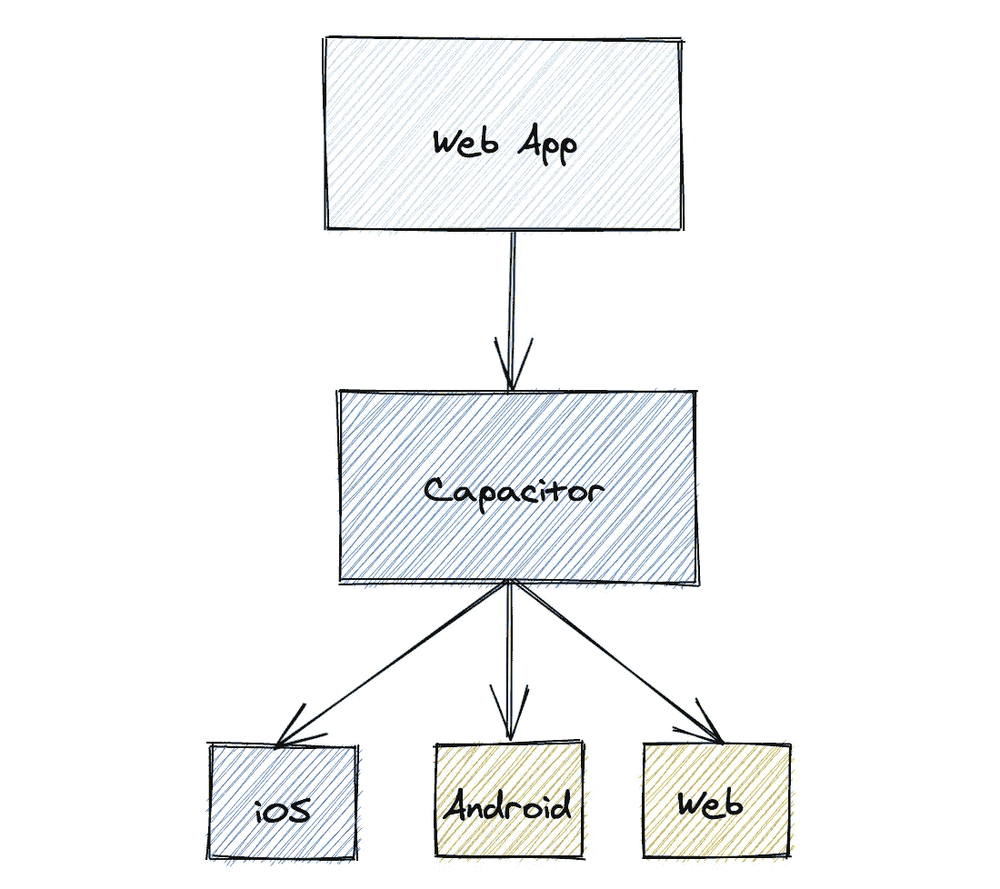
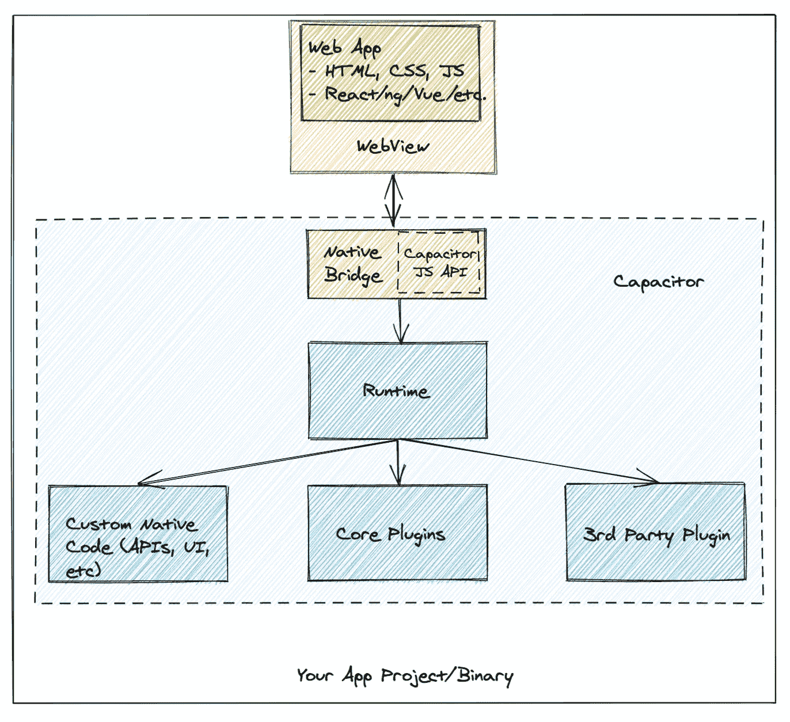

# CapacitorJS:把你的网络应用变成移动应用

> 原文：<https://javascript.plainenglish.io/capacitor-turn-your-web-app-into-a-mobile-app-4d114249e55b?source=collection_archive---------2----------------------->

## 如何通过 4 个简单的步骤，使用 capacitorjs 将您的网络应用转化为移动(Android/iOS)应用

作为一名 web 开发人员，最大的优势之一就是能够使用 web 技术创建移动和桌面应用程序，有时还能很好地访问本地 SDK。

也许你听说过 Ionic，这是一个流行的 JavaScript 框架，通过提供移动组件和对原生 SDK 的访问，使用 React、Angular 或 Vue 构建跨平台移动应用程序。

为了将 web 应用程序转换成移动应用程序，Ionic 团队开发了 [CapacitorJS](https://capacitorjs.com/) ，但它可以用于任何 web 应用程序项目，只要有 HTML 文件，Capacitor 就可以将其转换成移动应用程序。



# 什么是 CapacitorJS，它是如何工作的？

CapacitorJS 是 Apache Cordova 和 PhoneGap 的继承者。它是一个开源的运行时，允许你创建一个“跨平台*混合*移动应用”，它支持 Android 和 iOS。

它不会将您的代码转换成本地移动应用程序。相比之下，Capacitor 获取您的 web 应用程序代码，并使用 WebView 显示它(可以将它想象为一个只显示您的网站的浏览器选项卡)。



这个解释非常简单，如果你对电容器在技术方面如何工作的更多细节感兴趣，我建议阅读[他们的博客文章](https://capacitorjs.com/blog/how-capacitor-works)。

那么，我如何访问本地 API 呢？

通常，在 WebView 中显示一个网站并不能让你访问本地 API，比如通知、摄像头、文件系统等等，这就是插件发挥作用的地方。

通过使用[插件](https://capacitorjs.com/docs/plugins)，您可以轻松访问多个本地 API，而无需对您的代码库进行太多更改。电容器有一些官方插件，但是你可以找到更多的[社区插件](https://github.com/capacitor-community)。同样值得一提的是，大多数 Cordova 插件都可以很好地使用 Capacitor。

# 如何使用 CapacitorJS 转换您的 Web 应用程序

*要求:*

*   Node.js 版本 12 或更高版本
*   npm 或纱线
*   Android Studio(适用于 Android)
*   Xcode(适用于 iOS)

*注意:如果你不确定在 Android studio 中使用哪个 API 和/或仿真器版本，请安装最新版本。*

## 步骤 1:向项目中添加 CapacitorJS。

在项目的根文件夹中，运行以下命令。

```
$ npm install @capacitor/cli @capacitor/core
$ npm cap init
```

这将把 CapacitorJS 添加到项目的命令行界面中，并生成一个名为 *capacitor* 的配置文件。*配置*。 *json。*

## 步骤 2:更新配置文件

你可以在这个[文档参考](https://capacitorjs.com/docs/config)中找到所有你需要的关于配置文件的信息。

您现在可能需要更改的重要值是带有构建文件夹路径的`webDir`(确保它包含一个`index.html`)。

一般来说，你不需要担心这个，因为 init 命令可以猜测你正在使用哪个框架，并相应地设置`webDir`值。

## 步骤 3:安装本地平台

对于 Android:

```
$ npm install @capacitor/android
$ npx cap add android
```

对于 iOS:

```
$ npm install @capacitor/ios
$ npx cap add ios
```

**第四步:运行或构建你的应用**

现在，根据您运行的命令，您会注意到名为“android”和“ios”的新文件夹。您可以使用 Android Studio for Android 和 Xcode for iOS 打开这些文件夹。

运行应用程序的一个更快的方法是使用“运行”命令。

对于 Android:

```
$ npx cap run android
```

对于 iOS:

```
$ npx cap run ios
```

## 保持应用程序同步

当您更改 web 应用程序并构建它时，Capacitor 不会自动更新您的移动应用程序文件夹。为此，您需要使用 sync 命令。

```
$ npx cap sync
```

# 结论

CapacitorJS 是一个很好的工具。它是开源的，有很好的文档记录，并且简单易用。就我个人而言，我经常使用它，很少遇到任何问题。此外，您可以在不影响代码库的情况下使用它。

当然，你会得到一个混合应用，所以性能会低于原生移动应用。但是对于很多用例来说还是够用的，开发速度和维护上的增益非常重要。

*更多内容请看*[***plain English . io***](http://plainenglish.io/)