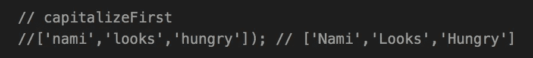
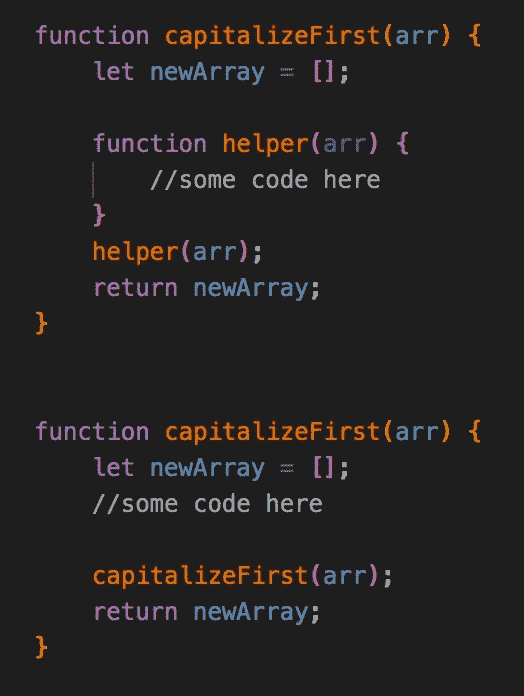
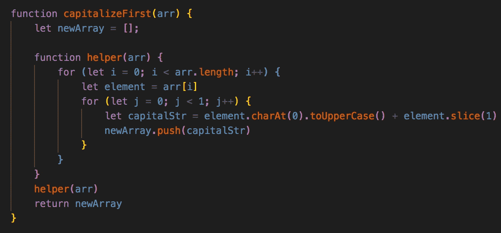

# 将数组中每个字符串的第一个字母大写:使用递归

> 原文：<https://javascript.plainenglish.io/capitalize-the-first-letter-of-each-string-in-an-array-using-recursion-5d6b6ead8c7?source=collection_archive---------6----------------------->

## 关于如何使用 JavaScript 中强大但令人困惑的递归方法解决这个有趣的算法问题的演练

在这里，我认为我的早期算法研究取得了不错的进展。

进入递归。即使是现在，学习递归感觉就像我每次到达英里标记时都被推回到同一场比赛的起跑线上。

Wait…wasn’t I just here?

如果在那个蹩脚的递归笑话之后你还在这里，感谢你没有放弃我。

然而，对于生活中的任何事情来说，没有什么比发展某项技能的舒适程度更好的了。希望有一天，递归会成为第二天性，就像去跑步或往杯子里倒水一样。

也许不是。但是一个人可以希望吗？

*在我们继续之前，对递归的工作原理有一个基本的了解是很重要的。这里有一个很好的资源可以让你了解更多，或者如果你需要快速复习:*[https://envo . app/what-is-recursion-a-recursive-function-explained-with-JavaScript-code-examples/](https://envo.app/what-is-recursion-a-recursive-function-explained-with-javascript-code-examples/)

# 问题是

好了，我们开始吧。我最近在我的研究中遇到了这个问题，要求如下:

*写一个名为 capitalizeFirst 的递归函数。给定一个字符串数组，将数组中每个字符串的第一个字母大写。*

在讨论代码之前，让我们先讨论一下我们的预期输出应该是什么。我们知道给了我们一个字符串数组，但是我们的输出应该是什么样的呢？假设我们得到了下面的字符串数组—如果问题要求我们大写数组中每个字符串的第一个字母*，我们的输入/输出应该是这样的:*

好——我们知道我们现在的目标是什么。快速浏览一下，我们可以确定我们需要以某种方式遍历字符串数组来访问数组中的每个元素(“nami”、“looks”、“hungry”)。一个用于循环的*应该能够完成这个任务。*

然而，我们需要更深入一层。如问题所述，我们希望将数组中每个字符串的第一个字母大写。我们必须找到一种方法来遍历每个单独的元素，一次一个字母，并在每次迭代中大写第一个字母。

虽然这不是最有效的方法，但我们可以在这里使用嵌套的 for 循环来解决更深层次的问题。在助手方法的帮助下，我们可以递归地解决这个问题。

# 方法

我们在上面勾画了我们计划的草图，但是让我们以一种更有条理的方式把它写下来。我会这样处理这个问题:

1.  创建一个新的数组，我们将每个新字符串的第一个字母大写。
2.  创建一个 helper 函数，它接受我们的数组，在这里我们将设置两个 for 循环。(*为什么要有辅助方法？很快会解释！*)
3.  在遍历每个字符串元素的嵌套 for 循环中，我们必须创建一个逻辑，将每个字符串的第一个字母大写，并将这个坏男孩放入我们的新数组中。
4.  调用我们的 helper 方法
5.  归还我们的新阵列

理解问题？
止。

了解我们的输入和输出？
检查。

理解我们的游戏计划？
止。

了解《权力的游戏》的结局？

…让我们继续。

# 为什么是辅助方法？

如果您一直在跟踪，您应该已经注意到我们将在我们的方法中使用一个 helper 方法，并且可能会问自己为什么。让我们继续创建我们的空数组，并说明以下要点:

在上面的截图中，我们有两个例子来说明我们如何递归地处理这个问题，一个有一个没有帮助方法。

让我们从没有 helper 方法的第二个例子开始。假设我们写出了一些代码，并将第一个大写的字符串放入新数组。然后我们递归地调用我们的函数，capitalizeFirst。

注意到发生了什么吗？当我们调用函数时，我们的 newArray 被重置回一个空数组，因此丢失了第一个大写的字符串！我们的函数将继续做所有的工作，把下一个大写的字符串放入数组，只是因为我们一直清空它，所以前一个字符串消失了。

这有点像学习新的东西，但随后忘记了以前学过的东西(可悲的是，这与我的小大脑产生了太多的共鸣)。

现在让我们看看第一个使用 helper 方法的例子。我们在 helper 方法之外设置我们的空数组，这样当调用 helper 方法时，推入新数组的字符串将在每次函数调用后被保存。

# 解决方案

因此，让我们建立两个 for 循环，以及首字母大写背后的逻辑。在做了一些谷歌搜索之后，我们可以使用的一种方法是使用内置的 charAt & toUpperCase 方法来隔离字符串的第一个字母，然后使用 slice 将剩余的字符添加到大写的字符串中。下面是它的样子:

出于可读性的考虑，我创建了一个名为 *element* 的变量，它将代表顶层循环中数组中的每个元素。

在我们的嵌套循环中，我们只需要迭代一次，因为我们只关心每个字符串的首字母大写。在每次迭代中，我们通过调用 element 上的 charAt(0)来分离第一个字母，它再次表示我们的每个字符串。charAt(0)获取我们的字符串的第一个索引，因此我们的输入数组的“n”、“l”和“h”([“Nami”、“looks”、“hungry”])，然后我们调用方法 toUpperCase()来简单地大写这三个字母中的每一个。最后，在每个字母在它们各自的迭代中被大写后，我们在我们的元素上调用 slice(1)，它返回我们的字符串的剩余部分*在*之后我们的大写字母(因此在我们的例子中，“ami”、“ooks”、“ungry”)，并将其添加到它们的大写字母中。

我们终于有了我们想要的输出，【“娜美”，“长相”，“饿了”】。这提醒了我，我应该喂娜美吃晚饭了。

# 结论

虽然这肯定不是最性感或最有效的方法，但在我目前的发展中，这是对我来说最有意义的方法。如果你和我一样，正在努力解决递归问题，那么没有什么比重复更好的了&接触更多可以递归解决的问题。

类似于其他算法问题，我们将开始注意我们的解决方案中的模式，以及我们如何使用类似的方法来回答其他类型的问题。在这种情况下，我们可以使用类似的方法来访问外部元素中的数据类型。

这就是了。请随意评论你的想法和/或你可能采取的其他方法。很想听听！

# 来源

Envo App:什么是递归？用 JavaScript 代码示例解释的递归函数
[https://envo . app/what-is-recursion-a-Recursive-Function-Explained-with-JavaScript-Code-Examples/](https://envo.app/what-is-recursion-a-recursive-function-explained-with-javascript-code-examples/)

*更多内容请看*[***plain English . io***](https://plainenglish.io/)