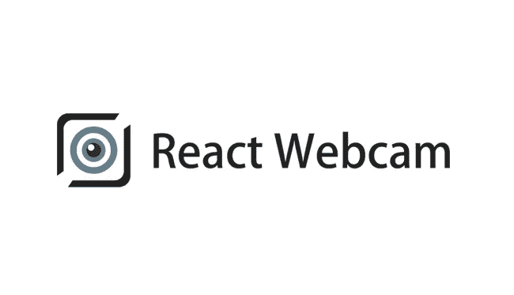
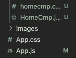
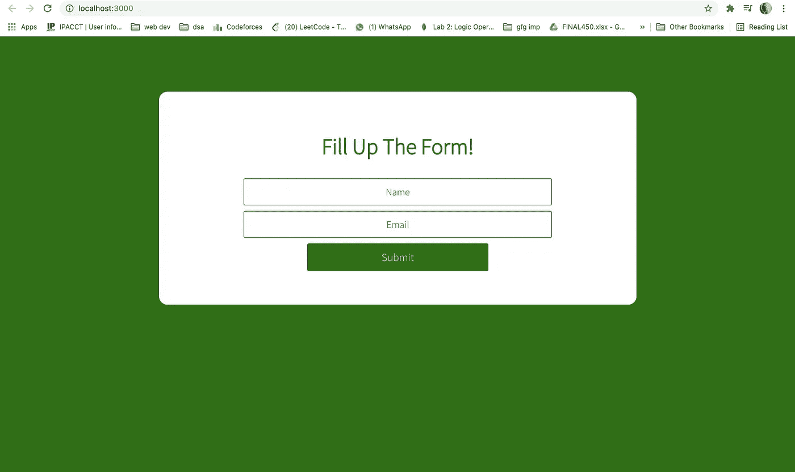
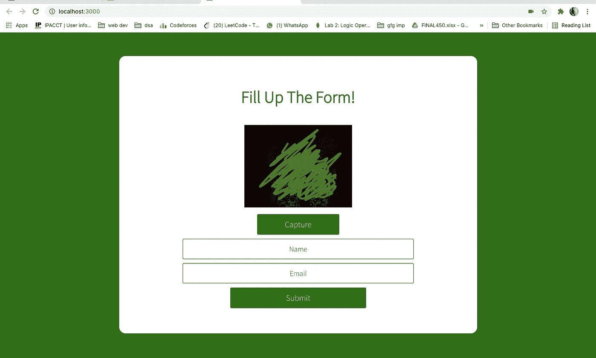

# 使用 React 网络摄像头捕捉图像

> 原文：<https://javascript.plainenglish.io/capture-images-via-webcam-using-react-9282bb87de5a?source=collection_archive---------0----------------------->



在这个故事中，我将分享通过网络摄像头捕捉图像。这将会非常有趣！那么，我们开始吧。

让我们在推特上连接— [链接](https://twitter.com/SRISTICHOWDHUR6)

[](https://twitter.com/SRISTICHOWDHUR6) [## JavaScript 不可用。

### 编辑描述

twitter.com](https://twitter.com/SRISTICHOWDHUR6) 

为了在 React 应用程序中实现**网络摄像头捕捉**特性，我们需要几个 Node.js 模块。

## 首先，我们需要一个叫做“反应-网络摄像头”的包。[看看这个](https://www.npmjs.com/package/react-webcam)

[](https://www.npmjs.com/package/react-webcam) [## react-网络摄像头

### 反应网络摄像头组件

www.npmjs.com](https://www.npmjs.com/package/react-webcam) 

要创建新的 **React 应用程序**，请使用您的终端并键入

1.  `npx create-react-app ***applicationName***`
2.  在合适的编辑器中打开应用程序。在这里，我将使用 ***VS 代码。***
3.  要让应用程序运行，在 VS 代码中打开一个新的终端。
4.  类型`***npm run start***` **。**
5.  这将在***localhost:3000***上打开您的浏览器

# 太好了，您已经运行了您的应用程序！

**源代码**将在[这里](https://github.com/Sristi27/React-webcam)可用。

通读这篇文章，然后在需要的时候获得源代码的帮助！

在我们设计网络摄像头组件之前，我将创建一个表单，该表单将接受一些细节以及通过网络摄像头捕捉的图像。



Folder Structure

在这里，我创建了一个名为 HomeCmp.jsx 的文件，还添加了一个名为 homecmp.css 的样式表

# 现在，让我们从 **HomeCmp.jsx 文件**开始。

*创建一个* ***基本表单*** *，带有输入元素，将* ***捕捉用户的图像和一些更多的细节。***

```
import React,{useState} from 'react'import { WebcamCapture } from '../Webcam/Webcam';import './homeStyles.css'const Home = () => {const [name,setName]=useState('')const [email,setEmail]=useState('');const submitForm = () =>{ alert("Form submitted")}return (<div className="home-container"> <div className="container"> <div className="text"> <h1>Fill up this form!</h1> <form className="form"> <input type="email" placeholder="Email" onChange={(e)=>setEmail(e.target.value)}/> <input type="text" placeholder="Name" onChange={(e)=>setName(e.target.value)}/> <button type="submit" id="login-button" onClick={(e)=>submitForm(e)}>Submit</button> </form> </div> </div></div>)}export default Home
```

一旦您开始在输入框中输入，输入字段中的值将被存储在钩子变量中。

如果不了解{useState}，可以在这里 了解一下 [**。**](https://reactjs.org/docs/hooks-state.html)

# 接下来，你可以给你的 JSX 文件一些样式！

在这里，你可以使用你的 **CSS 文件来设计你的 JSX 组件**。

添加到 CSS 文件的样式:

```
@font-face {font-family: 'Source Sans Pro';font-style: normal;font-weight: 200;src: url(https://fonts.gstatic.com/s/sourcesanspro/v14/6xKydSBYKcSV-LCoeQqfX1RYOo3i94_wlxdr.ttf) format('truetype');}@font-face {font-family: 'Source Sans Pro';font-style: normal;font-weight: 300;src: url(https://fonts.gstatic.com/s/sourcesanspro/v14/6xKydSBYKcSV-LCoeQqfX1RYOo3ik4zwlxdr.ttf) format('truetype');}.home-container {box-sizing: border-box;/* background-color: rgb(250, 193, 193); */background: #FBD3E9;  /* fallback for old browsers */background: linear-gradient(to left, #FBD3E9, #0e6e02);margin: 0;min-height:80vh;padding:60px 0;overflow: hidden;font-family: 'Source Sans Pro', sans-serif;}.home-container .container {max-width:60vw;margin: 0 auto;display: flex;padding: 0;background-color: white;border-left: 1px solid white;border-radius: 8px 0 0 8px;}.home-container .container h1 {font-size: 40px;color:#0e6e02;font-weight:600;animation: fadein 3s;margin-bottom:20px;}.home-container .container .text{width: 90%;padding:30px 0;text-align: center;margin:0 auto;}.home-container form {padding: 20px 0;position: relative;z-index: 2;width: 70%;margin:0 auto;}.home-container form input {-webkit-appearance: none;-moz-appearance: none;appearance: none;outline: 0;border: 1px solid #0e6e02;width: 55%;border-radius: 3px;padding: 10px 15px;margin:10px auto 10px auto;display: block;text-align: center;font-size: 18px;color: #0e6e02;transition-duration: 0.25s;}.home-container form input:hover {background-color: #0e6e02;color:#FBD3E9;}.home-container form input:focus {background-color:#0e6e02;width: 300px;color:#FBD3E9;}.home-container form ::placeholder{color:#0e6e02;}.home-container form input:hover::placeholder{color:white;}.home-container form button {-webkit-appearance: none;-moz-appearance: none;appearance: none;outline: 0;background-color: #0e6e02;border: 0;padding: 10px 15px;color: #FBD3E9;border-radius: 3px;font-size:20px;width: 60%;cursor: pointer;transition-duration: 0.25s;}.home-container form button:hover {border: 1px solid  #0e6e02;border-radius: 5px;background-color: #f5f7f9;color: #0e6e02;}
```

媒体查询~

```
@media screen and (max-width:1000px){.home-container .container{max-width:90vw;}}@media screen and (max-width:678px){.login-container{padding-top: 10%;}.home-container .container{max-width: 80vw;}.home-container form{width:90%;}.home-container .loginDesign{display: none;}.home-container .container .text{width: 100%;padding: 80px 20px;}}
```

在 App.js 组件中，使用 div 标记内的<homecmp>调用 Homecmp 组件。</homecmp>

```
function App() {return (<div className="App"><HomeCmp/></div>);}export default App;
```

现在，让我们看看我们的应用程序是什么样子~

*在浏览器上打开****localhost:3000***

***见下文👇🏻***

**

*This is how our application looks currently!*

# *万岁！*

# *你已经完成了我们申请的一半。*

**

# *网络摄像头组件*

*创建一个名为**“webcamcapture . jsx”**的文件*

```
*import React, { Component, useState } from 'react';import './cameraStyles.css'import Webcam from "react-webcam";**const WebcamComponent = () => <Webcam />;**const videoConstraints = {
  width: 220,
  height: 200,
  facingMode: "user"
};

const WebcamCapture = () => {const webcamRef = React.useRef(null);

  const capture = React.useCallback(
    () => {
      **const imageSrc = webcamRef.current.getScreenshot();**
    },

    [webcamRef]
  );

  return (
    <div className="webcam-container">
      <**Webcam**
        audio={false}
        height={200}
        ref={webcamRef}
        screenshotFormat="image/jpeg"
        width={220}
        videoConstraints={videoConstraints}
      />
      <button 
      onClick={(e)=>{e.preventDefault();capture();}>
      Capture</button>
    </div>
  );
};*
```

*这段代码将打开你的**网络摄像头**，并为你捕捉一个图像，以便稍后处理。*

*网络摄像头组件有各种可以赋值的属性。*

1.  ***高度和宽度**定义要捕捉的图像的尺寸。*
2.  ***视频约束**定义了在图像被捕获之前进行的视频记录的属性。*
3.  ***screenshotFormat** 返回当前网络摄像头图像的 base64 编码字符串。*

*使用**“捕捉”**按钮点击您的照片。*

# *显示捕获的图像*

```
*const [image,setImage]=useState('');*
```

*为了查看捕获的图像，我们将借助 React 中的钩子。*

```
*const capture = React.useCallback(() => {const imageSrc = webcamRef.current.getScreenshot();**setImage(imageSrc)**});*
```

*现在，我们可以使用图像源作为 **src** 变量值。捕获的屏幕截图存储在我们的 **src** 变量中。*

```
*<div className="webcam-container"> <div className="webcam-img">

 {image==''?<Webcam audio={false} height={200} ref={webcamRef} screenshotFormat="image/jpeg" width={220} videoConstraints={videoConstraints}/>:}
</div>
</div>*
```

*这段代码的作用是检查 image 变量是否为空，并在截图捕获后显示捕获的图像。*

# *重拍图像按钮*

*让我们添加一个**重拍图像**按钮，并在图像被捕获后显示出来。*

```
*<div>
{image!=''?<button onClick={(e)=>{e.preventDefault();setImage('')}}className="webcam-btn">Retake Image</button>:<button onClick={(e)=>{e.preventDefault();capture();}}className="webcam-btn">Capture</button>}
</div>*
```

*给 **homecmp.css** 文件中的按钮添加一些样式*

```
*.homecmp-container .webcam-container{display: flex;flex-direction: column;text-align: center;padding:10px 0;}.homecmp-container .webcam-container .webcam-btn{margin-top: 10px;width:30%;}*
```

## *现在你已经准备好测试你的代码了，但是在测试之前，不要忘记从你的 HomeCmp.jsx 中引用这个组件。*

```
*<form className="form">**<WebcamCapture/>**<input type="text" placeholder="Name" onChange={(e)=>setName(e.target.value)}/><input type="email" placeholder="Email" onChange={(e)=>setEmail(e.target.value)}/><button type="submit" id="login-button" onClick={(e)=>submitForm(e)}>Submit</button></form>*
```

***在我们创建的表单中，添加您的 WebcamCapture 组件渲染。***

*现在，当您在浏览器上打开应用程序时，您会发现视频记录流位于表单内输入字段的顶部。*

## ****现在，在 localhost:3000*** 上打开你的浏览器*

**

*There you go, the image recording part is on as well as you have the capture button.*

*我用绿色线条遮住了我的脸。忽略它……*

*查看下面的*视频*，了解网络摄像头组件的工作情况。*

*Do check this out!!!*

*在上面的视频中，您将能够看到我们使用了捕获的截图图像来显示在视频录制部分。同样，点击**重拍图像**按钮，记录再次开始，并且您会发现**捕获按钮**而不是**重拍图像**按钮*

# *耶！*

## *在 React 网络摄像头的帮助下，我们成功地捕捉到了一幅图像。*

*如果你想在使用 Node 的后端应用程序中使用这张图片，或者你想把它保存在你的文件夹中，你应该看看我的文章*

## *[上传图片到你的节点应用](https://sristi2705.medium.com/upload-images-in-your-node-app-e05d0423fd4a)*

*[](https://github.com/Sristi27) [## srist 27-概述

### 网页开发者和设计师。Sristi27 有 54 个存储库可用。在 GitHub 上关注他们的代码。

github.com](https://github.com/Sristi27) 

请随意访问我的 Github 个人资料。此外，整个代码将在[这个](https://github.com/Sristi27)上提供。

[](https://github.com/Sristi27/React-webcam) [## srist 27/React-网络摄像头

### 这个项目是用 Create React App 引导的。在项目目录中，您可以运行:在…中运行应用程序

github.com](https://github.com/Sristi27/React-webcam) 

**就这样。我希望你已经发现这是有用的。**

## **感谢您的阅读。***