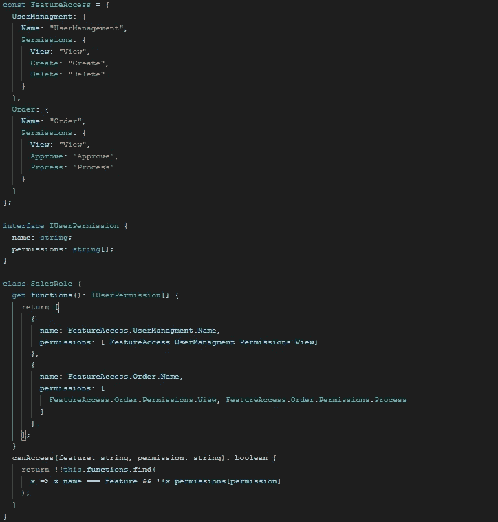

# 使用 TypeScript 区分联合类型和泛型进行重构

> 原文：<https://javascript.plainenglish.io/case-study-a-practical-usage-of-typescript-discriminated-union-type-and-generics-87e75a2717f8?source=collection_archive---------6----------------------->

## 通过使用 TypeScript 的有区别的联合类型和泛型的实际例子来增强您的重构技能

我喜欢 TypeScript 的是它的类型系统。它实用且功能丰富。在正确的用例中应用这些类型可以使我们的代码更干净，更容易维护。

本文的目的是分享一个用 TypeScript 区分联合类型和泛型进行代码重构的例子。

## 原始代码

这段代码用于表示用户角色和功能/权限映射，以在 Angular 应用程序中构建用户访问矩阵。

上面的代码包含:

1.  FeatureAccess:表示两个特性(“`UserManagement`”和“`Order`”)及其权限的常数。
2.  SalesRole:一个角色类，描述销售用户拥有的权限列表和基于此的`“canAccess`方法。

## 问题

上面的代码有什么问题？

首先，`SalesRole` 类中`functions` Getter 的返回类型不够强。在`IUserPermission`界面中，权限是一个字符串数组。虽然在`FeatureAccess` 常量中明确说明了每个特性都有不同的权限(即 Order 特性不一定要有 Create/Delete 权限)，但是如果有人在`SalesRole functions` Getter 中添加了“Create”权限，编译器也不会抱怨。

其次，代码没干。有许多重复的“名称空间”代码，如“`FeatureAccess.UserManagement.Permissions.xxx`”，这是一种减少错误地将错误权限添加到角色功能列表中的方法。在有许多角色和权限的真实项目中，这使得代码难以阅读。

我重构代码的第一次尝试是使用区分的联合类型。

## 区别工会类型

区分联合类型是通过一个名为**鉴别器**的属性来区分类型。辨别类型的强大之处在于，额外的类型检查是在编译时执行的，并且还将类型信息带入运行时。

通过应用有区别的联合类型，代码被重构如下

如上面的代码所示，新的`UserTypes`和`OrderTypes`是联合类型，表示每个特性允许的权限。新的`functionList`类型是一个有区别的联合类型，它加强了特性和它的权限之间的关系。

现在，如果有人添加了一个`Create` permission to Order 特性，编译器会不高兴。

重复的“名称空间”代码被删除，因为我们不必使用命名转换来使它“更安全”，相反，通过更好的编译器类型检查，我们可以使用简单的`PermList`常量，而不必担心将错误的权限添加到角色函数列表中。

## 作为常数

另一件值得强调的事情是这里使用的“常量断言”。

`as const`是常量断言表达式。它有两个作用，使所有属性`readonly` 和防止字符串文字扩大。后者是一个经常被遗忘的特性，但有时会非常有用。例如，如果没有这个神奇的表达式，`PermList.View`将是一个字符串，而不是一个字面上的“视图”类型，那么整个被区分的类型将不能用于这种情况。

这还不是结束，我们还可以通过使用 TypeScript 中的泛型来进一步改进代码。

## 无商标消费品

您可能已经注意到`IUserFunctions`和`IOrderFunctions`是相似的，它们都有“名称”和“权限”属性。同样，在现实世界中，这些接口可以像副本一样快速增长。

正如您所看到的，应用泛型后，它变得更加清晰。

## 结论

TypeScript 类型系统是强大的，这个用例只是触及了表面，我希望它能引发您进一步探索它的兴趣。

编程快乐！

*如果您还不是 Medium 的付费会员，* [***您可以访问此链接***](https://sunnysun-5694.medium.com/membership) *。你可以无限制地阅读媒体上的所有报道。我会收你一部分会员费作为介绍费。*