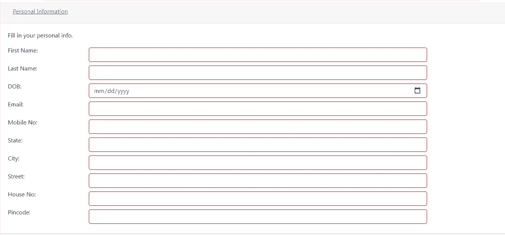
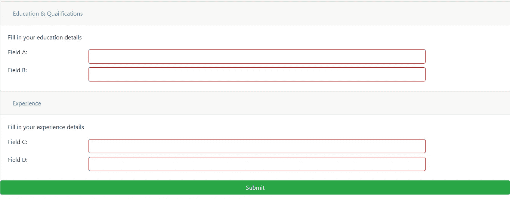
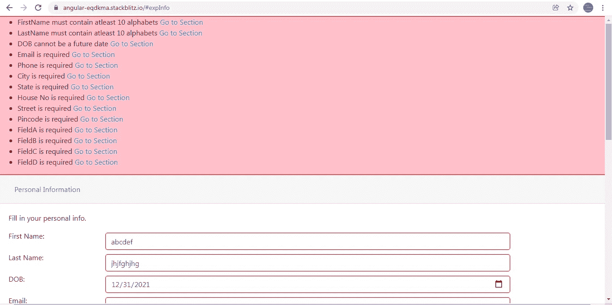

# Angular 中嵌套和简单表单组的集中式错误处理程序

> 原文：<https://javascript.plainenglish.io/centralized-error-handler-for-nested-and-simple-form-groups-in-angular-aea6ec6b5c7a?source=collection_archive---------3----------------------->

在 Angular 中实现集中式错误处理程序有几种方法。每个开发人员都有他/她自己的创造性的方法来做到这一点:)

如果你对为每个表单控件创建一个公共错误组件更感兴趣，你可以看看下面的故事。表单控件下显示的表单控件错误(如果有)。

[](https://link.medium.com/eKkFU7pa7kb) [## 为验证错误创建可重复使用的显示，并以角度形式滚动到第一个错误

### 表单验证对于任何类型的表单模板或反应式表单都是必须的。我们真的不想写 10-15 行 HTML…

link.medium.com](https://link.medium.com/eKkFU7pa7kb) 

这些是我们的目标:

1.  在 **AppComponent** 中我们有 3 个表单/部分。表单中可能有也可能没有嵌套的表单组。
2.  所有 3 个部分都有一个提交按钮。在提交时，我们在所有 3 个部分产生一个错误列表，并显示在一个公共错误显示组件**GeneralFormValidatorComponent。**
3.  您也可以通过单击错误旁边的“转到部分”链接导航到有错误的表单。

## AppComponent 类:

有三种形式/部分:**个人信息形式、教育信息形式和展示信息形式**。需要最后两个表单只是为了演示当单击错误旁边的“Go to Section”链接时，控件如何移动到适当的部分。

personalInfoForm 是一个包含简单表单控件的表单组:名字、姓氏、出生日期、电子邮件、联系人和一个嵌套的表单组:地址，其中包含一些表单控件。

**eduInfoForm** 是一个包含 2 个简单表单控件 **fieldA** 和 **fieldB** 的表单组。

**expInfoForm** 是一个包含两个表单控件 **fieldC** 和 **fieldD** 的表单组。



Personal Info Form



Education and Experience Form

3 个表单中的每个表单控件都用一个自定义的验证器方法进行验证。所有的验证方法都是从 **validator.ts** 文件中导出的。在这些验证器方法中没有任何东西是硬编码的。这确保了它们可以被需要类似验证的表单控件重用。

这些方法要么返回一个包含两个属性的对象:**错误**和**消息，要么**返回**空值**。**错误**属性始终保持值 true，而**消息**属性包含 FormControl 的适当场景错误消息。

单击 Submit 按钮，我们将检查哪些表单是无效的，并只将无效表单的详细信息和表单的 id 推入数组**allformerrodetails**。这个数组的每个元素包含一个具有两种属性的对象: **form 和 formId** 。属性表单包含整个表单组的详细信息，formId 包含硬编码的表单 Id。

我们将在后面看到为什么表单的 ID 也被传递。

```
**submit()** {
this.allFormErrorDetails = [];
let formErrorDetails = [];
if(this.personalInfoForm.invalid){
**formErrorDetails.push({form:this.personalInfoForm,formId:”personalInfo”});**
}if(this.eduInfoForm.invalid){
**formErrorDetails.push({form:this.eduInfoForm,formId:”eduInfo”});**
}if(this.expInfoForm){
**formErrorDetails.push({form:this.expInfoForm,formId:”expInfo”});**
}
**this.allFormErrorDetails = formErrorDetails**;
}
```

**AppComponent** 模板可以很长。我来总结一下。

1.  我们添加了通用错误组件**GeneralFormValidatorComponent**，它接受@ Input()**allformerrodetails**，并将**allformerrodetails 属性**作为值**。**如前所述**allformerrodetails**是一个数组，包含所有无效表单组及其表单 id 的列表。

```
<app-general-form-validator **[allFormErrorDetails]=”allFormErrorDetails”** ></app-general-form-validator>
```

2.接下来，我们添加了 3 个表单。请注意下表中 id 的位置。下面的 Id 与我们在**allformerrodetails**数组中的 **formId** 属性中使用的 id 相同。

我已经省略了不必要的标签，并以汇总格式突出显示了下面每个表单的 **formId** 。

```
<div class=”card-body collapse show” **id=”personalInfo”**>
<p class=”card-text”>Fill in your personal info.</p>
<form **[formGroup]=”personalInfoForm”**>
<!-- form elements will come here - ->
</form>
</div><div class="card-body collapse show" **id="eduInfo"**>
<p class="card-text">Fill in your education details</p>
<form **[formGroup]="eduInfoForm"**>
<!-- form elements will come here - ->
</form>
</div><div class="card-body collapse show" **id="expInfo"**>
<p class="card-text">Fill in your experience details</p>
<form **[formGroup]="expInfoForm"**>
<!-- form elements will come here - ->
</form>
</div>
```

## GeneralFormValidatorComponent 类:

因为**GeneralFormValidatorComponent**是 AppComponent 的子组件，所以从父组件传递到子组件的任何数据都可以在 **ngOnChanges** 生命周期钩子中检测到。

```
**ngOnChanges**(changes) {
if (changes) {
this.errorList = [];
**this.handleForm(this.allFormErrorDetails);**
}}
```

**errorList** 是一个数组，包含所有 3 种形式的错误信息(如果有的话)。该列表将在提交时显示在屏幕上。

**handleForm** ()遍历数组**allformerrodetails**，该数组包含 3 个表单的表单和 formId 细节。对于每个表单，我们调用 **parseFormErrors()** ，它检查每个表单组(简单的和嵌套的)的 FormsControls 中的错误。这些错误稍后将被构造成适当的消息。

```
**handleForm(formDetails)** {
formDetails.forEach(item => {
//iterating through each form
**this.parseFormErrors(item.form, item.formId);**
})
}
```

parseFormErrors() 使用内部函数的概念来完成任务。

```
**parseFormErrors(form, formId) {**
let that = this;
**iterate(form);****function iterate(formGroup) {**
Object.keys(formGroup.controls).forEach((key: string) => {
**if (formGroup.get(key) instanceof FormGroup) {**
// If the control is not a FormGroup then we know it's a FormControl
**iterate(formGroup.get(key));** 
//pass the FormGroup back to the same method for reiteration
} else {
**if (formGroup.get(key).errors) {**
//if form control has an error and error is not null
Object.entries(formGroup.get(key).errors).forEach(
([errorName, errorValue]) => {
**if (errorName === 'message') {
that.errorList.push({
message: errorValue,
sectionName: formId,
});
}**});
}}});
}}
```

**parseFormErrors()** 接受两个参数:表单细节，即**简单父表单组对象和表单 ID** 。让我们看看这里遵循的步骤。

1.调用内部函数 **iterate()** ，将表单的简单父表单组作为参数传递。该函数首先使用 **Object.keys.** 获取 FormGroup 的**控件属性**的所有键，请注意 FormGroup 的 controls 属性的每个键都是 FormControl/FormGroup。我们需要检查该键是简单的 FormControl 还是嵌套的 FormGroup。因此，它随后遍历键数组来执行上述检查。

2.如果键是嵌套的 FormGroup，则满足 IF 循环条件。因此，我们再次调用 iterate()，将嵌套的 FormGroup 作为参数传递。这样，我们就可以访问嵌套 FormGroup 的 controls 属性，并获得该嵌套 FormGroup 的 controls 属性的所有键。再次执行相同的检查:键是简单的 FormControl 或嵌套的 FormGroup。

3.如果满足 ELSE 循环条件，我们将检查 FormControl 是否有任何错误。请注意，无效表单的所有表单控件可能都没有错误。因此，在这里执行这项检查非常重要。

4.如果 FormControl 有错误，我们执行下面这段代码:

```
Object.entries(formGroup.get(key).errors).forEach(
([errorName, errorValue]) => {
if (errorName === 'message') {
that.errorList.push({message: errorValue,sectionName: formId,});
}}
);
```

FormControl 的**错误属性**是一个包含两个属性的对象:**错误和消息**。每个属性都包含错误名称作为键，并且该键有一个值。我们需要键和值来构造一个错误消息。因此，我们使用 **Object.entries** 以数组形式存储键及其相应的值。

请注意，我们只需要 message 属性来显示消息。

我们将来自每个表单控件的 error 对象的 **message** 属性的错误消息以及表单 ID(表单控件有此错误的表单的 ID)推入数组 **errorList** 。

让我们检查一下**GeneralFormValidatorComponent 模板**。

```
<div class=”errorList” *ngIf=”errorList.length”>
<ul>
**<li *ngFor=”let error of errorList”>{{error.message}} <a href=”#{{error.sectionName}}”>Go to Section</a></li>**
</ul>
</div>
```

这很简单。刚刚遍历了 **errorList** 数组并显示了数组中每个对象的**消息属性**。注意< a >标签的 href 属性。**我们已经将 href 链接到表单 ID** 。这样，当我们点击**“转到章节”**时，我们导航到包含错误的表格。当页面中有多个表单，而您很难找出哪个字段有错误时，这非常有用。

在提交 3 个表格时，错误信息将显示如下。每次提交时，错误消息将根据用户输入的正确输入进行更新。



List of Errors on Submission

就是这样！

您可以在下面的 StackBlitz 链接查看整个工作。

[](https://stackblitz.com/edit/angular-eqdkma?file=src/app/app.component.html) [## 角形(叉形)堆叠

### 编辑描述

stackblitz.com](https://stackblitz.com/edit/angular-eqdkma?file=src/app/app.component.html) 

*更多内容看*[***plain English . io***](http://plainenglish.io)