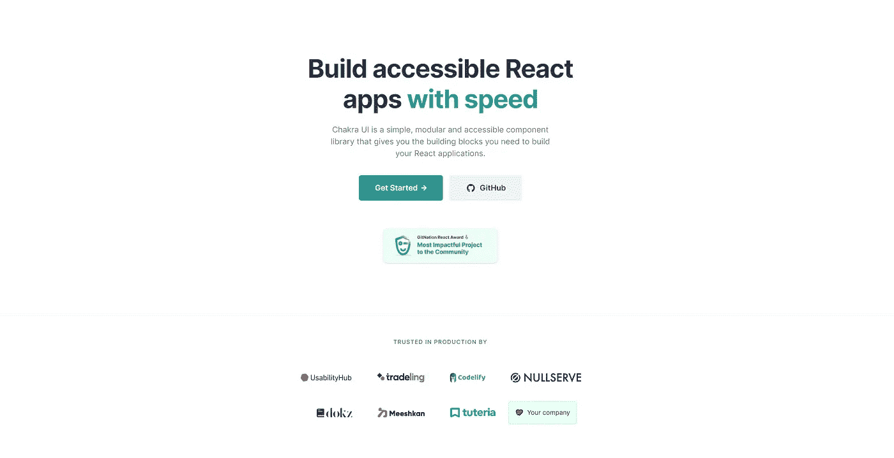
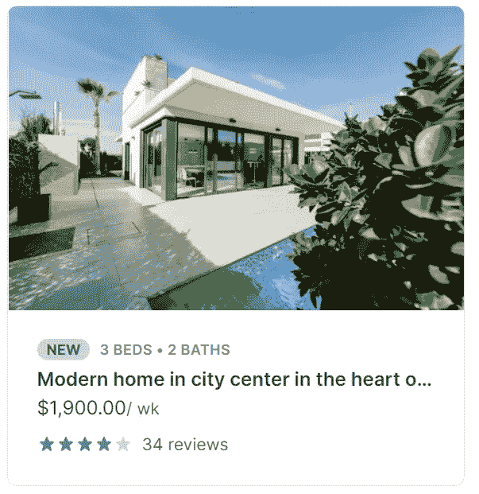

# 脉轮用户界面是您需要的唯一反应组件库

> 原文：<https://javascript.plainenglish.io/chakra-the-react-component-library-you-need-7e383a105a90?source=collection_archive---------2----------------------->

开发产品最困难的部分之一是任何完整堆栈应用程序经常需要的令人眩晕的组件数量。从头开始构建一个下拉菜单或按钮是很耗时的，会消耗掉在实际功能上的潜在时间。

像 [Tailwind CSS](https://tailwindcss.com/) 这样的工具已经出现来解决这个问题，加速了编程的设计- >代码部分。然而，Tailwind 可能是有限的，它不是为 React or 或 styled 组件(而不是使用 CSS 类)构建的，也不提供任何预构建的组件，只是提供标签来加快构建组件的速度。

我最近爱上了一个叫做 [Chakra UI](http://chakra-ui.com/) 的组件库。Chakra 是一个简单的、模块化的、可访问的组件库，它提供了构建一个优秀的 React 应用程序的所有构件。



Chakra

有几个使用脉轮的关键原因:

*   脉轮是用打字稿建造的
*   Chakra 支持 SSR(服务器端渲染)
*   脉轮是难以置信的模块化和可定制的
*   光/暗模式和定制主题支持的盒子！
*   文件清晰全面
*   脉轮社区越来越大

作为一名开发人员，我见过许多项目，在这些项目中，可访问性常常是一种几乎从未被处理过的草率想法。然而，有了 Chakra，让你的网站变得可访问以创建一个真正可访问的在线体验是非常简单的。

# 脉轮组件的优势是什么？

Chakra 提供了大量高质量的可定制反应组件。从开发人员的角度来看，这使得 Chakra 真正成为一种工作乐趣。

脉轮的设计考虑了几个核心原则:

1.  样式道具——所有组件样式都可以很容易地被覆盖和扩展，以减少使用`css`或`styled`
2.  简单性—每个组件都有一个简单的 API，文档显示了使用该组件的关键现实场景。
3.  组成——每个组件被分解成可以放在一起的小部分。例如,`Tab`组件实际上是由 3 个组件组成的。
4.  可访问性-焦点管理、键盘导航、颜色对比和`aria`属性可轻松访问/定制
5.  主题——主题很容易与每个组件集成
6.  一致道具命名——辅助动词用于所有道具，如`does`、`has`、`is`或`should`

## 风格道具

风格道具是我最喜欢的查克拉部分之一。使用 style props，您可以通过 props 轻松地定制组件的样式，这是一个非常干净的组件样式解决方案。

## 主题

查克拉是建立在[风格的系统](https://system-ui.com/theme/)主题规格上的，很容易扩展或定制内置的主题。

主题也扩展到组件风格。您可以使用对象声明改变大小或视觉属性的组件样式。点击阅读更多关于组件风格[的内容。](https://chakra-ui.com/docs/theming/component-style)

## 简单/模块化

脉轮的简单性和模块化是我最喜欢的特征。例如，让我们看一下包装了一个`div`元素的`Box`组件。它是脉轮工具集中最抽象的元素，基本上可以用来组成任何东西。

例如:

```
<Box as="span" ml="2" color="gray.600" fontSize="sm">
  Span
</Box>
```

这将呈现一个左边距、小字体、灰色的`span`元素。注意这里使用的道具是利用脉轮主题化来代替`gray.600`、`sm`和`2`的真实值。



这里有一个来自[脉轮盒文档](https://chakra-ui.com/docs/layout/box)的示例组件，使用`Box`和它的一些道具构建。当创造完全成熟的组件时，你可以看到查克拉是多么强大。

这个样式属性可以与 Chakra 工具集中的任何组件一起使用，而不仅仅是`Box`，所以你可以用相同的简单 API 定制每个组件。

# 结论

作为一名软件开发人员，我喜欢使用 Chakra 快速创建布局，这些布局不仅看起来很好，而且在幕后有非常棒和干净的代码。查看 [Chakra 网站](https://chakra-ui.com/)了解更多关于这个伟大组件库的信息。

## 保持联络

有很多内容，我很感谢你读我的。我是加州大学伯克利分校 MET 项目的本科生，也是一名年轻的企业家。我写软件开发、创业和失败(这是我非常擅长的)。你可以在这里注册我的时事通讯[或者在我的](https://newsletter.cometcode.io/)[网站](https://www.caelinsutch.com/)查看我正在做的事情。

请随时联系我，在 Linkedin 或 T2 Twitter 上联系我，我喜欢听到阅读我文章的人的声音:)