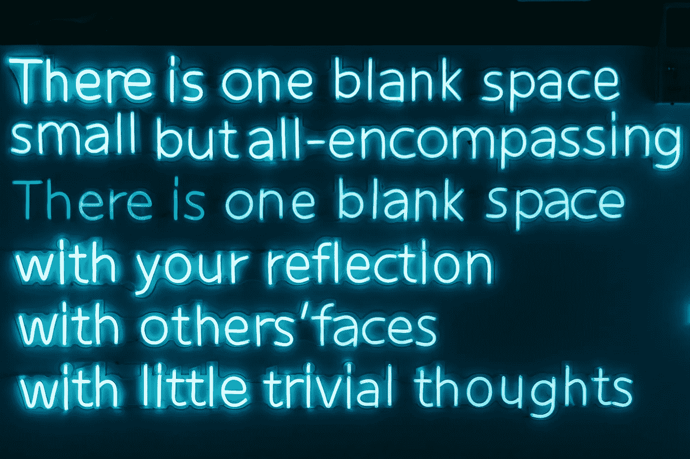
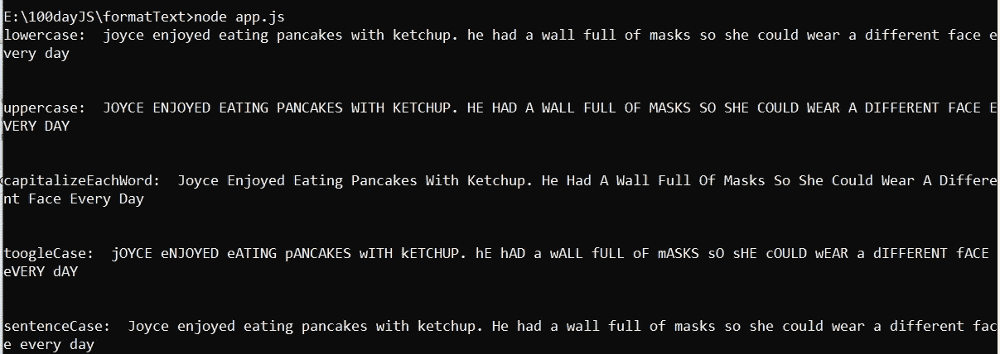

# 使用 JavaScript 更改大小写格式提示

> 原文：<https://javascript.plainenglish.io/change-case-formatting-tips-using-javascript-bd724c090bce?source=collection_archive---------15----------------------->



Photo by [Road Trip with Raj](https://unsplash.com/@roadtripwithraj?utm_source=unsplash&utm_medium=referral&utm_content=creditCopyText) on [Unsplash](https://unsplash.com/s/photos/word?utm_source=unsplash&utm_medium=referral&utm_content=creditCopyText)

更改大小写格式是每个文本编辑器提供的许多基本功能之一。在本文中，我想分享关于使用 JavaScript 的代码的变更大小写格式技巧。

供您参考，在 Microsoft Word 中，有五种常见的更改大小写格式:

1.  小写:将所有文本小写
2.  大写:将所有文本大写
3.  句子大小写:将句子的第一个单词大写
4.  每个单词都要大写:每个句子的第一个单词都要大写
5.  tOOGLE cASE:将所有文本大写，但第一个单词小写

# 程序

我们知道，对于第一种和第二种格式，都有函数来实现它。大家讨论一下，我会用 ES6 的语法来说清楚。

## 小写字母

为了制作小写字母，提供了 JavaScript。toLowerCase()函数使所有文本变成小写。所以，我们只需要写这样的代码

```
const lowerCase = (word) => word.toLowerCase();
```

从上面的代码中，我们声明了一个名为 lowerCase 的函数，文本值为 word。之后使用。toLowerCase()函数将所有单词变成小写。

## 大写字母

为了实现大写，提供了 JavaScript。toUpperCase()函数也是如此。它会将所有文本变成大写。所以，我们只需要写这样的代码

```
const upperCase = (word) => word.toUpperCase();
```

就像以前一样，我们可以把所有的单词变成大写，通过调用大写的函数名。

## 每个单词都要大写

正如你所看到的，在每一个单词中，我们需要把第一串变成大写。所以我们要做的第一件事就是把所有的单词都变成小写，然后用空格把每个单词分开。

之后，我们使用 charAt()函数改变第一个字符并将其转换为大写，对于其余的字符，我们减去第一个字符并将其合并。最后，把所有的单词重新组合成句子。

```
const capitalizeCase = (word) => {
  text = word
    .toLowerCase()
    .split(" ")
    .map((e) => e.charAt(0).toUpperCase() + e.substring(1))
    .join(" ");
  return text;
};
```

## 图格案件

如你所见，这个函数与之前的函数正好相反。我们需要做的是把所有的单词都变成大写，然后把它们拆分。接下来，同样的，在我们把第一个字符变成小写字母之前，在减去第一个字符之后，我们把它组合成一个单词。最后，我们再次连接所有单词。

```
const toogleCase = (word) => {
  text = word
    .toUpperCase()
    .split(" ")
    .map((e) => e.charAt(0).toLowerCase() + e.substring(1))
    .join(" ");
  return text;
};
```

## 判决案例

这个案件与另一个不同。因为，算法比以前长了一点。我们需要一些创造力。句子大小写意味着句子中只有第一个单词变成大写，其余的变成小写。

你知道怎么做吗？

嗯，首先我们需要把每一个句子分开(“.”)性格。接下来，我们需要声明 map 函数，这样我们就可以单独访问每一句话。之后，我们把一个句子的每一个第一个字符都变成大写字母，然后和其他已经变成小写字母的字母组合在一起。是的，工作完成了。

```
const sentenceCase = (word) => {
  text = word
    .split(". ")
    .map((e) => e.charAt(0).toUpperCase() +    e.substring(1).toLowerCase())
    .join(". ");
  return text;
};
```

# 测试

为了测试，我将使用[随机字生成器](http://randomwordgenerator.com)来造三个句子。让我们检查一下。

正文:乔伊斯喜欢吃蘸有番茄酱的煎饼。他有一整面墙的面具，所以她可以每天戴着不同的脸。

输出:



正如你所看到的，这个程序运行得非常好。

# 结论

我写这篇文章是为了弄清楚使用 JavaScript 的变更用例的算法。我希望你喜欢这篇文章，并增加你对 JavaScript 的理解。

有一个好的代码😇