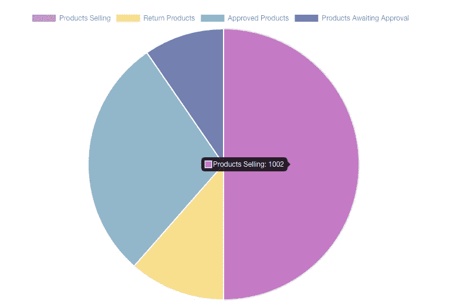
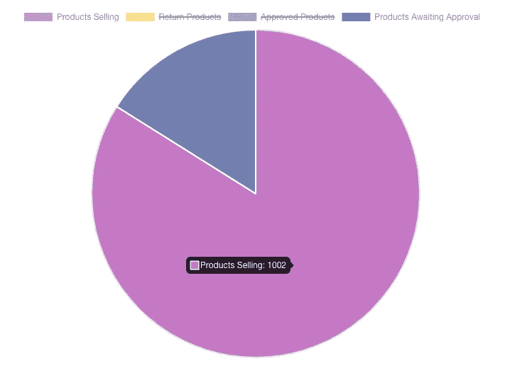
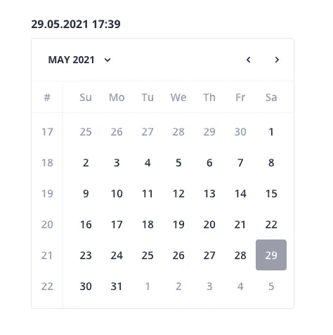
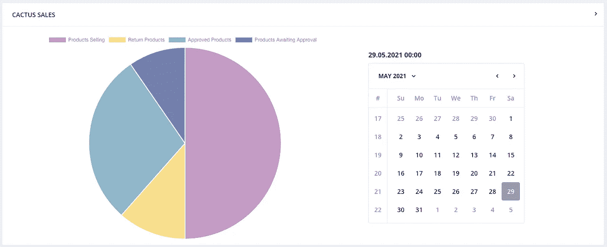

# 使用角状星云在翻转卡中设计图表和日历

> 原文：<https://javascript.plainenglish.io/chart-and-calendar-design-in-flip-card-using-angular-nebular-db0ffd434d5b?source=collection_archive---------7----------------------->

## 在活动卡片上创建一个快速、友好的图表和日历。

Photo by [Jason Coudriet](https://unsplash.com/@jcoudriet?utm_source=medium&utm_medium=referral) on [Unsplash](https://unsplash.com?utm_source=medium&utm_medium=referral)

今天，我为你准备了一篇关于图表和日历的文章。我和 ngx-admin 合作过，这是 Angular 的主题之一。这个主题中使用了角状星云。我做了一个研究，设计了一个活动卡片。在活动卡片的正面，有我将告诉你的图表和日历。

首先说一下翻盖卡设计。文件夹层次结构应该是；

**销售卡**

**- >仙人掌前线**

——cactus-sales-front-card . component . ts

——cactus-sales-front-card.component.html

——cactus-sales-front-card . component . scss

**- >仙人掌信息返回**

——cactus-INF-back-card . component . ts

——cactus-inf-back-card.component.html

——cactus-INF-back-card . component . scss

-cactus-sales.component.html

-cactus-sales.component.ts

-仙人掌-sales.component.scss

在 cactus-sales.component.ts 文件中，需要添加；

`flipped = false;`

`toggleView() { this.flipped = !this.flipped }`

这样，我们提供了我们创建的卡片的翻译。

在 cactus-sales-front-card.component.html 文件中，开始创建一个图表。

对于图表，我们需要在父文件夹 module.ts 文件中导入模块。

`import {ChartModule } from 'angular2-chartjs'`

`import { NgxChartsModule } from '@swimlane/ngx-charts';`

让我们开始创建图表。首先，我们创建一个名为数据和选项的属性。

`this.data = { ... }`

上面，我们输入了将用于图表的数据。我使用了两个字段作为标签和一个数据集。

使用 Chart 时，您可以通过这种方式输入数据并从服务中调用。我以这种方式创建数据，因为我目前没有使用任何 API。

在我设置了数据条目之后，在我们的。html 文件。

`Use the <chart></chart> tag.`

我们在`type='pie'`中选择图表类型

图表中要显示的数据就是这样提供的；`[data]='data'`

如果你想对图表使用 CSS，你可以在这里看到它的结构。

如果你使用的是`chart {}`而不是`::ng-deep chart {}` ，你的 CSS 代码将不会反映在图表上。

如果你想了解更多关于`::ng-deep`的详细信息，可以看我的文章。

 [## 如何将角度组件样式与特殊选择器一起使用

### 在具有独立样式文件的组件的基础上，将样式添加到您的 Angular 应用程序有助于您创建一个更…

javascript.plainenglish.io](/how-to-use-angular-component-styles-with-special-selectors-dc877514372c) 

在 CSS 定义之后，图表就完成了。

现在我想在图表旁边添加一个日历。日历将被写入当前日期和时间。

在 cactus-sales-front-card . component . ts 文件中，定义日期属性。

`date = new Date();`

定义日期后，我们直接在。html 文件。

在``标签中，这样定义日期；

`{{ date | date : 'dd.MM.yyyy HH:mm' }}`

我使用日期管道是因为我想得到日期数据。

首先，使用日历需要在父 module.ts 文件中导入模块。

`import { NbCalendarModule } from '@nebular/theme';`

像图表一样，在`<nb-calendar>`标签中，需要设置日期；

`[(date)]="date"`

使用日历时，获取选定日期的默认颜色。我想改变这种颜色。

我通过在 DevTools 中检查 CSS 层次结构找到了它。但并不是这样运作的。

`nb-calendar-day-cell.day-cell.today.selected.ng-star-inserted`

我又加了一个`::ng-deep`。这样我就能跑了。

我的卡片设计终于有了这个形状。作为一项适应建议，图表数据可能会因所选日期而异。

我们做到了！感谢您的阅读。我希望你已经发现这是有用的。

*更多内容请看*[***plain English . io***](http://plainenglish.io)