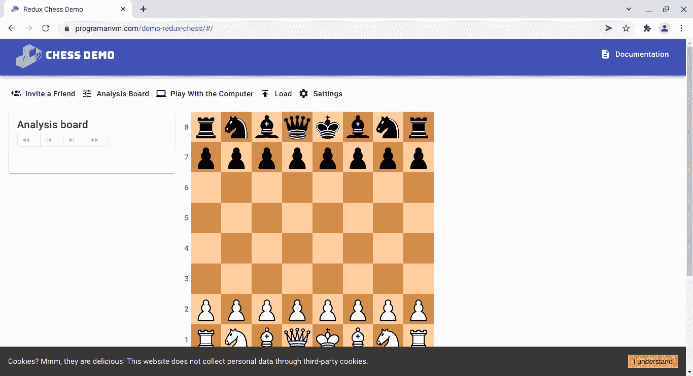
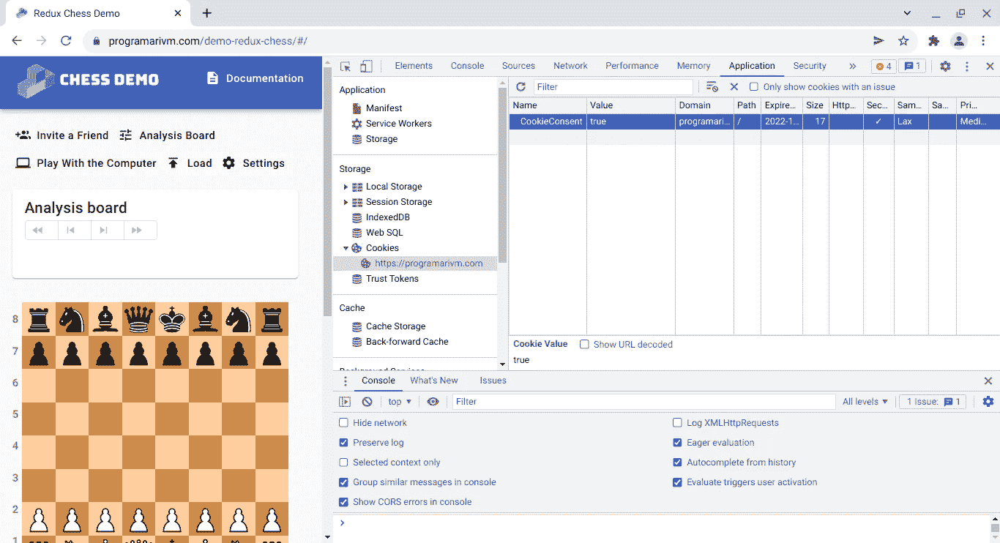
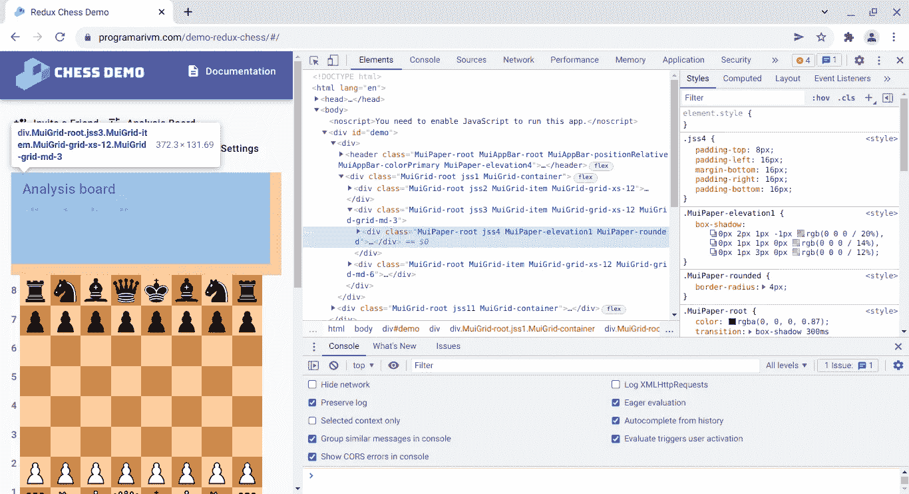
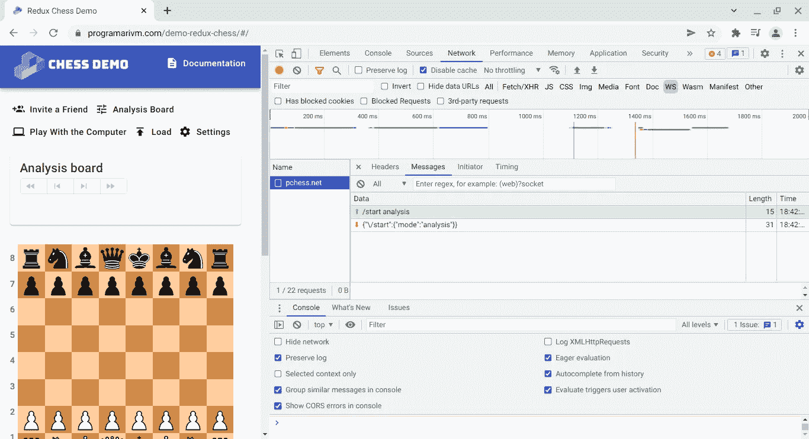
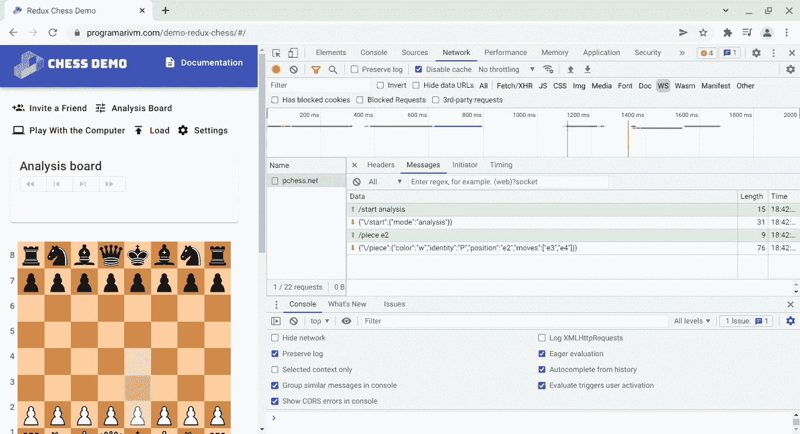

# 查看 Redux 国际象棋演示

> 原文：<https://javascript.plainenglish.io/check-out-the-redux-chess-demo-acbea003d710?source=collection_archive---------16----------------------->

## 请坐下来，享受一杯你最喜欢的啤酒


开始使用代码库的一个好方法可能是首先查看它的现场演示，尤其是在第一次提交之前的学习曲线的开始阶段。这种方法对我来说非常有效，因为它允许我从用户的角度到所支持的业务流程获得一个大的图像。

[](/what-is-redux-chess-6264c99c1eca) [## Redux 棋是什么？

### 嵌入到 React 应用程序中的易于使用的象棋插件

javascript.plainenglish.io](/what-is-redux-chess-6264c99c1eca) 

作为一名全栈开发人员，专注于演示——或者试运行环境——将有助于您在接触任何技术细节之前了解前端和后端如何相互通信。只需通过与 UI 的交互获得一些业务流程的直观知识。

> 将它分解成易于管理的理解片段，并列出在未来的工作会议中深入挖掘所需的工具。

请坐下来，享受一杯你最喜欢的啤酒，你们都被邀请来看看 [Redux 国际象棋演示](https://www.chesslablab.com/)。GitHub 回购是[在这里找到的](https://github.com/programarivm/demo-redux-chess)。请注意，pchess.net 的沙盒象棋服务器可能不会一直运行，在这种情况下，您可能希望在本地运行它。这在[文件](https://github.com/chesslablab/chess-server)中有所涉及。

让我们暂时关注从与演示的互动中获得启示。



Figure 1\. A Redux Chess plugin embedded into a React app.

第一次开始演示时，您可能注意到的第一件事是弹出的 cookie 横幅消息:

> 饼干？嗯，它们很好吃！本网站不会通过第三方 cookies 收集个人数据。

酷！

这个 cookie 横幅通知用户 [Redux Chess](https://github.com/chesslablab/redux-chess) 插件不处理个人数据或 cookie，因此他们可以在万维网上匿名下棋。与其他玩家下棋所需的会话数据作为 JWT 保存在 Redux 存储中。



Figure 2\. Inspect cookies in Chrome DevTools after the cookie banner has been accepted.

我们正在使用 [Chrome DevTools](https://developer.chrome.com/docs/devtools/) 来检查 Redux Chess 应用程序。很容易发现 [Material-UI](https://mui.com/) 库被用来提供现成的 React UI 组件，只需点击 **Element** 选项卡来浏览 DOM。



Figure 3\. All divs use class names prefixed with “Mui” which stands for Material-UI.

到目前为止还不错，只要这是普通的 HTML 和 JavaScript。但是等等，你怎么可能浏览 DOM 树的 React 副本呢？

如果您是一名中级 React 开发人员，您可能知道在某个时候必须将 React 代码转换为 web 浏览器可以理解的 JavaScript 代码的转换过程。换句话说，当创建一个 React 应用程序时，你需要考虑组件而不是 DOM 节点，所以如果这种方式可以在 Chrome 开发工具中可视化，那就太好了。

这就是 [React 开发者工具](https://chrome.google.com/webstore/detail/react-developer-tools/fmkadmapgofadopljbjfkapdkoienihi?hl=en)的用武之地。

React Developer Tools 是一个调试工具，它允许像检查 DOM 树一样检查 React 组件层次结构。另外，建议安装一个调试工具来调试状态变化，我们将使用 [Redux DevTools](https://chrome.google.com/webstore/detail/redux-devtools/lmhkpmbekcpmknklioeibfkpmmfibljd?hl=en) 来熟悉 Redux 模式。

最后，不要错过点击 **Chrome Dev Tools** 中的**网络**标签来阅读 React 应用和 chess 服务器之间来回发送的 WebSocket 消息的机会。我们在 GitHub 上开发新功能的时候会做很多这样的事情，因为 Redux Chess 毕竟是客户端-服务器架构的客户端。为此，确保在打开**网络**选项卡的情况下加载 Redux Chess 演示，并过滤 **WS** 流量，如下图所示。



Figure 4\. The client asks the server to start in analysis mode by sending a WebSocket message by default.

查询:

```
/start analysis
```

回应:

```
{“\/start”:{“mode”:”analysis”}}
```



Figure 5\. Then, if the user clicks on e4 for example, a new message is sent to the server, and the browser receives a response accordingly.

查询:

```
/piece e2
```

回应:

```
{“\/piece”:{“color”:”w”,”identity”:”P”,”position”:”e2",”moves”:[“e3”,”e4"]}}
```

好东西！

检查演示是一个很好的起点，但是您仍然需要在本地运行应用程序，以利用这些调试工具:

*   [Chrome 开发工具](https://developer.chrome.com/docs/devtools/)
*   [React 开发者工具](https://chrome.google.com/webstore/detail/react-developer-tools/fmkadmapgofadopljbjfkapdkoienihi?hl=en)
*   [Redux 开发工具](https://chrome.google.com/webstore/detail/redux-devtools/lmhkpmbekcpmknklioeibfkpmmfibljd?hl=en)

你准备好了吗？

[点击此处](https://github.com/chesslablab/testing-redux-chess)启动并运行 Redux Chess 测试应用程序。

*更多内容看* [*说白了. io*](http://plainenglish.io/) *。报名参加我们的* [*免费每周简讯*](http://newsletter.plainenglish.io/) *。在我们的* [*社区*](https://discord.gg/GtDtUAvyhW) *获得独家写作机会和建议。*