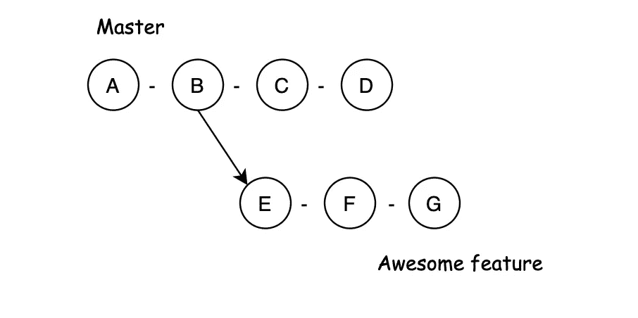
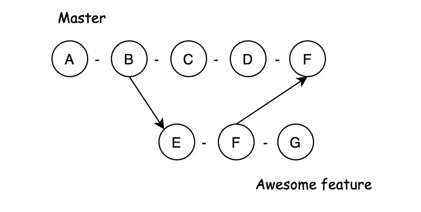

# cherry Pick——每个开发者都应该知道的 Git 命令

> 原文：<https://javascript.plainenglish.io/cherry-pick-the-git-command-every-developer-should-know-1ec20c7d1067?source=collection_archive---------14----------------------->


Photo by [Olesia Misty](https://unsplash.com/@olesia_misty?utm_source=medium&utm_medium=referral) on [Unsplash](https://unsplash.com?utm_source=medium&utm_medium=referral)

樱桃季节即将到来，这就是为什么，今天，我决定告诉你一个真正强大的 Git 命令，它可以简化你在大型和小型项目上的工作。

我说的是命令:`$ git cherry-pick`

对于那些不知道 Git 是什么的人，我建议你参考[官方指南](https://git-scm.com/book/en/v2/Getting-Started-What-is-Git%3F)来发现这个现在著名的“版本控制”工具的潜力。

另一方面，如果你不喜欢吃樱桃，我的建议是破例一次。

# 开始吧！

`git cherry-pick`命令允许您通过引用选择一个提交并将其添加到当前工作头。

在许多情况下，该命令会很有用。

您是否曾经没有注意到您在错误的分支上进行更改，然后不得不在正确的分支上手动进行这些更改？

或者，再一次利用另一个分支上的精确提交，而不必携带所有其他随时间发生的更改？

为什么不是这样，几个人在后端/前端工作相同的功能，一个团队成员创建了一个对其他人也有用的数据结构？

这些只是可能发生的一些情况。

# 但是为什么是樱桃？🍒

名字的原因其实很琐碎。

樱桃可以生长在不同的树枝上，这个命令的动作只不过是从我所在的树枝上摘樱桃。

# 总是安全的吗？

这个命令无论多么强大，也有缺点。

很明显，merge 命令总是比 cherry-pick 更可取，因为它允许您保持存储库干净整洁。

相反，应用精选可能导致不同分支上的代码重复，这很可能导致以后的手动合并。

# 可能情况

让我们想象下面的场景，在提交“b”时，一个分支已经从主分支中分离出来，以创建一个“令人敬畏的特性”。



在这个令人敬畏的分支上，团队继续开发，创造新的功能。

在开发过程中，致力于这个“令人敬畏的特性”的团队意识到了应用程序中的一个错误，并修复它以继续开发。

然而，此时，在提交“F”中修复的错误也需要在主服务器上修复。

这里有两种方法:

*   通过查看提交历史更改(🤯)
*   使用 cherry-pick 从“Awesome feature”分支中检索“F”提交，并将其提交给“Master”(😎)

# 这样做的程序

在运行命令之前，确保您在我们感兴趣的分支上。

```
git checkout master
```

然后检索 commitSha，可从控制台或使用`git log`命令恢复。

```
git cherry-pick <commitSha_F>
```

一旦执行，我们的主分支的 Git 历史将在头部看到 commit“F ”,以前只出现在“Awesome feature”的历史上。



# 附加命令

一些选项可以添加到`git cherry-pick`命令中。

第一个是下面的(`-e`)，它允许您在挑选之前定义一个提交消息。

```
-edit
```

相反，第二个选项(`-n`)不允许实际提交，而是在本地工作区完成精选操作，允许我们在远程提交之前对提交进行进一步的修改。

```
--no-commit
```

作为第三个选项(`-s`)，我们有 signOff，它将在精选提交消息的末尾添加一个“signoff”签名行。

```
--signoff
```

# **结论**

Cherry pick 是一个强大的工具，可以解决每天在大型或小型项目中发生的大量动态。然而，这个工具不应该取代像`git merge`或`git rebase`这样的命令，它们必须总是优先于精选命令。

如果你喜欢这篇文章，请随意发表👏🏻你想写多少遍都行，这会鼓励我写其他文章。

如果你有任何问题，请随意提问。非常感谢你的阅读！

*更多内容请看*[***plain English . io***](http://plainenglish.io/)