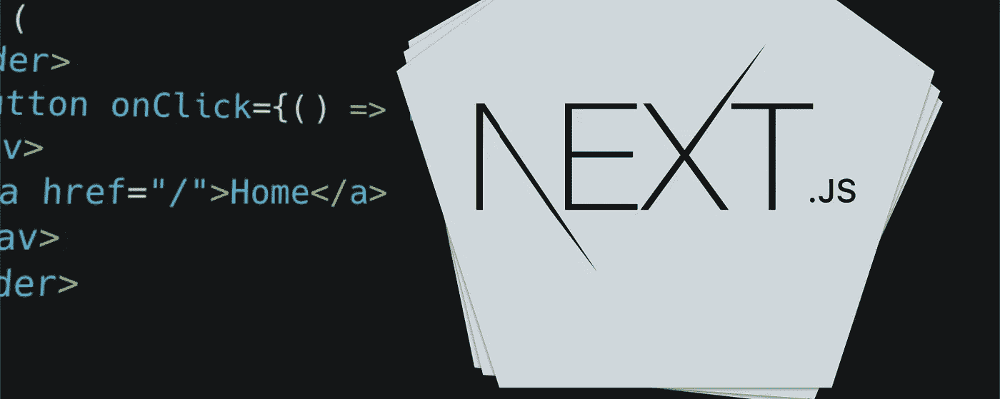
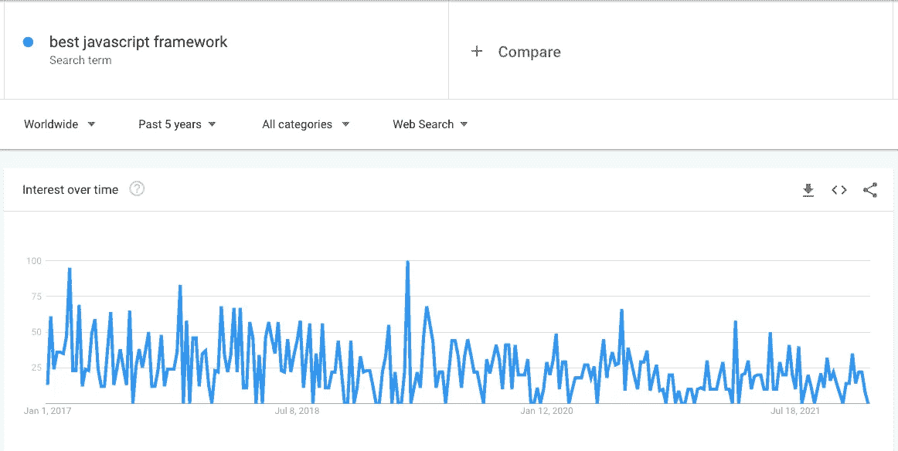
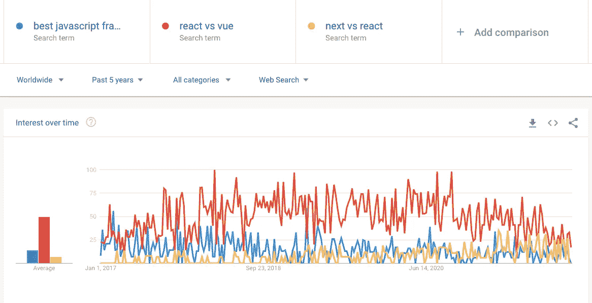
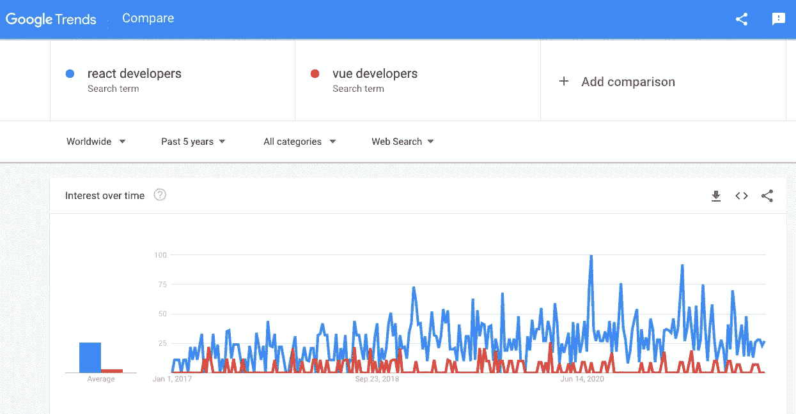
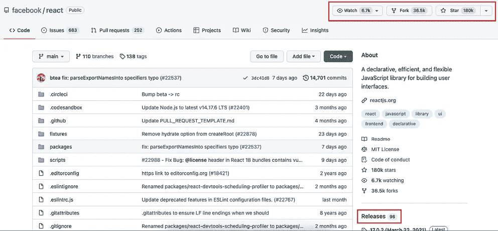
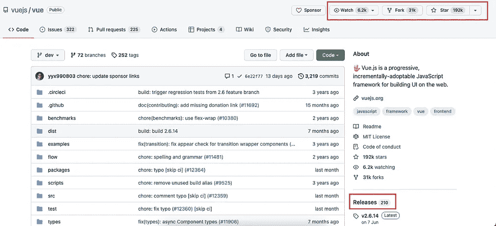

# 为什么在 2022 年选择 Next.js 而不是其他 JavaScript 框架

> 原文：<https://javascript.plainenglish.io/choose-nextjs-over-other-javascript-frameworks-be447dd3a5e7?source=collection_archive---------1----------------------->

## 是的，选择 Next.js 而不是 React.js。

> React 和 Vue 哪个好？
> 
> 哪个是最好的 JavaScript 框架？
> 
> NextJS 比 ReactJS 好吗？
> 
> 应该先学哪个 JavaScript 框架？
> 
> 我应该学 React 还是 Vue？

无论你想用什么方式来表达这个问题，现实是——在开发人员中，这些问题经常出现。他们应该选择 Next.js 还是 plain React 的问题。他们应该选择 React 还是 Vue？这些问题不仅广受欢迎，还引发了许多争论和激烈的交流。这些问题的不同变体在谷歌上有着良好且稳定的搜索流量。

*The search term ‘best javascript framework’ has remained consistently popular worldwide*

如果你认为这很疯狂，这里有三个不同搜索词的比较:

The most prevalent question always is on choosing between React and Vue. And spoiler alert — for some reason, React developers absolutely hate Vue!

无论你在 google trends 上搜索什么，结果都是一样的。

开发者一直在寻找这个问题的答案。

这个问题如此普遍，以至于许多著名的开发人员不得不屈服于来自社区和他们的观众的压力，来回答这个问题。

Jeff Delaney(来自 fireship.io)甚至制作了一个视频，他用 10 种不同的 JavaScript 框架制作了同一个应用程序。

每当我阅读这些讨论，以及人们比较不同的框架时，我总是不知所措。

大多数时候，我遇到的比较都是技术性的。框架的能力，速度，效率，原始能力。

所有这些讨论和比较都以同样的方式结束，即你应该根据你的目标来选择框架。

帮了大忙，是吧？

当我开始写代码时，我自己也做过这些搜索，这些比较留给我的问题比答案还多。

我不想给你一堆不同的性能指标，并表明一个框架在一件事上更好，而另一个在下一件事上更好。但最终，保持政治正确，远离给问题一个明确的答案。我不想成为那样的人。

所以，我会以正确的方式回答这个问题。

这些讨论经常忽略的一个事实是，除非你是一个独立的开发者，**否则你没有权利选择框架**。

你工作的公司不会因为你说它更好而改变它的框架。

作为一名自由职业者，你为之工作的客户不会因为某个刚开始工作的家伙向他们推荐了一个不同的框架而改变他们的网站架构。

即使客户到目前为止还没有网站，他也会有一个已经建议了一个框架的朋友。和美元的甜甜圈，你的客户会听他的朋友比你。

长话短说，*大多数开发人员*在他们将要工作的框架中几乎没有发言权。所以，一个框架可以是超人的化身，然而，他们仍然需要和 Bizzaro 一起工作。这是对他们的期望。

因此，当我抛出我的帽子，并回答这个问题时，我主要是从一个刚刚开始 web 开发之旅的人的角度来看待这个问题。

正如你将从我之前和未来的故事中看到的，这是我关注的焦点。帮助有前途的开发人员快速掌握 web 开发技能。特别是前端开发。我对新开发人员很感兴趣。想在前端开发方面做出一番事业的人。

# 在我们进入正题之前，先做一些快速、简短的回答

## 应该学习哪个 JavaScript 框架？

Next.js。

手放下。我甚至不需要去想它。如果你想在前端开发领域发展事业，请选择 Next.js，不要回头。你不会后悔的。我们会稍微详细讨论一下。

## 哪个 JavaScript 框架最好？

都挺好的。

首先，所有框架都基于相同的指导原则，遵循或多或少相同的方法和途径。当然，你需要一些时间来习惯不同框架之间的细微差别，但是它们彼此之间并没有那么大的不同。

如果你熟练掌握了一个框架，你不需要超过一周的时间就能熟练掌握不同的 JavaScript 框架。

## 哪个 JavaScript 框架简单易学？

如果你没有编程经验，它们将同样容易，或者同样困难——*取决于你如何划分容易和困难。*

如果你以前有一些 HTML 的经验，你会发现 Vue 因为它的模板系统而更容易上手。React 需要一些时间来适应它的类名。

如果你有使用 Angular 这样的 JavaScript 框架的经验，Vue 对你来说会更熟悉，因为 Vue 更像是 Angular 的扩展。

但是正如我所说的，如果你没有编程经验，你就有优势。你没有受到任何包袱的折磨。你从一张白纸开始。所以，正如我反复说的——就选 Next.js 吧。

## 哪种 JavaScript 框架最受欢迎？

React，推而广之，Next.js。

这甚至不是一场竞赛。看看 React 开发者和 Vue 开发者的搜索趋势对比就知道了。

永远记住，需求的不是框架，而是精通该框架的开发人员。所以，我们需要时刻牢记这一点。

## 哪个 JavaScript 框架最受欢迎？

React.js 和 Vue.js 都同样受欢迎。

在回答这个问题时，我总是参考他们的 GitHub 库，因为对我来说这是一个很好的基准测试方法。

如你所见，它们都是分叉的，有星的，被关注的程度几乎相同。如果你把它放在我们基于谷歌搜索趋势图所预期的背景下，这是非常有趣的。

也许，独立开发者更喜欢 Vue.js 而不是 React.js？我不确定，我没有数据对此事发表评论。

我在这里发现的另一个有趣的事情是发布的数量。Vue.js 似乎更频繁地推出新版本，这可能是好事也可能是坏事，取决于你如何看待它。

所以是的，两个框架。从表面上看，它们同样受欢迎。

> 让我暂停一下，给你讲一下这个故事背后的背景。这是一个我无意写的故事。
> 
> 我最近写了一篇关于如何开始做前端开发人员的文章。今天，我在写这个系列的下一篇文章 NextJS 初学者指南——不需要以前的编程经验。
> 
> 当我推荐选择 NextJS 时，问题就出现了。
> 
> 正当我要开始了解故事的实际内容时，我突然想到了。我需要给出一些关于我为什么推荐选择 NextJS 的背景。为了做到这一点，我需要给出一些关于我为什么推荐 React 的背景。我最后在上面写了 3 个部分。然后我意识到把它写成一个完整的故事会更好。我们在这里。
> 
> 反正前戏够了。让我们结束它，好吗？

# 我的最终裁决？

选择 Next.js。

它基于 React.js，所以你可以胜任任何需要你拥有 React.js 经验的工作。你也可以从事任何你想做的自由职业项目。最重要的是，如果你想开始一份新工作，会有无数的公司在寻找与你拥有的技能完全匹配的开发人员。

在我结束之前，让我告诉你更多关于 Next.js 的事情。

# Next.js 是什么？

Next.js 是 React.js 的 JavaScript 框架，由 [Vercel](https://vercel.com/) 的人开发。它吸收了 React 提供给开发者的所有好的东西，并使它变得更好。

与普通 React 相比，使用 Next.js 有很多好处:

*   如果你想在应用程序中进行服务器端渲染，Next.js 可以做到。(*如果需要，* [*仔细阅读客户端渲染和服务器端渲染的区别*](https://www.botify.com/blog/client-side-server-side-rendering-seo) )
*   如果你想创建一个静态站点，Next.js 是你更好的选择。
*   Next.js 通过智能地只加载当前页面所需的 CSS 和 JavaScript 来提高网站的性能，因此页面加载速度更快。
*   当你想到 SEO 的时候，Next.js 是一个明显的赢家。

Next.js 为您的生活带来了更多的性能增强，但就目前而言，我认为这些足以强调您应该选择 Next.js。

# 不先学 React 可以学 Next.js 吗？

绝对的。

虽然 Next.js 构建在 React.js 之上，但它本身就是一个完整的框架。所以，当你开始在 Next.js 中学习和开发系统的时候，你会自动学习如果你先学习 React.js 你会学到的原理。

如果你已经知道 React.js，那一定会加快你学习 Next.js 的速度。

但是，如果你完全是编程新手，学习 React 并不是强制性的。您可以直接开始学习 Next.js。您需要知道的一切，都将在学习过程中学习。别担心。

> PS:为了让你放心，刚开始学编码的时候，我选择了 NuxtJS。Nuxt 是为了 Vue(另一个流行的框架)下一步是什么反应。我在进入 Nuxt 的世界时没有任何问题。所以，继续前进，满怀信心地投入进去吧。
> 
> Next.js 足够强大，有能力照顾好你。

# 为什么我推荐 Next.js/React.js 而不是 Nuxt.js/Vue.js?

刚才提到刚开始学的时候选的是 Vue 和 Nuxt。所以当我选择 Nuxt 的时候，质疑我向你推荐 Next.js 的选择是很自然的。

简答？

对 React 的需求越来越多。

我们在图表中一遍又一遍地看到了这一点。你可以在你看到的任何一个招聘板上看到它。Vue 尽管有其优势，但在受欢迎程度、广泛接受度和需求方面却相形见绌。

如果你来找我咨询你应该选择哪个框架来开发你的下一个项目，我会毫不犹豫地推荐 React (Next.js)或 Vue (Nuxt.js)。两者都是很棒的框架，非常健壮、有能力，令人惊叹。

但是，如果你想从事前端开发，你总会发现 React 和 Next.js 比 Vue 和 Nuxt.js 更需要开发人员。

至此，我们为作为开发人员的您解决了关于最佳 JavaScript 框架的争论。

希望这会让你现在启动你的第一个 Next.js 项目。

可以从[官方 Next.js 教程](https://nextjs.org/learn/basics/create-nextjs-app)入手。

或者，你可以订阅，然后**把我的下一个故事收进你的收件箱**。我们将建立你的第一个网站——*，即使你一生中从未写过一行代码。*

# 2022 年你打算成为前端开发者吗？

去年，我决定学习编码。从那以后，我设计了无数的网站，集成了各种 API 以满足不同用例的需求，并构建了不同复杂度的系统。

我正在把我学到的东西总结成一本初学者友好的书。它遵循了我所知道的对新开发人员来说最快的、**最简单的、**和**最高效的方法**。

这本书包含几十个流行的和设计良好的网站组件的后续教程。当你完成的时候，你将能够立刻设计任何网站。

提前获得这本书会让你在最终价格上节省 50%,并获得终身更新，以及一堆其他赠品。

[现在就抢。😉](mailto:pirennesalvor@gmail.com)

今天到此为止。下次再见，保重！

*更多内容请看*[*plain English . io*](http://plainenglish.io/)*。报名参加我们的* [*免费每周简讯*](http://newsletter.plainenglish.io/) *。在我们的* [*社区不和谐*](https://discord.gg/GtDtUAvyhW) *获取独家写作机会和建议。*