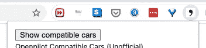
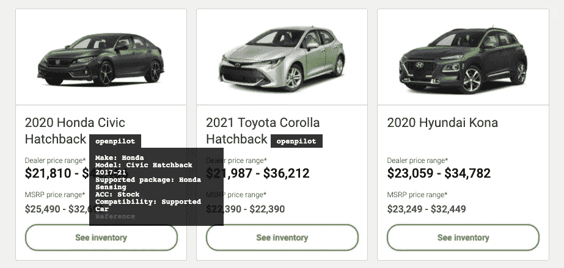
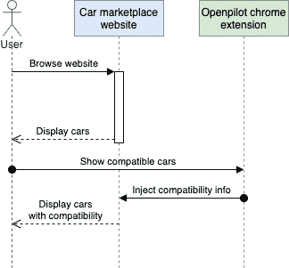
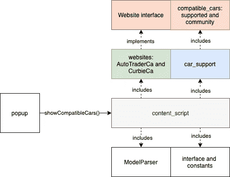
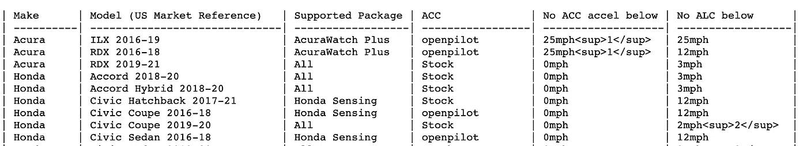
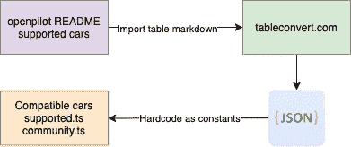

# 让我们为 Openpilot 支持的汽车构建一个 Chrome 扩展

> 原文：<https://javascript.plainenglish.io/chrome-extension-for-openpilot-supported-cars-unofficial-fa2fa2f179d?source=collection_archive---------19----------------------->

## 购买汽车，了解哪些汽车受 Openpilot 支持。

我非常喜欢 Comma.ai 在自动驾驶领域所做的事情。在你的汽车上安装一个运行开源驾驶辅助软件 Openpilot 的设备，是像我这样的修补匠的梦想。

在 autotrader.ca 上浏览汽车时，我想如果这些网站能显示 Openpilot 是否支持车辆就好了。那么为什么不为它构建一个 chrome 扩展呢？这将是一个有趣的周末项目。



Chrome extension popup. Screenshot by the author.



Screenshot of the chrome extension by the author.

# 技术堆栈

这个 Chrome 扩展是用 TypeScript 编写的。它使用 Webpack、React 和 Jest。

# 用户流量

安装 chrome 扩展后，用户应该能够:

*   浏览 autotrader.ca 等汽车市场网站，例如 https://www.autotrader.ca/new/hatchback,suv/?srt=1[&品牌=本田、现代、丰田](https://www.autotrader.ca/new/hatchback,suv/?srt=1&make=Honda,Hyundai,Toyota)
*   在浏览页面上，点击 chrome 扩展弹出菜单上的“显示兼容汽车”按钮。
*   展示带有弹出窗口的徽章，显示汽车的兼容性详细信息。

# 高级序列和结构

它将如何工作的高级序列图。



Sequence diagram by the author.

我对[源代码](https://github.com/ardydedase/openpilot-chrome-extension)使用了标准的 chrome 扩展结构。我用的是 GitHub 模板[chrome-extension-typescript-starter](https://github.com/chibat/chrome-extension-typescript-starter)。



High-level diagram by the author.

*   我将详细介绍彩色盒子。
*   其他框是不言自明的，其中一些是任何 chrome 插件中的标准组件。这里的“组件”可以指源代码的文件、模块或类。

# 兼容 _ 汽车-数据源

`src/compatible_cars`

支持的汽车数据来自 [Openpilot 的自述文件](https://github.com/commaai/openpilot/blob/master/README.md#supported-cars)。

Comma.ai 有一个 [API](https://api.commadotai.com/#comma-api-spec) ，返回支持的车辆兼容性数据。然而，它并不像 Openpilot 的自述文件那样是最新的。



Markdown table screenshot from the openpilot README.

我使用[tableconvert.com](http://tableconvert.com)将 Openpilot 的 README 中的这个 markdown 表转换成 JSON。然后，我在以下文件中使用 tableconvert.com 的 JSON 输出:

*   `src/compatible_cars/community.ts`
*   `src/compatible_cars/supported.ts`

`src/compatible_cars/supported.ts`的代码片段:

```
import { Compatibility } from '../interface';const cars = [
    {
        "Make": "Acura",
        "Model (US Market Reference)": "ILX 2016-19",
        "Supported Package": "AcuraWatch Plus",
        "ACC": "openpilot",
        "No ACC accel below": "25mph<sup>1</sup>",
        "No ALC below": "25mph"
    }, {
        "Make": "Acura",
        "Model (US Market Reference)": "RDX 2016-18",
        "Supported Package": "AcuraWatch Plus",
        "ACC": "openpilot",
        "No ACC accel below": "25mph<sup>1</sup>",
        "No ALC below": "12mph"
    },..........
];export const supportedCars = cars.map(car => {       
    return { ...car, Compatibility: Compatibility.Supported }
});
```



Data import diagram by the author.

这个手动步骤并不光彩。然而，如果将来我决定使用 comma 的 API 响应，我可以很容易地将它分配给`compatibleCars`常量。

# 网站—支持的网站

`src/websites/`

延伸部分支撑`autotrader.ca`和`curbie.ca`。`websites`文件处理这些支持的网站。

*   `src/websites/autotrader_ca.ts`
*   `src/websites/curbie_ca.ts`

`AutotraderCa`和`CurbieCa`实现`Website`接口。

Supported websites source code by the author.

## 支持新网站

如果你想支持一个新的网站，例如`carmarketplace.com`。您将需要添加一个实现`Website`接口的新类`CarmarketPlaceCom`。具体可以参考现有的网站接口实现。

```
export interface Website {
    getModelInfo(modelInfoElt: any): string;
    getElementsToUpdate(): Array<any>;
    updatePage(commaBtn: any): void;
    getMakeModelElement(supportedModelElt: any): any;
    getTargetNode(): Element | Document;
    mutations(mutations: []): boolean;
}
```

## 弹出

`src/popup.tsx`

这个文件处理当你点击 Chrome 工具栏上的 Openpilot 图标时出现的弹出窗口。当用户单击主按钮时，它将事件发送到 content_script。

## 内容 _ 脚本

`src/content_script.tsx`

Content script source code by the author.

`content_script`执行大部分的编排。它从解析网站上的汽车信息开始。一旦有了这些信息，它就会试图寻找兼容的汽车。最后，将徽章和 popover 元素注入汽车市场网站。

## 模型解析器

`src/model_parser.ts`

ModalParser 类包含解析汽车型号和年份的方法。

ModelParser source code by the author.

## 汽车 _ 支持

`src/car_support.ts`

包含用于识别受支持汽车的通用函数。

Car support source code by the author.

# 地方发展

## npm 运行观察

在处理存储库时，您可以在后台运行 watch。

```
npm run watch
```

## 测试本地 chrome 扩展的变化

上面的命令会自动编译`dist`文件夹中的扩展文件。您可以使用这个`dist`文件夹在您的浏览器上测试扩展。

要在浏览器上测试扩展:

1.  打开`chrome://extensions/`
2.  打开“开发者模式”开关
3.  点击“加载解压”并选择`dist/`文件夹
4.  后续更新，当你的 chrome 扩展源码指向你的`dist`文件夹时，你可以点击“更新”按钮。

运行单元测试:

```
npm run test
```

你可以在 GitHub 中查看代码，并从 Chrome 网上商店安装扩展。

**GitHub 来源:**

[](https://github.com/ardydedase/openpilot-chrome-extension) [## ardydedase/open pilot-chrome-扩展

### 通过在 GitHub 上创建一个帐户，为 ardydedase/open pilot-chrome-extension 开发做出贡献。

github.com](https://github.com/ardydedase/openpilot-chrome-extension) 

**从 Chrome 网络商店安装:**

[](https://chrome.google.com/webstore/detail/openpilot-supported-cars/kcpamfgakhobnodajoddnakkbknmclgp?hl=en-GB&authuser=0) [## Openpilot 支持的汽车(非官方)

### 指明汽车是否受 Openpilot 支持。

chrome.google.com](https://chrome.google.com/webstore/detail/openpilot-supported-cars/kcpamfgakhobnodajoddnakkbknmclgp?hl=en-GB&authuser=0) 

*更多内容尽在*[***plain English . io***](http://plainenglish.io)