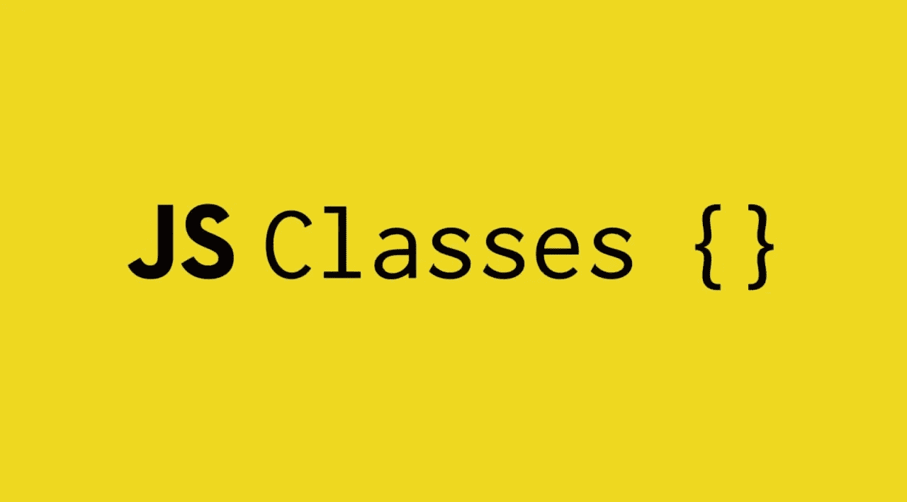
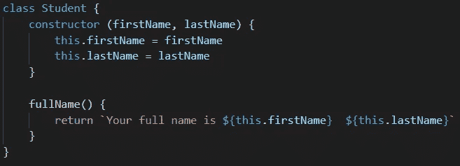
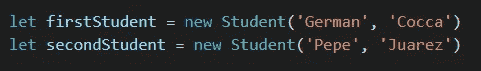
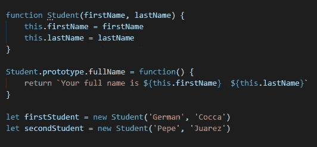

# JavaScript 中的类简介

> 原文：<https://javascript.plainenglish.io/classes-in-javascript-898bb2ad3bda?source=collection_archive---------14----------------------->

类是 JavaScript 提供的一种设置蓝图的方式，用来创建具有预定义属性和方法的对象。

通过创建具有特定属性和方法的类，您可以在以后实例化该类中的对象，这些对象将继承该类的所有属性和方法。

用更正式的术语来说，程序中的类是自定义数据结构“类型”的定义，包括数据和对数据进行操作的行为。类定义了这种数据结构是如何工作的，但是类本身并不是具体的值。为了获得可以在程序中使用的具体值，一个类必须被*实例化*(用`new`关键字)一次或多次。

可以通过以下方式创建类。

*   按照惯例，类名用大写首字母和大小写来声明。class 关键字创建了一个常量，因此以后不能重新定义它。
*   类必须总是有一个构造函数方法，该方法将在以后用于实例化该类。JavaScript 中的构造函数只是一个返回对象的普通函数。唯一特别的是，当用关键字`new`调用时，它将其原型指定为返回对象的原型。
*   “this”关键字指向类本身，用于在构造函数方法中定义类属性。
*   只需定义函数名及其执行代码，就可以添加方法。

要实例化一个类，我们需要以下面的方式使用 **new** 关键字。

*   我们声明一个变量，并将其定义为我们想要使用的类的实例，向它传递在类构造函数方法中定义的参数。
*   然后我们可以像普通对象一样访问这个变量。

类被用作一种使代码更加模块化、更有组织性和更易理解的方式，在 [OOP](https://es.wikipedia.org/wiki/Programaci%C3%B3n_orientada_a_objetos) 编程中被大量使用。尽管理解 JavaScript [很重要，但它并不像 Java、C++或. net 等其他语言那样真正支持类](https://www.toptal.com/javascript/es6-class-chaos-keeps-js-developer-up)。class 关键字是 ES6 引入的语法糖，有助于这种组织代码的方式。

为了形象化这一点，和我们之前定义一个类一样，我们可以用下面的方法定义一个函数。

任何函数都可以用关键字`new`作为构造函数调用，该函数的原型属性用于对象继承方法。“类”只是在概念上用来描述上面的实践，从技术上讲，它们只是函数。

*更多内容看*[***plain English . io***](http://plainenglish.io)