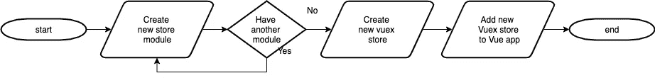
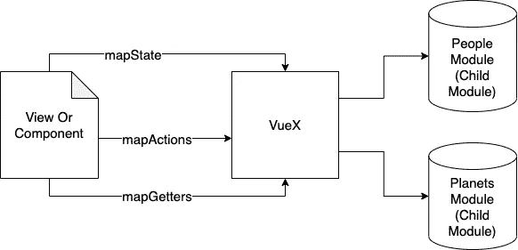

# 通过实例清洁建筑 Vuex

> 原文：<https://javascript.plainenglish.io/clean-architecture-vuex-by-example-a65cf2c18d5f?source=collection_archive---------0----------------------->

## 如何保持你的 Vuex 架构干净可维护，举例说明？


Photo by [Bench Accounting](https://unsplash.com/@benchaccounting) on [Unsplash](https://unsplash.com/photos/nvzvOPQW0gc)

## 介绍

本文探讨了如何为 Vuex 创建干净架构的技巧和诀窍。这个架构的灵感来自于官方文档、我的导师以及其他一些来自我的经验和互联网的参考资料。

基于 [Vuex](https://vuex.vuejs.org/) 官方文档，Vuex 是用于 [Vue.js](https://vuejs.org/) 应用的状态管理模式+库。它充当应用程序中所有组件的集中存储，规则确保状态只能以可预测的方式变化。

简单来说，VueJs 是一个采用基于组件的架构的框架，所以每个组件都被设计成 Vue 文件的一小块，可以在组件之间重用。因此，不排除一些小组件需要协同工作或使用相同数据的可能性。这就是为什么我们需要 Vuex 来帮助我们解决这个问题。Vuex 就像一个全局变量和全局函数，可以被我们拥有的每个组件使用。Vuex 还帮助我们更集中地管理 API 调用和存储响应数据，因此一个 API 调用和数据可以在我们 Vue 项目的每个组件中使用。


Vuex Architecture from official docs

## 深入了解如何注册和创建 Vuex 模块

对于本文的其余部分，让我们假设我们正在使用 Vuex 构建一个简单的 Vue 应用程序，该程序使用具有干净架构的 [Swapi.dev](https://swapi.dev/) 显示星球大战电影中的人和星球的列表。



Installing Vuex to our Vue App flow

首先，我们需要基于每个作用域创建一个新的 store 模块。
这是我们创建商店模块时的模板。每个存储模块都包含状态、突变、动作和获取器，我们将在下一节了解每个模块的更多信息。确保添加**命名的**属性。这意味着在访问存储模块之前，我们必须首先指定名称空间名称，这将使您的 Vuex 更加干净和可维护。我们将在最后一节看到更多的例子。

```
const state = {}
const mutations = {}
const actions = {}
const getters = {}*export default* {
  namespaced: *true*,
  state,
  mutations,
  actions,
  getters
}
```

在我们创建完我们需要的商店模块后，我们必须组合所有的商店模块并创建成一个 Vuex 商店。
实际上，您可以直接在下面的代码中创建一个存储模块(state、getters、actions ),而无需创建像 people 模块或 planets 模块这样的单独模块。
但是出于干净架构的目的，我必须说**不要这样做**最好创建几个小模块，然后像这个例子一样把它们组合成一个。

```
import Vue from 'vue'
import Vuex from 'vuex'
import people from './module/people'
import planets from './module/planets'Vue.use(Vuex)const store = new Vuex.Store({
  modules: {
    'people': people, // You can rename your namespaced in here
    planets // will auto set the namespaced name equals with planets
  }
});export default store
```

之后，您将几个存储模块组合在一起，并将其捆绑成一个模块。下一步是您必须在创建 Vue 应用程序时注册它，以便 Vue 应用程序可以使用我们之前创建的所有 Vuex 商店模块。

```
*import* Vue *from* 'vue'
*import* App *from* './App.vue'
*import* store *from* './store' *new* Vue({
  render: h => h(App),
  store
}).$mount('#app')
```

## 深入研究创建单一商店模块

对于单个商店模块的其余部分，我们只关注人商店模块，因为人和行星商店模块或多或少有点相似。你也可以在我的 [Github repo](https://github.com/hanssagita/vuex-example) 中查看行星实现。
首先，我总是先从状态开始，把状态简化成一个包含数据的全局变量。对于这个例子，我们想要存储星球大战人物数据。由于我们有不止一个人的数据，我们将把它存储在一个数组中。在这个例子中，我用一个空数组的默认值定义了一个 people 字段。

```
*const* state = {
  people: []
}
```

其次，在我们知道我们想要存储什么样的全局变量之后，我们需要创建一个突变来修改状态值。因为它就像一个全局变量，我们需要在不调用突变的情况下保护要编辑的状态，只有突变才能改变状态值。在这个例子中，我在修改状态值时使用了 spread 操作符，因为在 JavaScript 中，如果我们只使用 equals (=)，那么值只复制引用，而不深度复制数组值。恐怕又是一个 bug，很难调试。因此，在对新值进行变异时，最好使用 spread 运算符。对于对象，还要确保使用 spread 运算符。

```
*const* mutations = {
  setPeople(state, payload) {
    state.people = [...payload]
  }
}// Tips
// mutate array value use this --> = [...payload]
// mutate object value with --> = {...payload}
// mutate string, number or boolean value with --> = payload
```

第三，我们来看行动。简单来说，动作就像一个全局函数，可以在我们定义的每个组件中调用。大多数情况下，操作用于处理 API 调用和更改状态值。在动作中，我们通常调用突变来改变状态值。

在我看来，为了更干净的建筑。我建议为 API 创建一个新的单独文件。对于这个例子，我使用了 Axios，并将 Axios future promise 与回调函数相结合。Axios 将调用来自 [Swapi.dev](https://swapi.dev/) 的 get 请求，然后返回一些响应并触发带有结果的成功回调。有些请求失败了。它将运行 catch 并返回失败回调以及错误响应。

```
*import* axios *from* 'axios'

*const getPeople* = (success, fail) => {
  axios
    .get('https://swapi.dev/api/people/') // backend Url
    .then((response) => success(response)) // request success
    .catch((response) => fail(response)) // request fail
};

*export* { *getPeople* }
```

在完成和准备所有 API 调用并将其与回调结合之后，现在我们可以返回到我们的商店模块。在这个动作中，我们将调用我们之前在单独的文件中定义的 API，我们在对象成功和失败中接受 2 个参数，与 API 中相同，成功用于在完成 API 调用后触发一些函数。我们通常使用它来显示和隐藏加载或触发一些跟踪器，对于失败回调，我们通常使用它来向客户显示错误消息或处理组件中的错误处理程序。

```
import { getPeople } from '@/api'*const* actions = {
  getPeopleAction({ commit }, { success, fail } = {}) {
    getPeople( // Call the API
      (response) => { // Success Callback
        commit('setPeople', response.data.results) // call mutations
        // Trigger to view another success Callback
        success && success(response) 
      },
      (response) => { // Fail Callback
        fail && fail(response) // Trigger to view fail callback
      }
    )
  }
}
```

最后但同样重要的是，Getters 根据存储状态计算派生状态。Getters 是可选的，你可以有也可以没有。如果您需要修改值的状态，您可以拥有它。对于这个例子，我试图区分男性和女性，我们可以使用 getters 来处理。

```
*const* getters = {
  male (state) {
    *return* state.people.filter(person => person.gender === 'male') 
  },
  female (state) {
    *return* state.people.filter(person => person.gender === 'female')
  }
};
```

## 深入探讨如何从视图或组件访问商店模块



首先，先从状态说起。要访问状态，我们需要从 Vuex 导入 mapState，并将其映射到一个计算值，如下面的示例代码所示。

```
import { mapState } from 'vuex'
export default {
  name: "People",
  computed: {
    // First parameter is the namespaced name
    // Second parameter is the list of state
    ...mapState('people', ['people']),
  }
}*// Bonus tips
// If you want to access more than one store modules
// You need to define another mapState inside computed* computed: {
    ...mapState('people', ['people']), // first module
    ...mapState('planets', ['planets']) // second module
  }
```

其次是动作，您需要从 Vuex 导入 mapActions 并将其放在方法中，因为动作类似于全局方法。

```
import { mapActions } from 'vuex'
export default {
  name: "People",
  data () {
    return {
      isLoading: false
    }
  },
  methods: {
    ...mapActions('people', ['getPeopleAction']),
    handleSuccess () {
      this.isLoading = false
      console.log('success fetch data')
    },
    handleFail () {
      this.isLoading = false
      console.log('failed fetch data')
    }
  },
  created () { // created will be running before component rendered
    this.isLoading = true // loading variable became true
    this.getPeopleAction({ // call the actions we define
      success: this.handleSuccess, // will run this after success
      fail: this.handleFail // will run this if failed
    })
  },
}
```

最后但同样重要的是，getters 它和 mapState 差不多，我们需要从 Vuex 导入 mapGetters 并把它放在 computed 里面。

```
import { mapGetters } from 'vuex'
export default {
  name: "People",
  computed: {
    // First parameter is the namespaced name
    // Second parameter is the list of getters
    ...mapGetters('people', ['male', 'female']),
  }
}
```

[我的 Github 上的代码示例](https://github.com/hanssagita/vuex-example)

# 结论

Vuex 是状态管理，它存储你所有的 Vue 应用逻辑。你必须确保用我分享的一些技巧和窍门来保持它的整洁和可维护性。

就这样，如果你觉得这篇文章有帮助，请在评论中告诉我们。也可以在[中](https://medium.com/@hanssagita)和 [LinkedIn](https://www.linkedin.com/in/hans-sagita/) 上关注我