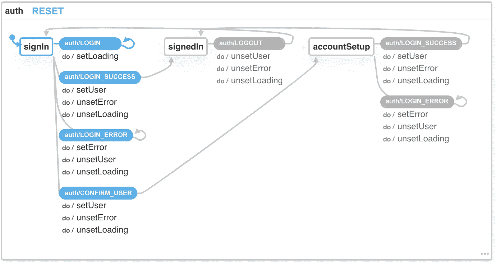

# 用有限状态机 Redux 和 Redux Sagas 创建客户端 Auth

> 原文：<https://javascript.plainenglish.io/client-side-authentication-via-finite-state-machines-redux-and-redux-sagas-cd3e0e2bd9ab?source=collection_archive---------8----------------------->


> "只有那些敢于冒险走得太远的人，才有可能发现自己能走多远。"艾略特

可以说，软件工程中我最喜欢的一个方面是总有新想法的空间。尝试新事物不需要任何人的许可，你只要去做就行了。有时候你的新想法出奇地有效，有时候则不然，但这就是尝试新事物的乐趣所在。

我想在本文中讨论的“新”想法是使用有限状态机结合 Redux 和 Redux-Saga 来处理 React 应用程序中的客户端身份验证。我给单词 *new* 加上引号的原因是因为这些概念中的每一个都已经存在了相当长的一段时间。然而，据我所知，将它们放在一起处理客户端身份验证是一个新想法。

本文将分为 6 个部分:

1.  我们要建造什么？
2.  什么是状态机？
3.  什么是传奇？
4.  基本应用程序设置。
5.  构建认证架构。
6.  构建身份验证用户界面。

# 我们正在建造的东西

在你继续阅读之前，我认为了解我们到底在构建什么，并确定你是否有兴趣继续下去是很重要的。本文的最终目标是拥有一个简单的 React 应用程序，它使用连接到 redux 的有限状态机实现身份验证，并使用 redux-sagas 作为处理异步操作(API 调用)的独立线程。

不会有任何形式的 CSS，HTML 或样式的重点。HTML 将尽可能保持最小，因为本文的重点是身份验证架构，而不是用户界面。在这篇文章的最后，你将有一个允许用户登录，设置他们的帐户和注销的应用程序。您将能够采用本文中介绍的思想，对其进行扩展，并将其应用到您的应用程序中。

# 引入状态机

有限状态机是描述系统行为的数学模型，该系统在任何给定时刻只能处于一种状态。该模型还描述了系统如何在其有限的状态集之间转换。信不信由你，你可能已经隐式地编写了一个状态机，甚至还没有意识到。

你可能想知道为什么我用一张交通灯的图片作为这篇文章的英雄形象。我这样做的原因是因为交通灯是有限状态机。让我们想想最简单的交通灯，它有三种状态:停止(红色)、减速(黄色)和通行(绿色)。交通灯有三种状态，在任何给定的时间，它只能处于其中一种状态。你不可能有一个交通灯同时告诉你停止*和*前进。那将是微软制造的交通灯。

现在，让我们考虑一下交通灯的规则，以及它如何在三种状态之间转换。交通灯不能从绿色变成红色。只能从绿色，到黄色，再到红色。从红色，它不能回到黄色，它必须先过渡到绿色，然后黄色等等。交通灯是一个有限状态机。它有一组有限的状态，对于如何在这些状态之间转换有严格的规则，并且一次只能处于一种状态。

那么，这如何应用于编程呢？当你想到你过去写的一些代码时，你可能会想到一些例子，你实际上使用了一个状态机，而你甚至没有意识到。例如，您可能已经构建了一个从 API 加载一些数据的组件。该组件可能有 3 种状态:正在加载、失败和已解决。它可能还隐含有规则，即您不能从已解决状态转换回失败状态，这将是一种糟糕的用户体验。

状态机非常适合前端应用。构建前端应用程序的全部本质是根据一些当前的本地状态向用户显示信息。无论是身份验证状态、api 调用的异步状态还是基于其他的状态。我们将应用有限状态机的概念来更容易、更安全地处理客户端认证。

下面是我们将要构建的状态机的可视化。机器有以下三种状态:`signIn`、`signedIn`和`accountSetup`。每个状态基于一个事件(如`auth/LOGIN`)执行一个转换(箭头表示转换)。每个转变都伴随着一系列的动作，比如`setUser`。这种形象化在以后会更有意义，但是你可以在阅读的时候回头参考它。



[https://xstate.js.org/viz/?gist = 9 EEA 8173 e 53528572 e 15 a 9 F2 a 0d 4d f1 d](https://xstate.js.org/viz/?gist=9eea8173e53528572e15a9f2a0d4df1d)

# 介绍 Redux Sagas

出于本文的目的，我将假设您已经熟悉 Redux 本身。如果你不是，那么我建议你在开始钻研 redux Saga 之前先读一些关于 Redux 的文章。

在我们讨论 Redux Saga 之前，我们需要讨论一下 Saga 模式。Sagas 的概念源于寻找一种更好的方法来管理跨多个服务或业务领域的顺序事务的需要，以及在一个或多个事务失败的情况下保持系统中数据一致性的需要。一个真实世界的例子将能够更好地解释这一点，所以让我们这样做。

假设我们有一个电子商务应用程序，用户订购了一台新电视。为了成功下订单，必须进行一系列连续的“交易”。首先，您的应用程序可能会检查库存数据库，以确保电视有库存，然后它可能会在该商品上放置一个临时标志，以表明它即将被购买。然后，您需要从用户的银行核实他们有足够的资金并执行交易。然后，您需要返回到库存数据库，并从库存中删除该商品。然后，您可能想要向第三方发送通知。

在上面的示例中，您可以看到跨不同服务进行了多次“交易”，即您的订单数据库、库存数据库、银行服务、通知服务。如果在这些步骤中的任何一个发生错误，saga 模式可以很容易地撤销(或重试)所有以前的事务，从而防止所有不同服务之间的数据不一致。

Redux Saga 通过 Redux 中间件将 Saga 模式带给客户端。您可以将 Redux Saga 视为应用程序中的一个独立线程，它总是在后台“运行”,并响应通过 Redux 操作分派的事件。你的用户将作为这些事件以及其他传奇的触发器。

例如，用户点击一个“添加到购物车”按钮，该按钮将一个动作分派给 redux，redux saga 然后启动相应的 saga。成功后，该传奇会发送一个动作，启动另一个发送确认电子邮件的传奇。一旦 saga 完成，它就会更新您的 redux store，并更新您的“Basket Total”组件，以反映购物车中所有商品的新总数。随着应用程序复杂性的增加，您可以开始看到前端 sagas 的优势在哪里。一旦我们开始构建应用程序，好处将变得更加明显。

# 关于生成器函数的快速注释

我不打算深入研究生成器函数，但是不提到它们对我来说太疯狂了。Redux Saga 是由 ES6 生成器函数实现的，它是一类特殊的函数，可以停止和启动(或退出和重新进入)。它们看起来像这样，其中星号(*)用于让 JavaScript 知道这个函数是一个生成器:

```
function* addToCartSaga(item) {
     const result = yield addToCart(item);     
     yield 'Hello';
     yield sayGoodbyeAfter4Seconds();
}
```

关键字`yield`告诉 JavaScript 等待这行代码完成。每个`yield`返回一个`Iterator`，它可以用来启动下一个`yield`。

```
const gen = addToCartSaga(item);

console.log(gen.next().value); // the item from the cart
console.log(gen.next().value); // 'Hello'
console.log(gen.next().value); // 'Goodbye'
```

生成器最强大的功能是函数上下文(思考范围或变量)将在停止和开始时保存。Redux saga 使用生成器功能，使我们能够构建强大的异步控制流，可以在任何时间点停止、启动和重新启动。

# 基本应用程序设置

为了节省时间，我不打算完成安装应用程序的整个过程。我提供了一个使用 **Create-React-App** 构建的初始报告，你可以用来跟进。所以只需克隆 repo，运行`yarn install`然后运行`yarn start`，你就会看到一个基本的应用程序。repo 将为您提供尽快启动和运行所需的一切，并避免处理偏离本文学习目标的样板代码。一旦应用程序启动并运行，请继续阅读。

您可以在这里找到 repo:[https://github . com/jerrywitaz/client-auth-state-machines-redux-sagas-starter](https://github.com/jerrywithaz/client-auth-state-machines-redux-sagas-starter)

# 结合 XState、Redux 和 Redux-Saga

现在，我们已经过了核心概念并得到了基本的应用程序设置，差不多是时候编写实际的代码了！但首先，我想解释一下您克隆的 repo 中某些文件的用途，以免丢失或混淆。

## src/redux/auth/actions.ts

该文件的目的是设置我们的动作创建者。动作创建器是接受一些参数集并返回 redux 动作对象的函数。它们是一个很好的声明性抽象，可以防止您在需要调度操作时键入对象。相反，您会这样做:

```
dispatch(login(username, password));## instead ofdispatch({ type: 'auth/LOGIN', payload: { username, password }});
```

## src/redux/auth/api.ts

这是一个充当我们的模拟后端 api 的文件。出于本文的目的，不需要实际的后端，如果您愿意，您可以添加自己的后端。这里的“api”只是简单地解决了类似于使用像`Axios`这样的库进行 api 请求的承诺。

## src/redux/auth/hooks.ts

我将单独写一篇关于这个模式的文章，但是我非常喜欢创建自定义钩子，以便从 redux 商店的不同地方选择状态。这些简单的单线挂钩让您的组件简单易读。例如:

```
import { useAuthStatus } from "./redux/auth/hooks";function AuthComponent() {
    const authStatus = useAuthStatus(); if (authStatus === 'signedIn')
        return <SignInComponent />
}
```

## src/redux/auth/machine.ts

该文件将包含我们的身份验证状态机，并将定义身份验证控制流的有效状态和转换。

## src/redux/auth/reduce . ts

这个文件将包含我们的认证缩减器，它将由认证状态机提供动力。

## src/redux/auth/sagas.ts

该文件将包含我们的认证传奇。

## src/redux/auth/selecters . ts

它包含 redux 选择器，可以有效地从我们的身份验证状态中选择一个状态。

## src/redux/auth/types.ts

该文件的目的是设置身份验证状态所需的所有 TypeScript 定义。我们定义了存储上的身份验证状态的形状，以及可以分派给身份验证缩减器的每个动作的形状。

## 定义机器

好了，现在是代码时间！认证架构的第一个也是最重要的部分是认证状态机，它将控制用户如何通过我们的认证协议的流程。我们将使用名为`xstate`的库来创建我们的状态机。让我们打开`machine.ts`并添加以下几行:

这里我们使用`xstate`建立一个基本的状态机。我们给机器一个名为`auth`的唯一标识符，我们定义它的初始状态`signIn`，我们初始化它的本地上下文，本地上下文将存储机器的附加上下文信息，如`user`对象。您还会注意到，我们为机器定义了 3 种状态:`signIn`、`signedIn`和`accountSetup`。下一步是定义每个状态的有效转换。

使用`xstate`，您可以将任何给定状态的基本转换定义为:

```
accountSetup: {
  on: {
    "auth/LOGIN_SUCCESS": {
      target: "signedIn",
      actions: ["setUser", "unsetError", "unsetLoading"],
    },
  }
},
```

这告诉`xstate`当 auth machines 状态值为`accountSetup`时，我们可以响应类型为`auth/LOGIN_SUCCESS`的事件。`target`表示当`auth/LOGIN_SUCCESS`事件发生时，我们将转换到`signedIn`状态。`actions`属性表示当`auth/LOGIN_SUCCESS`事件发生时，我们希望执行以下动作(我们将很快定义这些动作)。

现在你已经理解了定义转换的基础，让我们将所有允许的转换添加到我们机器上的`state`对象中。复制以下代码:

现在我们已经定义了所有的状态及其转换。我们需要做的最后一件事是定义我们的`actions`。`xstate`中的动作负责更新状态机的上下文。将以下代码添加到您机器上的`actions`属性中:

## 创建减速器

我们现在有一个完全工作的状态机来控制我们的身份验证状态。我们需要做的下一件事是将这个机器连接到我们的 reducer，这样对身份验证状态机的更改就可以在 redux 中持久化。打开`reducer.ts`并添加以下代码:

我们正在创建一个标准的 redux reducer，只是我们使用状态机通过机器的`transition`方法来管理转换。

## 创造传奇

我们需要完成的最后一步是创建 sagas，它负责向后端发出 api 请求，并将成功和失败发送回 redux。

Redux-Saga 中的 Saga 实际上不会发出任何异步请求，也不会自己执行任何代码，它们只是描述应该发生什么。代码的实际执行由中间件处理。你的传奇只会产生这样的效果，比如“*调用*一个名为 login 的函数”或者“*让*一个名为 loginSuccess 的动作”。你可以从`redux-saga/effects`导入特效。

因此，一个简单的登录传奇应该是这样的:

如前所述，使用 redux saga 构建的 saga 不执行您的功能，saga 中间件执行。每个`yield`语句返回一个效果描述符，如下所示:

```
{
  CALL: {
    fn: loginApi,
    args: ['test@email.com', 'password']
  }
}
```

我们需要让我们的 sagas 工作的另一件事是，我们需要设置“观察者”sagas，它将负责告诉 saga 中间件每当一个动作被分派给 redux 以匹配特定的动作类型时就执行某个 saga。例如，您可能想告诉 redux saga 在调度类型为`auth/LOGIN`的动作时执行`loginSaga`。登录观察器传奇看起来像这样:

让我们利用以上所有信息，创建 3 个传奇:`login`、`logout`和`accountSetup`。每个 saga 对应于认证状态机的一个有效状态。打开`sagas.ts`并粘贴以下代码:

所以，让我们来分解一下。我们建立了一个登录传奇，注销传奇和帐户设置传奇。用户必须做的第一件事是登录，所以每当登录动作被调度时，我们将通过执行`loginSaga`来响应。根据用户的状态，我们要么分派一个`loginSuccess`动作，要么分派一个`confirmPassword`动作。

如果您还记得，当我们设置我们的状态机时，我们定义了一个转换，允许用户在调度类型为`auth/CONFIRM_USER`的事件时从`signIn`转换到`accountSetup`:

```
"auth/CONFIRM_USER":{            
    "target":"accountSetup",            
    "actions":["setUser","unsetError","unsetLoading"]         
}
```

希望现在你能看到我们的国家机器和我们的传奇之间的联系。我们的状态机定义了我们的状态和受保护的转换，因此我们的应用程序永远不会处于无效状态。Redux saga 负责实际调用触发我们状态变化的函数。每个传奇就像它自己的微服务，进行一个或多个交易，然后将事件分派回 redux，redux 然后基于这些事件启动其他传奇。

此时，我们已经定义了我们的状态机，将它与我们的 reducer 配对以持久化状态，并且我们已经创建了我们处理副作用的传奇。我们的认证架构已经可以使用了！

# 构建用户界面

最后要做的是将我们的 redux 状态连接到我们的 React UI，这样我们就可以根据状态显示/隐藏信息。正如我在本文开头提到的，这篇文章的重点不是 HTML 和 CSS，所以我将只编写最简单的 HTML 来演示如何在 React 组件中使用我们的身份验证状态机。

因此，打开`src/App.tsx`并粘贴以下代码:

那么，让我们来分析一下发生了什么。我们使用从 redux auth 状态导出的定制钩子来获取当前的身份验证状态。由于我们使用状态机，我们知道我们的应用程序只能处于三种状态:`signIn`、`accountSetup`或`signedIn`。根据应用程序的身份验证状态，我们显示 3 个不同的按钮。我们还设置了硬编码的按钮处理程序，当每个按钮被点击时，它将动作分派给 redux 存储。

使用 redux sagas 的一个巨大好处是我们可以保持组件同步。你会注意到阅读我们的组件是多么简单和容易。我们不必进行任何异步调用，也不必担心确保我们的组件仍处于挂载状态。我们只是简单地从 redux 获取状态并分派动作。测试传奇也非常(我的意思是非常)容易，但是我会做一个单独的文章，所以敬请关注！

# 结论

身份验证是许多应用程序的核心，每个人的处理方式都不一样。身份认证流程通常很复杂，并且有许多移动部分，很难以清晰的方式进行管理。我们可以将有限状态机的完整性与 saga 模式的灵活性结合起来，构建一个易于管理、易于扩展和易于测试的认证系统。

你可以在这里下载完整的演示报告:[https://github . com/jerrywithaz/client-auth-state-machines-redux-sagas](https://github.com/jerrywithaz/client-auth-state-machines-redux-sagas)

如果你有任何问题或者想让我澄清什么，请在评论中告诉我。我将会写一篇关于测试状态机和传奇的后续文章。